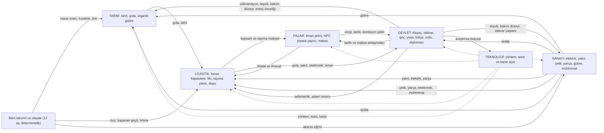

# 08 — Altı Katman: Tarım, Sanayi, Lojistik, Teknoloji, Pazar, Devlet

> **Özet.** Oyun altı katmandan oluşur: **Tarım, Sanayi, Lojistik, Teknoloji, Pazar** ve bunların hepsini yasa ve bütçe kollarıyla yönlendiren karma **Devlet** katmanı (nüfus ihtiyaçları + politika + askeri/diplomasi). Mevcut çekirdek (06) zaten tek bir mal akışı, ortak kenar kapasitesi ve veri güdümlü yöntemler sunuyor; bu belge o akışın üstüne her katmana 3–5 **yinelenen karar üreten** mekanik ekler (toprak yorgunluğu, elektrik ve brownout, filo kapasitesi, sürekli araştırma bütçesi, liman primi ve NPC makası, istikrar ve bedelli yasalar). Gerçek takvim aylarına bağlı bir **iklim takvimi** hasat oranını, buzlu limanları ve dağ geçitlerini değiştirir; dünya hiçbir zaman sıfırlanmaz. Bölge verileri gerçek kaynaklardan (GAEZ, CHELSA, USGS, GEM, NGA, BACI, WorldPop) çevrimdışı boru hattıyla türetilir; ilk gerçek dilim **Türkiye + Balkanlar + Karadeniz**'dir. Amaç, 20–25. gündeki tekrar sıkıntısını (H2) ve "her bölgede aynı en iyi strateji" sorununu (H1) her katmanda ayrı bir yinelenen kararla kırmaktır. Uygulama sırası **Faz B: B1 Tarım → B2 Sanayi → B3 Pazar → B4 Devlet → B5 Lojistik → B6 Teknoloji**'dir (son bölüm).

**Durum.** Bu belge bir **tasarım önerisidir; kod ve veri değiştirilmedi.** Sayılar başlangıç değeridir ve kalibre edilmemiştir; her biri Faz B'de bot ölçümüyle sınanır ([05](05-ilk-olcum-raporu.md), [02 §8](02-tasarim-arge.md)). Sözleşme (tip) değişiklikleri yalnızca takım lideri onayıyla yapılır. **Çelişki halinde uygulama kaynağı 06'dır;** bu belge onaylanan kısımları 06'ya taşır.

İlgili belgeler: [00 — Vizyon ve Kararlar](00-vizyon-ve-kararlar.md) (K17–K22) · [02 — Tasarım Ar-Ge](02-tasarim-arge.md) · [05 — İlk Ölçüm Raporu](05-ilk-olcum-raporu.md) · [06 — Simülasyon Spesifikasyonu](06-simulasyon-spesifikasyonu.md) · [07 — Tasarım Önerileri](07-tasarim-onerileri.md) · Araştırma: [altı katman rakipleri](arastirma/alti-katman-rakipler.md) · [açık kaynak ve veri](arastirma/acik-kaynak-ve-veri.md) · [3D teknoloji](arastirma/3d-teknoloji.md)

**Birim notu.** Tablolarda okunabilirlik için "birim" veya "para" yazılan değerler JSON ve çekirdekte **mili-birim / mili-para (×1000)** olarak saklanır; oranlar **ppm** (1 000 000 = %100), süreler **saat veya gün**, tüm sayılar **tamsayıdır**. Çekirdekte `Math.random`, `Date` ve transandantal `Math` yoktur; bu belgedeki hiçbir formül `sin`, `pow` vb. gerektirmez (yalnızca `carpBol` ve tamsayı karekök).

---

## 0. Katmanlar arası mal akışı



**Okuma kılavuzu.**
- **Kesintisiz çizgi** = mal veya değer akışı; **kesik çizgi** = kural açma (teknoloji yüzde vermez, yöntem açar).
- Mallar yalnızca Lojistik katmanından (kenarlar) geçer; bölge içi akışlar (elektrik) Lojistik'e girmez.
- Devlet hem akışın **tüketicisidir** (nüfus ihtiyacı) hem **düzenleyicisidir** (yasa, bütçe). Bu çift rol, altı katmanı tek ağda bağlar.

### 0.1 Tek bakışta: mevcut durum ve v1 mekanikleri

| Katman | Bugünkü durum (kod) | v1'in yeni yinelenen kararları (özet) |
|---|---|---|
| **Tarım** | `ciftlik` + `gida_fabrikasi`, 3 yöntem; `sqrt(rezervKalan/rezervIlk)` tahılda da uygulanır | toprak yorgunluğu ve ekim karışımı; iklim takvimi (12 ay hasat oranı); yayılan iklim olayları; gübre dozu; hayvancılık (ahır, mera) |
| **Sanayi** | 17 yöntem, 12 tesis türü, sabit bakım girdisi, tükenmeyen damarlar | elektrik ve brownout; ölçek kademesi (S/M/L); bakım düzeyi ve aşınma; kirlilik; damar ölçeği, tükenme ve keşif sondajı |
| **Lojistik** | min-maliyet çok-mal akış; tek `kapasiteSaat`; `kenar_gelistir`; kapsam nedenleri | filo kapasitesi ≠ yol kapasitesi; taşıma yakıtı; iklim takvimine bağlı kenar çarpanı; depo ve tampon; yeni neden sınıfları |
| **Teknoloji** | 6 düğüm, tek kuyruk, tek seferlik maliyet, yayılım §10.3 | ~17 düğüm; sürekli araştırma bütçesi; karşılıklı dışlayan dallar; ticaret anlaşmalı yayılım |
| **Pazar** | tek küresel NPC pazar (emilim/arz, Vic3 fiyat formülü), 1,1× / 0,9× çarpan | liman primi (taşıma maliyeti farkı); açık NPC makası; komisyon, tarife; kıtlık cezası; tedarik sözleşmesi; emir defteri kapısı (v1.5) |
| **Devlet** | nüfus büyümesi (gıda), `vergi_ayarla`, anlaşma/yaptırım, savaş ve ordu | 3 ihtiyaç kademesi; istikrar; göç; 7 bedelli yasa; 3 bütçe kolu; askeri/diplomasi bağları; yeni oyuncu koruması |

### 0.2 Ortak altyapı (her katmanın kullandığı üç parça)

**(a) İklim takvimi.** Dünya saati 1x iken oyun içi tarih gerçek takvimle akar; dünya sıfırlanmaz.

```
takvimGunu(t) = (iklim.baslangicGunu + floor(t × iklim.gunCarpani / GUN)) mod 365      (0 = 1 Ocak)
```

- `baslangicGunu` ilk sürüm için 273 (1 Ekim; dünya tarihi 30 Eylül 2026 gecesi kuruldu) **önerilir**; ölçüm koşuları aydan bağımsız olmak için tohuma göre döndürür (`baslangicGunu = 30 × (tohum mod 12)`).
- **Uyarı (ölçüm):** 30 günlük standart koşu tek bir ayı görür. İklim etkisini ölçmek için ölçüm takımı `gunCarpani = 12` kullanır (1 ay ≈ 2,5 gün) veya 12 farklı başlangıç ayıyla koşar. Dünya hızı 6x/24x iken takvim de hızlanır (t sim zamanıdır).
- Aylık değerler **ay ortalarında** verilir, günlük değer iki komşu ay ortası arasında **doğrusal** enterpolasyonla bulunur (tamsayı, negatif terim yok):

```
ayOrta[m] = ayBaslangic[m] + floor(ayGunleri[m] / 2)
k = gun − ayOrta[m];  aralik = ayOrta[m+1] − ayOrta[m]          (yıl sonunda m+1 = 0)
deger(gun) = floor( (egri[m] × (aralik − k) + egri[m+1] × k) / aralik )
```

- Yeni sim olayı `iklim_gunluk` her takvim günü başında çalışır; toprak, iklim olayları, kenar çarpanları, göç ve istikrar bu günlük tikte güncellenir (Lojistik günde en çok bir kez kirlenir).

**(b) Verim çarpan zinciri.** `bolgeHesapla` içinde bugün `potansiyelPpm = isciPpm × rezervVerimi × odemePpm` hesaplanır (`ekonomi/uretim.ts`). v1'de bu, tek bir yerde toplanan bir zincire dönüşür (her çarpım `carpBol`):

```
verimPpm      = min(isciPpm, girdiYeterliligi, elektrikKarsilanmaPpm)       // "sınırlayıcılar"
ciktiPpm      = verimPpm × doğalCarpan × cezaCarpani
doğalCarpan   = rezervVerimi (ham çıkarım)  |  toprak × iklim × olay × gübre × kirlilik (tarımsal yöntem)
cezaCarpani   = max(uretimTabaniPpm, asinma × istikrar × kitlik)             // yalnızca cezalar, tabanı var
```

- `uretimTabaniPpm = 400 000`: aşınma, düşük istikrar ve kıtlık birlikte bile üretimi %40'ın altına indirmez. Doğal değişkenlik (iklim, toprak, tükenme) bu tabanın dışındadır; çünkü oyuncunun ona tepki verebilmesi gerekir.
- Ödeme gücü (`odemePpm`, 06 §10.2) sınırlayıcılara eklenir.

**(c) Deterministik olay akışı.** `PrngAkisi` içinde `"olay"` akışı zaten vardır; iklim olayları ve keşif sondajları buradan çekilir. Kural: günlük tikte **her bölge × olay türü için tam bir çekim** yapılır (çekim sayısı olaydan bağımsız sabit), olay oluşursa şiddet ve süre için ek çekimler gelir. Böylece içerik değişince akış kaymaz ve aynı tohum aynı iklimi verir.

---

## 1. Tarım

### 1.1 Amaç ve oyuncu fantezisi

Oyuncu bir bölgenin **toprağını yönetir**: aynı tarlayı bitirmeden besleyen, yılın ritmine göre üreten, kuraklık haberini bir hafta önceden alıp ambarı doldurmaya çalışan bir tarım bakanı. Capital Rift'in "görünür ağ" hissi burada **toprağın ve iklimin görünürlüğü** olarak gelir: talep düğümde görünür, verimlilik bölgenin renginde okunur, bir olay komşulara **yayılırken** görülür.

**3D'de ne görülür.**
- Küre üzerinde ova bölgelerinin doygunluğu = `toprakPpm × iklimPpm`; takvim ilerledikçe yeşil dalga güneyden kuzeye ve ovadan yaylaya yayılır (hasat oranı eğrisi).
- Olay uyarısı (24 saat): bölge sınırında titreyen bir halka; olay başlayınca kahverengi (kuraklık), açık mavi (don/kar), koyu mavi (sel) renk komşulara azalan şiddetle yayılır.
- Yakın planda çiftlik, ahır, mera ve sulama kanalı yapıları; gübreli tarlada koyu, nadasta açık doku.

### 1.2 Mevcut durum

| Öğe | Dosya / veri | Bugün |
|---|---|---|
| Tesis türleri | `icerik.json` | `ciftlik` (gerekli etiket `ova`, gerekli rezerv `tahil`), `gida_fabrikasi` |
| Yöntemler | `icerik.json` | `geleneksel_tarim` (15 işçi → 200 tahıl/saat), `mekanize_tarim` (8 işçi → 320; yakıt 20, parça 4), `standart_gida_isleme` (tahıl 200 → gıda 160) |
| Verim | `ekonomi/uretim.ts` `rezervVerimi` | `sqrt(rezervKalan/rezervIlk)`; ovada tahıl rezervi ≈ 1 milyar mili-birim olduğundan verim fiilen hiç düşmez: **tarımda tükenme yok, zaman yok** |
| Bozulma | `icerik.json` | tahıl 10 000 ppm/gün, gıda 20 000 ppm/gün |
| Şok | yok | [02 §2](02-tasarim-arge.md) mekanizma 7 "şoklar" v0 dışı |
| Hayvancılık, gübre, iklim | yok | — |

**Ekonomi katmanının bölünme haritası (bugünkü `ekonomi/` dizininin altı katmana dağılımı).** Bugün "ekonomi" tek modüldür; v1'de Tarım, Sanayi ve Pazar ayrışır, nüfus ve vergi Devlet'e geçer. Tesis çalışma çekirdeği (`bolgeHesapla`) **ortak kalır** ve katmanlar ona çarpan kancalarıyla bağlanır (§0.2-b).

| Bugünkü parça | İçerik | v1 sahibi |
|---|---|---|
| `ekonomi/uretim.ts` (`bolgeHesapla`, `bolgeVerimCoz`, `bolgeOranlariUygula`, `uretimMuhasebesi`) | istihdam, girdi yeterliliği, çıktı/girdi oranları, rezerv tükenmesi | **ortak çekirdek**; tarımsal yöntem dalı → Tarım, rezerv/ölçek/aşınma/elektrik dalları → Sanayi |
| `ekonomi/insaat.ts`, `maliyet.ts` | inşa, maliyet düşümü | ortak (tesis türüne göre Tarım/Sanayi içeriği) |
| `ekonomi/komut.ts` (`tesis_insa`, `yontem_degistir`, `tesis_durum`) | tesis komutları | ortak; yeni komutlar ilgili katmana |
| `ekonomi/komut.ts` (`ticaret_emri`) + `ekonomi/pazar.ts` | emir, fiyat, hacim | **Pazar** |
| `ekonomi/komut.ts` (`vergi_ayarla`) + `ekonomi/nufus.ts` | vergi, nüfus büyümesi, gıda karşılanma | **Devlet** |
| `ekonomi/tablo.ts` | içerik tablosu | ortak |
| Mallar | `tahil`, `gida` (+ yeni `gubre`) | Tarım |
| Mallar | `cevher, komur, bakir, silis, petrol, celik, parca, elektronik, yakit, muhimmat` (+ yeni `elektrik`) | Sanayi |
| Tesis türleri | `ciftlik`, `gida_fabrikasi` (+ yeni `ahir`, `mera`, `sulama_kanali`) | Tarım |
| Tesis türleri | 10 maden/işleme türü (+ yeni `santral`, `gubre_fabrikasi`) | Sanayi |

### 1.3 v1 mekanikleri

#### T1. Toprak verimliliği ve ekim karışımı

- **Kural.** Her tarımsal bölgenin bir **toprak durumu** vardır (`toprakPpm`, 0–PPM; başlangıç PPM). Çiftlik çıktısı `toprakTabanPpm × toprakPpm` ile çarpılır. Oyuncu bölge başına bir **ekim planı** verir: üç pay (buğday / baklagil / nadas), toplam PPM. Günlük tikte toprak, ekimin toprak etkisine göre değişir.
- **Formül ve sayılar.**

| Ürün grubu | `ciktiPpm` | `toprakDegisimPpmGun` | `olayDuyarliligiPpm` | Anlam |
|---|---|---|---|---|
| `bugday` | 1 000 000 | −9 000 | 1 000 000 | yüksek verim, toprağı tüketir |
| `baklagil` | 450 000 | +4 000 | 600 000 | düşük verim, azot bağlar, kurağa dayanıklı |
| `nadas` | 0 | +12 000 | 0 | çıktı yok, toprağı hızla yeniler |

```
ekimKarmasiPpm   = Σ_i ekimPpm[i] × urun[i].ciktiPpm / PPM
toprakDegisim    = Σ_i ekimPpm[i] × urun[i].toprakDegisimPpmGun / PPM                (günlük tik)
                 + gubreDozu × gubreToprakPpmGun × gubreKarsilanmaPpm / PPM
toprakPpm        = clamp(toprakPpm + toprakDegisim, toprakTabaniPpm, PPM)             // toprakTabaniPpm = 300 000
```

  Örnekler (günlük toprak değişimi): %100 buğday −9 000 (25. günde toprak %77,5 → çıktı −%22,5); %100 buğday + 3 doz gübre ≈ 0; %50/25/25 rotasyon −500 (kararlı) ama çıktı yalnız ≈ %61. Çiftlik `ciktilar.tahil × ekimKarmasiPpm` ile ölçeklenir.
- **Yinelenen karar.** Evet: toprak her gün sürüklenir; "bu bölgede hangi karışım?" sorusu iklim takvimi ve gübre fiyatı değiştikçe yeniden sorulur. Gübreli monokültür (sanayiye/pazara bağımlı, yüksek çıktı) ile rotasyon (bağımsız, düşük çıktı) bölgeye göre farklı kazanır (H1). Bu, H2'deki %90 tekrarı kıran ana kaldıraçtır ([05 §3](05-ilk-olcum-raporu.md)).
- **Mikro yönetim riski.** Orta. Bölge başına 3 pay × 30–60 bölge. Azaltma: oyuncu düzeyinde `varsayilanEkimPlani` şablonu (tüm tarımsal bölgelere uygulanır; bölge başına geçersiz kılınabilir); arayüzde "toprak yorgunluğu uyarısı" (toprak < %70).
- **Rakip referansı.** Anno (verimlilik etiketi, gübre silosu +%100), Farming Simulator (ekim nöbeti ile %120'ye varan verim), Victoria 3 (toprağı zenginleştiren/gübreli yöntem kademeleri) ([araştırma](arastirma/alti-katman-rakipler.md) §1). Fark: bizde tarla/parsel çizimi yok; yalnızca ppm payları.

#### T2. İklim takvimi ve hasat oranı eğrisi (12 ay)

- **Kural.** Her bölgenin bir **iklim tipi** vardır (6 tip). Her tipin 12 aylık **hasat oranı eğrisi** çıktıyı takvime göre çarpar. Eğriler, yıllık ortalama **tam 1 000 000 ppm** olacak şekilde kurulur: iklim toplam yıllık üretimi değil **zamanlamayı** değiştirir; bölgeler arası yıllık fark `toprakTabanPpm`'den (GAEZ) gelir. Zamanlama farkı depo, bozulma ve ithalat kararlarını doğurur (ambar: Lojistik L4).
- **Eğriler (ppm × 1000; her satırın toplamı 12 000).**

| İklim tipi | Oca | Şub | Mar | Nis | May | Haz | Tem | Ağu | Eyl | Eki | Kas | Ara | Örnek bölge (öneri) |
|---|---|---|---|---|---|---|---|---|---|---|---|---|---|
| `akdeniz` | 850 | 900 | 1000 | 1150 | 1300 | 1350 | 1100 | 850 | 800 | 900 | 950 | 850 | Ege, Akdeniz kıyısı, Güney Balkan kıyısı |
| `karasal` | 300 | 350 | 600 | 1000 | 1500 | 1900 | 1800 | 1400 | 1000 | 1000 | 700 | 450 | İç Anadolu, Trakya içi |
| `karadeniz` | 600 | 650 | 800 | 1000 | 1250 | 1450 | 1450 | 1350 | 1200 | 1050 | 800 | 400 | Karadeniz kıyı şeridi |
| `balkan_kita` | 500 | 550 | 800 | 1100 | 1450 | 1700 | 1600 | 1250 | 1000 | 850 | 700 | 500 | Tuna ovası, Balkan iç bölgeleri |
| `kurak` | 700 | 900 | 1300 | 1800 | 1900 | 1400 | 600 | 400 | 500 | 800 | 900 | 800 | Güneydoğu Anadolu |
| `dag_yayla` | 100 | 100 | 300 | 900 | 1400 | 2100 | 2500 | 2100 | 1400 | 700 | 300 | 100 | Doğu Anadolu yaylası, Pindus, Rodop |

  (Örnek bölge eşlemesi **öneridir**; gerçek sınıflama CHELSA aylık sıcaklık ve yağıştan, hasat zamanlaması MIRCA-OS'tan türetilir, bkz. §1.5. Eğri sayıları tasarım başlangıcıdır, doğrulanmamıştır.)

```
hasatPpm          = egri(iklimTipi, takvimGunu)                  // §0.2-a enterpolasyon
sulamaliHasatPpm  = hasatPpm + sulamaEtkisi × max(0, PPM − hasatPpm) / PPM      // yalnızca dip yumuşar
sulamaEtkisi      = sulamaVar × 400 000 × sulanabilirPpm / PPM
```

  Sulama yalnızca hasat oranının 1'in altına düştüğü dipleri yumuşatır; yıllık ortalamayı yükseltir (kurak tipte yaklaşık +%8). Sulama kanalı (`sulama_kanali` tesisi) elektrik ister (B2'den sonra; B1'de yakıt).
- **Yinelenen karar.** Evet: depo ve ambar dolumu takvime göre planlanır ("Haziran fazlasını Kasım'a taşı"); ekim karışımı aya göre değişir; sulama yatırımı kurak tiplerde yüksek getirilidir.
- **Mikro yönetim riski.** Düşük: oyuncu ayar yapmaz, takvimi okur. Risk, **tahıl bozulması**dır: 10 000 ppm/gün (%1/gün) ile 90 günde stokun %60'ı kaybolur; uzun süreli (kışa kadar) depolama ancak ambarla (Lojistik L4: bozulma ×0,5) mümkündür. Ölçümde 10 000 ppm/gün v0.1 kalibrasyonu olarak korunur, ambar etkisi ayrı bir kaldıraçtır.
- **Rakip referansı.** Workers & Resources (ekim penceresi ve tek hasat; oyuncu şikâyeti: angarya), Victoria 3 (hasat koşulları). Fark: pencere yok, **hasat oranı çarpanı** var; sürekli akışla uyumlu.

#### T3. Yayılan iklim olayları (deterministik)

- **Kural.** Günlük tikte her bölge × olay türü için bir çekim yapılır; `olasilik = olasilikPpmGun[ay] × tipCarpani[tur][iklimTipi] / PPM` (ppm/gün). Olay oluşursa önce **24 saatlik uyarı** ilan edilir (02'deki "24 saat uyarı" ilkesi), sonra etki başlar. Şiddet merkez bölgede tam, komşu kenarlarda `yayilimPpm` kadar azalarak yayılır (menzil 2 kenar). Yayılma grafı olay yaratılırken bir kez hesaplanıp olaya yazılır (deterministik BFS, kenar indeksi artan sırayla).

| Olay | Etkilediği | Şiddet (çıktı/kapasite kaybı) | Süre | Aylık olasılık (ppm/gün/bölge; Oca…Ara) |
|---|---|---|---|---|
| `kuraklik` | Tarım (çıktı × (1 − şiddet × duyarlılık)) | 250 000–500 000 | 10–20 gün | 0, 0, 0, 100, 400, 800, 1200, 1200, 800, 100, 0, 0 |
| `don` | Tarım | 300 000–600 000 | 3–5 gün | 0, 0, 400, 800, 400, 0, 0, 0, 0, 100, 0, 0 |
| `sel` | Tarım (−), Lojistik (kenar kapasitesi −) | 200 000–400 000 | 4–8 gün | 500, 400, 500, 400, 300, 150, 0, 0, 150, 400, 600, 600 |
| `kis_firtinasi` | Lojistik (kenar kapasitesi −) | 400 000–700 000 | 3–6 gün | 800, 700, 400, 100, 0, 0, 0, 0, 0, 0, 250, 600 |

```
olayEtkisi[b](t) = siddet × yayilimPpm^mesafe(b) × (bitis − t) / (bitis − etkiBaslangic)       // doğrusal sönüm
yayilimPpm = 500 000 (her kenarda yarıya);  menzilKenar = 2
```

  Tip çarpanları (öneri, kuraklık): `kurak` 2,0, `akdeniz` 1,5, `karasal` 1,0, `balkan_kita` 0,8, `karadeniz` 0,3, `dag_yayla` 0,3 (ppm cinsinden 2 000 000, …). Sulama, kuraklık şiddetini `sulamaKuraklikKorumaPpm (600 000) × sulanabilirPpm / PPM` kadar azaltır. Beklenen yoğunluk (kalibrasyon hedefi): Temmuz'da 50 bölgelik haritada ≈ 2 kuraklık olayı, yayılmayla haritanın ≈ %14'ü etkilenir; "haritanın çoğu aynı anda kurak" çıkarsa olasılıklar yarıya indirilir.
- **Yinelenen karar.** Evet: uyarıyı okuyup ambarı doldurmak, tarife/ithalat açmak, sulama yatırımı, sigorta olarak depo tamponu. Olay bölgesel ve kısmen öngörülebilirdir (24 saat).
- **Mikro yönetim riski.** Düşük-orta: uyarı panelinde tek satır; oyuncu tepkisi opsiyoneldir (olay yoksa da oyun oynanır).
- **Rakip referansı.** Victoria 3 (hasat koşulları, eyalet merkezli yayılım; günlük çekim değil aylık ≈ bölgelerin üçte biri) ([Dev Diary #131](https://admin-forum.paradoxplaza.com/forum/developer-diary/victoria-3-dev-diary-131-famines-starvation-harvest-conditions.1708680/)); [02 §2](02-tasarim-arge.md) mekanizma 7. Fark: bizde olay akışı PRNG'den deterministik çekilir ve uyarılıdır.

#### T4. Gübre dozu

- **Kural.** Yeni mal `gubre` (kategori `ara`, taban fiyat 140 para, bozulma 1 000 ppm/gün). Bölge başına **gübre dozu** 0–3 (`gubre_dozu` komutu). Her doz, tarımsal tesis başına saatlik `gubreTuketimiSaat = 4 000` mili-birim (4 birim/saat) girdi ister. Girdi karşılandıkça (`gubreKarsilanmaPpm`) doz başına toprağa `+3 000 ppm/gün` ve çıktıya `+60 000 ppm` (+%6) verir.
- **Formül.** Doz 3 + %100 buğday: toprak Δ = −9 000 + 9 000 = 0, çıktı ×1,18; maliyet 12 birim/saat × 140 = 1 680 para/saat çiftlik başına. Çiftlik taban KD'si ≈ 6 000 para/saat olduğundan gübreli monokültür net ≈ 6 000 × 1,18 − 1 680 ≈ 5 400 (sürdürülebilir); rotasyon ≈ 3 700 (sürdürülebilir); gübresiz monokültür 6 000 ama her gün düşer. **Başabaş gübre fiyatı ≈ 285 para/birim:** piyasa fiyatı bunun üstüne çıkarsa rotasyon kazanır. Fiyat da Pazar'dan (ithalat 1,1×) ve Sanayi'den (gübre fabrikası) geldiğinden karar bölgeye göre ayrışır.
- **Yinelenen karar.** Evet: doz ve karışım gübre fiyatına, elektrik/petrol tedarikine ve iklim takvimine göre sürekli yeniden dengelenir.
- **Mikro yönetim riski.** Düşük: tek sayı, bölge başına; varsayılan şablonla toplu ayar.
- **Rakip referansı.** Anno (gübre silosu), Victoria 3 (gübre hayvancılıktan ve sanayiden).

#### T5. Hayvancılık (ahır ve mera)

- **Kural.** İki yeni tesis türü, ikisi de `gubre` ve `gida` üretir; ikisi de çiftliğin gübre ihtiyacını yerinde karşılamaya yarar.

| Tesis / yöntem | Etiket | Girdi (mili/saat) | Çıktı (mili/saat) | İşçi | Not |
|---|---|---|---|---|---|
| `ahir` / `ahir_besi` | `ova` | tahıl 120 000 | gıda 70 000, gübre 12 000 | 5 000 | yem tahılı gıda fabrikasıyla rekabet eder; 1 ahır ≈ 1 çiftliğin 3 dozuna yeter |
| `mera` / `mera_hayvancilik` | `dag` | — | gıda 70 000, gübre 6 000 (× toprak × iklim, `tarimsal`) | 9 000 | yayla iklimine bağlı: yaz bol, kış yok; dağ bölgesine tarımsal rol verir |

  KD/işçi: ahır ≈ 600, mera ≈ 640 (çiftlik 400; gıda işleme 867; [07 Tablo 1](07-tasarim-onerileri.md)). Ahır tahılı gıdaya gıda fabrikasından daha az verimle çevirir (0,58 yerine 0,8); karşılığı yerinde gübre ve gıda fabrikası gerektirmemesidir.
- **Yinelenen karar.** Evet: "tahılı gıda fabrikasına mı, ahıra mı?"; dağ bölgesinde kış için gıda ithalatı/ambar.
- **Mikro yönetim riski.** Düşük (iki yeni tesis türü, ek komut yok).
- **Rakip referansı.** Victoria 3 (hayvancılık çiftliği + gübre), Anno (yem zinciri).

### 1.4 Parametreler ve içerik

**`parametreler.json` eklenecek bloklar.**

```jsonc
"iklim": {
  "baslangicGunu": 273,
  "gunCarpani": 1,
  "ayGunleri": [31, 28, 31, 30, 31, 30, 31, 31, 30, 31, 30, 31],
  "uyariSaat": 24,
  "hasatEgrisiPpm": {
    "akdeniz":     [850000, 900000, 1000000, 1150000, 1300000, 1350000, 1100000, 850000, 800000, 900000, 950000, 850000],
    "karasal":     [300000, 350000, 600000, 1000000, 1500000, 1900000, 1800000, 1400000, 1000000, 1000000, 700000, 450000],
    "karadeniz":   [600000, 650000, 800000, 1000000, 1250000, 1450000, 1450000, 1350000, 1200000, 1050000, 800000, 400000],
    "balkan_kita": [500000, 550000, 800000, 1100000, 1450000, 1700000, 1600000, 1250000, 1000000, 850000, 700000, 500000],
    "kurak":       [700000, 900000, 1300000, 1800000, 1900000, 1400000, 600000, 400000, 500000, 800000, 900000, 800000],
    "dag_yayla":   [100000, 100000, 300000, 900000, 1400000, 2100000, 2500000, 2100000, 1400000, 700000, 300000, 100000]
  },
  "olaylar": {
    "kuraklik": { "sureGunMin": 10, "sureGunMax": 20, "siddetMinPpm": 250000, "siddetMaxPpm": 500000,
                  "menzilKenar": 2, "yayilimPpm": 500000,
                  "olasilikPpmGun": [0, 0, 0, 100, 400, 800, 1200, 1200, 800, 100, 0, 0] },
    "don":      { "sureGunMin": 3, "sureGunMax": 5, "siddetMinPpm": 300000, "siddetMaxPpm": 600000,
                  "menzilKenar": 2, "yayilimPpm": 500000,
                  "olasilikPpmGun": [0, 0, 400, 800, 400, 0, 0, 0, 0, 100, 0, 0] },
    "sel":      { "sureGunMin": 4, "sureGunMax": 8, "siddetMinPpm": 200000, "siddetMaxPpm": 400000,
                  "menzilKenar": 2, "yayilimPpm": 500000,
                  "olasilikPpmGun": [500, 400, 500, 400, 300, 150, 0, 0, 150, 400, 600, 600] },
    "kis_firtinasi": { "sureGunMin": 3, "sureGunMax": 6, "siddetMinPpm": 400000, "siddetMaxPpm": 700000,
                  "menzilKenar": 2, "yayilimPpm": 500000,
                  "olasilikPpmGun": [800, 700, 400, 100, 0, 0, 0, 0, 0, 0, 250, 600] }
  },
  "sulamaKuraklikKorumaPpm": 600000
},
"tarim": {
  "toprakTabaniPpm": 300000,
  "gubreTuketimiSaat": 4000,
  "gubreToprakPpmGun": 3000,
  "gubreCiktiEkiPpm": 60000,
  "azamiGubreDozu": 3
}
```

  (Olay olasılıklarının bölge tipi çarpanları `iklim.tipOlasilikCarpaniPpm` altında tutulur; tablo yukarıdaki kuraklık satırıdır. Olasılık sayıları ppm/gün/bölgedir ve kalibrasyon gerektirir.)

**`icerik.json` eklenecekler.**
- Yeni mal: `gubre` (`kategori: "ara"`, `tabanFiyat: 140000`, `lojistikOnceligi: 4`, `bozulmaPpmGun: 1000`); `parametreler.pazar.emilimSaat.gubre = 200000`, `arzSaat.gubre = 150000`.
- Yeni `tarimUrunleri`: `bugday`, `baklagil`, `nadas` (tablo T1).
- Yöntemler: `ahir_besi`, `mera_hayvancilik`; mevcut üç tarım yöntemine `tarimsal: true` (`geleneksel_tarim`, `mekanize_tarim`; `standart_gida_isleme` işleme olduğundan `tarimsal` değildir).
- Tesis türleri: `ahir` (`gerekliEtiket: ova`), `mera` (`gerekliEtiket: dag`), `sulama_kanali` (teknoloji `sulama_sistemi`).
- Harita: `bolge.tarim = { toprakTabanPpm, iklimTipi, tarimTesisTavani, sulanabilirPpm }`. Sentetik haritada değerler bölge etiketinden sabit kurallarla üretilir (ova 1 000 000, kıyı 800 000, dağ 400 000; iklim tipi bölge türüne göre), böylece gerçek veriden önce de ölçüm yapılabilir.

### 1.5 Gerçek veri kaynağı ve lisansı

| Değer | Kaynak | Lisans | Dönüşüm |
|---|---|---|---|
| `toprakTabanPpm` | [FAO GAEZ v5](https://data.apps.fao.org/catalog/iso/66bfe451-c6da-4edd-940e-cb4b0b83725a) ürün uygunluğu (GeoTIFF ~1 km) + [SoilGrids](https://isric.org//explore/soilgrids) | CC BY 4.0 (her ikisi) | bölge poligonunda zonal ortalama; uygunluk indeksi → 300 000–1 200 000 ppm doğrusal |
| `tarimTesisTavani` | GAEZ ekili alan uygunluğu; bölge alanı | CC BY 4.0 | uygun alan / referans çiftlik alanı, 1–6 |
| İklim tipi ve ay profili | [CHELSA v2.1](https://www.chelsa-climate.org/datasets/chelsa_climatologies) aylık sıcaklık ve yağış | **CC0** | bölge ortalaması → 6 tipten birine kural tabanlı atama |
| Hasat zamanlaması | [MIRCA-OS](https://www.nature.com/articles/s41597-024-04313-w) ekim/hasat ayları (23 ürün) | kayıtta doğrulanmalı (olasılıkla CC BY) | `hasatEgrisiPpm[m] = 12 × PPM × w_m / Σ w`, `w_m` = hasat alanı payı (kış ayları CHELSA don sınırıyla 0'a çekilir) |
| `sulanabilirPpm` | GAEZ sulanabilir alan senaryosu | CC BY 4.0 | zonal oran |

- **Kullanma:** FAOSTAT (CC BY-NC-SA 3.0 IGO, ticari değil) ve WorldClim (CC BY-NC-SA 4.0) **kullanılmaz**; FAOSTAT yalnızca çevrimdışı kalibrasyonda referans olabilir ([araştırma](arastirma/acik-kaynak-ve-veri.md) §2, K22).
- **Doğrulanmamış:** GAEZ uygunluk indeksinin tam ölçeği ve MIRCA-OS lisansı kayıtta kontrol edilmelidir; bölge→iklim tipi kuralı bir öneridir.

### 1.6 Diğer katmanlarla bağlar

| Yön | Mal / değer | Not |
|---|---|---|
| Sanayi → Tarım | `gubre` (gübre fabrikası), `yakit` + `parca` (mekanize yöntem), `elektrik` (sulama) | gübre fiyatı T4 kararını belirler |
| Sanayi → Tarım | kirlilik | `çıktı × (1 − kirlilikPpm × 250 000 / PPM)` (S4) |
| Tarım → Devlet | `gida` | temel ihtiyaç (D1), istikrar ve nüfus büyümesi |
| Tarım → Pazar | `tahil`, `gida` | ihracat ve ithalat; iklim olayında fiyat yükselir |
| Tarım → Sanayi | `tahil` → gıda fabrikası; `gubre` yan ürünü | ahır: tahıl gıdaya + gübreye |
| İklim → Tarım | hasat eğrisi, olaylar | §1.3 T2, T3 |
| Devlet → Tarım | tarım koruma yasası, enerji önceliği | D4 |

### 1.7 Bot ölçümü

| Hipotez | Etki | Ölçüm önerisi |
|---|---|---|
| **H1** | bölge farkı: ova/kıyı/dağ farklı toprak ve iklim, gübreye erişim farklı | bölge türü başına en iyi önayar ≥ 4 farklı (mevcut 5); yeni önayar `tarim_gubreli` ve `tarim_rotasyon` |
| **H2** | 20–25. gün tekrarı: toprak yorgunluğu ve takvim | "en iyi ekim karışımı" 30. günde bir öncekiyle aynı mı (tekrar endeksi); karar tükenmesi (toprak kararı için pozitif marjinal değer olan gün sayısı) |
| **H3** | dolaylı | gübre ve yakıt talebi askeri kayışla değişiyor mu |
| **H5** | olay çevrimdışıyken gelir | kur-ve-unut oyuncunun 48 saatte iklim olayı kaybı ≤ %30 (olay şiddeti tavanı 700 000 × yayılım); yapısal kayıp tavanına **dahil edilmez**, ayrıca raporlanır |
| **H6** | geç katılan | sahipsiz bölge "uykuda" kuralı toprak ve iklim durumunu da dondurur; geç katılan taze toprakla başlar |
| **H7** | ayarla-unut | sabit ekim planının 72 saat sonra çıktı oranı; iklim takvimiyle düşüşün aktif oyuncudan farkı |

- **Ölçüm notu:** iklim etkisini görmek için `gunCarpani = 12` (veya 12 başlangıç ayı) kullanılır; toprak sürüklenmesi 30 günde %22'ye varabilir (monokültür), bu yüzden 30 günlük H2 ölçümü anlamlıdır.
- **Başarı göstergesi:** tek bir ekim karışımı/doz kombinasyonu bölgelerin > %70'inde en iyiyse tasarım başarısızdır (H1 mantığı).

### 1.8 Kaçınılacaklar

- Tarla veya parsel çizimi, ekim–hasat tarih penceresi (W&R şikâyeti: angarya), makine filosu yönetimi.
- Ürün başına ayrı bozulma takibi (Banished performans dersi); ürün grubu sayısı 3'ün üstüne çıkarılmaz.
- Günlük giriş ödülü veya "sezon" sıfırlaması; iklim takvimi **sıfırlama değildir** ([00 K21](00-vizyon-ve-kararlar.md)).
- Toprak durumunun 0'a inmesi (taban 300 000 ppm; sonsuz çöküş yok, oyuncu ceza sarmalına girmez).

### 1.9 Uygulama adımları (B1)

1. **Sözleşme:** `IklimTipi`, `BolgeTarimTanimi`, `TarimUrunTanimi`, `YontemTanimi.tarimsal`, `Parametreler.iklim/tarim`, çekirdekte `BolgeDurumu.tarim`, `Dunya.iklim`, olay `iklim_gunluk`, komutlar `ekim_plani` ve `gubre_dozu` (kod blokları: [Faz B, B1](#b1-tarım)).
2. **Çekirdek modülü:** `cekirdek/src/tarim/` (`iklim.ts`: takvim + enterpolasyon + olay çekimi; `toprak.ts`: günlük tik; `uretim` kancası: §0.2-b `doğalCarpan`); `motor.ts` günlük tik planı; `kurulum.ts` başlangıç durumu.
3. **İçerik:** `gubre` malı, ürünler, `ahir`/`mera`/`sulama_kanali`, sentetik haritaya `tarim` alanı, `sulama_sistemi` teknolojisi (mevcut teknoloji mekaniğiyle).
4. **Test:** takvim enterpolasyonu birim testi (her eğrinin 365 günlük ortalaması = PPM ± 1 000); toprak sınırları; olay yayılımı; determinizm (aynı tohum → aynı özet, 30 ve 400 gün); sahipsiz bölge uykusunda toprak/iklim donar.
5. **Kabul ölçütleri:**
   - `pnpm kontrol` yeşil; performans: 30 günlük koşu süresi ≤ v0.2'nin ×1,15'i.
   - 30 günlük 4 botlu koşuda toprak ∈ [300 000, 1 000 000]; olaylar deterministik (iki koşu birebir aynı).
   - Ölçüm: H2 tekrar endeksi ≤ %60 ve kalıcı sıfır karar günü yok; H1 ilk üç oranı ≤ %70; lavabo/gelir 0,30–0,63; H5 hâlâ ≤ %25 (yapısal tavan).

---

## 2. Sanayi

### 2.1 Amaç ve oyuncu fantezisi

Oyuncu bir **sanayi havzasını** kurar ve ayakta tutar: madenden çeliğe, çelikten parçaya ve elektroniğe uzanan zinciri, onu besleyen **elektrik şebekesini**, yıpranan tesisleri ve bacaların bıraktığı kirliliği yönetir. Capital Rift'in görünür ağ hissi burada **akışın ve enerjinin görünürlüğüdür:** hangi fabrikanın neden yavaşladığı (girdi mi, işçi mi, elektrik mi, aşınma mı) bölgenin üzerinde tek bakışta okunur.

**3D'de ne görülür.**
- Havzalarda bacalar ve duman sütunları; `kirlilikPpm` arttıkça bölge üzerinde gri sis.
- Gece yarıküresinde bölge ışıkları = elektrik karşılanma oranı; **brownout'ta ışıklar titrer ve söner.**
- Yakın planda tesis ölçeği (S/M/L) bina büyüklüğüyle, aşınma pas dokusuyla, damar tükenmesi ise maden çukurunun derinliğiyle ve renginin solmasıyla okunur.

### 2.2 Mevcut durum

| Öğe | Dosya / veri | Bugün |
|---|---|---|
| Yöntem ve tesis | `icerik.json` | 17 yöntem, 12 tesis türü; çıkarım 7 yöntem (yüzey/derin cevher, yüzey/derin kömür, bakır, silis, petrol), işleme 9 (yüksek fırın, elektrik ark, 2 parça, elektronik, rafineri, mühimmat …) |
| Verim | `ekonomi/uretim.ts` | `isciPpm × rezervVerimi × odemePpm`; ham çıkarımda `sqrt(kalan/ilk)` |
| Bakım | `YontemTanimi.bakim` | sabit parça girdisi, her zaman tüketilir; karşılanmazsa **ceza yok** (yalnızca talep) |
| İşletme gideri | `tesisIsletmeParasiSaat = 60 000` | aktif tesis başına sabit para lavabosu |
| Damarlar | `sentetik-50.json` `rezervler` | medyan 392 000 birim; tek tesiste 25. günde verim medyanı 0,90 ([07 D5](07-tasarim-onerileri.md)) |
| Enerji, ölçek, kirlilik | yok | — |
| v0.2 dengesi | [06 §10.5](06-simulasyon-spesifikasyonu.md) | zincir yöntemleri işçi başına KD ≈ 255–314 (ham çıkarım 250–400) |

### 2.3 v1 mekanikleri

#### S1. Elektrik malı ve brownout

- **Kural.** Yeni mal `elektrik` (kategori `enerji`, **depolanamaz ve taşınamaz**; yalnızca bölge içi, anlık denge). `santral` tesis türü elektrik üretir; tesisler ve hane elektrik ister. Bölgenin toplam talebi üretimi aşarsa **tüm tüketiciler orantılı yavaşlar** (Factorio'daki brownout). Elektrik, yöntemlerin `girdiler` alanında `elektrik` olarak yazılır; çekirdekte bu mal stoklanmaz, iki geçişli hesaplanır (önce santraller, sonra tüketiciler; santralin kendi tüketimi yoktur).
- **Formül ve sayılar.**

```
arz    = Σ santral çıktısı (verim × çıktı)
talep  = Σ tesis.elektrik × verim  +  nüfus/1000 × tuketim1000Saat.elektrik
karsilanmaPpm = min(PPM, arz × (PPM − iletimKaybiPpm) / talep)            // iletimKaybiPpm = 50 000
tesis.verim  ×= karsilanmaPpm                                               // elektrik girdili tüm tesisler
```

  Enerji önceliği yasası açıksa (D4) önce hane karşılanır, kalan sanayiye dağılır.

| Santral yöntemi | Girdi (mili/saat) | Çıktı elektrik (mili/saat) | İşçi | Bakım (parça) | Emisyon (ppm/saat) | Koşul |
|---|---|---|---|---|---|---|
| `komur_santrali` | kömür 60 000 | 240 000 | 4 000 | 1 200 | 120 | baştan açık |
| `yakit_jeneratoru` | yakıt 40 000 | 160 000 | 2 000 | 800 | 60 | baştan açık (pahalı yedek, hızlı kurulum) |
| `hidro_santrali` | — | 300 000 × `akarsuEgrisiPpm` (12 ay, ortalama PPM) | 2 500 | 2 000 | 0 | `gerekliEtiket: dag`; bahar piki (kar erimesi) iklim takvimine bağlı |
| `ruzgar_gunes` | — | 180 000 (dalgalı: 500 000–1 500 000 ppm çarpanı, 4 günde bir) | 1 000 | 600 | 0 | teknoloji `temiz_enerji` (dışlayan dal, §4) |
| `kombine_cevrim` | kömür 60 000 | 340 000 | 4 500 | 1 500 | 180 | teknoloji `termik_verim` (dışlayan dal, §4) |

  Santral inşa: çelik 70 000 + parça 30 000 mili-birim, 12 000 000 mili-para, 8 saat (hidro 12 saat, çelik 120 000). 1 santral ≈ 10 tesisi besler.

  **Elektrik girdisi (mevcut yöntemlere eklenen alan; mili-birim/saat).** Gölge fiyat 10 para (yalnızca KD hesabı için; pazarda satılmaz). Eklenince KD/işçi dengesi ≤ %16 bozulur (en çok elektrik ark: −%16).

| Yöntem | Elektrik | Yöntem | Elektrik | Yöntem | Elektrik |
|---|---|---|---|---|---|
| `yuksek_firin` | 25 000 | `standart_elektronik` | 30 000 | `derin_cevher` | 15 000 |
| `elektrik_ark` | 50 000 | `standart_rafineri` | 25 000 | `derin_komur` | 12 000 |
| `standart_parca` | 12 000 | `standart_muhimmat` | 15 000 | `mekanize_tarim` | 8 000 |
| `otomatik_hat` | 20 000 | `standart_gida_isleme` | 10 000 | ham çıkarım (diğer) | 5 000–6 000 |

  Hane tüketimi: `tuketim1000Saat.elektrik = 150` (mili-birim/1000 kişi/saat; 100 bin kişi → 15 birim/saat).
- **Yinelenen karar.** Evet: santral kapasitesi tesis sayısıyla birlikte büyür (her 2–3 yeni tesiste yeniden karar); enerji karışımı (kömür, hidro bahar piki, jeneratör yedeği) iklim takvimine ve yakıt fiyatına göre değişir; brownout uyarısı ve "hane mi sanayi mi" önceliği.
- **Mikro yönetim riski.** Düşük: bölge başına tek "karşılanma" sayısı; trafo/kablo yok.
- **Rakip referansı.** Factorio (orantılı paylaşım, brownout), Workers & Resources (talebe göre üretim; trafo hiyerarşisi bilerek **alınmaz**).
- **v1.5:** `ortak_sebeke` anlaşması (komşu bölgeye elektrik iletimi, iletim kaybıyla).

#### S2. Tesis ölçek kademesi (S / M / L)

- **Kural.** Her tesis bir ölçekte çalışır; `tesis_olcek_yukselt` komutuyla yerinde yükseltilir. Büyük tesis işçi başına daha verimli, ama girdi, elektrik, bakım ve inşa maliyeti orantısız büyür; 07'deki "işçi başına katma değer düşük" sorununun yapısal çözümüdür.

| Ölçek | Çıktı/girdi/elektrik | İşçi | Bakım ve işletme | İnşa (para + mal) | Koşul | İşçi başına çıktı |
|---|---|---|---|---|---|---|
| S | ×1,0 | ×1,0 | ×1,0 | ×1,0 | baştan | 1,00 |
| M | ×2,2 | ×1,8 | ×2,0 | ×2,5 | baştan | 1,22 |
| L | ×3,6 | ×2,6 | ×3,2 | ×4,5 | teknoloji `otomasyon` | 1,38 |

  ppm olarak: M = `{cikti: 2 200 000, isci: 1 800 000, bakim: 2 000 000, insa: 2 500 000}`; L = `{3 600 000, 2 600 000, 3 200 000, 4 500 000}`. Yükseltme süresi = tür inşa süresi × 500 000 / PPM (yarısı); maliyet = hedef kademe inşa maliyeti − mevcut kademe maliyeti. Yükseltme sırasında tesis çalışmaya devam eder.
- **Formül etkisi.** İşgücü kısıtlı maden bölgelerinde ([07 Tablo 4](07-tasarim-onerileri.md): zincir/ham oranı 1,00–1,01) M/L ölçek işleme zincirinin işçi başına KD'sini +%22–38 artırarak zincir/ham oranını ≈ 1,2–1,35'e çıkarır. Ham çıkarımda L ölçek damar çekimini 3,6 katına çıkarır (S5: hız ve ömür takası).
- **Yinelenen karar.** Evet: "hangi tesisi yükselteyim?" sorusu işgücü, elektrik ve girdi akışı değiştikçe yinelenir; L ölçek girdi açlığı ve brownout riski taşır.
- **Mikro yönetim riski.** Orta: tesis sayısı arttıkça yükseltme kararı çoğalır. Azaltma: komut bölge + tesis türü düzeyinde ("bu bölgedeki tüm çelikhaneleri M yap") de verilebilir.
- **Rakip referansı.** Victoria 3 (yapı seviyesi/throughput bonusu), Anno (büyük fabrika). Fark: yüzde bonus yok, işçi ve girdi ile orantısız ölçek var.

#### S3. Bakım düzeyi ve aşınma

- **Kural.** Oyuncu düzeyinde bir **bakım düzeyi** (asgari / normal / yüksek; bütçe kolu, D5) seçilir. Bakım girdisi ve işletme gideri bu düzeyin çarpanıyla değişir; düzey düşükse tesislerde **aşınma** birikir, verimi düşürür. Bölge başına `genel_onarim` komutu aşınmayı bir kerede sıfırlar.

| Düzey | Bakım girdisi ve işletme | Aşınma değişimi (ppm/gün) |
|---|---|---|
| asgari | ×0,5 | +20 000 |
| normal | ×1,0 | 0 |
| yüksek | ×1,5 | −15 000 |

```
asinmaPpm   = clamp(asinmaPpm + düzey.asinmaPpmGun, 0, PPM)                            // günlük tik (bakım girdisi tam karşılanıyorsa)
asinmaCarpaniPpm = PPM − asinmaPpm × 400 000 / PPM                                     // en çok −%40
genel_onarim: maliyet = insa maliyetinin %20'si (çelik + parça + para), tesis 6 saat durur, asinmaPpm = 0
```

  Parça kıtlığı da aşınmayı artırır: bakım girdisi karşılanmazsa değişim `max(değişim, +20 000)` olur. Asgari düzeyde 25 günde aşınma %50, verim −%20.
- **Yinelenen karar.** Evet: "tasarruf mu, verim mi?"; genel onarım zamanlaması; yüksek düzey (iyileştirme) bir yatırımdır.
- **Mikro yönetim riski.** Düşük: tesis başına değil oyuncu düzeyinde tek ayar; onarım bölge düzeyindedir.
- **Rakip referansı.** [02 §2](02-tasarim-arge.md) mekanizma 1 (yapı yıpranması %1–2/gün, v0 dışı); W&R bakım istasyonu (alınmaz).

#### S4. Kirlilik

- **Kural.** Her yöntemin `kirlilikPpmSaat` değeri vardır. Bölge kirliliği `kirlilikPpm` (0–PPM) saatte emisyon eklenir, günde `kirlilikAzalmaPpmGun = 30 000` (mevcut durumun %3'ü) azalır. Etkisi: tarımsal çıktı `× (PPM − kirlilikPpm × 250 000 / PPM)` (en çok −%25), Devlet'te istikrar hedefi `− kirlilikPpm × 400 000 / PPM`, komşu kenarlara her gün kirliliğin %10'u geçer (rüzgâr yayılımı).

| Yöntem | ppm/saat | Yöntem | ppm/saat |
|---|---|---|---|
| `komur_santrali` | 120 | `yuksek_firin` | 100 |
| `kombine_cevrim` | 180 | `elektrik_ark` | 60 |
| `derin_cevher` / `derin_komur` | 40 | `standart_rafineri` | 80 |
| diğer işleme | 20 | yüzey çıkarım, tarım | 10 |

  Örnek: 2 kömür santrali + 2 yüksek fırın + 2 maden ≈ 520 ppm/saat ≈ 12 500 ppm/gün → denge `kirlilikPpm ≈ 416 000` (%42); tarım −%10, istikrar hedefi −%17. Filtre teknolojisi (`temiz_enerji` dalı) emisyonu %50 düşürür; `emisyon_siniri` kararı (D4 sanayi teşviki bedeli) tersini yapar.
- **Yinelenen karar.** Evet: sanayi ve tarım aynı bölgede rekabet eder; tarım bölgesine santral kurmak bedelli bir karardır; temiz enerji dalı.
- **Mikro yönetim riski.** Düşük: bölge başına tek gösterge, ek komut yok.
- **Rakip referansı.** Victoria 3 (kirlilik kuraklık/sel etkisini artırır), Factorio (kirlilik → tepki).

#### S5. Damar ölçeği, tükenme ve keşif sondajı (docs/07 Ö7)

- **Kural.** (a) **Damar ölçeği küçülür:** medyan 392 000 birim → ≈ 150 000 (aralık 40 000–400 000); harita verisidir, `rezervler` × 0,4 ile ilk kurulur, gerçek veride USGS/GEM'den türetilir. (b) `sqrt(kalan/ilk)` korunur ama verimin tabanı `rezervVerimTabaniPpm = 250 000` (damar tükenince tesis sıfıra değil %25'e iner; H7 "çökmesin" riski için). (c) **Keşif sondajı:** `arama_sondaji(bolge, mal)` komutu (8 000 para + 20 parça, 24 saat); deterministik `"olay"` çekimiyle %40 olasılıkla yeni damar: `rezervIlk` ve `rezervKalan` `rezervIlk × U(300 000, 600 000) / PPM` artar. Bölge × mal başına en çok 2 keşif hakkı.
- **Formül ve sayılar.** Tek tesiste 25. günde (600 saat): `yuzey_cevher` (100 birim/saat) 60 000 birim → 150 000'lik damarın %40'ı → verim √0,6 = 0,77; `derin_cevher` (190 birim/saat) 114 000 birim → %76 → verim 0,49. Yani **derin yöntem ve L ölçek hızlı ama kısa ömürlü**; Ö7 hedefi (25. günde %25–45 tükenme, verim ≈ 0,75) yüzey yöntemi için tutar.
- **Yinelenen karar.** Evet ve ana kaldıraç: 15–25. günlerde "damar tükeniyor: ikame, işleme, ithalat veya keşif?" sorusu kayan yatak mekanizmasını ([02 §2](02-tasarim-arge.md), mekanizma 5) çalıştırır. H2'nin 20–25. gün hedefi için en önemli gizli iş kalemi ([07 §3.1](07-tasarim-onerileri.md)).
- **Mikro yönetim riski.** Düşük: keşif isteğe bağlıdır, cezası yoktur; bölge başına en çok 2 komut.
- **Rakip referansı.** [02 §2](02-tasarim-arge.md) tükenme ve kayan yataklar; Victoria 3 (kaynak tükenmesi, yeni keşif olayı).
- **Risk.** Ö7 uyarısı: tükenme ceza gibi hissedilebilir ve H7 (kur-ve-unut 168/336. saatte %49,5–53,6) %50'nin altına inebilir. Azaltma: verim tabanı (yukarıda), keşif sondajı ve sahipsiz bölgelerin uykuda donması.

### 2.4 Parametreler ve içerik

**`parametreler.json`.**

```jsonc
"sanayi": {
  "iletimKaybiPpm": 50000,
  "uretimTabaniPpm": 400000,
  "olcekKademeleri": [
    { "ciktiPpm": 1000000, "isciPpm": 1000000, "bakimPpm": 1000000, "insaPpm": 1000000, "gerekliTeknoloji": null },
    { "ciktiPpm": 2200000, "isciPpm": 1800000, "bakimPpm": 2000000, "insaPpm": 2500000, "gerekliTeknoloji": null },
    { "ciktiPpm": 3600000, "isciPpm": 2600000, "bakimPpm": 3200000, "insaPpm": 4500000, "gerekliTeknoloji": "otomasyon" }
  ],
  "olcekYukseltmeSureCarpaniPpm": 500000,
  "hidro": { "akarsuEgrisiPpm": [400000, 500000, 800000, 1700000, 2400000, 2000000, 1000000, 600000, 500000, 600000, 600000, 900000] },
  "bakim": {
    "duzeyler": [
      { "id": "asgari", "girdiPpm": 500000, "asinmaPpmGun": 20000 },
      { "id": "normal", "girdiPpm": 1000000, "asinmaPpmGun": 0 },
      { "id": "yuksek", "girdiPpm": 1500000, "asinmaPpmGun": -15000 }
    ],
    "asinmaVerimKaybiTavaniPpm": 400000,
    "genelOnarimMaliyetPpm": 200000,
    "genelOnarimDurusSaat": 6
  },
  "kirlilik": {
    "azalmaPpmGun": 30000, "komsuYayilimPpmGun": 100000,
    "tarimKatsayiPpm": 250000, "istikrarKatsayiPpm": 400000
  },
  "damar": {
    "rezervOlcegiPpm": 400000, "rezervVerimTabaniPpm": 250000,
    "kesifMaliyetPara": 8000000, "kesifMaliyetMal": { "parca": 20000 }, "kesifSureSaat": 24,
    "kesifOlasilikPpm": 400000, "kesifEkiMinPpm": 300000, "kesifEkiMaxPpm": 600000, "kesifHakkiBolgeMal": 2
  }
},
"nufus": { "tuketim1000Saat": { "elektrik": 150 } }
```

**`icerik.json`.** Yeni mallar `elektrik` (`kategori: "enerji"`, `depolanabilir: false`) ve `gubre` (Tarım'da eklendi). Yeni tesis türleri `santral` (yöntemler: `komur_santrali`, `yakit_jeneratoru`, `hidro_santrali`, `ruzgar_gunes`, `kombine_cevrim`), `gubre_fabrikasi` (`azotlu_gubre`: girdi petrol 50 000 + elektrik 15 000 → gübre 40 000, işçi 6 000, bakım parça 1 000, KD/işçi ≈ 333). Tüm mevcut yöntemlere `elektrik` girdisi ve `kirlilikPpmSaat` alanı (yukarıdaki tablolar).

**Dikkat (KD dengesi).** Elektrik girdisi eklenince `elektrik_ark` KD'si 3 100 → ≈ 2 600 olur (işçi başına 310 → 260); B2 kalibrasyonunda çıktısı 60 000 → 63 000'e çıkarılarak telafi edilir (KD/işçi ≈ 296). Bu, 07 Ö2'nin hedefini (KD/işçi ≥ 250) korumak içindir.

### 2.5 Gerçek veri kaynağı ve lisansı

| Değer | Kaynak | Lisans | Dönüşüm |
|---|---|---|---|
| Çelik ve demir tesisleri (yöntem ve ölçek dağılımı) | [GEM](https://globalenergymonitor.org/creative-commons-public-license/) Iron & Steel Tracker | CC BY 4.0 | bölgedeki kapasite toplamı → `celikhane` sayısı ve ölçeği |
| Kömür madenleri | GEM Coal Mine Tracker | CC BY 4.0 | kapasite → `komur_ocagi` ve `rezervIlk` ölçeği |
| Enerji santralleri | GEM Coal Plant Tracker + [WRI GPPD](https://github.com/wri/global-power-plant-database) | CC BY 4.0 (WRI v1.3.0'dan beri bakımsız) | kapasite × yakıt türü → başlangıç `santral` ve hidro yeri |
| Maden yatakları (cevher, bakır, silis, petrol yeri ve boyutu) | [USGS MRDS](https://mrdata.usgs.gov/catalog/cite-view.php?cite=23) + USGS Mineral Commodity Summaries | kamu malı | nokta → bölge; `rezervIlk = ölçek × log-sınıf` (MRDS verisi eskidir, MCS ile tamamlanır) |
| Nüfus ve istihdam ölçeği | [WorldPop](https://www.worldpop.org/faq/) / [GHS-POP](https://data.jrc.ec.europa.eu/dataset/2ff68a52-5b5b-4a22-8f40-c41da8332cfe) | CC BY 4.0 | işgücü sınırı |

- **Dilim örnekleri (öneri; boru hattı çıktısıyla doğrulanacak, doğrulanmadı):** Karadeniz kömür havzası (Zonguldak) ve çelik (Karabük), Kütahya/Soma linyit, Sırbistan'ın Bor bakır bölgesi, Romanya petrol (Ploieşti), Güneydoğu Anadolu petrolü. Bunlar tasarım sezgisidir; oyun değerleri yalnızca yukarıdaki açık veriden türetilir, el ile tahmin edilmez.
- Oyundaki değerler **soyuttur** (oyun birimi "ton" değildir); bölge farkı göreli büyüklükten gelir, mutlak gerçekçilik hedeflenmez.

### 2.6 Diğer katmanlarla bağlar

| Yön | Mal / değer |
|---|---|
| Sanayi → Tarım | `gubre`, `yakit`, `parca`, `elektrik` (sulama), kirlilik (olumsuz) |
| Sanayi → Lojistik | `yakit` (taşıma yakıtı), `celik` + `parca` (filo, kenar geliştirme), `elektrik` (depo, soğutma) |
| Sanayi → Devlet | `elektrik` ve `yakit` (temel ihtiyaç), `elektronik` (konfor), kirlilik (istikrar), `muhimmat` (ordu) |
| Sanayi → Pazar | ara mallar: ihracat ve ithalat |
| Tarım → Sanayi | `tahil` → (gıda), `gubre` yan ürünü ahırdan |
| Devlet → Sanayi | sanayi teşviki, bakım düzeyi, istikrar çarpanı, enerji önceliği |
| Teknoloji → Sanayi | derin madencilik, ark ocağı, otomasyon (ölçek L), temiz enerji / termik verim |

### 2.7 Bot ölçümü

| Hipotez | Etki | Ölçüm önerisi |
|---|---|---|
| **H1** | bölge farkı: damar zenginliği, hidro eğrisi, enerji yakıtı, ölçek | `agir_sanayi` ve `elektronik` önayarlarının bölge türü başına en iyiliği; elektrikli zincir yalnızca enerji kaynağı olan bölgede niş |
| **H2** | **ana etki** (damar tükenmesi + bakım + elektrik genişlemesi) | 20–25. günde "ikame/keşif/ölçek/onarım" kararlarının çeşitliliği; aynı düzenlemenin 10 günlük pencerede tekrarı (mevcut %90 → hedef ≤ %60) |
| **H3** | ikame: mühimmat elektrik ve çelik ister | askeriye kaydırmada elektrik karşılanması ve çelik fiyatı değişimi ≥ %10 |
| **H5** | dolaylı | savaşta yağma stoku vurur; brownout/aşınma kayıp sayılmaz; ayrı raporlanır |
| **H6** | geç katılan | taze damar + ölçek S ile hızlı başlangıç; erken oyun hızlandırması ölçek yükseltme süresine de uygulanır |
| **H7** | **risk**: damar tükenmesi ve aşınma kur-ve-unut oyuncuyu çökertir | 24/48/72. saat oranı [%50, %85]; 168/336. saat bilgi amaçlı ≥ %50; verim tabanı bunun için |

- **Yeni önayarlar:** `enerji_onceligi` (santral önce), `olcek_buyutucu` (L ölçek), `bakim_tasarrufcusu` (asgari düzey). Arka planda yine militarist ve tüccar.
- **Başarı göstergesi:** brownout gününün oranı ≤ %5 (iyi oynayan bot için); `bakim_tasarrufcusu` 30. günde iyi oynayandan düşük skor almalı ama çökmemeli.

### 2.8 Kaçınılacaklar

- Tesis içi bant/yerleşim (Factorio), tek tek trafo ve kablo (W&R), vardiya yönetimi, vasıflı/vasıfsız işgücü ayrımı (v1.5 adayı; Devlet eğitimine bağlanır).
- Elektriğin lojistik ağdan taşınması (v1'de bölge içi); elektriğin pazarda alınıp satılması.
- Yüzde bonus veren sanayi teknolojileri (yöntem ve ölçek açılır, çıktı %'si verilmez).
- Verim tabanının (%25) kaldırılması: tükenme ceza sarmalına dönüşür.

### 2.9 Uygulama adımları (B2)

1. **Sözleşme:** `MalKategorisi += "enerji"`, `MalTanimi.depolanabilir?`, `YontemTanimi.kirlilikPpmSaat?`, `Parametreler.sanayi`, çekirdekte `BolgeDurumu.elektrik`, `kirlilikPpm`, `kesifSayisi`, `TesisDurumu.olcek`, `asinmaPpm`, komutlar `tesis_olcek_yukselt`, `genel_onarim`, `bakim_duzeyi`, `arama_sondaji` ([B2 kod blokları](#b2-sanayi)).
2. **Çekirdek modülü:** `cekirdek/src/sanayi/` (`elektrik.ts`, `olcek.ts`, `asinma.ts`, `kirlilik.ts`, `damar.ts`); `ekonomi/uretim.ts` içinde §0.2-b çarpan zincirinin tamamı.
3. **İçerik:** `santral`, `gubre_fabrikasi`, tüm yöntemlere elektrik ve emisyon; sentetik harita `rezervler × 0,4` (yeni sentetik sürüm, v0.2 koşularıyla karşılaştırma için eski kalır); Tarım'daki `sulama_kanali` yakıttan elektriğe geçirilir.
4. **Test:** elektrik iki geçişli hesap (santral verimi ve kendi tüketimi), brownout orantılı dağılım, enerji önceliği, ölçek maliyet/işçi/çıktı orantıları, aşınma sınırları, kirlilik dengesi, keşif sondajı determinizmi; `elektrik` stoklanmaz/taşınmaz invariantı.
5. **Kabul ölçütleri:**
   - H2 tekrar endeksi ≤ %60 (mevcut %56,7, bir koşulda %90); karar tükenmesi 30. güne kadar > 0.
   - H1: tür başına en iyi önayar ≥ 4; ilk üç oranı ≤ %70 (hedef ≤ %60); elektrik ark yöntemi en az 2 bölgede seçiliyor (ölü uç kalmamalı).
   - H7: 24/48/72. saat oranları [%50, %85]; 168. saat ≥ %50.
   - Lavabo/gelir 0,30–0,63; `israf/üretim` artmaz; performans ×1,15'in altında.

---

## 3. Lojistik

### 3.1 Amaç ve oyuncu fantezisi

Lojistik projenin **ana yeniliğidir** ([00 §4](00-vizyon-ve-kararlar.md)): oyuncu hangi malın nereye, hangi yoldan, **hangi taşıtla ve hangi yakıtla** gittiğini tek tek yönetmez; ağı genişletir, filo ve depo yatırımı yapar, **kışa hazırlanır.** Capital Rift'in "şoförlü kamyonu park et, ağa katılır, rota çizimi yok" hissi bu katmanda birebir korunur: filo bir havuzdur, rota otomatik çözülür, oyuncunun işi darboğazı okuyup onu açmaktır.

**3D'de ne görülür.**
- Büyük daire yayları (great-circle) üzerinde akan taneler = akış; **yayın kalınlığı = yol kapasitesi, rengi = kullanım** ([02 §6](02-tasarim-arge.md) U3); filo yetersizse yayın üstünde taşıt sayısı azalır (seyrek taneler).
- Buzlu liman beyaz kaplamayla, kış kapanan dağ geçidi kesik çizgiyle; iklim olayı (fırtına, sel) kenar boyunca dalgalanan uyarı şeridiyle görünür.
- Yakın planda depo yapıları ve liman vinçleri; bölgede yakıt biterse duran konvoylar.

### 3.2 Mevcut durum

| Öğe | Dosya | Bugün |
|---|---|---|
| Ağ ve çözüm | `lojistik/graf.ts`, `mcf.ts`, `akis.ts`, `cozum.ts` | bölge düğüm, kenar kara/deniz/hava; **ardışık en kısa yol min-maliyet çok-mal akış**; maliyet = taşıma süresi |
| Kapasite | `KenarDurumu.kapasiteSaat` | tek sayı: tüm mallar ve iki yön toplamı; sivil/askeri paylaşır; `askeriRezervPpm` sert rezerv |
| Gecikme | `oran_delta` olayları | akış kaynakta düşülür, hedefe `t + süre` ulaşır; yoldaki mal korunur |
| Kapsam | `lojistik/kapsam.ts`, `kapsamHesap.ts` | bölge × mal karşılanma, en yakın kaynağa süre, neden: `kapasite`, `girdi_eksik`, `mesafe`, `erisim_yok`, `yok` |
| Geliştirme | `kenar_gelistir` | `gelistirmeArtisPpm = 500 000` (+%50), çelik 400 + parça 100 + 20 000 para, 12 saat |
| Depo | `ekonomi.depoKapasitesi = 10 000 000`, `lojistik.tamponSaat = 12` | bölge × mal sabit tavan ve tampon |
| Filo, yakıt, iklim | yok | taşıma **bedava** ([02 §4](02-tasarim-arge.md): "v0'da taşıma parasal değildir") |

### 3.3 v1 mekanikleri

#### L1. Filo kapasitesi ≠ yol kapasitesi

- **Kural.** Oyuncu, kenar türü başına (kara, deniz, hava) bir **filo havuzu** (`konvoy` adedi) tutar. Bir konvoy `konvoyYukuMili = 100 000` mili-birim (100 birim) taşır ve bir sefer `2 × sureSaat` saat sürer. Etkin akış = min(yol kapasitesi × iklim çarpanı, **filonun kalan konvoy-saatleri**). İki ayrı yatırım hattı, iki ayrı darboğaz: **altyapı** (`kenar_gelistir`) ve **filo** (`filo_al`).
- **Formül.**

```
gerekenKonvoy(akis, kenar) = ceil( akis × 2 × sureSaat / konvoyYukuMili )                (akis: mili-birim/saat)
filoKalan[tur]             = filo[tur] − Σ_{kenar ∈ tur} gerekenKonvoy(kenarAkisi)
```

  Örnek: 3 saatlik kara kenarında 600 birim/saat akış = 600 000 × 2 × 3 / 100 000 = 36 konvoy. Filo havuzu küresel olduğu için akışların kenar kenar paylaştırılması çözücüdedir: **augment miktarı** = min(yoldaki kalan kenar kapasiteleri, her tür için `floor(filoKalan[tur] × konvoyYukuMili / (2 × Σ_{yoldaki o türden kenarlar} sureSaat))`). Bu, mevcut ardışık en kısa yol çözücüsüne **ikinci bir sınırlayıcı** ekler; min-maliyet yapısı ve determinizm korunur (kaynak kullanımı mallar `lojistikSirasi` sırasıyla tüketilir: önce askeri ikmal ve gıda).
- **Filo fiyatı.** `filo_al(tur, adet)`: konvoy başına 200 para + çelik 2 birim + parça 1 birim, 4 saat; işletme gideri 4 para/saat/konvoy (para lavabosu, v0.1 lavabo/gelir hedefini kollar). Başlangıç filosu her oyuncuya v0.2 koşularındaki ortalama akış hacminin ≈ %120'sine göre verilir (B5 kalibrasyonu).
- **Yinelenen karar.** Evet: "yol mu genişlesin, filo mu?"; kapsam açıklık nedeni `kapasite` (yol) mü `filo_yetersiz` (taşıt) mi, doğrudan okunur. Askeri üretim de filodan pay aldığı için H3'ün lojistik etkisi güçlenir.
- **Mikro yönetim riski.** Düşük: üç sayı (tür başına konvoy); rota, araç ataması ve sefer yönetimi yok.
- **Rakip referansı.** Capital Rift (kamyon parkı ağa katılır), Transport Fever 2 (hat kapasitesi; fazla araç tıkanıklık), HoI4 (en zayıf halka). Fark: araç tek tek değil, havuz.

#### L2. Taşıma yakıtı

- **Kural.** Her akış, taşındığı kenar türüne göre yakıt yakar. Yakıt, akışın **başladığı bölgenin** `yakit` stoğundan düşülür (lojistik talebine eklenir; bir çözüm gecikmeyle: yakıt talebi önceki çözümün akışlarından hesaplanır, determinizm için sabit sırayla). Yakıt yetersizse o bölgeden çıkan akış `yakitKarsilanmaPpm` oranında kısılır.

```
yakitMiliSaat(kenar) = kenarAkisi × sureSaat × yakitKatsayiPpm[tur] / PPM
yakitKatsayiPpm = { kara: 8 000, deniz: 3 000, hava: 40 000 }
```

  Örnek: 100 birim/saat, 3 saatlik kara kenarı = 100 000 × 3 × 8 000 / 1 000 000 = 2 400 mili-birim/saat (2,4 birim/saat) yakıt ≈ 240 para/saat; taşınan malın (cevher, 35 para) değeri 3 500 para/saat; taşıma maliyeti ≈ %7. Hava taşıma ≈ 5× pahalı, deniz en ucuz: deniz yolunun daha ucuz ama yavaş olması gerçek bir takas doğurur.
- **Yinelenen karar.** Evet: yakıt, yatırımın sürekli maliyetidir; yakıt arzı (rafineri, ithalat) ve taşıma mesafesi birlikte ayarlanır.
- **Mikro yönetim riski.** Düşük: otomatik.
- **Rakip referansı.** W&R (yakıt tüketimi), Factorio (yakıt). **H7 riski:** kur-ve-unut oyuncunun yakıtı bitince akış kopar; azaltma: yakıtın `lojistikOnceligi`'nin 2'de kalması (gıdadan sonra) ve taşıma yakıtının yalnızca kaynak bölge yakıtından düşülmesi.

#### L3. İklim takvimine bağlı kenar çarpanı

- **Kural.** Her kenarın isteğe bağlı bir **iklim profili** vardır (12 aylık kapasite çarpanı). Etkin yol kapasitesi = `kapasiteSaat × profil(ay) × (PPM − olayEtkisi)` (sel, kış fırtınası: Tarım T3 olayları). Çarpan günde bir güncellenir; kenar kapasitesi düşünce lojistik çözüm yeniden akış yönlendirir (min-maliyet kendiliğinden alternatif rota bulur).

| Profil (örnek kullanım) | Oca | Şub | Mar | Nis | May | Haz | Tem | Ağu | Eyl | Eki | Kas | Ara |
|---|---|---|---|---|---|---|---|---|---|---|---|---|
| `buzlu_liman` (kuzey Karadeniz, Tuna deltası limanları) | 400 | 500 | 800 | 1000 | 1000 | 1000 | 1000 | 1000 | 1000 | 1000 | 1000 | 600 |
| `dag_gecidi` (Balkan/Anadolu kış kapanan geçitler) | 300 | 300 | 500 | 800 | 1000 | 1000 | 1000 | 1000 | 1000 | 900 | 600 | 400 |
| `nehir_tuna` (Tuna; yaz alçak su, kış buz) | 600 | 700 | 900 | 1000 | 1000 | 900 | 800 | 600 | 600 | 800 | 1000 | 800 |
| `karadeniz_firtina` (kıyı deniz yolları) | 700 | 700 | 850 | 1000 | 1000 | 1000 | 1000 | 1000 | 1000 | 900 | 800 | 700 |

  (Değerler ×1000 ppm; ortalama 1'e çekilmez: bu profiller yalnızca **kapasite kayıplarıdır.** Doğrulanmamış tasarım başlangıcıdır.) `buzkiran_filosu` teknolojisi buzlu profillerin tabanını 700 000'e yükseltir.
- **Yinelenen karar.** Evet: "kışa hazırlık": kış öncesi depo doldurma, deniz/kara rota dengesi, buzkıran araştırması; yılın her ayı farklı bir darboğaz.
- **Mikro yönetim riski.** Düşük: oyuncu ayar yapmaz; yalnızca önceden hazırlık kararı verir.
- **Rakip referansı.** Capital Rift benzeri kenar kapasite; iklim takvimine bağlı kenar önerisi ([araştırma](arastirma/alti-katman-rakipler.md) §3); Anno/OpenTTD'de yok.
- **Kapsam ve H4:** `iklim_kapali` neden sınıfı "neden açık değil" cevabını tek satıra indirir (örn. "Kış kapanan geçit: Oca–Şub kapasite %30"; yer adı gerçek veriyle belirlenir).

#### L4. Depo ve ara istasyon (ambar)

- **Kural.** Yeni tesis türü `depo` (bölge başına en çok 3). Yöntemi bölgenin stok kapasitesini ve tamponunu yükseltir ve hassas malların bozulmasını yavaşlatır; elektrik ve işçi ister.

| Yöntem | `kapasiteEkPpm` (her mal) | `tamponEkSaat` | `bozulmaCarpaniPpm` (tahıl, gıda) | Elektrik | İşçi | Koşul |
|---|---|---|---|---|---|---|
| `standart_depo` | 500 000 (+%50) | 12 | 800 000 | 10 000 | 1 500 | baştan |
| `soguk_depo` | 800 000 (+%80) | 24 | 500 000 | 30 000 | 2 500 | teknoloji `soguk_zincir` |

  Depo inşa: çelik 40 000 + parça 15 000 mili-birim, 8 000 000 mili-para, 6 saat. Bozulma çarpanı yalnızca `tahil` ve `gida` için: hasat fazlası ambarda kışa taşınabilir (T2).
- **Yinelenen karar.** Evet: hangi bölgede depo? (hasat bölgesinde, limanda, cephe gerisinde); iklim olayı öncesi tampon.
- **Mikro yönetim riski.** Düşük: tesis inşa kararı.
- **Rakip referansı.** HoI4 dağıtım merkezleri, Capital Rift depo (talep/sağlama), Ostriv bozulma.

#### L5. Kapsam görünümü genişlemesi

- **Kural.** `AciklikNedeni` birliğine üç yeni neden eklenir: `filo_yetersiz` (filo sınırlayıcı), `yakit_yok` (kaynak bölgede yakıt stoku 0), `iklim_kapali` (iklim çarpanı < %50 olan kenar). v1.5'te `liman_dolu` (elleçleme kapasitesi, [07 Ö5](07-tasarim-onerileri.md)). Neden sırası: `iklim_kapali` > `yakit_yok` > `filo_yetersiz` > `kapasite` > `girdi_eksik` > `mesafe` > `erisim_yok`.
- **Yinelenen karar / risk.** Karar üretmez; okunurluğu sağlar (H4). Arayüz yükü artar: 3 yeni glif ([02 §6](02-tasarim-arge.md) U4).
- **Mikro yönetim riski.** Yok. **Rakip referansı:** HoI4 ikmal haritası, OpenTTD bağlantı grafiği.

### 3.4 Mevcut min-maliyet akışla nasıl birleşir

| Adım | Mevcut (06 §5) | v1 değişikliği |
|---|---|---|
| Kenar kapasitesi | `kapasiteSaat` | `kapasiteSaat × iklimCarpaniPpm(kenar) / PPM` (günlük güncellenir) |
| Arz/talep | tesis girdisi + nüfus + ikmal + ihracat + bakım | + **taşıma yakıtı talebi** (önceki çözümün akışından, kaynak bölgeye) |
| Çözüm | mal mal ardışık en kısa yol, maliyet = süre | aynı; augment miktarına **filo sınırlayıcısı** eklenir; maliyet = süre (iklim kapalı kenarın süresi de `× PPM/çarpan` ile uzar, böylece akış alternatife kayar) |
| Sert askeri rezerv | `askeriRezervPpm` yol kapasitesinde | aynı; filo için ayrı rezerv **yok** (askeri akış önce çözüldüğünden filoyu ilk o kullanır) |
| Gecikme | `oran_delta` | aynı |
| Kapsam | 5 neden | +3 neden |
| Kirletme | saatlik, olay ve komutla | iklim günlük tiki de en çok günde bir kirletir |

Bu tasarım **çözücünün yapısını değiştirmez;** yalnızca kapasite ve augment üst sınırlarını zenginleştirir. Determinizm: konvoy hesabı tamsayı tavan; filo tüketimi sabit sırayla; yakıt 1 çözüm gecikmeli.

### 3.5 Parametreler ve içerik

```jsonc
"lojistik": {
  "konvoyYukuMili": 100000,
  "yakitKatsayiPpm": { "kara": 8000, "deniz": 3000, "hava": 40000 },
  "filo": {
    "konvoyMaliyetMal": { "celik": 2000, "parca": 1000 }, "konvoyParasi": 200000,
    "konvoySureSaat": 4, "konvoyIsletmeSaat": 4000,
    "baslangic": { "kara": 150, "deniz": 60, "hava": 0 }
  },
  "depo": { "azamiBolge": 3, "bozulmaMallari": ["tahil", "gida"] },
  "iklimKapaliEsigiPpm": 500000,
  "buzkiranTabaniPpm": 700000
},
"iklim": {
  "kenarProfilleri": {
    "buzlu_liman":        [400000, 500000, 800000, 1000000, 1000000, 1000000, 1000000, 1000000, 1000000, 1000000, 1000000, 600000],
    "dag_gecidi":         [300000, 300000, 500000, 800000, 1000000, 1000000, 1000000, 1000000, 1000000, 900000, 600000, 400000],
    "nehir_tuna":         [600000, 700000, 900000, 1000000, 1000000, 900000, 800000, 600000, 600000, 800000, 1000000, 800000],
    "karadeniz_firtina":  [700000, 700000, 850000, 1000000, 1000000, 1000000, 1000000, 1000000, 1000000, 900000, 800000, 700000]
  }
}
```

- `icerik.json`: tesis türü `depo` (+ `standart_depo`, `soguk_depo` yöntemleri, `YontemTanimi.depoEtkisi`), teknolojiler `soguk_zincir`, `buzkiran_filosu` (§4).
- Harita: `KenarTanimi.iklimProfili?: string` (örn. `"dag_gecidi"`); sentetik haritada `dar_gecit` etiketli bölgelere bağlanan kara kenarlarına `dag_gecidi`, kıyı–liman deniz kenarlarına `buzlu_liman`/`karadeniz_firtina` atanır.

### 3.6 Gerçek veri kaynağı ve lisansı

| Değer | Kaynak | Lisans | Dönüşüm |
|---|---|---|---|
| Liman büyüklüğü ve derinliği (deniz kenar kapasitesi) | [NGA World Port Index](https://data.humdata.org/dataset/world-port-index) (~3,8 bin liman) | kamu malı | liman sınıfı → deniz kenar `kapasiteSaat` sınıfı |
| Havalimanları (hava kenarı, isteğe bağlı) | [OurAirports](https://ourairports.com/data/) | kamu malı | kargo havalimanı sayısı → hava kenarı |
| Kara/demiryolu mesafe ve sınıf | **Natural Earth** yollar ve demiryolu (kamu malı) **öncelikli**; OSM/Geofabrik yalnızca ayrı ODbL dosyası olarak | kamu malı / [ODbL](https://opendatacommons.org/licenses/odbl/1-0/) | bölge merkezleri arası mesafe / hız → `sureSaat = ceil(km / hizKmSaat)`; yol sınıfı → `kapasiteSaat` |
| Dar boğaz ve liman trafiği | [IMF PortWatch](https://portwatch.imf.org/pages/data-and-methodology) (28 dar boğaz, 2 065 liman) | IMF koşulları, **ticari kullanım belirsiz** | kullanılmaz; ~10 dar boğaz el ile kamuya açık bilgiden girilir |
| Eğim ve geçit yüksekliği | DEM: Copernicus GLO-90 veya SRTM (lisans doğrulanacak), [ETOPO](https://www.ncei.noaa.gov/products/etopo-global-relief-model) kamu malı | doğrulanmadı / kamu malı | eğim cezası `süre × (1 + eğim)`; > 1 500 m geçit → `dag_gecidi` profili |
| Buzlanma ve soğuk ay | CHELSA aylık sıcaklık (kara; CC0) | CC0 | kıyıdaki limanlarda Oca–Şub ortalaması < −2 °C ise `buzlu_liman` (deniz buzu için ayrı veri bu araştırmada doğrulanmadı) |

- **Hukuki not:** OSM türevi mesafeler ayrı bir ODbL dosyasında tutulur ve "© OpenStreetMap contributors" atfı verilir; Natural Earth yol/demiryolu tercih edilir ([araştırma](arastirma/acik-kaynak-ve-veri.md) §4, K22).
- **Kural:** OpenTTD'nin cargodist algoritması **tasarım referansıdır;** GPL-2.0 kod kopyalanmaz, MCF yalnızca yayımlanmış açıklamadan yeniden yazılır (mevcut `lojistik/mcf.ts` zaten böyledir).

### 3.7 Diğer katmanlarla bağlar

| Yön | Mal / değer |
|---|---|
| Sanayi → Lojistik | `yakit`, `celik`, `parca` (filo ve genişleme), `elektrik` (depo) |
| Lojistik → Pazar | kapsam ve taşıma maliyeti → liman primi (P1); hacim sınırı (v1.5 elleçleme) |
| Lojistik → Devlet | gıda, yakıt, elektronik teslimatı = temel ihtiyaç karşılanması; ordu ikmali |
| Lojistik → Tarım | hasat taşıma, gübre dağıtımı; iklim olayları kenarı kapatır |
| Devlet → Lojistik | `askeri_rezerv`, seferberlik (ikmal talebi ×), yaptırım (erişim) |
| İklim → Lojistik | kenar çarpanı (L3) |
| Askeri | yağma miktarının saldıranın filo kapasitesiyle sınırlanması ([02 §7](02-tasarim-arge.md) C2) **B5 sonrası isteğe bağlı**; H5 tavanı korunur |

### 3.8 Bot ölçümü

| Hipotez | Etki | Ölçüm önerisi |
|---|---|---|
| **H1** | kıyı / iç / dağ erişim farkı; buzlu limanlar | bölge türü başına `kapsam` dağılımı; iklim aylarında en iyi önayar değişiyor mu |
| **H2** | kış hazırlığı, filo/yol dengesi, depo yeri: yeni karar eksenleri | "yol ↔ filo ↔ depo" yatırım dağılımının 20–25. gün çeşitliliği |
| **H3** | askeri mallar filo ve yakıtı tüketir | askeriye kaymada `kapsam` değişimi ≥ %10 (mevcut belirsiz) |
| **H4 (insan)** | yeni neden sınıfları okunabilir mi | 5 kişilik test: "neresi açık ve neden" 60 saniyede; neden sayısı 8'e çıktığı için ≥ 4/5 doğru eşiği korunur |
| **H5** | filo bağlı yağma (isteğe bağlı) | pencere kaybı ≤ %25 (yapısal tavan değişmez) |
| **H7** | **risk**: kur-ve-unut oyuncu kışta çöker; yakıt biter | 24/48/72. saat oranı [%50, %85]; kış ayında başlayan koşuda ayrı ölçüm (`gunCarpani`) |

- **Yeni önayarlar:** `filo_yoneticisi`, `kis_hazirlikli` (depo + buzkıran), `hazirliksiz` (hazırlıksız referans).
- **Başarı göstergesi:** `iklim_kapali` nedenli açık hücre oranı ve kış başına kapsam kaybı; hazırlıklı botun hazırlıksızdan ≥ %10 yüksek kapsamı.

### 3.9 Kaçınılacaklar

- Araç rotası veya hat çizimi, sinyal ve çarpışma, tek araç yönetimi, sürücü atama.
- Filo aşınması ve ayrı filo bakımı (v1.5 adayı), filo başına ayrı yakıt takibi; yakıt yalnızca bölge düzeyinde.
- Kenar başına filo ataması (filo **küresel havuzdur**; mikro yönetim riski).
- İklim çarpanını sert kapatma (tabanı %30; ceza sarmalı ve H5/H6 yapısal güvencesi için tam kapanma yok).

### 3.10 Uygulama adımları (B5)

1. **Sözleşme:** `KenarTanimi.iklimProfili?`, `Parametreler.lojistik` ek alanları, `Parametreler.iklim.kenarProfilleri`, `YontemTanimi.depoEtkisi?`, çekirdekte `OyuncuDurumu.filo`, `KenarDurumu.iklimCarpaniPpm`, `AciklikNedeni` genişlemesi, komut `filo_al` ([B5 kod blokları](#b5-lojistik)).
2. **Çekirdek modülü:** `lojistik/filo.ts` (konvoy hesabı, kalan konvoy-saat), `lojistik/iklim.ts` (çarpan), `mcf.ts`/`akis.ts`'te augment sınırlayıcı, `kapsamHesap.ts` neden sırası, depo etkisinin `stok.ts` kapasite/bozulma hesabına bağlanması.
3. **İçerik:** `depo` tesisi ve yöntemleri, `buzkiran_filosu` ve `soguk_zincir` teknolojileri, sentetik haritaya `iklimProfili`.
4. **Test:** eski çözüm sonuçlarıyla eşdeğerlik (`filo = ∞`, `iklimCarpani = PPM`, yakıt katsayısı 0 iken v0.2 çıktısı birebir aynı: regresyon kalkanı); konvoy tavan hesabı; augment sınırlayıcı; alternatif rotaya kayma; yakıt kıtlığında akış kısılması; determinizm.
5. **Kabul ölçütleri:**
   - Eşdeğerlik testi geçer; performans: çözüm süresi ×1,2'nin altında.
   - Bot koşusunda kapsam ve nedenler tutarlı (`iklim_kapali` yalnızca profilli kenarlarda ve kış aylarında görünür).
   - H3: askeriye kaymada en az bir mal fiyatı veya kapsamı ≥ %10 değişir; H7 bandı bozulmaz; lavabo/gelir 0,30–0,63.

---

## 4. Teknoloji

### 4.1 Amaç ve oyuncu fantezisi

Teknoloji yüzde vermez, **yöntem açar** ([02 §2](02-tasarim-arge.md) mekanizma 4, Victoria 3 dersi): her düğüm yeni bir üretim yöntemi, tesis türü veya karar getirir ve **her yöntemin bir bedeli vardır.** Oyuncu fantezisi, sınırlı bir araştırma bütçesini **hangi dala** harcayacağına karar veren bir devlet bilimi planlayıcısıdır; iki dal birbirini dışlar, yani "hangi ülke olacağım" sorusu geri dönüşsüzdür. Capital Rift'in görünür ağ hissi burada "ağaç = ağdaki yeni bağlantılar" olarak gelir: bir teknoloji açılınca haritada yeni tesis türü, yeni yöntem simgesi ve yeni akış türü görünür.

**3D'de ne görülür.** Araştırma tamamlanınca ilgili tesislerde görsel değişim (mekanize traktörler, ark ocağı parıltısı, rüzgâr türbinleri); teknolojiyi bilen komşu devletlerin üzerinde **yayılım halkası** (aynı teknolojiyi bilen bölgeler arası ince ışıklı bağlar).

### 4.2 Mevcut durum

| Öğe | Dosya | Bugün |
|---|---|---|
| Düğümler | `icerik.json` `teknolojiler` | 6 düğüm: `mekanize_tarim`, `derin_madencilik`, `elektrik_ark_ocagi`, `otomasyon`, `konteyner_limani`, `mekanize_ordu` |
| Mekanik | `teknoloji.ts` | `arastir` komutu: maliyet hazineden **tek seferde** düşer, `sureGun` sonra açılır; **aynı anda tek araştırma** |
| Yayılım | [06 §10.3](06-simulasyon-spesifikasyonu.md) | bilen diğer oyuncu payı `p`; maliyet ve süre `(1 − p × 500 000 / PPM)` |
| Erken oyun | [06 §10.1](06-simulasyon-spesifikasyonu.md) | süre çarpanı ilk 24 saatte %10 |
| Ölü uç | [07 §1.2](07-tasarim-onerileri.md) | `konteyner_limani` yalnız bir karar açıyor; `mekanize_ordu` `acar: {}` |

### 4.3 v1 mekanikleri

#### TK1. Yöntem açan düğümler ve "bedel" kuralı (~17 düğüm)

- **Kural.** Her katmana 2–4 düğüm; toplam 17 (ikisi dışlayan çift). Her düğüm yüzde vermez; bir yöntem, tesis türü veya karar açar ve **bedeli vardır** (ek girdi, elektrik, kirlilik, işçi veya karşılıklı dışlama). Sayı, PDF'in "5–8 düğüm" sığlığının bilinçli genişletilmesidir ([00 K19 notu](00-vizyon-ve-kararlar.md)): katman sayısı 5'ten 6'ya çıktı; düğüm başına etki küçük, ağaç derinliği ≤ 4 kalır.

**Tam liste.**

| # | Düğüm (`id`) | Katman | Açtığı yöntem / karar | Bedeli | Maliyet (mili-para) | Süre (gün) | Ön koşul | Dal |
|---|---|---|---|---|---|---|---|---|
| 1 | `mekanize_tarim` (mevcut) | Tarım | yöntem `mekanize_tarim` | yakıt + parça + elektrik | 15 000 000 | 2 | — | — |
| 2 | `sulama_sistemi` | Tarım | tesis `sulama_kanali`; kuraklık korumasını açar | elektrik, işçi | 12 000 000 | 2 | — | — |
| 3 | `hassas_tarim` | Tarım | yöntem `hassas_tarim` (çıktı 360 000, işçi 6 000; gübre etkinliği ×1,5) | elektronik 3 000 + yakıt 15 000; **organik dalı kapatır** | 28 000 000 | 4 | `mekanize_tarim` | **A** (dışlar `organik_rotasyon`) |
| 4 | `organik_rotasyon` | Tarım | yöntem `organik_ciftlik` (girdisiz, çıktı 230 000, işçi 12 000; baklagil ve nadas toprak etkisi ×1,5; gübre üst sınırı 1) | düşük çıktı, çok işçi; **hassas dalı kapatır** | 18 000 000 | 3 | — | **B** (dışlar `hassas_tarim`) |
| 5 | `derin_madencilik` (mevcut) | Sanayi | yöntemler `derin_cevher`, `derin_komur` | yakıt + elektrik; hızlı tükenme | 25 000 000 | 3 | — | — |
| 6 | `elektrik_ark_ocagi` (mevcut) | Sanayi | yöntem `elektrik_ark` | yüksek elektrik (50 000) + yakıt | 30 000 000 | 3 | `derin_madencilik` | — |
| 7 | `otomasyon` (mevcut) | Sanayi | yöntem `otomatik_hat`; **ölçek L** | elektronik girdisi, elektrik; L ölçek brownout riski | 35 000 000 | 4 | `mekanize_tarim` | — |
| 8 | `temiz_enerji` | Sanayi | yöntem `ruzgar_gunes`; karar `emisyon_filtresi` (emisyon −%50) | dalgalı elektrik; **termik dalı kapatır** | 30 000 000 | 3 | `otomasyon` | **A** (dışlar `termik_verim`) |
| 9 | `termik_verim` | Sanayi | yöntem `kombine_cevrim` (kömür başına +%40 elektrik) | emisyon ×1,5; **temiz dalı kapatır** | 25 000 000 | 3 | `derin_madencilik` | **B** (dışlar `temiz_enerji`) |
| 10 | `konteyner_limani` (mevcut) | Lojistik | karar `deniz_kenar_gelistir` | çelik + parça + para | 30 000 000 | 4 | `otomasyon` | — |
| 11 | `buzkiran_filosu` | Lojistik | karar `buz_kirma` (buzlu profil tabanı 700 000) | yakıt gideri, konvoy işletmesi | 22 000 000 | 3 | `konteyner_limani` | — |
| 12 | `soguk_zincir` | Lojistik | yöntem `soguk_depo` (bozulma ×0,5) | yüksek elektrik (30 000) | 20 000 000 | 3 | `mekanize_tarim` | — |
| 13 | `tedarik_sozlesmesi` | Pazar | karar `sozlesme_teklif` (sabit vadeli tedarik; isteğe bağlı B3.5) | teminat (%20) | 18 000 000 | 2 | — | — |
| 14 | `serbest_liman` | Pazar | karar `serbest_liman_ilan` (liman için tarife ve ihracat vergisi 0) | tarife geliri kaybı, istikrar −20 000 (bölge) | 26 000 000 | 3 | `konteyner_limani` | — |
| 15 | `kamu_egitimi` | Devlet | yasa `egitim` (0–3) | hazine gideri (nüfusla orantılı) | 20 000 000 | 3 | — | — |
| 16 | `seferberlik_hukuku` | Devlet | yasa `seferberlik` | işgücü −%8, istikrar −150 000 | 24 000 000 | 3 | `kamu_egitimi` | — |
| 17 | `mekanize_ordu` (mevcut) | Devlet | birim `zirhli_tumen` | yakıt + parça ikmali | 40 000 000 | 5 | `elektrik_ark_ocagi` | — |

- **Yinelenen karar.** Evet: sıradaki düğüm, dal seçimi, bütçe payı. Bir oyuncu 15 düğümü (çiftlerden bir taraf) tek slotta ve tam hızla seri araştırırsa ≈ 46–47 gün sürer (17 düğümün toplam süresi 53 gün); 30. günde ağacın ≈ %60'ı açılmış olur (iki slot paralel çalışırsa daha erken, ama bütçe tam hıza yetmez). **Sınırlılık:** ağaç bitince karar tükenmesi riski vardır; ikinci kademe (v1.5 adayı) veya `dal_degistir` ile giderilir.
- **Mikro yönetim riski.** Düşük: 17 düğümlük sığ ağaç, ağaç görünümü tek ekran.
- **Rakip referansı.** Victoria 3 (yöntem açan teknoloji), Workers & Resources / Frostpunk (karşılıklı dışlayan yollar).
- **Mevcut düğümlere uyum.** Mevcut 6 düğümün `id` ve açtıkları değişmez (testler, bot önayarları); `konteyner_limani` ölü ucu `buzkiran_filosu` ve `serbest_liman` ile kapanır; `mekanize_ordu`'nun `acar: {}` alanı birlik tanımına bağlı kalır.

#### TK2. Sürekli araştırma bütçesi (iki slot)

- **Kural.** `arastir` artık maliyeti peşin düşmez. Oyuncu, brüt gelirinin bir payını **araştırma bütçesi** olarak ayırır (Devlet bütçe kolu `arastirma`, D5); bu para aktif araştırmalara saatlik akar. **En çok 2 aktif araştırma** vardır; bütçe iki slot arasında `pay1Ppm` / `PPM − pay1Ppm` olarak bölünür (`arastirma_payi` komutu). Erken oyun hızlandırması (ilk 24 saat %10 süre) ve yayılım indirimi değişmeden uygulanır.
- **Formül.**

```
tamHizSaatlikPara = maliyet / (sureGun × 24)                          // para/saat (mili-para)
hizPpm            = min(hizTavaniPpm, butcePaySaat × PPM / tamHizSaatlikPara)
ilerlemePpmSaat   = hizPpm / (sureGun × 24)                            // 1 000 000 olunca bitti
ödenen            = hizPpm × tamHizSaatlikPara / PPM                   // bütçeden saatlik düşülen
hizTavaniPpm      = 1 000 000 + egitimDuzeyi × 100 000                 // eğitim yasasıyla 1,3× hız
```

  Bütçe tam hıza yetmezse araştırma yavaşlar (yarım bütçe = iki kat süre) ama **toplam maliyet aynıdır** (para yayılır, harcanmış olur). Tam hız için bütçe gerekli: örn. `elektrik_ark_ocagi` için 30 000 000 / 72 = 416 667 mili-para/saat (≈ 417 para/saat). Hız olayı stok eşikleri gibi sürümlü olay olarak planlanır (hız değişince bitiş yeniden hesaplanır).
- **Yinelenen karar.** Evet: bütçe payı, iki slot arasındaki dağılım, yön. Araştırma sürekli bir **para lavabosudur** (R2: kapasiteye bağlı yinelenen lavabolar); gelir arttıkça kalıcı bir harcama kalemi oluşur.
- **Mikro yönetim riski.** Düşük-orta: iki slider; ayarla-unut oyuncu için **kuyruk** (en çok 3 düğümlük sıralı liste) v1.5'te eklenir; o zamana kadar bitince bütçe birikir (kaybolmaz).
- **Rakip referansı.** [araştırma raporu](arastirma/alti-katman-rakipler.md) §4 (sürekli araştırma bütçesi önerisi); Victoria 3 (araştırma puanı yatırımı). Fark: hız tavanı ve iki slot.

#### TK3. Yayılım (ticaret anlaşmalı)

- **Kural.** Mevcut yayılım ([06 §10.3](06-simulasyon-spesifikasyonu.md)) korunur: `maliyet ve süre × (1 − p × yayilimIndirimiPpm / PPM)`, en çok 900 000'e izin verilir. `p`, teknolojiyi bilen **ağırlıklı** oyuncu payı olur: ticaret anlaşması olan partner 1,5 ağırlık, diğerleri 1,0.

```
p = Σ_j w_j × bilir_j × PPM / Σ_j w_j         w_j = 1 000 000 (anlaşmasız)  |  anlasmaAgirlikPpm = 1 500 000 (ticaret anlaşmalı)
```

- **Yinelenen karar.** Evet: ticaret anlaşması yapmak teknolojik yetişmeyi de hızlandırır (diplomasi ↔ teknoloji bağı); yalnızca bilinen teknoloji yayılır.
- **Mikro yönetim riski.** Yok. **H6 bağı:** geç katılan, olgun dünyada çoğu teknolojiyi bilen oyuncuların yarı fiyatına araştırır (yetişme yardımı).
- **Rakip referansı.** Victoria 3 (yalnız diğer ülkelerin bildiği teknoloji yayılır); casusluk v1 dışıdır.

#### TK4. Karşılıklı dışlayan dallar

- **Kural.** `TeknolojiTanimi.dislayanlar` alanı: bir düğümü araştıran oyuncu, onun dışlayanlarını **araştıramaz** (komut reddedilir). v1'de geri dönüşsüzdür; v1.5'te `dal_degistir` (maliyet ve süre ×2, dışlanan düğümün yöntemi kullanan tesisler varsayılan yönteme döner) eklenir. İki çift: **(3) hassas tarım ⊕ (4) organik rotasyon** ve **(8) temiz enerji ⊕ (9) termik verim**.
- **Bölgesel anlam (H1).** Hassas tarım elektronik ve sanayiye yakın ova bölgelerinde, organik rotasyon yalıtık veya yayla bölgelerinde; temiz enerji kömürsüz ve kirliliğe duyarlı tarım bölgelerinde, termik verim kömür havzalarında kazanır. Aynı devletin bölgeleri bile farklı dalları tercih edebilir; bu **oyuncu düzeyi** kararı olduğundan, çoklu bölge sahibi oyuncu bir uzlaşma yapar (bölge farkı kararı acılaştırır).
- **Yinelenen karar.** Evet (bir kez verilir ama ağaç boyunca sonuçları yinelenir); **mikro yönetim riski:** yok. **Rakip referansı:** W&R ve Frostpunk'taki karşılıklı dışlayan yollar.
- **Risk.** Geri dönüşsüz kararın oyuncuda pişmanlık ("yanlış dalı seçtim") yaratması; azaltma: dal açıklamasında bedel açık yazılır, `dal_degistir` v1.5.

### 4.4 Parametreler ve içerik

```jsonc
"teknoloji": {
  "yayilimIndirimiPpm": 500000,
  "anlasmaAgirlikPpm": 1500000,
  "azamiAktifArastirma": 2,
  "hizTavaniPpm": 1000000
}
```

- `icerik.json`: 11 yeni düğüm (yukarıdaki liste), `dislayanlar` ve `dal` alanları; yeni yöntemler (`hassas_tarim`, `organik_ciftlik`, `ruzgar_gunes`, `kombine_cevrim`, `soguk_depo`) ilgili katman bölümlerinde tanımlanır.
- Maliyet toplamı: 17 düğümün tamamı 418 000 000 mili-para; bir oyuncunun açabileceği 15 düğüm (her çiftten bir taraf) ≈ 360–375 milyon mili-para (≈ 365 000 para). Başlangıç hazinesi 50 000 para olduğundan ağacı açmak başlangıç hazinesinin yaklaşık 7 katını gerektirir: **ilk 30 günde ağacın ≈ %60'ı** hedeflenir; sonrası sürekli bütçe lavabosudur.

### 4.5 Gerçek veri kaynağı ve lisansı

Teknoloji katmanı **gerçek veri kullanmaz;** düğümler tasarım verisidir. Başlangıç teknoloji düzeyi herkes için aynıdır (adillik, H6): devletlerin gerçek kalkınma düzeyine göre baştan teknoloji verilmez ve WDI gibi kaynaklar bu amaçla kullanılmaz. Gerçek veriye dayanan tek dolaylı bağ: ilgili yöntemlerin (ark ocağı, rüzgâr/güneş, soğuk zincir) gerçekçi **göreli** maliyetleri için GEM ve WRI kapasite verileri sezgi sağlar ([§2.5](#25-gerçek-veri-kaynağı-ve-lisansı)); oyun sayıları soyuttur.

### 4.6 Diğer katmanlarla bağlar

| Yön | Not |
|---|---|
| Devlet → Teknoloji | araştırma bütçesi (D5), eğitim yasası (hız tavanı) |
| Teknoloji → Tarım | `mekanize_tarim`, `sulama_sistemi`, `hassas_tarim` ⊕ `organik_rotasyon` |
| Teknoloji → Sanayi | `derin_madencilik`, `elektrik_ark_ocagi`, `otomasyon` (ölçek L), `temiz_enerji` ⊕ `termik_verim` |
| Teknoloji → Lojistik | `konteyner_limani`, `buzkiran_filosu`, `soguk_zincir` |
| Teknoloji → Pazar | `tedarik_sozlesmesi`, `serbest_liman` |
| Teknoloji → Devlet | `kamu_egitimi`, `seferberlik_hukuku`, `mekanize_ordu` |
| Pazar/Devlet → Teknoloji | ticaret anlaşması yayılımı artırır (TK3) |

### 4.7 Bot ölçümü

| Hipotez | Etki | Ölçüm önerisi |
|---|---|---|
| **H1** | dışlayan dallar bölgeye göre farklı kazanır | tür başına en iyi dal seçimi (hassas/organik, temiz/termik) en az 2 farklı; her dalın kazanma oranı ≤ %70 |
| **H2** | sürekli bütçe ve dal kararı; 30. günde hâlâ açık düğüm var | 30. günde ağacın açılma oranı < %70; bütçe payı değişim sıklığı |
| **H3** | `seferberlik_hukuku` ve `mekanize_ordu` askeri kaymayı etkiler | askeriye kaymasında fiyat/kapsam değişimi |
| **H6** | yayılım yetişme yardımı | geç katılanın 14 günde açtığı düğüm sayısı / yerleşik medyan ≥ %50 |
| **H7** | bütçe birikirse ve kuyruk yoksa kur-ve-unut araştırması durur | 24/48/72. saat üretim oranı [%50, %85]; araştırma durması ayrıca raporlanır |

- **Yeni önayarlar:** `teknoloji_ikilisi` (her dalı dener), `bilim_odakli` (yüksek bütçe payı), `arastirma_yok` (referans).
- **Başarı göstergesi:** hiçbir düğüm hiçbir önayarda hiç seçilmeyen "ölü düğüm" olmamalı (mevcut ölü uçlar: `konteyner_limani`, `elektrik_ark_ocagi` [07]).

### 4.8 Kaçınılacaklar

- Küresel yüzde bonus, çağ kapıları, 100+ düğümlü ağaç; her düğümün yöntem veya karar açması şarttır.
- Geri dönüşsüz seçimlerin gizli bedelle sunulması; dallar açıkça etiketlenir.
- Araştırmanın gerçek dünya teknoloji seviyesine bağlanması (adillik).
- Casusluk ve sabotaj (v1 dışı).

### 4.9 Uygulama adımları (B6)

1. **Sözleşme:** `TeknolojiTanimi.dislayanlar?`, `dal?`, `Parametreler.teknoloji` ek alanları, çekirdekte `ArastirmaDurumu` (ilerleme, hız, sürümlü olay), `OyuncuDurumu.arastirmalar` (2 slot), komut `arastirma_payi` ([B6 kod blokları](#b6-teknoloji)).
2. **Çekirdek modülü:** `teknoloji.ts` yeniden yapılır (bütçe hızı, sürümlü bitiş olayı, dışlayan denetimi, ağırlıklı yayılım); eski `arastir` davranışı `arastirmaButcesi = sınırsız` ile aynı sonucu vermelidir (regresyon).
3. **İçerik:** 11 yeni düğüm (B1–B5'te ilgili katman içerikleriyle birlikte zaten eklenmiş olabilir; B6 bunları bağlar ve dışlayan çiftleri etkinleştirir).
4. **Test:** ilerleme ve bütçe eşitliği (toplam ödenen = maliyet × yayılım çarpanı ± yuvarlama), hız tavanı, slot paylaşımı, dışlayan denetimi, ağırlıklı yayılım, erken oyun çarpanı regresyonu.
5. **Kabul ölçütleri:** eski `arastir` sonuçlarıyla eşdeğerlik; H2 karar çeşitliliği; H6 ≥ %50 (mevcut %66,7'nin altına düşmez); ölü düğüm yok; performans ×1,1'in altında.

---

## 5. Pazar

### 5.1 Amaç ve oyuncu fantezisi

Oyuncu, bölgelerinin fazlasını **liman ve ticaret ağı** üzerinden değere çevirir; fiyat farkının **taşıma maliyetinden** doğduğunu görür. Dünya pazarı bir NPC piyasa yapıcıdır ve **açıkça öyle işaretlenir** ("bu fiyatı kim belirliyor?" sorusunun cevabı ekranda yazar). Oyuncular arası emir defteri **v1.5'te** gelir; o zamana kadar pazar, lojistiğin (taşıma maliyeti) ve devletin (tarife, komisyon) kararlarını fiyata çeviren ince bir katmandır. Capital Rift'in görünür ağ hissi burada **fiyat etiketi haritada görünür** olmasıdır: her liman üzerinde `fiyat / taban` ve makas.

**3D'de ne görülür.** Limanlar üzerinde küçük "tahta" etiketleri (malın fiyatı/tabanı, yeşil = ihracat avantajlı, kırmızı = ithalat pahalı); ihracat ve ithalat yayları liman etiketine bağlanır; NPC rozeti ("Dünya Piyasa Yapıcısı") ve makas bandı ekranda sürekli okunur. Kıtlık yaşayan bölge sarıdan kırmızıya yanıp söner.

### 5.2 Mevcut durum

| Öğe | Dosya | Bugün |
|---|---|---|
| Pazar | `ekonomi/pazar.ts` (`pazarFiyatlari`, `pazarEmirleriniGerceklestir`) | **tek küresel** fiyat vektörü; `fiyat = taban × (1 + e × clamp((T−A)/min(T,A), −1, +1))`, `e = 0,75` |
| Hacim | `parametreler.pazar.emilimSaat/arzSaat` | v0.2'de işlenmişler derinleştirildi ([06 §10.5](06-simulasyon-spesifikasyonu.md)); mühimmat taban altında |
| Makas | `ithalatCarpaniPpm = 1 100 000`, `ihracatCarpaniPpm = 900 000` | fiilen ±%10 makas ama **adı yok**, NPC olarak işaretli değil |
| Politika | `politika.ts` `pazarCarpanlari` | ticaret anlaşması 1,05 / 0,95; yaptırım 1,3 / 0,7 |
| Erişim | `Etiket "liman"` | yalnızca limanlı bölgeler ticaret yapar (haritada 9/50) |
| Komisyon, tarife, liman farkı, kıtlık cezası | yok | taşıma bedava, tek fiyat |
| Emir defteri | yok (bilinçli) | [02 §5](02-tasarim-arge.md): düşük nüfusta pazar çökmesi riski |

### 5.3 v1 mekanikleri

#### P1. Liman primi: fiyat farkı = taşıma maliyeti

- **Kural.** Küresel referans fiyat (mevcut Vic3 formülü, v0.1 kalibrasyonu) **korunur;** her liman ona bir **konum primiyle** bağlanır. Prim, limanın "dünya kapılarına" (haritada 2–4 işaretli liman; prim 0) deniz kenarlarıyla uzaklığından (saat) gelir: uzak liman ithalatı pahalı, ihracatı ucuzdur. Böylece fiyat farkı, yalnızca **taşıma maliyeti** (süre) ile tutarlı, ve **risksiz arbitraj mümkün değildir** (ispat aşağıda).

```
prim(liman)  = min(limanPrimTavaniPpm, dunyaMesafeSaat × limanPrimPpmSaat)              // 150 000 tavan, 2 500 ppm/saat
ithalatFiyat = referans × (PPM + makas/2) / PPM × (PPM + prim) / PPM × (PPM + tarife) / PPM
ihracatFiyat = referans × (PPM − makas/2) / PPM × (PPM − prim) / PPM × (PPM − ihracatVergisi) / PPM × (PPM − komisyon) / PPM
```

  Örnek: 24 saat uzaklık → prim %6; ithalat ×1,1 × 1,06 = 1,166, ihracat ×0,9 × 0,94 = 0,846. **Arbitraj yoktur:** A limanından al, B limanına sat: çarpım `(1 + makas/2 + primA)(1 − makas/2 − primB) …` her zaman < 1 (aynı referans fiyat), yani makas ve primler kaybettirir; kâr yalnızca malın **işlenmesiyle** (katma değer) mümkündür. `dunyaMesafeSaat` oyun grafiğinden (deniz kenarları üzerinde Dijkstra) çevrimdışı türetilir; dış veri gerekmez.
- **Yinelenen karar.** Evet: hangi limana yatırım ve hangi mal nereden ihraç edilir (prim 0 olan kapıya yakın bölgeler ihracat avantajlı; uzak bölgeler işleme ile değer katar); H1'e doğal bölge farkı sağlar.
- **Mikro yönetim riski.** Düşük: oyuncu ayar yapmaz, yalnızca harita okur.
- **Rakip referansı.** EVE (fiyat farkı taşıma maliyet ve riskinden doğar), Albion (şehir pazarları izole) ([araştırma](arastirma/alti-katman-rakipler.md) §5).

#### P2. Açıkça işaretli NPC piyasa yapıcı ve makas

- **Kural.** `PazarDurumu.kaynak = "npc"`; arayüzde "Dünya Piyasa Yapıcısı (NPC)". Makas bugünkü fiili ±%10'un adlandırılmasıdır: `makasPpm = 200 000` (toplam; alış −%10, satış +%10). Anlaşma ve yaptırım makası değiştirir: ticaret anlaşması `anlasmaMakasPpm = 100 000` (±%5, mevcut 1,05/0,95'e eşit), yaptırım `yaptirimMakasPpm = 600 000` (±%30, mevcut 1,3/0,7'ye eşit). Emilim/arz (likidite) `emilimSaat/arzSaat`'tır; aktif oyuncu sayısı 4'ün üstüne çıkınca **orantılı büyür** (`npcLikiditeOlcek = PPM × max(4, oyuncu) / 4`), böylece düşük nüfusta çökme değil, yüksek nüfusta doygunluk önlenir.
- **Yinelenen karar.** Dolaylı: oyuncu NPC'den kaçınıp v1.5'te defterde kote etmeyi tercih edecek şekilde makas geniş tutulur (oyuncu emri her zaman NPC'den iyi).
- **Mikro yönetim riski.** Yok. **Rakip referansı:** Capital Rift (derinlik düşükken NPC), EVE.

#### P3. Komisyon, tarife ve ihracat vergisi

- **Kural.** Her işlem değeri üzerinden `islemKomisyonuPpm = 10 000` (%1) sisteme gider (para lavabosu). Devlet yasası (D4, `ticaret_rejimi`) oyuncu düzeyinde **ithalat tarifesi** (0 / 100 000 / 200 000) ve **ihracat vergisi** (0 / 50 000 / 100 000) belirler; bunlar hazineye gelir yazılır. `serbest_liman` ilan edilen limanda tarife ve ihracat vergisi 0'dır. Yeni oyuncu koruması süresince komisyon ve tarife yoktur (H6).
- **Formül etkisi.** Tarife %10 + konum primi %6: ithalat çarpanı ≈ 1,1 × 1,06 × 1,1 = 1,283; yerli üretimin değeri yükselir ama kıtlık riski de (P4). Komisyon spam emirlerini ve sürekli çevirmeyi frenler ([02 §3](02-tasarim-arge.md) lavabo).
- **Yinelenen karar.** Evet: tarifeyi açmak/kapamak (korumacılık ↔ kıtlık riski), komisyonlu işlemden kaçınıp işlemeye kaymak.
- **Mikro yönetim riski.** Düşük: oyuncu düzeyinde iki sayı.
- **Rakip referansı.** EVE (komisyon %3 + satış vergisi %7,5: bizde daha hafif), Albion (%8 satış vergisi).

#### P4. Kıtlık cezası

- **Kural.** Bir bölgenin **temel ihtiyaç karşılanması** `temelKarsilanmaPpm = min(gida, yakit, elektrik)` (D1) düşükse kademeli **üretim cezası** uygulanır (Victoria 3'teki kıtlık → throughput cezası): ithalat bağımlılığı gerçek bir risk olur.

| Karşılanma | Kıtlık kademesi | Üretim çarpanı cezası |
|---|---|---|
| ≥ 900 000 | 0 | 0 |
| 700 000–899 999 | 1 | 50 000 |
| 500 000–699 999 | 2 | 150 000 |
| < 500 000 | 3 | 300 000 |

  Ceza en çok %30'dur (Vic3'te −%5…−%75; bizde H5/H6/H7 güvencesi için düşük tutuldu). Kademe iyileşirken her 24 saatte bir kademe düşer (toparlanma ataleti). Ceza §0.2-b çarpan zincirine girer (`uretimTabaniPpm = 400 000` tabanı içinde).
- **Yinelenen karar.** Evet: ithalat tamponu, depo, tarife kararı.
- **Mikro yönetim riski.** Yok (otomatik). **Rakip referansı:** Victoria 3 (kıtlık cezası). **Çift sayım notu:** Devlet istikrarı (D2) aynı karşılanmayı kullanır; iki ayrı kanal (arz şoku ve toplum tepkisi) kasıtlıdır; kalibrasyonda biri kapatılıp diğeri tek başına ölçülür.

#### P5. Tedarik sözleşmesi (taslak, isteğe bağlı B3.5)

- **Kural.** `tedarik_sozlesmesi` teknolojisi (TK1 #13) iki oyuncu arasında **sabit vadeli** (≤ 14 gün) bir teslimat sözleşmesi açar: mal, saatlik oran, sabit fiyat, `teminatPpm = 200 000`. Teslimat lojistikle yapılır; teslim edilemeyen miktarın teminatı karşı tarafa gider. Çok oyunculu sunucu gerektirdiğinden B3 kapsamı dışındadır, B3.5 olarak tasarlanır ve botlarla ([H7 etkisi](05-ilk-olcum-raporu.md)) ölçüldükten sonra açılır.
- **Yinelenen karar / risk:** Evet; risk olarak sözleşme spam'i (en çok 3 açık sözleşme). **Rakip referansı:** EVE teslim sözleşmeleri (teminatlı), Capital Rift sözleşmesi (v1.5 adayı).

### 5.4 Oyuncular arası emir defteri: ne zaman (v1.5 kapısı)

Emir defteri **v1'de yoktur;** şu koşullar sağlandığında v1.5'te eklenir:

| # | Koşul | Gerekçe |
|---|---|---|
| 1 | B3 tamamlandı, NPC makas/komisyon ölçüldü | defter NPC'nin yerine değil, üstüne eklenir |
| 2 | ≥ 8 eşzamanlı aktif oyuncu (çok oyunculu sunucu, A8) | boş defter = "kimse satmıyorsa o mal yoktur" (Capital Rift) |
| 3 | Bölgesel defter (liman başına), global tek defter yok | fiyat farkı = taşıma maliyeti; lojistik değerli kalır |
| 4 | NPC makası oyuncu emirlerinden geniş (oyuncu emri her zaman daha iyi) | NPC'nin defteri boşaltmaması |
| 5 | Emir limiti 20 açık emir, ömür 72 saat; komisyon %1 + satış vergisi %2 | mikro yönetim ve spam sınırı; H7 (ayarla-unut uzun ömürlü emir) |
| 6 | Bot market-maker'la test: H7 ve H3 etkisi | defter ekonomiyi oynaklaştırabilir ([05 §3 H3](05-ilk-olcum-raporu.md) gürültü tabanı) |
| 7 | Liman elleçleme kapasitesi ([07 Ö5](07-tasarim-onerileri.md)) | hacimli malın defteri tıkamaması |

### 5.5 Parametreler ve içerik

```jsonc
"pazar": {
  "makasPpm": 200000,
  "anlasmaMakasPpm": 100000,
  "yaptirimMakasPpm": 600000,
  "limanPrimPpmSaat": 2500,
  "limanPrimTavaniPpm": 150000,
  "islemKomisyonuPpm": 10000,
  "npcLikiditeTabanOyuncu": 4,
  "kitlik": {
    "esikPpm": [900000, 700000, 500000],
    "cezaPpm": [50000, 150000, 300000],
    "toparlanmaSaat": 24
  },
  "tarife": { "ithalatPpm": [0, 100000, 200000], "ihracatVergisiPpm": [0, 50000, 100000] }
}
```

  Eski `ithalatCarpaniPpm/ihracatCarpaniPpm` alanları B3'te `makasPpm`'den türetilir (`PPM ± makas/2`) ve doğrulayıcı tutarlılığı denetler; `yaptirim*`/`anlasma*` çarpanları da aynı biçimde makas alanlarına geçer (geri uyumlu geçiş). Harita: `BolgeTanimi.liman?: { dunyaKapisi: boolean; dunyaMesafeSaat: number; kapasiteSinifi: number }` (`kapasiteSinifi` v1.5 elleçleme için).

### 5.6 Gerçek veri kaynağı ve lisansı

| Değer | Kaynak | Lisans | Dönüşüm |
|---|---|---|---|
| Liman büyüklüğü (`kapasiteSinifi`) | [NGA World Port Index](https://data.humdata.org/dataset/world-port-index) | kamu malı | liman sınıfı (derinlik, barınak) → 1–4 |
| Mal bazlı ticaret dağılımı (`emilimSaat/arzSaat` ağırlıkları, hangi bölge ne ihraç eder) | [CEPII BACI](https://www.cepii.fr/DATA_DOWNLOAD/baci/doc/baci_webpage.html) (HS6) | Etalab 2.0 (yalnızca atıf) | HS6 → 12 oyun malı eşlemesi; ülke payı → o ülkedeki liman bölgelerine dağıtım |
| Ekonomi büyüklüğü, sektör payları | World Bank WDI | CC BY 4.0 (**doğrulanmadı**) | yalnızca bölgelerin göreli ticaret ağırlığı; başlangıç parası veya teknolojisi için **kullanılmaz** |
| `dunyaMesafeSaat` | oyun grafiği | — | deniz kenarları üzerinde Dijkstra, işaretli dünya kapılarına |
| Dar boğaz trafiği | [IMF PortWatch](https://portwatch.imf.org/pages/data-and-methodology) | ticari kullanım belirsiz | **kullanılmaz** (izin gerekir) |
| Dünya taban fiyatları | oyun içi soyut | — | gerçek emtia fiyatı kullanılmaz (lisans ve güncelleme yükü yok) |

- **Kullanma:** UN Comtrade (ticari olmayan ve yeniden dağıtım yasak), FAOSTAT (NC) **kullanılmaz** (K22).
- **Atıf:** BACI ve diğer CC BY/Etalab kaynakları `DATA_SOURCES.md` ve oyun içi "Hakkında" ekranına yazılır.

### 5.7 Diğer katmanlarla bağlar

| Yön | Mal / değer |
|---|---|
| Lojistik → Pazar | taşıma süresi ve kapsam = liman primi; hacim sınırı (v1.5) |
| Pazar → Devlet | tarife, ihracat vergisi, ithalat/ihracat geliri (hazine) → vergi tabanı |
| Devlet → Pazar | tarife yasası, anlaşma/yaptırım (makas), yeni oyuncu muafiyeti |
| Tarım/Sanayi → Pazar | ihracat; gübre, yakıt ve çelik ithalatı |
| Pazar → Tarım/Sanayi | ithal girdi (gübre, petrol); kıtlık cezası (üretim çarpanı) |
| Teknoloji → Pazar | `tedarik_sozlesmesi`, `serbest_liman` |

### 5.8 Bot ölçümü

| Hipotez | Etki | Ölçüm önerisi |
|---|---|---|
| **H1** | liman primi bölgeye doğal fark; ihracat kapı yakınlığına bağlı | bölge türü başına ihracat geliri / toplam gelir; `ihracatci` baskınlığının düşmesi ([05 §5](05-ilk-olcum-raporu.md): %68,8) |
| **H2** | tarife ve ithalat tamponu kararı; komisyon lavabosu | tarife düzeyi değişim sıklığı; komisyonun brüt gelire oranı |
| **H3** | NPC makası fiyat tepkisini sönümler → fiyat göstergesi düşebilir | H3 iki göstergeden biri yeterli: **kapsam** ≥ %10 korunmalı; makas öncesi/sonrası fiyat tepkisi karşılaştırılır |
| **H5** | dolaylı | kıtlık cezası çevrimdışı oyuncuyu vurabilir: 48 saat koşuda ceza kademesi ≤ 2 |
| **H6** | geç katılan komisyonsuz; uzak liman primi dezavantaj | yeni oyuncunun dünya kapısına uzak limanda yetişme oranı; koruma süresince muafiyet etkisi |
| **H7** | emirlerini güncellemeyen oyuncu | makas ve prim sabit olduğundan fiyat sürüklenmesine dayanıklılık; 168/336. saat oranı ([05 §3 H7](05-ilk-olcum-raporu.md): ≥ %50) |

- **Değişmezlik testi (zorunlu):** risksiz arbitraj kârı = 0 (bot: iki limanda al-sat döngüsü toplamı ≤ 0); kıtlık kademesi ≤ 3.
- **Yeni önayarlar:** `korumaci` (tarife yüksek), `serbest_ticaret`, `kapi_yakin_ihracatci`.

### 5.9 Kaçınılacaklar

- Vadeli işlem, opsiyon, marjin ve açığa satış; global tek emir defteri; emir başına mikro yönetim.
- NPC'nin kâr peşinde hareket etmesi veya oyuncuya karşı fiyat manipülasyonu; NPC deterministik, formülle çalışır.
- Gerçek emtia fiyatlarının oyuna bağlanması; UN Comtrade/FAOSTAT kullanımı.
- Kıtlık cezasının %30'un üstüne çıkarılması (ceza sarmalı, H6 güvencesi).

### 5.10 Uygulama adımları (B3)

1. **Sözleşme:** `BolgeTanimi.liman?`, `Parametreler.pazar` ek alanları (makas, prim, komisyon, kıtlık, tarife), çekirdekte `PazarDurumu.kaynak`, `BolgeDurumu.kitlikKademesi`, `OyuncuDurumu.ticaretRejimi` (tarife ve ihracat vergisi; komut B4'te) ([B3 kod blokları](#b3-pazar)).
2. **Çekirdek modülü:** `cekirdek/src/pazar/` (`fiyat.ts`, `komisyon.ts`, `kitlik.ts`); `ekonomi/pazar.ts` buraya taşınır; `politika.ts` `pazarCarpanlari` makas alanlarına bağlanır; `lojistik/cozum.ts` `hazineKalemleri` komisyon ve tarife kalemlerini içerir.
3. **İçerik:** `parametreler.json` makas ve prim; `sentetik-50.json` liman `dunyaKapisi` (en çok bağlı 3 liman) ve `dunyaMesafeSaat`; `yaptirim*/anlasma*` çarpanlarının makasa dönüşümü.
4. **Test:** prim ve fiyat formülü tamsayı doğruluğu; arbitraj yok (özellik testi, 40 tohum); komisyon/tarife hazine muhasebesi; kıtlık kademesi ve toparlanma; eski çarpanlarla eşdeğerlik (makas 200 000, prim 0, komisyon 0, tarife 0 → v0.2 sonuçları birebir).
5. **Kabul ölçütleri:** eşdeğerlik testi geçer; H3 en az bir gösterge ≥ %10; `ihracatci` ilk üç oranı ≤ %60 (mevcut %68,8); lavabo/gelir 0,30–0,63; H6 ≥ %50; H5 %25'i aşmaz.

---

## 6. Devlet

### 6.1 Amaç ve oyuncu fantezisi

Devlet, diğer beş katmanı **yasa ve bütçe kollarıyla yönlendiren** karma katmandır: **nüfus ve toplum ihtiyaçları** (halkın beklentisi), **politika** (yasa, vergi, tarife, bütçe) ve **askeri/diplomasi** (ordu, savaş, anlaşma, yaptırım). Oyuncu fantezisi bir devlet yöneticisidir: aynı anda çiftçiyi sübvanse edip sanayiyi teşvik edemez, çünkü her yasanın **bedeli** vardır; halk memnuniyeti (istikrar) üretimi doğrudan etkiler. Capital Rift'in görünür ağ hissi burada **toplumun ağında** görünür: nüfus bölgeler arasında akar, ihtiyaç karşılanma durumu bölgenin renginde okunur.

**3D'de ne görülür.**
- Bölge sınır poligonları istikrara göre ısı haritası (yeşil → sarı → kırmızı); ihtiyaç karşılanmayan bölgede uyarı simgeleri.
- Bölgeler arası **göç okları** (küçük insan noktaları akışı); nüfus büyüklüğü bölgenin ışık yoğunluğunda.
- Yasalar ekranda "kanun kitabı" olarak (7 yasa kartı, bedelleri açık yazılı); savaş pencereleri sınır çizgisinde kırmızı nabız; diplomatik anlaşmalar sınırlar arasında ince bağlar.

### 6.2 Mevcut durum

| Öğe | Dosya | Bugün |
|---|---|---|
| Nüfus | `ekonomi/nufus.ts` `nufusTik` | gıda karşılanma ≥ %95 ve vergi ≤ eşik → `buyumePpmGun`; gıda < %80 → `kuculmePpmGun`; sahipsiz bölge uykuda |
| Tüketim | `parametreler.nufus.tuketim1000Saat` | gıda 200, yakıt 30, elektronik 8 (mili-birim/1000 kişi/saat); **yalnızca lavabo**, gelir üretmez ([07 D4](07-tasarim-onerileri.md)) |
| Vergi | `vergi_ayarla`, `ekonomi.vergiBuyumeEsigiPpm = 350 000` | tek oran; vergi eşik üstü büyümeyi keser |
| Politika | `politika.ts` | `anlasma_teklif`, `anlasma_feshet` (ticaret, ortak altyapı), `yaptirim` |
| Askeri | `askeri/` | birlik üretimi, ikmal, önceden ilanlı savaş, kayıp tavanı %25 (H5), yeni oyuncu koruması 7 gün, hazır savunma emirleri |
| İstikrar, göç, yasa, bütçe | yok | — |

### 6.3 v1 mekanikleri

#### D1. Üç ihtiyaç kademesi

- **Kural.** Nüfusun ihtiyaçları üç kademede toplanır; her kademenin karşılanma oranı (0–PPM) bölge başına hesaplanır.

| Kademe | İçerik | Tüketim (mili/1000 kişi/saat) | Karşılanmazsa | Karşılanırsa |
|---|---|---|---|---|
| **K1 Temel** (mal) | gıda, yakıt, **elektrik** | gıda 200, yakıt 30, elektrik 150 | istikrar hedefi düşer (D2), nüfus küçülür (gıda < %80, mevcut), kıtlık cezası (P4) | nüfus büyür (gıda ≥ %95, mevcut) |
| **K2 Konfor** (mal) | elektronik | elektronik 8 | istikrar hedefi hafif düşer | vergi tabanı `+150 000 × k2 / PPM` (%15'e kadar); göç çekimi artar |
| **K3 Hizmet** (bütçe) | eğitim, sağlık, güvenlik harcaması | gereken: nüfus/1000 × 150 mili-para/saat | istikrar hedefi hafif düşer | büyüme ×1,2; araştırma hız tavanına katkı (eğitim yasası) |

```
k1 = min(gidaKarsilanma, yakitKarsilanma, elektrikHaneKarsilanma)       // PPM
k2 = elektronikKarsilanma
k3 = min(PPM, kamuHizmetiButcesiSaat × PPM / (nufus/1000 × hizmetBirimGideri))
```

  K1/K2 mevcut `gidaKarsilanmaPpm` mantığının genellemesidir (`BolgeDurumu.kademeKarsilanmaPpm: [k1, k2, k3]`). K3 bütçeyle bağlıdır: halk mal ister, devlet hizmet verir.
- **Yinelenen karar.** Evet: nüfus büyüdükçe ihtiyaç ve hizmet bütçesi büyür; konfor yatırımı (elektronik) vergi tabanı ve göç için getirilidir.
- **Mikro yönetim riski.** Düşük: otomatik hesap; oyuncu yalnızca bütçe oranını ayarlar.
- **Rakip referansı.** Anno (temel ve lüks ihtiyaç kademeleri), Victoria 3 (yaşam standardı ve ihtiyaç sepeti) ([araştırma](arastirma/alti-katman-rakipler.md) §6). Fark: lüks yerine **hizmet** kademesi (yeni mal açmaya gerek kalmaz).

#### D2. İstikrar (0–1)

- **Kural.** Her bölgenin bir `istikrarPpm` değeri vardır (başlangıç 800 000). Günlük tikte, bir **hedef** değere doğru en çok `istikrarHiziPpmGun = 50 000` hareket eder (atalet: ani sıçrama yok; 20–25. gün dinamiği kendiliğinden oluşur).

```
hedef = PPM − cezaK1 − cezaK2 − cezaK3 − cezaVergi − cezaKirlilik − cezaSavas − yasaCezasi        (0 ile PPM arası kelepçe)
cezaK1       = (PPM − k1) × 1 200 000 / PPM
cezaK2       = (PPM − k2) × 300 000 / PPM
cezaK3       = (PPM − k3) × 200 000 / PPM
cezaVergi    = max(0, vergiPpm − 250 000) × 1 500 000 / PPM                  // %35 vergi → 150 000
cezaKirlilik = kirlilikPpm × 400 000 / PPM                                   // S4
cezaSavas    = 100 000 (savaş kaybı, 7 gün) | 30 000 (savaş ilanı/pencere süresince)
istikrarPpm  = istikrarPpm + clamp(hedef − istikrarPpm, −50 000, +50 000)
```

  **Etkisi:** `istikrarCarpaniPpm = istikrar ≥ 600 000 ? PPM : 700 000 + istikrar / 2` (0'da %70, 600 000'de %100). Yani istikrar %60'ın üstünde üretime **hiçbir etkisi yoktur;** yalnızca altında üretimi en çok %30 kısar. Bu eşik, tek bir savaşın veya kısa kıtlığın üretimi vurmamasını yapısal olarak sağlar (D7).
- **Yinelenen karar.** Evet: halk memnuniyeti ile vergi/üretim takası; istikrar yavaş hareket ettiği için 20–25. günde birikimli sorunlar (kirlilik, hizmet açığı, yüksek vergi) ortaya çıkar ve oyuncu yeniden karar verir (H2).
- **Mikro yönetim riski.** Düşük: bölge başına gösterge, kontrol kolu yok (yasa ve bütçe oyuncu düzeyinde).
- **Rakip referansı.** Victoria 3 (radikalleşme/sadakat), Frostpunk (umut/memnuniyetsizlik), Anno (mutluluk).

#### D3. Göç

- **Kural.** Günlük tikte kenarla bağlı bölge çiftleri arasında (kenar indeksi artan sırayla, deterministik) nüfus, **çekim** farkına göre hareket eder. Çekim: istikrar, konfor ve iş doluluğu.

```
isPpm     = min(PPM, tesislerinIsciTalebi × PPM / isgucu)                         // iş bol mu
cekim     = (istikrarPpm × 500 000 + k2 × 200 000 + isPpm × 300 000) / PPM
fark      = cekim[b] − cekim[a]
goc(a→b)  = nufus[a] × min(gocTavaniPpmGun, fark × gocKatsayiPpm / PPM) / PPM    // fark > gocEsigiPpm iken
gocEsigiPpm = 100 000;  gocKatsayiPpm = 10 000;  gocTavaniPpmGun = 3 000          // en çok günde %0,3
```

  Toplam nüfus korunur (a'dan düşer, b'ye eklenir). Yabancı (başka oyuncunun) bölgesine göç yalnızca iki tarafın arası savaşta ve yaptırımlı değilse ve kenar kullanılabilirse (ortak altyapı veya açık kenar) işler; tavan küçüktür (H6/H5 güvencesi).
- **Yinelenen karar.** Evet: bölgeler arası rekabet (istikrar ve konfor yatırımı nüfus ve işgücü çeker); yerleşim dengesi.
- **Mikro yönetim riski.** Yok (otomatik). **Rakip referansı:** Victoria 3 (göç: iş ve arazi olan eyalete).
- **Risk.** Göçün bir bölgeyi boşaltması: günlük tavan %0,3, eşik ve iş boşluğu etkisi küçük; `nufus ≥ 1000` tabanı mevcut.

#### D4. Yasalar (7, bedelli)

- **Kural.** Oyuncu düzeyinde 7 yasa vardır; her yasa aç/kapa veya 0–3 düzeylidir, **her birinin bedeli vardır** (bedelsiz yasa yok; Frostpunk dersi). Bir yasa değiştirildikten sonra **72 saat** bekleme uygulanır (spam ve salınımı önler; yeni oyuncu koruması süresince bekleme yoktur). `yasa_cikar(yasa, duzey)` komutu ile ayarlanır.

| # | Yasa (`id`) | Düzeyler | Etki | Bedel | Koşul |
|---|---|---|---|---|---|
| 1 | `vergi_rejimi` | serbest oran (mevcut `vergi_ayarla`) | hazine geliri | vergi > %25 istikrar cezası (D2); > %35 nüfus büyümesi kesilir (mevcut) | baştan |
| 2 | `tarim_koruma` | 0 / 1 | tarımsal çıktı ×1,10; tahıl ve gıda ithalatına +%15 tarife | hazine gideri 40 para/saat × tarımsal tesis; ithalat pahalı → kıtlık riski | baştan |
| 3 | `sanayi_tesviki` | 0 / 1 | sanayi tesis işletme gideri ×0,5; tesis inşa süresi ×0,75 | emisyon ×1,25 (S4); istikrar hedefi −30 000 | baştan |
| 4 | `ticaret_rejimi` | 0 / 1 / 2 | ithalat tarifesi {0, 100 000, 200 000}; ihracat vergisi {0, 50 000, 100 000} (hazineye) | düzey 2'de ticaret anlaşması makası 100 000 → 150 000 (anlaşma yarıya iner); kıtlık riski | baştan |
| 5 | `seferberlik` | 0 / 1 | birlik parti süresi ×0,6; ikmal öncelikli | işgücü −80 000 ppm (`isgucuPpm`); birlik maaşı ×1,5; istikrar hedefi −150 000; en az 7 gün aktif kalır | teknoloji `seferberlik_hukuku` |
| 6 | `egitim` | 0–3 | araştırma hız tavanı +100 000 × düzey; K3 karşılanma | hazine gideri = düzey × nüfus/1000 × 300 mili-para/saat | teknoloji `kamu_egitimi` |
| 7 | `enerji_onceligi` | hane / sanayi | brownout'ta öncelikli taraf tam karşılanır | hane önce: sanayi kısılır; sanayi önce: hane karşılanma ↓ → K1 → istikrar | baştan |

  Bu yasalar diğer beş katmanı yönlendirir: **tarım sübvansiyonu** (#2), **sanayi teşviki** (#3), **tarife** (#4), **araştırma bütçesi** (#6 ve D5), **seferberlik** (#5), enerji (#7). Yasa etkileri parametre tablosunda tutulur; yeni yasa eklemek koddan değil veriden olmalıdır (ileride).
- **Yinelenen karar.** Evet: yasa ↔ bedel takası; durum değişince (savaş, kıtlık, brownout, hasat olayı) yasalar yeniden değerlendirilir; 72 saat bekleme kararı ciddi kılar.
- **Mikro yönetim riski.** Düşük: 7 kart; toplam düzey sayısı < 15; bekleme süresi salınımı engeller.
- **Rakip referansı.** Frostpunk (bedelsiz yasa yoktur), Victoria 3 (yasalar ve politika), [araştırma](arastirma/alti-katman-rakipler.md) §6 (5–7 yasa önerisi).

#### D5. Bütçe kolları

- **Kural.** Oyuncu, **brüt gelirinin** (vergi + ihracat + tarife geliri) bir payını kollara dağıtır. Toplam ≤ %50 olur; hazine 0 iken kollar orantılı kısılır (ödeme gücü, [06 §10.2](06-simulasyon-spesifikasyonu.md)). Komut: `butce_ayarla(kol, deger)`.

| Kol | Değer | Etki | Varsayılan |
|---|---|---|---|
| `arastirma` | ppm (gelir payı) | Teknoloji TK2 bütçesi (hız = bütçe / tam hız gideri) | 100 000 (%10) |
| `kamu_hizmeti` | ppm (gelir payı) | K3 karşılanması (nüfus büyümesi ×1,2, istikrar) | 100 000 (%10) |
| `bakim` | düzey (asgari / normal / yüksek) | Sanayi S3 bakım düzeyi (girdi çarpanı, aşınma) | normal |

  (Tarım sübvansiyonu ve sanayi teşviki **yasadır** (#2, #3), bütçe kolu değil; bütçe kolları sürekli akışlar, yasalar kalıcı ayarlardır.)
- **Yinelenen karar.** Evet: gelir değiştikçe ve kıtlık/araştırma önceliği değiştikçe pay yeniden ayarlanır.
- **Mikro yönetim riski.** Düşük: 3 kol. Varsayılanlar ayarla-unut oyuncuyu taşır (H7).
- **Rakip referansı.** Victoria 3 (bütçe ve harcama), Anno (hizmet binaları).

#### D6. Askeri ve diplomasi entegrasyonu

- **Askeri.** Mevcut çekirdek (06 §6) korunur ve Devlet'e bağlanır:
  - `seferberlik` yasası (D4 #5) birlik partisini hızlandırır, işgücü ve istikrar bedeli öder.
  - Savaşın istikrar etkisi: savaş ilanı ve pencere süresince hedef −30 000; savaşı kaybetmek −100 000 (7 gün); yağma stok vurur (K1 etkilenir); savunma çarpanı `istikrarCarpaniPpm` ile çarpılır (moral).
  - `askeri_rezerv` (Lojistik) ve ordu ikmali (K1 ile aynı ağdan geçer, HoI4 benzeri).
- **Diplomasi.** Ticaret anlaşması **makası yarıya** indirir (P2) ve teknoloji yayılımını artırır (TK3); yaptırım makası ±%30'a çıkarır (ithalat kıtlık riski); `ortak_altyapi` kenar paylaşımı ve göç geçişidir. v1.5: `gumruk_birligi` (tarifesiz), ittifak blokları.
- **Yinelenen karar.** Evet: savaş ↔ istikrar ↔ üretim üçgeni; diplomasi ↔ ticaret ↔ teknoloji üçgeni.
- **Mikro yönetim riski.** Düşük: 06'dan gelen mevcut komut kümesi; yalnızca yasa ve bütçe eklenir.
- **Rakip referansı.** HoI4 (ordu ikmali aynı ağdan), Victoria 3 (diplomatik oyun; bizde ayrıntılı diplomasi ağacı **yok**).

#### D7. Yeni oyuncu koruması ve H5 kayıp tavanı ile ilişki

Devlet katmanı, H5 (çevrimdışı kayıp ≤ %25) ve H6 (geç katılan) güvencelerini **bozmamalıdır.** Kurallar:

1. **Eşik tasarımı.** `istikrarCarpaniPpm` yalnızca istikrar < %60 iken etkilidir. Tek bir savaşın doğrudan istikrar cezası −100 000 (hedefe doğru günlük en çok 50 000) olduğundan, başlangıç istikrarı 800 000'den tek savaş istikrarı 600 000'in altına **indiremez;** yani tek savaş üretim çarpanını etkilemez. İlan kuralları (06 §6) zaten bir bölgede iki yağma arasında ≥ 49 saat bırakır.
2. **Koruma süresi.** `yeniOyuncuKorumasiGun` (7 gün) boyunca: istikrar zemini 600 000 (üretim cezası yok); kıtlık cezası ≤ kademe 1; komisyon ve tarife yok (P3); yasa bekleme süresi yok; göçle bölgeden nüfus çekilmez (göç **çıkışı** dondurulur).
3. **H5 tanımı.** H5 **stok** kaybını ölçer; istikrar, göç ve iklim olayı kaynaklı üretim kaybı bu tanıma dahil **değildir** ama ayrıca raporlanır (`degerKaybi24s` = stok yağması + istikrar kaynaklı üretim kaybı). Hedef: 48 saat çevrimdışı oyuncunun toplam değer kaybı ≤ %30.
4. **Sahipsiz bölge.** Uykudaki bölgede istikrar, göç, toprak ve kirlilik **donar** (06 §4 uyku kuralı genişler); geç katılan taze durumla başlar.

### 6.4 Parametreler ve içerik

```jsonc
"devlet": {
  "ihtiyac": {
    "kademeMallari": { "temel": ["gida", "yakit", "elektrik"], "konfor": ["elektronik"] },
    "hizmetBirimGideriMiliSaat": 150,
    "konforVergiTabaniEkiPpm": 150000,
    "hizmetBuyumeCarpaniPpm": 1200000
  },
  "istikrar": {
    "baslangicPpm": 800000, "hiziPpmGun": 50000, "uretimEsigiPpm": 600000, "carpanTabaniPpm": 700000,
    "katsayilar": { "k1": 1200000, "k2": 300000, "k3": 200000, "vergiEsigi": 250000, "vergi": 1500000 },
    "savas": { "ilanPpm": 30000, "kayipPpm": 100000, "kayipGun": 7 },
    "korumaZeminiPpm": 600000
  },
  "goc": { "esikPpm": 100000, "katsayiPpm": 10000, "tavanPpmGun": 3000, "agirlik": { "istikrar": 500000, "konfor": 200000, "is": 300000 } },
  "yasa": {
    "beklemeSaat": 72,
    "tarimKoruma": { "ciktiPpm": 1100000, "ithalatTarifePpm": 150000, "tesisGideriSaat": 40000 },
    "sanayiTesviki": { "isletmeCarpaniPpm": 500000, "insaSureCarpaniPpm": 750000, "emisyonCarpaniPpm": 1250000, "istikrarPpm": 30000 },
    "ticaretRejimi": { "anlasmaMakasPpm": 150000 },
    "seferberlik": { "partiSureCarpaniPpm": 600000, "isgucuEksigiPpm": 80000, "maasCarpaniPpm": 1500000, "istikrarPpm": 150000, "enAzGun": 7 },
    "egitim": { "hizPpmDuzey": 100000, "giderMiliSaatDuzey": 300 }
  },
  "butce": { "toplamTavanPpm": 500000, "varsayilan": { "arastirma": 100000, "kamuHizmeti": 100000, "bakim": 1 } }
}
```

- `icerik.json`: `yasalar` dizisi (`id`, `ad`, `duzeyler`, `gerekliTeknoloji?`; etki sayıları parametre dosyasında).
- Harita: `BolgeTanimi` değişmez; `DevletTanimi` (oyun içi blok) aynı kalır; gerçek devletler değil, oyun içi bloklardır (00 A2).

### 6.5 Gerçek veri kaynağı ve lisansı

| Değer | Kaynak | Lisans | Dönüşüm |
|---|---|---|---|
| `nufus` (bölge başlangıç nüfusu) | [WorldPop](https://www.worldpop.org/faq/) veya [GHS-POP](https://data.jrc.ec.europa.eu/dataset/2ff68a52-5b5b-4a22-8f40-c41da8332cfe) | CC BY 4.0 | bölge poligonunda zonal toplam (Kontur OSM içerdiği için **kullanılmaz**: ODbL riski) |
| Kentleşme ve iş doluluğu sezgisi | aynı nüfus rasterları + [GEM](https://globalenergymonitor.org/creative-commons-public-license/) tesis kapasiteleri | CC BY 4.0 | başlangıç tesis karışımı |
| Sektörel yapı (tarım/sanayi payı) | World Bank WDI | CC BY 4.0 (doğrulanmadı) | yalnızca bölge başlangıç tesis karışımı; başlangıç parası veya teknolojisi **verilmez** (H6 adilliği) |
| Bölge sınırları | [Natural Earth admin-1](https://www.naturalearthdata.com/downloads/10m-cultural-vectors/10m-admin-1-states-provinces/) veya [geoBoundaries](https://github.com/wmgeolab/geoBoundaries) | kamu malı / CC BY 4.0 | 30–60 bölgeye birleştirme; sınır ve isim politikası (00 A2) |

- **Kullanılmaz:** güncel siyasi veri (seçim, rejim, çatışma), kültür/din/etnisite verisi. Devlet katmanı gerçek siyaseti **modellemez;** yalnızca nüfus büyüklüğünü gerçek veriden alır. Balkan ve Karadeniz diliminde ihtilaflı bölgeler (örn. Kırım, Kosova, Kıbrıs) nedeniyle sınır ve isim politikası (A2) dilim seçiminden **önce** yazılı olmalıdır; Karadeniz'in kuzey kıyıları (Ukrayna, Rusya) güncel çatışma senaryosu yapılmadan ancak tarafsız adlandırmayla eklenir ya da dışarıda bırakılır (karar takım liderinindir).

### 6.6 Diğer katmanlarla bağlar

| Yön | Mal / değer |
|---|---|
| Tarım → Devlet | `gida` (K1) |
| Sanayi → Devlet | `yakit`, `elektrik` (K1), `elektronik` (K2), `muhimmat` (ordu), kirlilik (istikrar) |
| Lojistik → Devlet | teslimat (karşılanma), ikmal |
| Pazar → Devlet | tarife, ihracat vergisi, vergi tabanı, kıtlık kademesi |
| Devlet → Tarım | tarım koruma, enerji önceliği, istikrar çarpanı |
| Devlet → Sanayi | sanayi teşviki, bakım düzeyi, enerji önceliği, istikrar çarpanı |
| Devlet → Lojistik | `askeri_rezerv`, seferberlik, yaptırım (erişim) |
| Devlet → Pazar | `ticaret_rejimi`, anlaşma/yaptırım makası |
| Devlet → Teknoloji | araştırma bütçesi, eğitim yasası |
| Teknoloji → Devlet | `kamu_egitimi`, `seferberlik_hukuku`, `mekanize_ordu` |

### 6.7 Bot ölçümü

| Hipotez | Etki | Ölçüm önerisi |
|---|---|---|
| **H1** | bölge farkı: nüfus, ihtiyaç karşılanması, göç | bölge türü başına yasa kombinasyonu ve en iyi önayar; kent bölgeleri konfor, kırsal bölgeler tarım koruması |
| **H2** | **yasa ve bütçe değişim sıklığı**; istikrarın gecikmeli dinamiği 20–25. günde yeni sorun doğurur | 30. günde yasa/bütçe kararının bir öncekiyle aynı olma oranı (tekrar endeksi) ve karar tükenmesi |
| **H3** | `seferberlik` ve ikmal, askeriye kaymasını güçlendirir | seferberlik açıkken fiyat/kapsam değişimi ≥ %10 |
| **H5** | savaş, istikrar ve göç **değer kaybı** | 48 saat çevrimdışı: `degerKaybi24s` ≤ %30; stok kaybı ≤ %25 (mevcut tavan); istikrar < %60'a inmez |
| **H6** | yeni oyuncu koruması ve sahipsiz uyku | geç katılan 14 günde istikrar ≥ %60; göç çıkışı korumada sıfır |
| **H7** | varsayılan bütçe ve yasa ile kur-ve-unut istikrarı korur mu | 24/48/72. saat [%50, %85]; 168/336. saatte istikrar ≥ %50; "kirlilik + hizmet açığı" kaynaklı çöküş yok |

- **Yeni önayarlar:** `refah_odakli` (yüksek hizmet ve konfor), `savas_ekonomisi` (seferberlik + yüksek vergi), `minimum_devlet` (varsayılan yasa ve bütçe, H7 tabanı).
- **Başarı göstergesi:** tek bir yasa kombinasyonunun bölgelerin > %70'inde en iyi olmaması; `minimum_devlet` botunun istikrarının 30. günde ≥ %50 kalması.

### 6.8 Kaçınılacaklar

- Birey bazlı nüfus, kültür/din/etnisite ayrımı, parti ve seçim sistemi, ayrıntılı diplomasi ağacı, casusluk.
- Gerçek siyasi veya güncel çatışma verisinin modele girmesi; oyuncunun gerçek bir ülkeyi değil gerçek coğrafyadaki bir **bölgeyi** yönettiği ilkesi (00 A2).
- Bedelsiz yasa, yasa spam'i (72 saat bekleme), istikrarın ceza sarmalına girmesi (tabanlar: üretim tabanı %40, istikrar çarpanı tabanı %70 (`carpanTabaniPpm`)).
- Yeni oyuncuya istikrar veya kıtlık cezası uygulamak (koruma süresi).

### 6.9 Uygulama adımları (B4)

1. **Sözleşme:** `YasaTanimi`, `Parametreler.devlet`, çekirdekte `BolgeDurumu.istikrarPpm` ve `kademeKarsilanmaPpm`, `OyuncuDurumu.yasalar` ve `butce`, komutlar `yasa_cikar`, `butce_ayarla`, `tarife_ayarla` ([B4 kod blokları](#b4-devlet)).
2. **Çekirdek modülü:** `cekirdek/src/devlet/` (`ihtiyac.ts`, `istikrar.ts`, `goc.ts`, `yasa.ts`, `butce.ts`); `ekonomi/nufus.ts` bu modüle taşınır; `politika.ts` Devlet altında kalır; askeri modül değişmez, yalnızca istikrar ve yasa kancaları eklenir.
3. **İçerik:** `yasalar`, parametreler, tüketim kademesi; sentetik haritada başlangıç istikrarı.
4. **Test:** istikrar hareketi ve eşik (tek savaş çarpanı etkilemez: özellik testi), göç korunumu (toplam nüfus sabit), yasa bekleme ve koruma istisnası, bütçe kısılması (hazine 0), koruma süresi kuralları, H5 yapısal testi genişletilir (stok tavanı + koruma).
5. **Kabul ölçütleri:** `minimum_devlet` botu 30. günde istikrar ≥ %50; H5 ≤ %25 ve `degerKaybi24s` ≤ %30; H6 ≥ %50; H7 bandı bozulmaz; H2 tekrar ≤ %60; performans ×1,1'in altında.

---

## 7. Faz B uygulama sırası

**Sıra:** B1 Tarım → B2 Sanayi → B3 Pazar → B4 Devlet → B5 Lojistik → B6 Teknoloji. Sıra, bağımlılık ve ölçüm kolaylığından gelir: Tarım iklim altyapısını getirir (Sanayi ve Lojistik buna bağlanır); Sanayi elektriği ve gübreyi getirir (Tarım ve Devlet ona bağlanır); Pazar tarife ve makası getirir (Devlet yasaları ona bağlanır); Devlet bütçe kollarını getirir (Teknoloji ve Sanayi bakımı ona bağlanır); Lojistik iklim ve yakıt altyapısına dayanır; Teknoloji en sonda bütçe ve dışlayan dalları bağlar.

**Genel kurallar (her adım için).**
- Yeni alanlar **isteğe bağlıdır** (`?`), eski `icerik.json`/`parametreler.json` dosyaları yüklenmeye devam eder; `surum` alanı 1'den 2'ye yükseltilir ve doğrulayıcı (zod şeması, `packages/veri/src/sema.ts`) her adımda genişler.
- **Regresyon kalkanı:** her adımda yeni mekanik "kapalı" değerlerle (çarpan PPM, ceza 0, filo ∞) **v0.2 sonuçlarını birebir** vermelidir; bu, kaymayı kanıtlar.
- Adım tamamlanmış sayılmak için `pnpm kontrol` yeşil, determinizm testi (aynı tohum + aynı günlük = aynı özet; 30 ve 400 günlük), performans (30 günlük koşu ≤ önceki adımın ×1,15'i) ve ölçüm kabul ölçütleri geçer.
- Her adım sonrası `pnpm olcum --hip H1,H2,H3,H5,H6,H7 --tohum 1-3` (tam kapı için `1-10`) ve iklim etkisi için `gunCarpani = 12` ile ek koşu yapılır; rapor `docs/olcum/` altına, sonuç 05 biçiminde yazılır.
- Sözleşme dosyaları `packages/veri/src/tipler.ts` ve `packages/cekirdek/src/tipler.ts` ortaktır: **değişiklik takım lideri onayıyla yapılır**; aşağıdaki kod blokları **öneridir.**

**Bağımlılık özeti.**

| Adım | Bağımlı olduğu | Sağladığı |
|---|---|---|
| B1 Tarım | — | iklim takvimi + olay akışı, `gubre`, toprak, hayvancılık |
| B2 Sanayi | B1 (gübre, kirlilik→tarım, sulama elektriği) | elektrik/brownout, ölçek, aşınma, kirlilik, damar, `uretimTabani` çarpan zinciri |
| B3 Pazar | B1, B2 (gübre ve elektrik malları) | liman primi, makas, komisyon, tarife alanı, kıtlık |
| B4 Devlet | B2 (elektrik, kirlilik), B3 (tarife, kıtlık) | ihtiyaç, istikrar, göç, yasalar, bütçe |
| B5 Lojistik | B1 (iklim), B2 (yakıt, elektrik), B4 (askeri rezerv/seferberlik) | filo, yakıt, kenar iklim çarpanı, depo |
| B6 Teknoloji | B4 (bütçe kolu), B1–B5 düğüm içerikleri | sürekli bütçe, iki slot, dışlayan dallar, ağırlıklı yayılım |

**İçerik düğümlerinin eklenme yeri.** Teknoloji düğümleri mevcut mekanikle çalışır (yöntem/tesis/karar açmak); B1–B5'te kendi katmanlarının düğümleri `icerik.json`'a eklenir (ör. `sulama_sistemi` B1'de), B6 bunları bağlar ve dışlayan çiftleri etkinleştirir.

### B1 Tarım

**Kapsam.** İklim takvimi ve olay akışı; toprak, ekim planı, gübre dozu; hayvancılık; `gubre` malı; sulama kanalı (yakıtla, B2'de elektriğe).

**Sözleşme değişikliği (`packages/veri/src/tipler.ts`).**

```ts
export type KatmanId = "tarim" | "sanayi" | "lojistik" | "teknoloji" | "pazar" | "devlet";

export type IklimTipi = "akdeniz" | "karasal" | "karadeniz" | "balkan_kita" | "kurak" | "dag_yayla";
export const IKLIM_TIPLERI: readonly IklimTipi[] = ["akdeniz", "karasal", "karadeniz", "balkan_kita", "kurak", "dag_yayla"];

export type IklimOlayTuru = "kuraklik" | "don" | "sel" | "kis_firtinasi";

/** BolgeTanimi içine: tarim?: BolgeTarimTanimi */
export interface BolgeTarimTanimi {
  /** GAEZ uygunluğundan türetilir: 300_000..1_200_000; 1_000_000 = referans ova. */
  toprakTabanPpm: number;
  iklimTipi: IklimTipi;
  /** Çiftlik + ahır + mera toplam tesis tavanı. */
  tarimTesisTavani: number;
  /** Sulanabilir alan payı (ppm). */
  sulanabilirPpm: number;
}

export interface TarimUrunTanimi {
  id: string;
  ad: string;
  /** Tesis çıktısına çarpan (ppm). */
  ciktiPpm: number;
  /** Günlük toprak değişimi (ppm/gün; negatif = tüketir). */
  toprakDegisimPpmGun: number;
  /** Olay şiddetine duyarlılık (ppm; 1_000_000 = tam). */
  olayDuyarliligiPpm: number;
}

/** IcerikDosyasi içine: tarimUrunleri?: TarimUrunTanimi[]  (bugday, baklagil, nadas) */
/** YontemTanimi içine: tarimsal?: boolean  (toprak/iklim/olay çarpanı uygular, rezerv tüketmez) */

export interface IklimOlayProfili {
  sureGunMin: number;
  sureGunMax: number;
  siddetMinPpm: number;
  siddetMaxPpm: number;
  menzilKenar: number;
  yayilimPpm: number;
  /** 12 ay: ppm/gün/bölge */
  olasilikPpmGun: number[];
}

/** Parametreler içine */
export interface IklimParametreleri {
  baslangicGunu: number;             // 0 = 1 Ocak; öneri 273
  gunCarpani: number;                // takvim hız çarpanı (ölçüm için 12)
  ayGunleri: number[];               // 12 eleman, toplam 365
  uyariSaat: number;
  hasatEgrisiPpm: Record<IklimTipi, number[]>;      // 12 eleman, ortalama PPM
  olaylar: Record<IklimOlayTuru, IklimOlayProfili>;
  tipOlasilikCarpaniPpm: Record<IklimOlayTuru, Record<IklimTipi, number>>;
  sulamaKuraklikKorumaPpm: number;
}
export interface TarimParametreleri {
  toprakTabaniPpm: number;
  gubreTuketimiSaat: number;         // mili-birim/saat/doz/tesis
  gubreToprakPpmGun: number;
  gubreCiktiEkiPpm: number;
  azamiGubreDozu: number;
}
// Parametreler içine: iklim: IklimParametreleri; tarim: TarimParametreleri;
```

**Sözleşme değişikliği (`packages/cekirdek/src/tipler.ts`).**

```ts
export interface BolgeTarimDurumu {
  /** Toprak durumu (0..PPM; başlangıç PPM). */
  toprakPpm: number;
  /** Ürün payları (tarimUrunleri sırasıyla, toplam PPM). */
  ekimPpm: number[];
  gubreDozu: number;
  /** Son günlük tikte hesaplanan iklim hasat oranı (ppm) ve olay kaybı (ppm). */
  iklimPpm: number;
  olayKaybiPpm: number;
}
// BolgeDurumu içine: tarim: BolgeTarimDurumu | null;   (tarım etiketli değilse null)

export interface IklimOlayi {
  id: number;
  tur: IklimOlayTuru;
  merkez: number;                    // bölge indeksi
  uyari: Ms;                         // ilan anı
  etkiBaslangic: Ms;                 // uyari + uyariSaat
  bitis: Ms;
  siddetPpm: number;
  /** Yayılma: önceden hesaplanmış (bölge indeksi artan sırada). */
  etki: Array<{ bolge: number; siddetPpm: number }>;
}
export interface IklimDurumu {
  olaylar: IklimOlayi[];
  sonGun: number;                    // son işlenen takvim günü (mutlak gün sayısı)
}
// Dunya içine: iklim: IklimDurumu;

// OLAY_ONCELIGI içine: iklim_gunluk: 5
// OlayVerisi içine: | { tur: "iklim_gunluk" }

// Komut içine:
//   | { tur: "ekim_plani"; bolge: string; ekimPpm: number[] }      // toplam PPM, ürün sayısı kadar eleman
//   | { tur: "gubre_dozu"; bolge: string; doz: number }            // 0..azamiGubreDozu
```

**Bağımlılık.** Yok (ilk adım). **Kabul ölçütleri.** Bkz. [§1.9](#19-uygulama-adımları-b1): eğri ortalama testi, toprak sınırları, deterministik olaylar, regresyon kalkanı (`ekimPpm = [PPM,0,0]`, toprak değişimi 0, iklim eğrisi PPM, olay olasılığı 0 → v0.2 birebir), H2 tekrar ≤ %60, H1 ilk üç ≤ %70, lavabo/gelir 0,30–0,63.

### B2 Sanayi

**Kapsam.** Elektrik ve brownout; ölçek kademesi; bakım düzeyi ve aşınma; kirlilik; damar ölçeği, tükenme ve keşif sondajı; çarpan zinciri; santral ve gübre fabrikası.

**Sözleşme değişikliği (`packages/veri/src/tipler.ts`).**

```ts
/** MalKategorisi genişler */
export type MalKategorisi = "ham" | "ara" | "tuketim" | "askeri" | "enerji";

/** MalTanimi içine: false ise stok tutulmaz, lojistikten geçmez (elektrik). Varsayılan true. */
//   depolanabilir?: boolean;

/** YontemTanimi içine */
//   kirlilikPpmSaat?: number;    // bölge kirliliğine saatlik emisyon (ppm)
//   elektrik girdisi: girdiler["elektrik"] olarak yazılır (MalId "elektrik")

export interface OlcekKademesiTanimi {
  ciktiPpm: number;
  isciPpm: number;
  bakimPpm: number;
  insaPpm: number;
  gerekliTeknoloji: string | null;
}
export interface BakimDuzeyiTanimi {
  id: "asgari" | "normal" | "yuksek";
  girdiPpm: number;                  // bakım girdisi ve işletme çarpanı
  asinmaPpmGun: number;              // günlük aşınma değişimi (negatif = iyileşir)
}
export interface SanayiParametreleri {
  iletimKaybiPpm: number;
  uretimTabaniPpm: number;           // aşınma × istikrar × kıtlık cezalarının birleşik tabanı
  olcekKademeleri: OlcekKademesiTanimi[];   // [S, M, L]
  olcekYukseltmeSureCarpaniPpm: number;
  hidro: { akarsuEgrisiPpm: number[] };     // 12 ay
  bakim: {
    duzeyler: BakimDuzeyiTanimi[];
    asinmaVerimKaybiTavaniPpm: number;
    genelOnarimMaliyetPpm: number;
    genelOnarimDurusSaat: number;
  };
  kirlilik: { azalmaPpmGun: number; komsuYayilimPpmGun: number; tarimKatsayiPpm: number; istikrarKatsayiPpm: number };
  damar: {
    rezervOlcegiPpm: number;
    rezervVerimTabaniPpm: number;
    kesifMaliyetPara: number;
    kesifMaliyetMal: Record<MalId, number>;
    kesifSureSaat: number;
    kesifOlasilikPpm: number;
    kesifEkiMinPpm: number;
    kesifEkiMaxPpm: number;
    kesifHakkiBolgeMal: number;
  };
}
// Parametreler içine: sanayi: SanayiParametreleri;  nufus.tuketim1000Saat["elektrik"] eklenir
```

**Sözleşme değişikliği (`packages/cekirdek/src/tipler.ts`).**

```ts
// TesisDurumu içine
//   olcek: 0 | 1 | 2;              // S, M, L
//   asinmaPpm: number;             // 0..PPM

export interface BolgeElektrikDurumu {
  uretimMili: Mili;                // son çözümde santral çıktısı
  talepMili: Mili;
  karsilanmaPpm: number;           // tüketici karşılanma oranı
  haneKarsilanmaPpm: number;
}
// BolgeDurumu içine:
//   elektrik: BolgeElektrikDurumu;
//   kirlilikPpm: number;           // 0..PPM
//   kesifSayisi: number[];         // mal indeksine göre (kullanılan keşif hakkı)

// OyuncuDurumu içine:
//   bakimDuzeyi: 0 | 1 | 2;        // asgari, normal, yüksek (bütçe kolu B4'te bağlanır)

// Komut içine:
//   | { tur: "tesis_olcek_yukselt"; bolge: string; tesis: number; olcek: 1 | 2 }
//   | { tur: "genel_onarim"; bolge: string }
//   | { tur: "bakim_duzeyi"; duzey: 0 | 1 | 2 }
//   | { tur: "arama_sondaji"; bolge: string; mal: string }
// OlayVerisi içine: | { tur: "sondaj_bitti"; bolge: number; mal: number }   (priorite: 3)
```

**Bağımlılık.** B1 (gübre fabrikası girdisi, tarıma kirlilik etkisi, sulama elektriği, `iklim_gunluk` tiki). **Kabul ölçütleri.** Bkz. [§2.9](#29-uygulama-adımları-b2): H2 ≤ %60 (karar tükenmesi > 0), H1 tür başına en iyi önayar ≥ 4 ve ark ocağı en az 2 bölgede seçiliyor, H7 bandı, lavabo/gelir 0,30–0,63, brownout günü ≤ %5.

### B3 Pazar

**Kapsam.** Liman primi, açık NPC makası, komisyon, tarife alanı, kıtlık cezası, NPC likidite ölçeği (tedarik sözleşmesi B3.5 isteğe bağlı).

**Sözleşme değişikliği (`packages/veri/src/tipler.ts`).**

```ts
/** BolgeTanimi içine: liman?: LimanTanimi  (yalnızca "liman" etiketli bölgelerde) */
export interface LimanTanimi {
  /** Dünya kapısı ise prim 0 (haritada 2-4 liman). */
  dunyaKapisi: boolean;
  /** En yakın dünya kapısına deniz yolu ile saat (çevrimdışı Dijkstra). Kapıda 0. */
  dunyaMesafeSaat: number;
  /** NGA sınıfından 1..4; v1.5 elleçleme kapasitesi için. */
  kapasiteSinifi: number;
}

export interface KitlikParametreleri {
  esikPpm: [number, number, number];      // kademe 1, 2, 3 için üst eşikler
  cezaPpm: [number, number, number];
  toparlanmaSaat: number;
}
/** Parametreler.pazar içine ek alanlar */
export interface PazarEkAlanlari {
  makasPpm: number;
  anlasmaMakasPpm: number;
  yaptirimMakasPpm: number;
  limanPrimPpmSaat: number;
  limanPrimTavaniPpm: number;
  islemKomisyonuPpm: number;
  npcLikiditeTabanOyuncu: number;
  kitlik: KitlikParametreleri;
  tarife: { ithalatPpm: number[]; ihracatVergisiPpm: number[] };
}
// Eski ithalatCarpaniPpm/ihracatCarpaniPpm/anlasma*/yaptirim* alanları makasPpm'den türetilir (kullanımdan kalkar).
```

**Sözleşme değişikliği (`packages/cekirdek/src/tipler.ts`).**

```ts
// PazarDurumu içine
//   kaynak: "npc";                       // arayüz etiketi: "Dünya Piyasa Yapıcısı"

// BolgeDurumu içine
//   kitlikKademesi: 0 | 1 | 2 | 3;
//   kitlikT: Ms;                         // son kademe değişimi (toparlanma için)

export interface TicaretRejimi {
  ithalatTarifePpm: number;              // komut B4'te (tarife_ayarla); B3'te varsayılan 0
  ihracatVergisiPpm: number;
}
// OyuncuDurumu içine: ticaretRejimi: TicaretRejimi;
// B3.5 (isteğe bağlı): Dunya.sozlesmeler: SozlesmeDurumu[]; Komut: sozlesme_teklif / sozlesme_kabul / sozlesme_feshet
```

**Bağımlılık.** B1 (`gubre` pazar girdisi), B2 (`elektrik` kıtlık girdisi). **Kabul ölçütleri.** Bkz. [§5.10](#510-uygulama-adımları-b3): arbitraj yok (özellik testi), eşdeğerlik (makas 200 000, prim/komisyon/tarife 0 → v0.2), H3 ≥ %10 (en az bir gösterge), `ihracatci` ilk üç ≤ %60, lavabo/gelir 0,30–0,63, H6 ≥ %50.

### B4 Devlet

**Kapsam.** İhtiyaç kademeleri, istikrar, göç, 7 yasa, 3 bütçe kolu, askeri/diplomasi kancaları, koruma kuralları.

**Sözleşme değişikliği (`packages/veri/src/tipler.ts`).**

```ts
export type YasaId =
  | "vergi_rejimi" | "tarim_koruma" | "sanayi_tesviki" | "ticaret_rejimi"
  | "seferberlik" | "egitim" | "enerji_onceligi";
export const YASA_SIRASI: readonly YasaId[] = [
  "vergi_rejimi", "tarim_koruma", "sanayi_tesviki", "ticaret_rejimi", "seferberlik", "egitim", "enerji_onceligi",
];

export interface YasaTanimi {
  id: YasaId;
  ad: string;
  /** Düzey sayısı (aç/kapa = 2). */
  duzeySayisi: number;
  gerekliTeknoloji?: string;
}
/** IcerikDosyasi içine: yasalar?: YasaTanimi[] */

export interface DevletParametreleri {
  ihtiyac: {
    kademeMallari: { temel: MalId[]; konfor: MalId[] };
    hizmetBirimGideriMiliSaat: number;
    konforVergiTabaniEkiPpm: number;
    hizmetBuyumeCarpaniPpm: number;
  };
  istikrar: {
    baslangicPpm: number; hiziPpmGun: number; uretimEsigiPpm: number; carpanTabaniPpm: number;
    katsayilar: { k1: number; k2: number; k3: number; vergiEsigi: number; vergi: number };
    savas: { ilanPpm: number; kayipPpm: number; kayipGun: number };
    korumaZeminiPpm: number;
  };
  goc: { esikPpm: number; katsayiPpm: number; tavanPpmGun: number; agirlik: { istikrar: number; konfor: number; is: number } };
  yasa: {
    beklemeSaat: number;
    /** Yasa başına sayısal etki parametreleri (tarimKoruma, sanayiTesviki, ticaretRejimi, seferberlik, egitim). */
    etkiler: Record<string, Record<string, number>>;
  };
  butce: { toplamTavanPpm: number; varsayilan: { arastirma: number; kamuHizmeti: number; bakim: number } };
}
// Parametreler içine: devlet: DevletParametreleri;
```

**Sözleşme değişikliği (`packages/cekirdek/src/tipler.ts`).**

```ts
// BolgeDurumu içine
//   istikrarPpm: number;                          // 0..PPM
//   kademeKarsilanmaPpm: [number, number, number]; // K1, K2, K3

export interface YasaDurumu {
  yasa: YasaId;
  duzey: number;
  /** Son değişim zamanı (bekleme için). */
  sonDegisim: Ms;
}
export interface ButceDurumu {
  arastirmaPpm: number;
  kamuHizmetiPpm: number;
  // Bakım kolu ayrı alan tutmaz: OyuncuDurumu.bakimDuzeyi (B2) kullanılır; `butce_ayarla` kol "bakim" onu yazar
  // ve B2'deki `bakim_duzeyi` komutu B4'ten sonra bunun takma adı olur.
}
// OyuncuDurumu içine:
//   yasalar: YasaDurumu[];                        // YASA_SIRASI sırasında, sabit uzunluk
//   butce: ButceDurumu;

// Komut içine:
//   | { tur: "yasa_cikar"; yasa: YasaId; duzey: number }
//   | { tur: "butce_ayarla"; kol: "arastirma" | "kamu_hizmeti" | "bakim"; deger: number }
//   | { tur: "tarife_ayarla"; ithalatPpm: number; ihracatVergisiPpm: number }
// OLAY_ONCELIGI içine: devlet_gunluk: 5   (iklim_gunluk ile aynı günlük tikte birleştirilebilir)
// OlayVerisi içine: | { tur: "devlet_gunluk" }
```

**Bağımlılık.** B2 (elektrik, kirlilik, bakım düzeyi), B3 (tarife, kıtlık, `TicaretRejimi`). **Kabul ölçütleri.** Bkz. [§6.9](#69-uygulama-adımları-b4): `minimum_devlet` botu 30. günde istikrar ≥ %50; tek savaş üretim çarpanını etkilemez (özellik testi, 40 tohum); toplam nüfus korunumu; H5 stok ≤ %25 ve `degerKaybi24s` ≤ %30; H6 ≥ %50; H7 bandı; H2 tekrar ≤ %60.

### B5 Lojistik

**Kapsam.** Filo havuzu ve augment sınırlayıcı; taşıma yakıtı; kenar iklim çarpanı; depo; kapsam neden sınıfları.

**Sözleşme değişikliği (`packages/veri/src/tipler.ts`).**

```ts
/** KenarTanimi içine: iklimProfili?: string  (Parametreler.iklim.kenarProfilleri anahtarı) */

/** YontemTanimi içine (depo yöntemleri): */
export interface DepoEtkisi {
  kapasiteEkPpm: number;       // tüm malların bölge depo kapasitesine ek (ppm)
  tamponEkSaat: number;        // lojistik tamponuna ek saat
  bozulmaCarpaniPpm: number;   // lojistik.depo.bozulmaMallari için bozulma çarpanı
}
//   depoEtkisi?: DepoEtkisi;

export interface LojistikEkAlanlari {
  konvoyYukuMili: number;
  yakitKatsayiPpm: Record<KenarTuru, number>;
  filo: {
    konvoyMaliyetMal: Record<MalId, number>;
    konvoyParasi: number;
    konvoySureSaat: number;
    konvoyIsletmeSaat: number;
    baslangic: Record<KenarTuru, number>;
  };
  depo: { azamiBolge: number; bozulmaMallari: MalId[] };
  iklimKapaliEsigiPpm: number;
  buzkiranTabaniPpm: number;
}
/** Parametreler.iklim içine: kenarProfilleri: Record<string, number[]>  (12 ay, ppm) */
```

**Sözleşme değişikliği (`packages/cekirdek/src/tipler.ts`).**

```ts
// OyuncuDurumu içine: filo: [number, number, number];   // [kara, deniz, hava] konvoy adedi (KENAR_TURU_SIRASI)
// KenarDurumu içine:
//   iklimCarpaniPpm: number;      // günlük tikte güncellenir; 1_000_000 = normal
//   filoKullanilanKonvoy: number; // son çözümde (ölçüm ve kapsam için)
// BolgeDurumu içine: yakitKarsilanmaPpm: number;   // taşıma yakıtı karşılanma

export type AciklikNedeni =
  | "yok" | "kapasite" | "girdi_eksik" | "mesafe" | "erisim_yok"
  | "filo_yetersiz" | "yakit_yok" | "iklim_kapali";      // v1.5: "liman_dolu"

// Komut içine:
//   | { tur: "filo_al"; kenarTuru: KenarTuru; adet: number }
// OlayVerisi içine: | { tur: "filo_teslim"; oyuncu: OyuncuId; kenarTuru: KenarTuru; adet: number }   (priorite: 3)
```

**Bağımlılık.** B1 (iklim altyapısı), B2 (yakıt ve elektrik), B4 (seferberlik/askeri rezerv). **Kabul ölçütleri.** Bkz. [§3.10](#310-uygulama-adımları-b5): eşdeğerlik testi (filo = ∞, iklim çarpanı PPM, yakıt 0 → v0.2 çözümüyle birebir); konvoy ve augment doğrulukları; `iklim_kapali` yalnızca profilli kenarlarda ve kış aylarında; H3 ≥ %10; H7 bandı; lavabo/gelir 0,30–0,63; çözüm süresi ×1,2'nin altında.

### B6 Teknoloji

**Kapsam.** Sürekli araştırma bütçesi (2 slot), dışlayan dallar, ağırlıklı yayılım, 11 yeni düğümün bağlanması.

**Sözleşme değişikliği (`packages/veri/src/tipler.ts`).**

```ts
/** TeknolojiTanimi içine */
//   dislayanlar?: string[];     // bu düğümü açan oyuncu bunları araştıramaz (karşılıklı tanımlanır)
//   dal?: KatmanId;             // görsel gruplama ve ölçüm raporu

export interface TeknolojiEkAlanlari {
  anlasmaAgirlikPpm: number;
  azamiAktifArastirma: number;
  hizTavaniPpm: number;      // eğitim yasası düzeyi başına artış Devlet parametresinden (yasa.egitim.hizPpmDuzey) okunur
}
/** Parametreler.teknoloji içine ek alanlar (yayilimIndirimiPpm korunur) */
```

**Sözleşme değişikliği (`packages/cekirdek/src/tipler.ts`).**

```ts
/** ArastirmaDurumu genişler; OyuncuDurumu.arastirma (tek) yerine arastirmalar (en çok 2 slot) */
export interface ArastirmaDurumu {
  teknoloji: number;
  /** 0..PPM; PPM olunca biter. */
  ilerlemePpm: number;
  /** Son ilerleme güncelleme anı ve saatlik hız (ppm/saat); hız değişiminde tembel güncelleme. */
  t0: Ms;
  hizPpmSaat: number;
  /** Bütçe payı (ppm); iki slot toplamı PPM. */
  payPpm: number;
  /** Sürümlü bitiş olayı (eski olayı geçersiz kılar). */
  surum: number;
}
// OyuncuDurumu içine: arastirmalar: ArastirmaDurumu[];   // en çok azamiAktifArastirma
// Komut içine: | { tur: "arastirma_payi"; pay1Ppm: number }
// OlayVerisi içine: arastirma_bitti'ya { oyuncu, slot, surum } alanları eklenir
```

**Bağımlılık.** B4 (bütçe kolu `arastirma`, eğitim yasası); B1–B5 içerik düğümleri. **Kabul ölçütleri.** Bkz. [§4.9](#49-uygulama-adımları-b6): eski `arastir` sonuçlarıyla eşdeğerlik (bütçe = sınırsız); toplam ödenen = maliyet × yayılım çarpanı; hız tavanı; dışlayan denetimi; H2 karar çeşitliliği; H6 ≥ %50; ölü düğüm yok.

### Faz B sonunda: tam kapı değerlendirmesi

B6 sonrası 10 tohumlu tam H paketi (`--tohum 1-10`) ve `gunCarpani = 12` ek koşusu çalıştırılır; sonuç [05 §4](05-ilk-olcum-raporu.md) biçiminde bir kapı raporu olur. Kapı 2 ölçütleri değişmez ([04 §3](04-yol-haritasi.md)): H1 ilk üç ≤ %70, H2 ≤ %60, H3 ≥ %10, H5 ≤ %25, H6 ≥ %50, H7 [%50, %85]. Simülasyon dengeyi ölçer, eğlenceyi kanıtlamaz ([00 R5](00-vizyon-ve-kararlar.md)); H4 (insan) 3D/2D arayüzde ölçülür.

---

## 8. Açık sorular ve riskler

| # | Soru / risk | Durum |
|---|---|---|
| 1 | **Tahıl bozulması** (10 000 ppm/gün) iklim takvimi ve ambarla birlikte kışa kadar depolamaya izin veriyor mu? | B1'de ölçülür; gerekirse `bozulmaMallari` çarpanı veya tahıl bozulması düşürülür (v0.1 kalibrasyonunu bozar; dikkatli) |
| 2 | **Bot koşusu tek ay görür** (30 gün) | ölçüm: `gunCarpani = 12` veya 12 başlangıç ayı; H2 iklim etkisi bu sayede görünür |
| 3 | **Çift sayım**: kıtlık cezası (P4) ve istikrar (D2) | iki kanal kasıtlı; kalibrasyonda biri kapatılıp tek başına ölçülür |
| 4 | **Toplam ceza tabanı** (%40) tüm cezaları yeterince sınırlıyor mu | B4 sonunda ölçülür; H6/H7 güvencesi |
| 5 | **Dışlayan dallar geri dönüşsüz** | v1.5 `dal_degistir`; pişmanlık riski açıkça etiketlenir |
| 6 | **Elektrik bölge içi**, iletim yok | v1.5 `ortak_sebeke`; elektriğin tek bölgede kalması küçük bölgelerde santral yükünü artırır |
| 7 | **Tedarik sözleşmesi ve emir defteri** çok oyunculu sunucu ister | v1.5 kapısı (§5.4) |
| 8 | **Gerçek dilimin sınır ve isim politikası** (Balkan, Karadeniz) | 00 A2 dilim verisinden önce yazılmalı |
| 9 | **Sayıların hepsi başlangıç varsayımı** | her adımda bot ölçümü; kalibre sayılmaz |
| 10 | **Mikro yönetim birikimi** | yeni komutlar: `ekim_plani`, `gubre_dozu`, `tesis_olcek_yukselt`, `genel_onarim`, `bakim_duzeyi`, `arama_sondaji`, `filo_al`, `arastirma_payi`, `yasa_cikar`, `butce_ayarla`, `tarife_ayarla`; oyuncu düzeyi şablonlarla ve varsayılanlarla azaltılır; H7 bunu ölçer |
