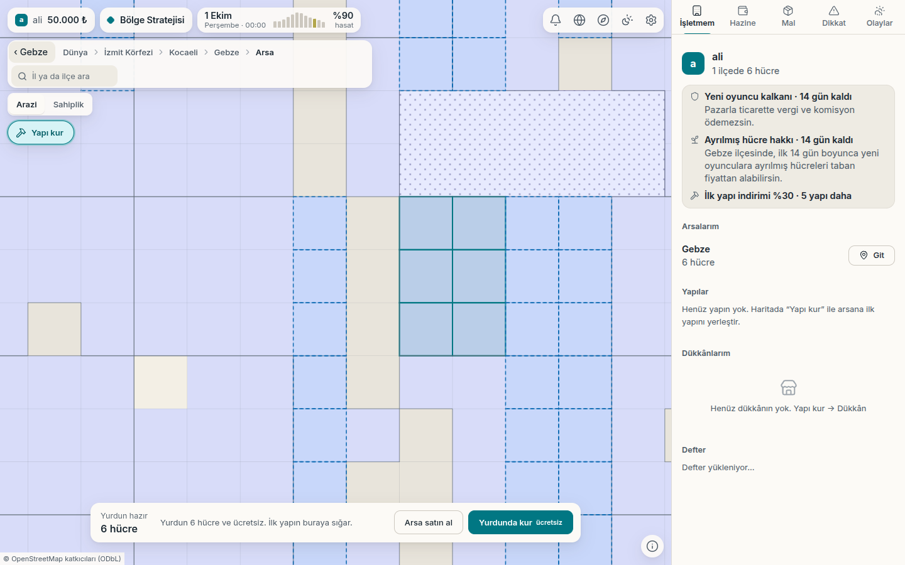
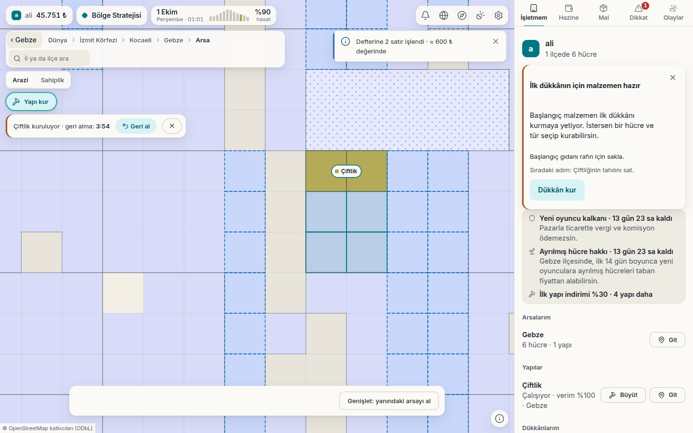
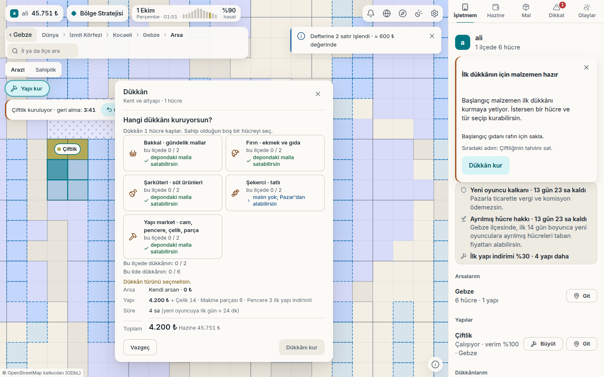
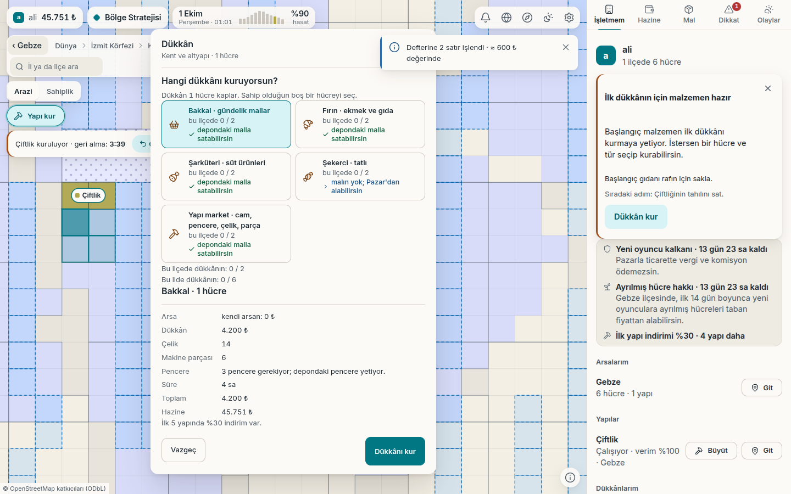
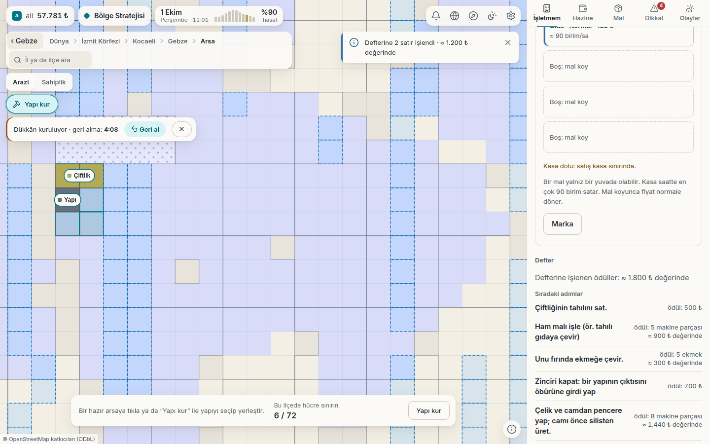
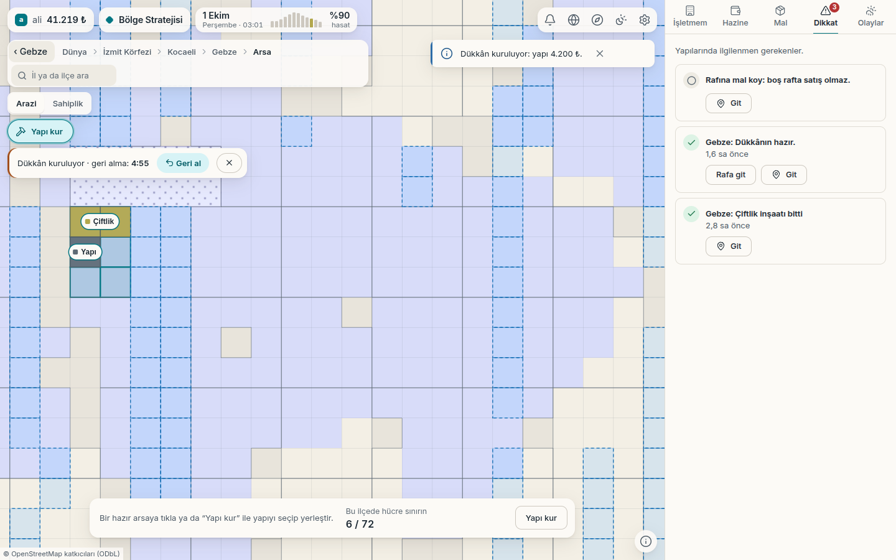
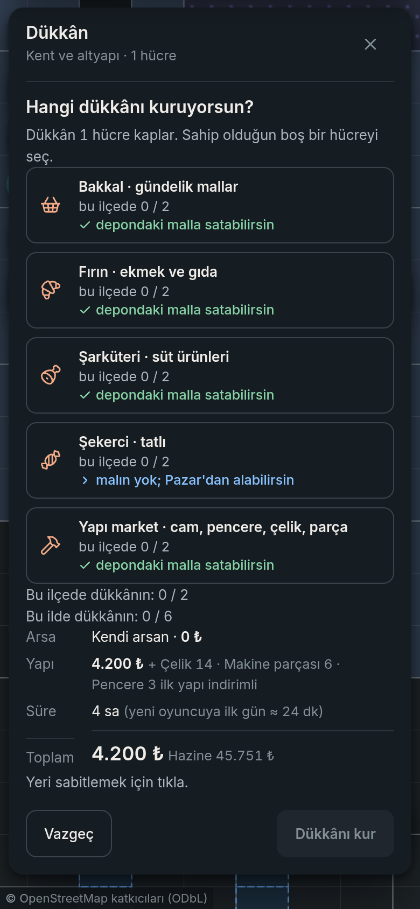
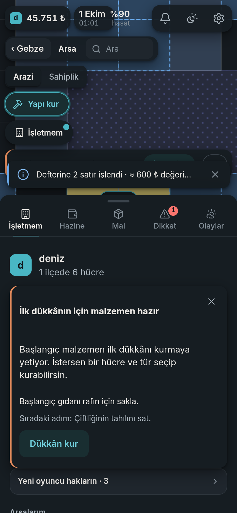

# Sabah raporu 2: gece neler oldu (2 Ekim 2026)

> Baş liderden sahibe. Yalnız ürün ve oyun. Ana dal: `2103af0` (GitHub'da). Gece 9 paket birleşti, hepsi tam kapıdan, Postgres doğrulamasından ve uçtan uca tarayıcı testinden geçti.

## Tek cümlede

**Dükkân artık oynanıyor ve üç ilçe açık.** Oyuncu bedava yurdunda çiftliğini kurup tahılını satabiliyor; ilk dükkânını kurup rafını doldurabiliyor, fiyat kademesini seçip ilk satışı görebiliyor. Gebze, Gemlik ve Körfez'de başlanabiliyor. Ekmek zinciri ile cam → pencere hattı çekirdekte ve veride hazır. **Ancak bu iki hattı ekrandan seçmeyi sağlayan "yöntem seçici" bu gece ana dala yetişmedi;** sabahın ilk paketi o.

## 1. Oyuncu bugün ne yaşıyor

| An | Oyuncu ne yapar | Durum |
|---|---|---|
| Giriş | E-postasına gelen bağlantıyla parolasız girer, küçük harfli bir ad önerilir; hesap bölümünde "Hesabı sil" var | **Oynanır** |
| Yerleşme | Üç ilçeden birini seçer: **Gebze, Gemlik, Körfez** (her biri gerçek arsa ızgarasıyla) | **Oynanır** (Gemlik/Körfez bu gece açıldı) |
| Varış | "Yurdun hazır" kartı: 6 hücrelik **bedava yurt**; 50.000 ₺ hibe; 14 gün yeni oyuncu kalkanı; ilk 5 yapıda %30 indirim | **Oynanır** |
| İlk yapı | Çiftliği yurduna tek tıkla kurar; ilk gün inşa 12 dk; arsa+yapı her zaman **tek işlem** (yarım alım yok) | **Oynanır** |
| İlk satış (~25–30. dk) | Defter "Çiftliğinin tahılını sat." der; başlangıç gıdası rafa saklanır | **Oynanır** |
| İlk dükkân (~50–60. dk) | Öneri kartı → "Dükkân kur" → tür (bakkal, fırın, şarküteri, şekerci, yapı market) → maliyet → inşa → "Dükkânın hazır" → "Rafa git" → raf, fiyat kademesi, marka | **Oynanır** |
| İlk dükkân satışı | "Dükkânında ilk satış oldu; hayırlı olsun." + Defter ödülü (10 çelik) | **Oynanır** |
| Ekmek zinciri | Gıda fabrikasında değirmen + fırın; elektrik ve yakıt şebekeden kendiliğinden | Çekirdek ve veri **hazır**; ekranda yöntem seçimi **sabah paketinde** |
| Cam → pencere | Cam fırını + çelik doğrama; yapı market cam/pencere/çelik satar; "ilk pencere" 8 parça ödül | Veri **hazır** (bu gece girdi); yöntem seçimi **sabah paketinde** |
| Bakım | Yapılar zamanla aşınır, makine parçası ister; aşınma ekranda görünecek | Mekanizma **oynanır**; aşınma gösterimi kısmen |
| Dönüş | "Sen yokken" kartı: net sonuç, biten işler, dükkân satışı dahil | **Oynanır** |

Davetli oyuncu kısa adresle girer: `https://<site>/` (barındırma senden; bkz. §5).

### Ekran görüntüleri (ana dal `2103af0`, T2'nin gece seti)

| | |
|---|---|
|  Varış: bedava yurt |  İlk dükkân önerisi ve Defter adımı |
|  Dükkân türü seçimi (5 tür) |  Maliyet kartı |
|  Raf, kademe ve Defter |  "Dükkânın hazır · Rafa git" |
|  Telefon, koyu tema |  Telefon, İşletmem |

Tam set (yaklaşık 60 kare, açık/koyu, masaüstü/telefon) ekipte duruyor; istersen depoya alınır.

## 2. Bu gece verdiğim ürün kararları

- **Boş raf:** ilk satış başlangıç gıdasıyla değil **çiftliğin tahılıyla** yapılır ("Çiftliğinin tahılını sat."); gıda dükkânın rafına kalır. Veri değişmedi, yalnız metin.
- **Arsa + yapı tek işlem:** iki farklı arsa sınıfına düşen yerleşimde bile oyuncu "arsayı aldı, yapı kurulamadı" durumuna düşmez.
- **Pencere zinciri güçlendirildi:** çelik doğrama 28 → 30 pencere/sa, cam fırını yakıtı 16 → 12; geri ödeme 37,9 → 26 sa (en zayıf zincirdi).
- **Arsa fiyatı tam lira:** fiyat yukarı, bırakma iadesi aşağı yuvarlanır (10.001 ₺ / 39.999 ₺ gibi kesirli görünüm bitti).
- **Aşınma görünür olacak:** tesis aşınması protokole eklendi; 3B'de yapı aşındıkça soluklaşacak.
- **Her açılış çiftlikle başlar;** açılış seçimi yalnız ikinci adımı belirler.
- **Yöntem seçiminde varsayılan yok:** gıda fabrikası kurarken oyuncu değirmen/fırın/gıda işlemeden birini bilerek seçer (tek açık yöntem varsa o seçili gelir).
- **Fiyat sınırı açığı kapandı:** boşalt-doldur döngüsüyle 6 saatlik fiyat değişim sınırı aşılabiliyordu; kapatıldı. İlk doldurma ve ilk kademe seçimi serbest.
- **Kamu kasası:** hazine sıfırken ödenmeyen borç kasaya yazılmıyor (ileride para basma açığı olurdu).
- **KVKK:** sunucu günlüğünde e-posta adresinin hiçbir parçası tutulmuyor (yalnız anonim 8 haneli iz); gerçek veritabanı provasıyla kanıtlandı. Hesap silme uçtan uca çalışıyor.
- **Süreç:** gece boyunca `git stash` yasaklandı (ajanlar arası değişiklik karışması yaşandı, kayıp yok).

## 3. Ekonomi ve denge: Ar-Ge'nin bulguları (kâğıt model)

- **Zarar eden zincir yok.** Net ₺/sa: fındık 7.765, süt 4.933, ekmek 4.492, cam → pencere ~3.400 (güçlendirme sonrası). Süt ve fındık **Alfa-0 sonrası**.
- **A0-11 (ilk dükkân ≤ 36 sa, geri ödeme ≤ 48 sa) medyanda tutuyor:** ilk dükkân 0,6–1,0 sa, geri ödeme 22–37 sa. Tutmayan durumlar: 20 binden küçük ilçe, bir kasabada 3+ dükkân.
- **Seyrek oyuncu kalıcı geride kalmıyor:** haftada bir giren, 7. günde her gün girenin servetinin %63'ünde, 30. günde %92'sinde. Uçurum yok.
- **Para sızıntısı taraması:** yüksek ciddiyetli açık yok. İki orta bulgu kapandı (fiyat sınırı döngüsü, ödenmeyen borç).
- **Sunucu yükü:** dükkânlı çözümde p95 22 ms (hedef 300 ms), en kötüye yakın senaryoda.
- **Ölçüm:** Alfa-0 kabul tablosu (A0-1…A0-18), metrik okuma kılavuzu ve açılış günü risk listesi hazır; ekonomi metrikleri sunucuda.

## 4. Riskler ve bilinen açıklar

1. **Yöntem seçici ana dalda değil** (sabahın ilk paketi): ekmek zinciri ve cam → pencere ekrandan seçilemiyor. Seçici yazıldı, gerçek sunucuda değirmen+fırın kurulup ekmek üretildi; uçtan uca testte kart haritanın yarısını örttüğü görüldü, kompakt kart (≤ ~300 px) ve kart konumu düzeltmesiyle birlikte girecek.
2. **Fiyat kademesinde üst kademe hep kazanıyor** (talep modeli fiyata duyarsız): Alfa-0'da kabul, canlıda izleniyor; Alfa-1 için tek parametrelik çözüm notu yazıldı.
3. **İthal edip dükkânda 1,15'te satmak** küçük ama gerçek yeni para üretiyor: Alfa-0'da kabul, %15 eşikli izleme.
4. **Bakım C**, satışın kamu talebiyle sınırlı olduğu zincirlerde kendini ödemiyor: ilk canlı hafta ölçülecek.
5. **Defter ilk satış damgası** satıştan en çok 1 saat sonra geliyor; dükkânın anlık "ilk satış" bildirimi bunu karşılıyor.
6. **Kalabalık:** tek ilçede 23+ oyuncuda geri ödeme 48 saati aşar; üç ilçe açıldığı için risk azaldı.
7. **Caddy (istemci sunumu)** yapılandırıldı ama gerçek makinede denenmedi (bu ortamda Docker yok).
8. **Yürüyüş (sokak) görünümü** canlıda oyuncunun gerçek yapılarını değil örnek yapıları çiziyor; harita (2B) görünümü doğru. Bağlama işi sırada.
9. **Dükkân ekranında küçük kusurlar** (ekran setinden 24 madde): haritada dükkânın etiketi "Yapı" yazıyor; kasa/boş raf iletileri iki yerde; yuva satırındaki gelir rakamı (satış × fiyat ile tutmuyor) incelenene kadar gizleniyor. Düzeltmeler hazırlanıyor.
10. **Gemlik/Körfez ve sunucu ayarı:** istemci üç ilçeyi açıyor ve uçtan uca testte Gemlik'e yerleşme geçti; ancak sunucu ızgara dosyalarıyla başlatılmazsa kartta "henüz açık değil" görünüyor (ekran setinde böyle çıktı). Kurulum kılavuzunda bunun varsayılan olduğu doğrulanıyor.

## 5. Senden beklenen kararlar

- **Barındırma (A-2) ve site adresi:** sağlayıcı ve alan adı; yapı (Caddy + sunucu + Postgres) sağlayıcıdan bağımsız hazır.
- **KVKK ve yasal metinler:** veri sorumlusu, rıza/aydınlatma metni, destek e-postası, hesap silmede silme süresi ve veri kapsamı; günlük maskesinin hukuki teyidi (Ö13).
- **Alfa-0 davet listesi** (en çok 200; ilk dalgada ~20 öneriyorum) ve **test oturumlarını kim yürütecek** (S1).
- **E-posta sağlayıcısı (SMTP/SES)**, geçici e-posta alanı listesinin lisansı, TÜİK nüfus verisi lisansı.
- Bilgi: marka/görünen ad küçük harfle kaydediliyor (S-12); "serbest" dersen tek satır.

Ayrıntılı liste ekte (aynı içeriğin tamamı `docs/13` §4 ve gece listesinde).

## 6. Alfa-0'a kalan yol

1. **Sabah paketi:** yöntem seçici + kompakt kart + kart konumu → ekmek zinciri ve cam → pencere ekrandan oynanır.
2. Dükkân akışı uçtan uca test betiği kapıya (yazıldı, koşuluyor).
3. Barındırma ve gerçek makinede kurulum provası (Caddy dahil) — senin A-2 kararınla.
4. **İnsan testi** (pilot paketi hazır): ilk saat, ilk dükkân, seyrek oyuncu gözlemleri.
5. Askeri 0a şeması güncel (yalnız belge); 0b bayraklı eşkıya Alfa-0 sonrası sırada.

## Kaynaklar

- Oyuncu yolculuğu: `docs/arastirma/alfa0-oyuncu-yolculugu.md`
- Kabul tablosu: `docs/arastirma/alfa0-kabul-tablosu.md`; metrik okuma: `docs/arastirma/alfa0-metrik-okuma.md`
- Zincir kârlılığı ve oyuncu tipleri: `docs/arastirma/alfa0-zincir-karlilik.md`, `docs/arastirma/alfa0-oyuncu-tipleri.md`
- Alfa-1 fiyat esnekliği notu: `docs/arastirma/alfa1-talep-esnekligi.md`
- İşletim kılavuzu: `docs/alfa0-isletim.md`
