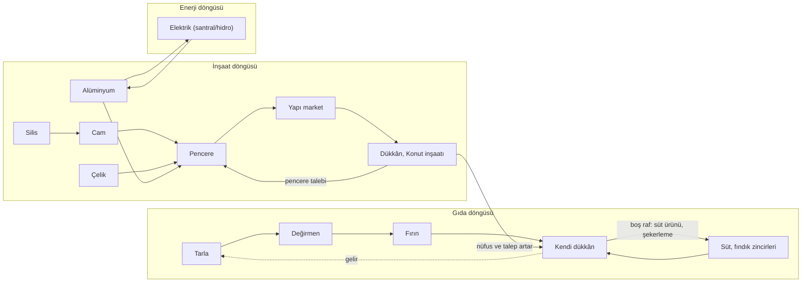

# Araştırma — Dikey Üretim Zincirleri ve Kendi Dükkânın (Perakende)

> **Durum ve güvenilirlik.** 1 Ekim 2026'da derlendi. Bu bir **Ar-Ge önerisidir; kod, veri ve başka belge değiştirilmedi.** Sayıların hepsi başlangıç değeridir, **kalibre edilmemiştir** ve `icerik.json` / `parametreler.json` ölçeğine (Tarla = 200 birim/sa tahıl, tahıl ₺30, çelik ₺120, parça ₺180, elektronik ₺400) göre hesaplanmıştır; kaynaksız sayı "ilk tahmin"dir. Gerçek dünya dönüşüm oranları (un, peynir, alüminyum, cam, iplik, fındık) web kaynaklarından alındı ve **ikincil kaynaktır** ([K#] listesi sonda; çoğu arama özetidir, birincil metin okunmadı: "doğrulanmadı" ibaresi taşır). Oyun birimi gerçek kilogram **değildir**; gerçek randıman oranları yalnız yönü ve sıralamayı belirler, oyundaki oranlar katma değer hedefine (§2.2) göre ayarlanmıştır. Capital Rift, Big Ambitions, Anno, Factorio ve Victoria 3 bilgileri üçüncü taraf wiki ve rehber sayfalarındandır. "Sezon" yerine "iklim takvimi/dönem" denir.

İlgili belgeler: [cesitlilik-uretim-katmanlari](cesitlilik-uretim-katmanlari.md) (§4.4 Z1–Z10, §5.2 S-Z1–S-Z8, §7 katalog — **tekrar edilmez**) · [canli-dunya-simulasyonu](canli-dunya-simulasyonu.md) (§4.1 çekim formülü, §3.3–3.4 talep — **tekrar edilmez**) · [imza-mekanikleri-ve-yonelimler](imza-mekanikleri-ve-yonelimler.md) (§3.6 N14, N3 hal, N4 ihale, K-5, K-7) · [arsa-ve-insa-derinlestirme](arsa-ve-insa-derinlestirme.md) · [baslangic-ve-ustalik](baslangic-ve-ustalik.md) · [capital-rift-mekanikleri](capital-rift-mekanikleri.md) · [12 — Yön Taslağı §8](../12-yon-taslagi.md).

---

## 0. Yönetici özeti (10 madde)

1. **Boşluk.** Katalogda zincir tabloları (Z1–Z10, S-Z1–S-Z8) ve N14 iskeleti var; ama (a) sahibin ilk örneği olan **buğday → un → ekmek → fırın** ve **boksit → alüminyum → pencere → yapı market** zincirinde `ekmek`, `boksit`, `alumina`, `aluminyum`, `cam`, `pencere`, `hazir_giyim`, `sekerleme` malları katalogda **yok**; (b) "kendi dükkânım" için **yapı, raf, fiyat, konum** tanımı yok; (c) mevcut içerik tek bir yerde tutuyor: Tarla → Gıda fabrikası → `gida`; zincirin ucunda raf değil NPC pazar var.
2. **Yedi yeni zincir ve bir kavşak** (§3), her biri 2–5 kademe, kademe başına yapı/yöntem, süre, oran ve katma değer ile: **Ekmek**, **Alüminyum→doğrama**, **Cam**, **Çelik→doğrama/yapı malzemesi**, **Süt→peynir→şarküteri**, **Pamuk→giyim**, **Fındık→şekerleme** ve üç zincirin birleştiği **Pencere kavşağı**. Her kademede çıktı/girdi değeri 1,23–1,48 (mevcut 1,22–1,37 bandına uyumlu); oranlar §2.2'deki betikle üretildi.
3. **Yeni yapı gerekmez, yeni yöntem gerekir.** 19 yeni yöntem mevcut yapılara eklenir: Gıda fabrikası (değirmen, fırın, mandıra, kavurma, ezme), Çelikhane (cam, alümina, ergitme, çimento), Parça fabrikası (iki doğrama), Maden ocağı (boksit), Tarla (pamuk, fındık bahçesi), Ahır (süt). Tek yeni yapı **Dükkân**'dır (§5).
4. **Kanal ekonomisi (§4).** NPC pazar net **0,891 R** öder (satış çarpanı 0,9 − komisyon %1). Diğer kanallar buna göre: hal ≈ 0,94 R, zincir market toptan 0,92 R, **kendi dükkân 1,00–1,12 R**, oyuncuya sözleşme 0,95–1,05 R, kamu ihalesi tavan 1,10 R (ithalat paritesi; kamu raporu KK-9). Dükkân primi pazara göre **+%12 ile +%26**; ama doyan pazarda (oyuncu arzı emilimin 2 katıysa fiyat ×0,25'e iner) dükkân kanalı **zinciri kurtaran çıkış** olur.
5. **Perakende modeli (§5): tek `dukkan` ek yapısı + tür = veri.** Altı tür (fırın, bakkal, şarküteri, şekerci, yapı market, giyim) **yöntem benzeri veri kaydıdır**, ayrı yapı değil. **Raf = çeşit yuvası** (S 4 / M 6 / L 8; bir yuva = bir mal), **kasa kapasitesi** (S 90 / M 198 / L 324 birim/sa), fiyatı **oyuncu belirler** ([0,7 ; 1,4] R bandı, otomatik fiyat önayarlarıyla). Çekim formülü [canli-dunya §4.1](canli-dunya-simulasyonu.md#41-yerel-pazar-kanalı-npc-müşteri-nasıl-çekilir) **aynen** kullanılır; yalnız üç çarpan eklenir: tür uyumu, konum çarpanı, kasa kapasitesi.
6. **Bölge (il) sınırı lojistik sınırıdır.** Mülk kipinde stok (oyuncu, il) işletme düğümünde ve il içi taşıma bedavadır ([11 §3.5](../11-urun-donusu.md#35-lojistik)); dükkân yalnız **talep konumudur**. Bu, "zinciri bir ilde kapat" ile "boksiti başka ilden getir" arasındaki farkı gerçek bir lojistik kararı yapar (örnek: 20 konvoy ≈ ₺12.400).
7. **Dikey entegrasyon ↔ uzmanlaşma (§6).** Bulgu: **NPC pazar makası (±%10, gidiş-dönüş ≈ %20) ara kademe uzmanlığını Alfa-0'da öldürür** (değirmen uzmanı −₺272/sa; tam entegre ≈ +₺9.036–10.304/sa). Bu bilinçli bir sonuç olarak yazılmalı: **Alfa-0 = kapalı zincir ve çıkış kanalı seçimi; Alfa-1 (sözleşme P5, emir defteri) = kademe uzmanlığı.** Sözleşme fiyatı R'de dengelendiğinde entegre ≈ uzmanların toplamı (₺10.653 ↔ ₺10.508) olur; fark fiyat dışı kuvvetlerden gelir (kümelenme +%5/çift, hasat dalgası, risk, dikkat, sermaye).
8. **Zincir topolojisi dengeyi belirler (§6.4).** *Çizgi zincir* (ekmek, süt, fındık, pamuk: 4 yapı, 7 hücre) **entegrasyona**, *ağ zinciri* (pencere: 7–8 yapı, 15–16 hücre, 3 farklı il kaynağı) **uzmanlaşma ve ticarete**, *çeşit perakendesi* (bakkal, yapı market, giyim: raf için ≥4–6 mal) **çok tedarikçiye** doğal olarak iter. Üç tür oyuncu aynı zamanda var olabilir.
9. **Döngü hissi (§7).** Beş tür geçiş tetiği, **Fırsat Kartı** olarak (imza §4.2 biçimi; günde ≤1, kalabalık sönümü ¼) üretilir: *boş raf*, *NPC'den ithal ettiğin girdi*, *ilçede inşaat sayısı*, *elindeki ara mal stoku*, *aynı ilde komşu zincirin açığı*. En güçlü bağ: **Dükkân'ın kendi inşaatı pencere ister** (4 birim) ve Konut/Dükkân gibi yeni yapılar `pencere`/`cimento` tüketir; böylece "pencere satan oyuncu yapı malzemesi talebini fark eder" kural olur.
10. **Alfa-0 önerisi (§9): 4 tam zincir + 1 isteğe bağlı + 1 Alfa-1.** Ekmek, Cam→Pencere (çelik doğrama), Süt→şarküteri, Fındık→şekerleme; isteğe bağlı Alüminyum (ithal boksitle); Alfa-1 Pamuk→giyim. Mevcut 14 malın üstüne **9 yeni mal** (`un`, `ekmek`, `cam`, `pencere`, `sut`, `sut_urunu`, `findik`, `findik_urunu`, `sekerleme`) + 4 isteğe bağlı (`cimento`, `boksit`, `alumina`, `aluminyum`) + 4 Alfa-1 (`pamuk`, `iplik`, `kumas`, `hazir_giyim`). **G8:** içerik dizilerine yalnız sona ekleme; kimlikler kalıcı; katalogdaki `tekstil` kimliği doğmadan **düzeltilmeli** (`kumas` + `hazir_giyim`).

---

## 1. Kapsam, mevcut durum ve tekrar etmeme sınırı

### 1.1 Ne var, ne yok

| Konu | Var (kaynak) | Bu rapor ne ekliyor |
|---|---|---|
| Mal ve zincir kataloğu | 14 mal; Tier 1/2/3 katalog (§7) ve Z1–Z10, S-Z1–S-Z8 zincirleri | 9+4+4 yeni mal önerisi; **zincir başına kademe, yapı, süre, oran, katma değer, kanal** |
| `ekmek`, `boksit`, `alumina`, `aluminyum`, `cam`, `pencere`, `hazir_giyim`, `sekerleme` | Katalogda **yok** (`cimento`, `un`, `iplik`, `tekstil` var) | Eklenmesi gereken minimum liste (§9.2) |
| Perakende | N14 bakkal "küçük Ticaret ofisi, perakende yöntemi" (imza §3.6); çekim formülü, esnaf tabanı %25, esnaf fiyatı ref +%12 (canli-dunya §4.1–4.2); tabela/vitrin ≤+%10 (capital-rift madde 8) | **Dükkân yapısı, raf/çeşit, kasa, fiyat, konum, vitrin, tür tablosu** (§5); N14'e dokunmadan genelleme notu |
| Kanallar | NPC pazar (`makasPpm` %20, ihracat ×0,9, ithalat ×1,1), hal (N3), zincir market (N14), ihale (N4/§4.5), tedarik sözleşmesi P5 | **Kanal başına net fiyat ve marj farkı** (§4) |
| Zincir kümelenmesi | E2 +%5/çift, ≤+%15; OSB "Sanayi Adası" (cesitlilik S4/§5.4) | Kullanıldı; yeniden tanımlanmadı |
| Dikey/uzman | NPC makası "her adımda ≈%20" (baslangic §4.2), Ü8 çarpanı **kaldırıldı** önerisi | **Sayısal denge testi** ve topoloji ilkesi (§6) |

### 1.2 Birimler ve ölçek

- Miktar mili-birim (200 000 = 200 birim), para mili-₺ (30 000 = ₺30). Tablolarda "birim/sa" ve "₺/sa" kullanılır; **S ölçek** (ölçek kademesi çarpanları M ×2,2 / L ×3,6 çıktı; [06 §12](../06-simulasyon-spesifikasyonu.md)).
- **Kenar koşul:** Tarla 200 birim/sa × ₺30 = ₺6.000/sa, dünya NPC emilimi (`tahil` 360 birim/sa) yalnız iki Tarla'ya yeter. Bu yüzden ₺/sa değerleri **kanalın sınırsız emdiği üst sınırdır**; gerçek sınırlayıcı NPC emilimi ve ilçe talebidir (`Q`). Karar için **göreli** marjlar esastır, mutlak ₺ değil.
- Mülk kipinde stok (oyuncu, il) işletme düğümünde, il içi akış bedava ve anlıktır; iller arası akış filo/konvoy ister (konvoy = 100 birim, sefer 2 × süre; `filo_al` ₺200 + 2 çelik + 1 parça).

---

## 2. Zincir tasarım ilkeleri

### 2.1 Tanımlar

| Terim | Anlam |
|---|---|
| **Kademe** | Zincirde bir yapı + yöntem; girdi malları → çıktı mal(lar)ı |
| **Çizgi zincir** | Her kademe tek girdi hattı (tahıl→un→ekmek); 1:1:1 kapasite |
| **Ağ zinciri / kavşak** | Bir kademe ≥2 ayrı zincirin çıktısını ister (pencere = alüminyum/çelik + cam + parça) |
| **Çeşit perakendesi** | Raf için ≥4 farklı malın farklı zincirlerden gelmesi gereken dükkân türü (bakkal, yapı market, giyim) |
| **Kapalı zincir** | Üretimden rafa ya da çıkış kanalına kadar tek oyuncu |

### 2.2 Katma değer sınaması (betikle)

Her kademe için `çıktı değeri / girdi değeri` **1,15–1,5** (zanaat dışı). Girdi değeri = Σ girdi × taban fiyat (elektrik ve yakıt dahil); bakım parçası ve işletme gideri ayrıca düşülür. Hesap betiği (scratchpad, depoda yok) şu sonuçları verdi (S ölçek, birim/sa):

| Yöntem (yapı) | Girdi → çıktı | Girdi değeri | Çıktı değeri | Oran | KD (₺/sa) | KD/işçi |
|---|---|---:|---:|---:|---:|---:|
| `degirmen` (Gıda fab.) | 200 tahıl + 12 elektrik → 150 un | 6.120 | 7.500 | 1,23 | 1.380 | 276 |
| `ekmek_firini` (Gıda fab.) | 150 un + 22 yakıt + 15 elektrik → 225 ekmek | 9.850 | 13.500 | 1,37 | 3.650 | 456 |
| `boksit_cikarim` (Maden) | 6 elektrik → 100 boksit | 60 | 4.000 | — | 3.940 | 358 |
| `alumina_bayer` (Çelikhane) | 100 boksit + 8 yakıt + 12 elektrik → 50 alümina | 4.920 | 6.250 | 1,27 | 1.330 | 190 |
| `aluminyum_ergitme` (Çelikhane) | 50 alümina + 100 elektrik → 27,5 alüminyum | 7.250 | 9.625 | 1,33 | 2.375 | 396 |
| `cam_firini` (Çelikhane) | 60 silis + 18 yakıt + 20 elektrik → 50 cam | 3.500 | 4.750 | 1,36 | 1.250 | 179 |
| `aluminyum_dograma` (Parça fab.) | 27,5 Al + 50 cam + 7,5 parça + 25 elektrik → 60 pencere | 15.975 | 21.600 | 1,35 | 5.625 | 703 |
| `celik_dograma` (Parça fab.) | 24 çelik + 32 cam + 6 parça + 15 elektrik → 27 pencere | 7.150 | 9.720 | 1,36 | 2.570 | 367 |
| `cimento_firini` (Çelikhane) | 30 silis + 20 kömür + 8 elektrik → 40 çimento | 1.430 | 1.800 | 1,26 | 370 | 62 |
| `sut_sigirciligi` (Ahır) | 90 tahıl + 5 elektrik → 100 süt | 2.750 | 4.000 | 1,45 | 1.250 | 208 |
| `peynir_mandira` (Gıda fab.) | 150 süt + 10 elektrik → 68 süt ürünü | 6.100 | 8.160 | 1,34 | 2.060 | 343 |
| `findik_kavurma` (Gıda fab.) | 80 fındık + 5 yakıt + 6 elektrik → 40 iç | 7.360 | 9.600 | 1,30 | 2.240 | 373 |
| `findik_ezme_sekerleme` (Gıda fab.) | 40 iç + 30 gıda + 12 elektrik → 90 şekerleme | 11.820 | 16.200 | 1,37 | 4.380 | 626 |
| `iplik_egirme` (Parça fab.) | 100 pamuk + 20 elektrik → 80 iplik | 7.200 | 10.400 | 1,44 | 3.200 | 400 |
| `kumas_dokuma` (Parça fab.) | 80 iplik + 25 elektrik → 76 kumaş | 10.650 | 15.200 | 1,43 | 4.550 | 506 |
| `konfeksiyon` (Parça fab.) | 76 kumaş + 15 elektrik → 60 hazır giyim | 15.350 | 20.400 | 1,33 | 5.050 | 361 |

Notlar: (a) Mevcut yöntem KD/işçi hedefi 250–400'dür ([06 §10.5](../06-simulasyon-spesifikasyonu.md)); `alumina_bayer` (190), `cam_firini` (179), `cimento_firini` (62) hedefin altındadır: işçi 5/5/2'ye çekilirse 266/250/185 olur (öneri; işçi sayısı serbest ayar). (b) `aluminyum_dograma` 703 yüksektir çünkü üç zincirin çıktısını birleştirir; **bilerek** yüksek: ağ zincirinin uzmanı en çok getirmesi gereken kademedir ve tek başına entegre olmak pratik değildir (§6.4). (c) Katalogdaki `findik_urunu` ₺190 oranı 1,10 verir ([cesitlilik §4.4](cesitlilik-uretim-katmanlari.md)); **₺240** olursa 1,30 olur ve kavurma kademesi 1,15 eşiğini aşar. (d) `sut` → `sut_urunu` mal oranı **2,2 : 1** (gerçek 7,5–12 L : 1 kg [K5]); katalog fiyatları (`sut` 40, `sut_urunu` 120) gerçek kütle oranını taşımaz, bu yüzden oyun oranı katma değere göre ayarlandı. Bunun sonucu: katalogda fiyat sınıfları kütle oranına göre **yeniden okunmalı** (Q, §10).

### 2.3 Üç ilke

1. **Her zincir iki ucundan girilebilir.** Oyuncu ham maddeyi NPC ithalatıyla (×1,11) alıp ortadan da başlayabilir; tam zincir zorunlu değildir. Ama NPC makası ara kademeyi pazardan beslemeyi pahalı yapar (§6).
2. **Yeni yapı yerine yeni yöntem.** Kural: *çıktı/girdi kümesi değişiyorsa yöntem* ([arsa-ve-insa §3.1](arsa-ve-insa-derinlestirme.md#31-üç-eksen-yöntem--ölçek--modül)). Çelikhane yapısı ("fırın ve metalurji") cam, alümina, ergitme ve çimento yöntemlerini taşır; Parça fabrikası iki doğrama ve üç tekstil yöntemini taşır ([cesitlilik §5.2 (A)](cesitlilik-uretim-katmanlari.md): "adı yanıltıcı" riski, Alfa-1'de 19./20. yapı kararı).
3. **Bölge kimliği tarif takasıyla gelir.** `yuksek_firin` ↔ `elektrik_ark` gibi **`aluminyum_dograma` ↔ `celik_dograma`** aynı malı (pencere) farklı kaynak profiliyle verir: alüminyum yolu boksit (güney iller [K9]) ve elektrik ister, çelik yolu cevher+kömür ister. Alfa-0 illerinde (Kocaeli, Sakarya, Bursa) boksit yoktur (il düzeyi doğrulanmadı; kaynaklar güney illeri sayar [K9]); çelik doğrama doğal yoldur, alüminyum **ithal boksitle** isteğe bağlıdır.

---

## 3. Zincirler

Süre sütunu: **inşa süresi** `mulk.yapiInsaSaati` (ilk 24 saatte erken oyun çarpanı %10; [06 §15.5](../06-simulasyon-spesifikasyonu.md)); üretim sürekli akıştır (birim/sa). "Eşleşme" sütunu kapasite oranını verir. Lojistik: il içi bedava ve anlık; iller arası MCF + filo.

### 3.1 Zincir A — Ekmek (çizgi, A0)

*Buğday → un → ekmek → fırın / bakkal / pazar.* Gerçek dayanak: Türkiye kişi başı yıllık ≈ 199,6 kg ekmek tüketir, dünyada birinci [K3]; 100 kg buğdaydan ≈ 68–75 kg ekmeklik un [K4]; 1 kg undan ≈ 1,5–1,7 kg ekmek [K3b].

| # | Kademe | Yapı (yöntem) | İnşa | Girdi → çıktı (S, birim/sa) | Oran | Eşleşme | Katma değer |
|---|---|---|---:|---|---|---|---:|
| 1 | Tarla | `ciftlik` (`geleneksel_tarim`, mevcut) | 2 sa | — → 200 tahıl (hasat eğrisi ×0,3–1,9) | — | 1 | ham |
| 2 | Değirmen | `gida_fabrikasi` (**`degirmen`**) | 6 sa | 200 tahıl + 12 elektrik → 150 un | 0,75 (gerçek %68–75) | 1 | ×1,23 |
| 3 | Fırın | `gida_fabrikasi` (**`ekmek_firini`**) | 6 sa | 150 un + 22 yakıt + 15 elektrik → 225 ekmek | 1,5 (gerçek 1,5–1,7) | 1 | ×1,37 |
| 4 | Satış | `dukkan` (tür `firin` / `bakkal`, §5) | 4 sa | 225 ekmek → NPC müşteri | — | 1 | kanal primi |

- **Bozulma:** `ekmek` anlık sınıfı (250.000 ppm/gün ≈ %25/gün, öneri); fırın → dükkân aynı il düğümünde bedava ve anlıktır, bozulma yalnız stokta işler. `un` orta (8.000), `tahil` 10.000 (mevcut).
- **Ekmek dalgası:** dükkân stok hedefi 1–2 gün; bayat ekmek **`tahil`e geri dönüşüm** (bozulan ekmeğin %30'u yem/`tahil` değeri; hayvan yemi olarak gerçek) isteğe bağlı küçük döngü kapatıcıdır (Capital Rift'in "her şey geri dönüşür" izine benzer; [cr §2.3](capital-rift-mekanikleri.md)).
- **Eşleşme:** Anno'da aynı zincir 2:1:2 gibi kesirli oranlardır [K13]; bizde bilerek **1:1:1** (rehber dostu); oran bulmacası ölçek kademelerinden (S/M/L ×1/×2,2/×3,6) gelir.
- **Mevsim:** karasal iklimde Ocak eğrisi 0,30 (Tarla ≈ 60 birim/sa); silo/ambar ve ithalat (×1,11) kararı doğar (§6.3).
- **Lojistik:** zincir bir ilde kapanırsa lojistik yok; Tarla ova (`gerekliEtiket: ova`), dükkân ticari/konut arsası. İki il arasına bölünürse un için (150 birim/sa, 3 saatlik kenar) `gerekenKonvoy = 150 000 × 2 × 3 / 100 000` = 9 konvoy.
- **Yatırım:** 4 yapı, 7 hücre, ₺32.000 + 170 çelik + 58 parça + 4 pencere ≈ ₺64.700 taban değer; ilk 5 yapıda %30 indirimle ≈ ₺45.000: hibe + başlangıç kiti içinde ([baslangic §5.2](baslangic-ve-ustalik.md)).
- **Kanallar (225 ekmek/sa, KD = gelir − ₺2.992 dış gider, §6.2):** NPC pazar ₺9.036 · zincir market toptan 0,92 R ₺9.428 · hal/günlük toptan 0,94 R ₺9.698 · kendi dükkân 1,00 R ₺10.304 / 1,08 R ₺11.384 · sözleşme 1,00 R ₺10.508.
- **Gerçeğe bağlanma:** halk ekmek ve mahalle fırını kimliği; gerçek marka yok. Ekmek "gıda sepeti"nin %30'unu oluşturur (§5.6).

### 3.2 Zincir B — Alüminyum → doğrama → yapı market (ağ, A0-ops/A1)

*Boksit → alümina → alüminyum → pencere → yapı market.* Gerçek dayanak: ≈ 4 t boksit → 2 t alümina → 1 t alüminyum [K1]; elektroliz 12–15 MWh/t [K2]; Eti Alüminyum Seydişehir Türkiye'nin cevherden metale tek entegre tesisidir [K1]; boksit güney illerinde (Konya–Antalya, Muğla–Milas, Hatay…) [K9].

| # | Kademe | Yapı (yöntem) | İnşa | Girdi → çıktı (S, birim/sa) | Oran | Eşleşme | Katma değer |
|---|---|---|---:|---|---|---|---:|
| 1 | Boksit ocağı | `maden` (**`boksit_cikarim`**, damar şartı) | 6 sa | 6 elektrik → 100 boksit | rezerv | 1 | ham (₺4.000) |
| 2 | Alümina (Bayer) | `celikhane` (**`alumina_bayer`**) | 10 sa | 100 boksit + 8 yakıt + 12 elektrik → 50 alümina | 2 : 1 | 1 | ×1,27 |
| 3 | Ergitme (elektroliz) | `celikhane` (**`aluminyum_ergitme`**, teknoloji `elektroliz`) | 10 sa | 50 alümina + 100 elektrik → 27,5 alüminyum | 1,82 : 1 (gerçek 1,92) | 1 | ×1,33 |
| 4 | Doğrama | `parca_fabrikasi` (**`aluminyum_dograma`**) | 8 sa | 27,5 Al + 50 cam + 7,5 parça + 25 elektrik → 60 pencere | — | 1 + cam hattı | ×1,35 |
| 5 | Satış | `dukkan` (tür `yapi_market`) | 4 sa | pencere, çelik, çimento, parça | — | — | kanal primi |

- **Elektrik canavarı:** ergitme 100 birim elektrik/sa (yüksek fırın 25, ark 50); aynı ildeki santral/hidro sahibiyle **taş-kâğıt-makas bağı** ([imza §4.5](imza-mekanikleri-ve-yonelimler.md)): elektrik önceliği ve brownout riski.
- **Kirlilik:** alümina için "kırmızı çamur" kirliliği [K1b] E1 puanı 2 (öneri; Çelikhane 3'ten düşük, arıtma modülü ×0,5).
- **Lojistik örneği (boksit başka ilden):** 100 birim/sa, 10 saatlik kenar → gerekenKonvoy = 100 000 × 2 × 10 / 100 000 = **20 konvoy** ≈ 20 × (₺200 + 2 × ₺120 + 1 × ₺180) = ₺12.400 tek sefer + ₺80/sa işletme; NPC ithalatı ₺44,4/birim × 100 = ₺4.440/sa. Taşıma bedeli küçük, asıl bedel **kapasite ve süredir**.
- **Alfa-0'da:** boksit ocağı yok (il haritasında rezerv yoksa `arama_sondaji` boş döner); alüminyum yolu yalnız ithal boksitle (×1,11 maliyet, kademe 2 katma değeri ×1,27 → makas gidiş-dönüş yutar: **Alfa-0'da yalnız Alümina+Ergitme+Doğrama entegre oyuncusu için anlamlı**, uzman için değil). Tam zincir Alfa-1 güney illerinde (Konya, Antalya, Muğla).

### 3.3 Zincir C — Cam (çizgi + dallanma, A0)

*Silis → cam → pencere / şişe-ambalaj.* Gerçek dayanak: float camda ≈ %56 silis kumu, %18 soda, %26 dolomit/kalker vb. [K6]; Marmara'da kuvars/cam kumu üretimi ve sevkiyatı yaygın [K10]. Oyunda soda/dolomit **soyut**tur (silisin içinde sayılır; ayrı mal yok).

| # | Kademe | Yapı (yöntem) | İnşa | Girdi → çıktı (S, birim/sa) | Oran | Eşleşme | Katma değer |
|---|---|---|---:|---|---|---|---:|
| 1 | Silis ocağı | `silis_ocagi` (`silis_cikarim`, mevcut) | 6 sa | 5 elektrik → 60 silis | rezerv | 1 | ham |
| 2 | Cam fırını | `celikhane` (**`cam_firini`**) | 10 sa | 60 silis + 18 yakıt + 20 elektrik → 50 cam | 0,83 | 1 | ×1,36 |
| 3a | Doğrama | `parca_fabrikasi` (**doğrama**, Zincir B/D) | 8 sa | cam 50/32 → pencere | — | 1 | ×1,35–1,36 |
| 3b | Çimento (yan dal) | `celikhane` (**`cimento_firini`**) | 10 sa | 30 silis (kireçtaşı soyut) + 20 kömür + 8 elektrik → 40 çimento | — | 1 | ×1,26 |

- Silis iki dalı besler (cam, çimento) ve elektronik zincirini (mevcut: `bakir` + `silis`): **tek ham maddenin üç talebi**; silis ocağı oyuncusu doğal olarak uzmanlaşır (ham+ilk işleme).
- **Kırılganlık:** `cam` bozulma düşük ama kırılma olayı (kış fırtınası → cam/pencere talep ×1,5; [canli-dunya §5](canli-dunya-simulasyonu.md) olay şablonu) deterministik talep şoku olarak.
- **Alfa-0:** Sakarya/Kocaeli silis kumu; cam fırını Çelikhane yöntemi; ağır sanayi komşuluk kuralı (E1 kirlilik) geçerli.

### 3.4 Zincir D — Çelik → doğrama / yapı malzemesi (A0)

*Cevher + kömür → çelik → çelik doğrama (pencere) ve inşaat çeliği.*

| # | Kademe | Yapı (yöntem) | İnşa | Girdi → çıktı (S, birim/sa) | Oran | Eşleşme | Katma değer |
|---|---|---|---:|---|---|---|---:|
| 1 | Cevher + Kömür | `cevher_madeni` + `komur_ocagi` (mevcut) | 6 + 6 sa | → 100 cevher; 90 kömür | rezerv | 1 + 1 | ham |
| 2 | Yüksek fırın | `celikhane` (`yuksek_firin`, mevcut) | 10 sa | 100 cevher + 50 kömür + 25 elektrik → 60 çelik | — | 1 | ×1,37 |
| 3 | Çelik doğrama | `parca_fabrikasi` (**`celik_dograma`**) | 8 sa | 24 çelik + 32 cam + 6 parça + 15 elektrik → 27 pencere | — | 2,5 hat/fırın | ×1,36 |
| 4 | Satış | `dukkan` (`yapi_market`: `celik` raf, `pencere`, `cimento`) | 4 sa | çelik + pencere | — | — | kanal primi |

- `celik` zaten her yapının inşa maliyetinde geçer ([`icerik.json`](../../packages/veri/icerik/icerik.json)); yapı market rafında **inşaat çeliği** olarak satılır (ayrı mal yok).
- Zonguldak/Karabük/Ereğli çelik kimliği Tier 2 `yassi_celik` ile ilişkili (genel bilgi).

### 3.5 Pencere kavşağı (Zincir B + C + D birleşimi)

`pencere` üç zincirin çıktısını birleştirir: **cam** (silis), **çerçeve** (alüminyum ya da çelik), **donanım** (`parca`). İki tarif eşit katma değerli ama kaynak profilleri farklıdır.

| Ölçüt | `aluminyum_dograma` | `celik_dograma` |
|---|---|---|
| Çerçeve girdisi | 27,5 alüminyum (boksit → alümina → ergitme) | 24 çelik (cevher + kömür → çelik) |
| Çıktı/hat | 60 pencere/sa | 27 pencere/sa |
| Pencere başına girdi değeri | ₺266 | ₺265 |
| Elektrik yoğunluğu (zincir toplamı) | çok yüksek (ergitme 100/sa) | orta |
| Kaynak ili | güney (Konya, Antalya, Muğla…) | Karadeniz/Marmara (Zonguldak, Kocaeli…) |
| Tam entegrasyon bedeli | 7 yapı, ≈16 hücre, ≈ ₺188.000 (taban) | 7 yapı, ≈15 hücre, ≈ ₺170.000 |
| Alfa | A0-ops (ithal boksit) / A1 | **A0** |

Tam entegre bir oyuncu için yapı listesi (Al yolu): Boksit ocağı (2 hücre) + Alümina (3) + Ergitme (3) + Silis ocağı (2) + Cam (3) + Doğrama (2) + Dükkân (1) = **16 hücre**; çelik 480, parça 188 birim, ₺97.000 para: tek başına pratik değildir → **ağ zinciri uzmanlaşmaya ve sözleşmeye iter** (§6.4).

- **Pencere talebi (dört kaynak)** — her biri bir `NpcAlici` kaydıdır ([imza K-5](imza-mekanikleri-ve-yonelimler.md#k-5-para-korunumu-ve-npc-alıcı-bütçeleri), bütçe toplamı sabit):
  1. **Hane yenileme** (K2 "ev ve onarım"; [canli-dunya §3.3](canli-dunya-simulasyonu.md#33-i̇htiyaç-kademeleri)): `nufusEma` × oran; ilk tahmin 8 mili/1000 kişi/sa; `yerelOlcek` 50 ile 100 bin nüfuslu ilçede ≈ 40 pencere/sa.
  2. **NPC konut inşaatı** ([canli-dunya §3.2](canli-dunya-simulasyonu.md#32-i̇lçe-durum-alanları-çekirdek-hepsi-tamsayı): doluluk >%97 iken günde ≤%0,02 yavaş inşa): hız, **yerel yapı malzemesi karşılanmasına** bağlanır; oyuncu arzı yoksa yavaş kalır, varsa 2 katına çıkabilir (tavanlı).
  3. **Oyuncu inşaatı:** yeni yapılar (Dükkân 4 pencere, Konut ek katı, vitrin camı modülü) pencere/çimento ister; **mevcut 18 yapı maliyeti değişmez** (bölge kipi altınları korunur).
  4. **Kamu:** okul/muhtarlık onarımı ihalesi ([canli-dunya §4.5](canli-dunya-simulasyonu.md#45-kamu-belediye-i̇haleleri-ve-kamu-döngüsü); N4 v1.5): `pencere`, `cimento`, `celik`.
- **Pencere üreten, yapı malzemesi talebini fark eder:** bkz. §7 (döngü).

### 3.6 Zincir E — Süt → peynir → şarküteri (çizgi, A0)

Gerçek dayanak: 1 kg beyaz peynir ≈ 7,5–12 L süt, kaşar ≈ 10–12 L [K5]; Kandıra manda, Sakarya Abhaz, Kars kaşar imza ([cesitlilik Z3](cesitlilik-uretim-katmanlari.md)).

| # | Kademe | Yapı (yöntem) | İnşa | Girdi → çıktı (S, birim/sa) | Oran | Eşleşme | Katma değer |
|---|---|---|---:|---|---|---|---:|
| 1 | Ahır / mera | `ahir` (**`sut_sigirciligi`**) / `mera` (`mera_sutculuk`, veri) | 4 sa | 90 tahıl + 5 elektrik → 100 süt | 1,1 | 1,5 | ×1,45 |
| 2 | Mandıra | `gida_fabrikasi` (**`peynir_mandira`**) | 6 sa | 150 süt + 10 elektrik → 68 süt ürünü | 2,2 : 1 (oyun ayarı) | 1 | ×1,34 |
| 3 | Satış | `dukkan` (`sarkuteri`: `sut_urunu`, `zeytinyagi`, `gida`, sonra `sarkuteri`) veya hal | 4 sa | — | — | — | kanal primi |

- **Bozulma:** `sut` hızlı (80.000 ppm/gün) → aynı il kuralı; `sut_urunu` orta (15.000).
- **Eşleşme 3 : 2** (3 ahır, 2 mandıra): Anno tipi oran bulmacası; ölçek kademeleri çözümü.
- **Kalite:** imza (manda yoğurdu, Abhaz peyniri) K1/K2 primi ilçe tabanlı (§6.5).
- **Şarküteri çeşit sorunu:** `sut_urunu` tek başına tam çeşit değildir (tam çeşit 4); ikinci/üçüncü raf için `zeytinyagi`, `gida`, `sarkuteri` (Tier 2, sonra) gerekir → **doğal tedarik ilişkisi** (§5.3).
- **Alfa-0:** Kandıra manda sütü (Kocaeli) ve Sakarya; ilçe seviyesi Kasaba (şarküteri).

### 3.7 Zincir F — Pamuk → iplik → kumaş → hazır giyim (çizgi, A1)

Gerçek dayanak: lif pamukta karde ring iplik imalinde toplam fire/zayiat %14,2–20,6 (100 kg pamuktan ≈ 80 kg iplik) [K8]; Türkiye hazır giyim ihracatı 2025 Ocak–Eylül 12,7 milyar $, −%6,7 [K8b]; pamuk bugün GAP'tadır (Şanlıurfa ≈ %41,7; [cesitlilik §4.1](cesitlilik-uretim-katmanlari.md)).

| # | Kademe | Yapı (yöntem) | İnşa | Girdi → çıktı (S, birim/sa) | Oran | Eşleşme | Katma değer |
|---|---|---|---:|---|---|---|---:|
| 1 | Pamuk tarlası | `ciftlik` (ekim ürünü `pamuk`, `tarimUrunleri`) | 2 sa | — → 100 pamuk | — | 1 | ham (₺7.000) |
| 2 | İplik | `parca_fabrikasi` (**`iplik_egirme`**) | 8 sa | 100 pamuk + 20 elektrik → 80 iplik | 0,80 (gerçek 0,80–0,86) | 1 | ×1,44 |
| 3 | Dokuma | `parca_fabrikasi` (**`kumas_dokuma`**) | 8 sa | 80 iplik + 25 elektrik → 76 kumaş | 0,95 | 1 | ×1,43 |
| 4 | Konfeksiyon | `parca_fabrikasi` (**`konfeksiyon`**) | 8 sa | 76 kumaş + 15 elektrik → 60 hazır giyim | 0,79 | 1 | ×1,33 |
| 5 | Mağaza | `dukkan` (tür `giyim`: `hazir_giyim`, `kumas`) | 4 sa | — | — | — | kanal primi |

- **İşgücü yoğun:** konfeksiyon işçi 14 (yüksek fırın 7): kasaba/şehir **işgücü havuzu** kararı ([canli-dunya §3.6](canli-dunya-simulasyonu.md#36-i̇şgücü-havuzu)); Bursa tekstil kimliğiyle uyumlu.
- **Alfa-0'da pamuk yok** (Alfa-0 illeri GAP değil): Bursa'da iplik/kumaş/giyim **ithal pamuk/iplik** ile başlatılabilir, ama tam zincir Alfa-1. K2 (giyim) talebi `K1 karşılanma ≥%90` koşulu ve `η = 0,8` ile hassastır.
- Hacim: dünya 100 hazır giyim/sa emilim önerisi (§9.2).

### 3.8 Zincir G — Fındık → kavrulmuş iç → ezme/şekerleme → şekerci (çizgi, A0; hasat dönemi dışı)

Gerçek dayanak: TMO alımı %50 sağlam iç esasına göredir (100 g kabuklu → 50 g iç; 2026/27 Giresun kalite 255 ₺/kg) [K7]; 2025'te fındık rekolte −%38,5 ([cesitlilik §4.1](cesitlilik-uretim-katmanlari.md)).

| # | Kademe | Yapı (yöntem) | İnşa | Girdi → çıktı (S, birim/sa) | Oran | Eşleşme | Katma değer |
|---|---|---|---:|---|---|---|---:|
| 1 | Bahçe | `ciftlik` (bahçe yöntemi `findik_bahcesi`; Sakarya, Düzce, Ordu) | 2 sa | — → 80 fındık (hasat Ağu–Eyl; yumuşak pencere 0,1–0,3) | — | 1 | ham (₺6.800) |
| 2 | Kırma/kavurma | `gida_fabrikasi` (**`findik_kavurma`**) | 6 sa | 80 fındık + 5 yakıt + 6 elektrik → 40 iç (`findik_urunu`) | 0,5 [K7] | 1 | ×1,30 |
| 3 | Ezme / şekerleme | `gida_fabrikasi` (**`findik_ezme_sekerleme`**) | 6 sa | 40 iç + 30 gıda + 12 elektrik → 90 şekerleme | — | 1 | ×1,37 |
| 4 | Satış | `dukkan` (tür `sekerci`: `sekerleme`, `findik_urunu`, sonra `kuru_meyve`) | 4 sa | — | — | — | kanal primi + bayram |

- **Bayram talebi:** dini bayram yalnız talep ve hatırlatma takvimidir; `sekerleme` talebi bayram haftasında ×2 (talep zamanlaması değişir, **toplam sabit**: bayram sonrası %−15 telafi; K-5).
- **Hasat dönemi:** Alfa-0 1 Ekim'de açılır, fındık hasadı bitmiştir ([cesitlilik §4.5](cesitlilik-uretim-katmanlari.md)); oyuncu **ambar/silo** kararıyla yıl boyu işler (fındık bozulması 3.000 ppm/gün düşük): zincirin bu kısmı "ambarla hasat fazlasını yıla yay" davranışını öğretir.
- **Kalite:** Giresun/Sakarya fındığı K1 (mahreç) ×1,12, bahçe + kavurma + ezme aynı ilçede K2 ×1,25 (ilçe tabanlı, §6.5).

---

## 4. Satış kanalları ve kanal başına marj farkı

### 4.1 Kanal fiyat tablosu (birim fiyatı, referans R = taban fiyat × fiyat dalgası)

| Kanal | Net birim fiyat | Marj farkı (NPC pazara göre) | Hacim sınırı | Hız / risk | Koşul / Alfa |
|---|---:|---:|---|---|---|
| **NPC pazar (ihracat emri)** | **0,891 R** (0,90 × (1 − %1 komisyon)) | referans | `emilimSaat` (sabit); oyuncu arzı > emilim ise fiyat ×0,25'e kadar iner (e = 0,75) | anında; limansız ilde de ([06 §15.2](../06-simulasyon-spesifikasyonu.md)); doyma riski | A0 (mevcut) |
| Ticaret ofisli NPC pazar | 0,908 R (komisyon %−25, makas %−15) | +%1,9 | aynı | aynı | A0 (mevcut) |
| **Hal / günlük toptan** (bozulan: `ekmek`, `sut_urunu`, `taze`) | **≈ 0,94 R** (komisyon %2–8 + rüsum %1; il kartı) | **+%5,5** (aralık +%2 … +%9) | günlük tavan; yerel pazarı doldurmaz | günlük kapanış 09:00; garantili, hızlı | A0-ops NPC / A1 (N3) |
| **Zincir market toptan** (N14) | **0,92 R** (ref −%8) | +%3,3 | büyük; tedarikçi başına ≤%35 | ≥14 gün sözleşme, ödeme güvenli | A1 |
| **Kendi dükkân** | **1,00–1,12 R** (fiyat bandı [0,7 ; 1,4]) | **+%12 … +%26** | `Q` payı, kasa kapasitesi, çeşit/stok | tembel satış, çevrimdışı satar; stok bozulması, bakım gideri | A0 (§5) |
| **Pazar günü tezgâhı** (İ-2) | 0,97–1,00 R (dar makas −%3) | +%9 … +%12 | hacim tavanı; kura | haftalık; tezgâh ₺30/hafta | A1 |
| **Oyuncuya sözleşme** (P5) | **0,95–1,05 R** | **+%6,6 … +%17,8** | ≤14 gün, ≤3 açık | teminat %20; sicil | A1 |
| **Kamu ihalesi** (§4.5 / N4) | **tavan 1,10 R** (= NPC ithalat paritesi; ref +%15 tavanı NPC'den alıp kamuya satmayı risksiz kâr yapardı, bkz. kamu-ve-kamu-arazileri KK-9); kazanan **≈ 1,00–1,05 R** (en düşük teklif) | +%12 … +%18 (tavan +%23) | parti büyüklüğü; ilçe başına ≤3 açık | teminat %3 + %6; gecikme cezası; puan fiyat %70 + süre %20 + portföy %10 | v1.5 / A1-son |
| İhracatçı heyeti (fuar) | R × liman primi, fuar dönemi talep +%20 | +%0 … +%20 | yalnız limanlı il, fuar günü | sabit havuz bütçesi | A1 |

**Neden dükkân primi daha büyük olamaz.** Esnaf fiyatı R × 1,12; ağırlık (R/fiyat)² olduğundan 1,12 R'de oyuncu esnaftan %20 az çeker; 1,4 R'de ağırlık 0,51'e düşer. Zeminde ise NPC pazar vardır: **hiçbir oyuncu 0,891 R altında satmaz** (stoğu NPC pazara boşaltabilir): fiyat savaşının doğal tabanı budur (örnek: B dükkânı 0,90 R'ye çekince primi ₺44/sa'ye düşer, §5.6). Bu, "fiyat çıpası = NPC pazar tabanı" tasarım ilkesidir.

### 4.2 Son ürün başına kanal tablosu (₺/birim)

| Son ürün | R | NPC pazar | Hal/toptan | Zincir market | Kendi dükkân (1,00–1,12 R) | Sözleşme (0,95–1,05 R) | Kamu ihalesi (≈1,00–1,05 R; tavan 1,10 R) |
|---|---:|---:|---:|---:|---:|---:|---:|
| `ekmek` | 60 | 53,5 | 56,4 | 55,2 | 60,0–67,2 | 57,0–63,0 | 60–63 (okul/hastane gıdası) |
| `pencere` | 360 | 320,8 | — | — | 360–403 | 342–378 | 360–378 (okul/muhtarlık onarımı) |
| `sut_urunu` | 120 | 106,9 | 112,8 | 110,4 | 120–134 | 114–126 | 120–126 |
| `sekerleme` | 180 | 160,4 | — | — | 180–202 (bayram +) | 171–189 | — |
| `hazir_giyim` | 340 | 303,0 | — | — | 340–381 | 323–357 | 340–357 (okul önlüğü, kamu üniforması) |
| `findik_urunu` | 240 | 213,8 | — | — | 240–269 | 228–252 | — |

### 4.3 Kanal seçimi (oyuncu kararı) ve taşma sırası

Otomatik sıra (varsayılan; oyuncu `Genel Talimat` ile değiştirir): **(1) kendi dükkân rafı** (hedef stok gününe kadar) → **(2) sözleşme taahhüdü** (teminatlı) → **(3) hal/toptan** (bozulan mallarda stok bozulma eşiğinde öne geçer) → **(4) NPC pazar** (taşma). Doyma örneği: `ekmek` emilimi 250 birim/sa iken iki oyuncu 225'er birim satarsa T/A = 250/450 = 0,56 → (T − A)/min = −0,8 → fiyat ×(1 − 0,75 × 0,8) = **×0,40**; yerel dükkân kanalı olan oyuncunun kazancı pazar kazancının ≈ 2,8 katına çıkar. **Kanal çeşitliliği** ölçütü §10 ZP4'tür (imza İM14.3 ile uyumlu).

---

## 5. Perakende mekaniği: kendi dükkânın

### 5.1 Dükkân yapı mı yöntem mi? (geri dönüşü zor)

| Seçenek | Artı | Eksi | Karar |
|---|---|---|---|
| **A: Ticaret ofisi yöntemi** (N14 notu "küçük Ticaret ofisi") | Yeni yapı yok | Ticaret ofisi `enFazlaIlBasina` 2; emir yuvası/komisyon indirimi ile karışır; raf **stok sahibi** semantiği yok; dükkân ağı (zincirin çok ilçede şubesi) 2 ile sınırlı | Hayır |
| **B: `dukkan` ek yapısı + tür = veri (öneri)** | `parametreler.mulk.ekYapilar` zaten ayrı blok (tesis türü olsa tablolar ve bölge kipi altınları etkilenirdi, [06 §15.3](../06-simulasyon-spesifikasyonu.md)); yeni tür = yeni veri; 1 hücre; kendi limitleri; ölçek kademesi (S/M/L) ve modül altyapısını aynen kullanır | Çekirdeğe gerçek bir **perakende çözümleyicisi** eklemek gerekir (M/L); yapı sayısı kuralı (S-4: ≤19) → Dükkân **19.** yapıdır, "Hafif sanayi tesisi" (cesitlilik Q1-B) 20. olur: **Q1 ile birlikte karar** | **Evet** |
| C: Her tür ayrı yapı (6 yapı) | Basit | Yapı sayısı 18 → 24; palet gürültüsü; fırından bakkala geçmek yıkım ister | Hayır |
| D: Yalnız Gıda fabrikası yöntemi (fırın = üret+sat) | Zincir kısa | Yapı market/giyim için çözüm değil; üretim ve satış aynı yapıda kilitlenir | Hayır (üretici-dükkân ileride "yerinde üretim" seçeneği olabilir) |

### 5.2 Arsa, kullanım ve inşa

| Konu | Kural (öneri) |
|---|---|
| Hücre / yuva | 1 hücre (S/M/L aynı ayak izi: [arsa-ve-insa §3.1](arsa-ve-insa-derinlestirme.md#31-üç-eksen-yöntem--ölçek--modül) "yükseltme aynı ayak izinde"); ilçe başına ≤2 dükkân, il başına ≤6 (Ticaret ofisi ≤2 limiti dükkân ağını boğmasın) |
| Maliyet (S) | ₺6.000 + 20 çelik + 8 parça + **4 pencere** (Zincir B/D'ye bağ); 4 sa (ilk gün ×%10 → 24 dk); ilk 5 yapıda %30 indirim; M ×2,5, L ×4,5 ([06 §12](../06-simulasyon-spesifikasyonu.md)). **Pencere zinciri kurulmadan da inşa edilir:** `pencere` NPC pazarında ilk günden ithal alınır (`arzSaat` 60 birim/sa); 4 birim ≈ 4 × 1,10 × 1,01 × ₺360 ≈ **₺1.600** (indirimli yapıda ≈ ₺1.120) |
| Arsa türü ([arsa-ve-insa §2.2](arsa-ve-insa-derinlestirme.md#22-arsa-türleri-ve-izin-matrisi) matrisine ek satır) | **Ticari ✓** (tüm türler), **Konut ○** (yalnız `firin`, `bakkal`, S, "alt kat dükkân"), **Sanayi ○** (yalnız `yapi_market`, ana yol cephesi), Tarla/Bahçe/Orman/Kıyı ✗ (Kıyı: `sekerci`/`bakkal` ○, liman turizmi sonra) |
| Cadde cephesi, merkez mesafesi | Arsa bayrakları (A5): cadde cephesi `+%10` konum çarpanı; merkez mesafe kovası ≤300 m 1,15 / ≤1,5 km 1,00 / ≤5 km 0,90 / >5 km 0,80 (§5.7); fiyat KD'si buna uyar (**ticari hücre ≈ 1,3–1,6 × taban**; Kasaba ₺2.500 → ₺3.250–4.000) |
| İlçe seviyesi kilidi | Köy: `firin`, `bakkal`; Kasaba: `sarkuteri`, `sekerci`, `yapi_market`, `giyim` (K2 kademesi; [canli-dunya §3.3](canli-dunya-simulasyonu.md#33-i̇htiyaç-kademeleri)); Alfa-0 ilçeleri nüfus açısından zaten Kasaba |
| Vergi / maliyet | Arazi vergisi haftalık %1 arazi değeri (₺25–40/hafta: **ihmal edilebilir**); asıl bedel hücre yuvası, ilçe %25 ve 72 hücre tavanı |
| Açılış Tezgâhı | [oyun-kimligi-harman §5](oyun-kimligi-harman.md) "Açılış Tezgâhı" `dukkan` türü `tezgah` özel durumu olabilir (anında, parasız, bir kez); sonra gerçek dükkân |

### 5.3 Altı dükkân türü

Her tür **veri kaydıdır** (`mulk.perakende.dukkanTurleri[]`), ayrı kod yolu yok. `tamCesit` = çeşitlilik paydası; `cesitYuvasi` ölçeğe göre.

| Tür | İlçe seviyesi | Raf mal listesi | Tam çeşit | Talep kalemi | Aile | Özel kural |
|---|---|---|---:|---|---|---|
| **fırın** (`firin`) | Köy | `ekmek`, `gida` (hamur işi) | 2 | K1 (ekmek payı %30) | **üretici-dükkân** | Bozulma A: stok hedefi ≤1 gün; sabah pik görseli (sunum) |
| **bakkal** (`bakkal`) | Köy | `gida`, `ekmek`, `sut_urunu`, `taze`, `yakit`, `sekerleme` | 6 | K1 | **çeşit-dükkân** | N14 bakkal avantajları (yakınlık, veresiye sonra); çeşit çarpanı en yüksek (+%25) |
| **şarküteri** (`sarkuteri`) | Kasaba | `sut_urunu`, `zeytinyagi`, `gida`, sonra `sarkuteri`, `et` | 4 | K1 üst | üretici/çeşit | Soğuk dolap modülü bozulmayı ×0,5 |
| **şekerci** (`sekerci`) | Kasaba | `sekerleme`, `findik_urunu`, sonra `kuru_meyve` | 3 | K1 üst (lüks yiyecek) | üretici-dükkân | Bayram talebi ×2 (toplam sabit) |
| **yapı market** (`yapi_market`) | Kasaba | `pencere`, `celik`, `cimento`, `parca`, `kereste` (sonra) | 5 | K2 "ev ve onarım" + oyuncu inşaatı + NPC konut | **çeşit-dükkân** | Oyuncu alıcı: toplu alım (inşaat) istemi; Sanayi arsasında ○ |
| **giyim** (`giyim`) | Kasaba | `hazir_giyim`, `kumas` (ev tekstili) | 2–3 | K2 giyim | üretici/çeşit | Okul açılışı (Eylül) +%20 talep (toplam sabit) |

**Aile ayrımı.** *Üretici-dükkân* (fırın, şekerci): zincirin ucundaki ürün tek maldır; çeşit tamlığı düşük (1/2, 1/3) ve çeşit çarpanı zayıftır → **entegrasyon doğaldır**. *Çeşit-dükkân* (bakkal, yapı market): raf ≥4–6 mal, **çok sayıda tedarikçi** ister → perakendeci uzmanlığı ve oyuncu ağı doğar (§6.4).

### 5.4 Raf ve çeşit modeli

| Parça | Kural |
|---|---|
| **Raf yuvası** | Ölçeğe göre S 4 / M 6 / L 8; **1 yuva = 1 mal**; yuva kaydı `{malId, fiyat, hedefStokGun, oncelikliKaynak}` (konum değil, **mal kimliği** ile; G8) |
| **Stok** | Dükkân düğümünde ayrı stok **yoktur**; mal (oyuncu, il) işletme stokundan **tembel** olarak çekilir; **stok yeterliliği** = stok / (hedefStokGun × saatlik beklenen satış) ≤ 1 olarak çekim formülüne girer (İ-2 `stokYeterlilik`) |
| **Çeşitlilik** | `cesitlilik[j] = doluYuva / tamCesit ∈ [0,1]`; "dolu" = son 24 saatin ≥%80'inde stok>0 (titreşim ve boş-raf hilesi yok); çekim çarpanı (1 + 0,25 · çeşitlilik) ([canli-dunya §4.1](canli-dunya-simulasyonu.md#41-yerel-pazar-kanalı-npc-müşteri-nasıl-çekilir), tekrar tanımlanmadı) |
| **Raf eki modülü** | +2 yuva (modül yuvası S 1/M 2/L 3; [arsa-ve-insa §3.1](arsa-ve-insa-derinlestirme.md#31-üç-eksen-yöntem--ölçek--modül)); tam çeşidi aşamaz |
| **Boş raf** | Mal stoku 0 ise yuva satış yapmaz, 6 saat sonra çeşitlilikten düşer; Dikkat paneli "Rafın boş: `sut_urunu`" (▲ rozet) |
| **Kasa kapasitesi** | `kasaKapasite` birim/sa **toplam**: S 90, M 198, L 324 (çıktı ×2,2/×3,6 ölçek kademesi); ikinci kasa modülü +%25; Big Ambitions "tek kasa, kuyruk" [K11]. Satış = min(Q · pay, stok, kasa) ve artan talep kalan noktalara taşar (mevcut su-doldurma) |
| **Raf ürün çeşitliliği teşviki** | Çeşit çarpanı + `bakkal` türünün tam çeşidi 6: altı farklı malı rafa koyan dükkân **çeşitlilik 1,0 → ağırlık ×1,25** alır |

### 5.5 Fiyat belirleme

**Fiyatı oyuncu belirler** (Capital Rift ve Big Ambitions'ın ortak ilkesi [K11]; strateji kararını tek ekranda tutar); sınırlar:

| Kural | Değer (öneri) |
|---|---|
| Bant | [0,7 ; 1,4] R ([canli-dunya §4.1](canli-dunya-simulasyonu.md#41-yerel-pazar-kanalı-npc-müşteri-nasıl-çekilir) yerel fiyat bandı); pazar günü tezgâhı ±%15'ten ayrıdır |
| Değişiklik hızı | ≥6 saat arayla; günde ≤4 değişiklik; çekim ağırlıkları yalnız **fiyat/emir/bakım değişince** yeniden hesaplanır (komut anı + günlük kuantum) |
| Pompala-boşalt | Esnaf payı **14 günlük kayan ortalama**; esnaf tabanı **%25**; tek oyuncu ilçede >%60 pay alırsa esnaf indirim kampanyası ([canli-dunya §4.2](canli-dunya-simulasyonu.md#42-esnaf-arka-plan-dükkânlar)) |
| Fiyat çıpası uyarısı | Fiyat < 0,891 R ise arayüz: "NPC pazar daha yüksek ödüyor" (strateji uyarısı, engel yok) |
| **Otomatik fiyat önayarı** (Big Ambitions "Pricing Manager" [K11b]) | `esnaf_alti` (esnaf fiyatının %3 altı, çekim önde), `referans` (R), `devir` (hedef stok devri; stok >hedef ise %2 kademe düşür, <hedef ise %2 artır). **Ayarla-unut**; uzak ekranda tek tık |
| Rakip fiyat görünürlüğü | Yalnız ilçe **fiyat bandı** (min/medyan/maks, mal başına) görünür; tek tek rakip fiyatı **yalnız yürüyüşte yakınında** (A1; Capital Rift madde 9) |
| İthalatla toptan-al-perakende-sat | Üretmeyen dükkân rafı NPC ithalatıyla (×1,10 × %1 komisyon = **1,111 R**) doldurup 1,2–1,4 R'ye satarsa **pozitif marj alır** (sayısal örnek §5.6); bu **meşru Ticaret yönü oyunudur** (karar §5.6), sınırları: esnaf tabanı, düşük çekim payı, hane bütçesi B, ZP11 |

### 5.6 NPC müşteri akışı (formülü tekrar etmeden uzantılar)

[canli-dunya §4.1](canli-dunya-simulasyonu.md#41-yerel-pazar-kanalı-npc-müşteri-nasıl-çekilir) formülü aynen: `w[j] = (ref/fiyat[j])² · (1 + 0,25·çeşitlilik[j]) · bakım[j] · vitrin[j]` (vitrin ≤ +%10), `pay[j] = w[j] / (Σ w + w_esnaf)`, `satış[j] = min(Q · pay[j], arz[j])`. **Eklenen üç çarpan/kısıt** (veri güdümlü, formülü bozmaz):

1. **Tür uyumu:** dükkân yalnız `dukkanTuru.mallar` listesindeki mal için müşteri çeker; mal listesi dışı raf yuvası açılamaz.
2. **Konum çarpanı** `konum[j] ∈ [0,8 ; 1,3]` = merkez mesafe kovası × cadde cephesi × çarşı kümelenmesi (aynı adada her ek ticari yapı +%3, ≤+%9; Ticaret ofisi ile aynı mantık E4). Alfa-1'de **halka havuzu** (§5.7).
3. **Kasa kapasitesi:** `satış[j] ≤ kasaKapasite[j]`.

**Talep (Q) için yeni mal kalemleri** — mülk kipine özel `mulk.perakende.talep1000Saat` bloğu (bölge kipi altınları için `nufus.tuketim1000Saat` **dokunulmaz**): `gida` 200 → **120**, `ekmek` **60** (ekmek gıda sepetinin %30'u), `sut_urunu` **20**, `sekerleme` 6, `hazir_giyim` 12, `pencere` 8, `cimento` 6 (mili-birim/1000 kişi/sa). K1'in toplam harcaması **sabittir** (ekmek payı gıdadan ayrılır). `yerelOlcek` 50 ile 100 bin nüfuslu ilçede: gıda 600, ekmek 300, süt ürünü 100, şekerleme 30, giyim 60, pencere 40, çimento 30 birim/sa.

**Sayısal örnek (ekmek, 100 bin nüfuslu ilçe, zincir market yok).** `Q = 300` birim/sa; esnaf tabanı %25 = 75; oyuncu havuzu 225. Üç fırın dükkânı: **A** M, 1,00 R, çeşit 1,0, vitrin +%5; **B** S, 0,95 R, çeşit 0,5; **C** M, 1,08 R, çeşit 0,5, konum 1,15. Esnaf 1,12 R.

| Dükkân | w | Satış (birim/sa) | Gelir (₺/sa) | NPC pazar eşdeğeri | Prim (₺/sa) | Gider (işletme + bakım) | Net prim |
|---|---:|---:|---:|---:|---:|---:|---:|
| A (M) | 1,312 | 80,5 | 4.830 | 4.304 | 527 | 204 | **+323** |
| B (S) | 1,247 | 76,5 | 4.358 | 4.088 | 271 | 132 | **+139** |
| C (M) | 1,109 | 68,0 | 4.409 | 3.637 | 772 | 204 | **+568** |
| Esnaf | 0,797 | 75,0 | — | — | — | — | — |

Kasa kapasiteleri (198/90/198) **bağlayıcı değildir**; havuz talep sınırlıdır. B fiyatı 0,90 R'ye çekerse satışı 81,7'ye çıkar ama primi ₺44/sa'ye düşer (fiyat savaşının tabanı). Sonuç: **perakende primi küçük ama kalıcı** (pazar eşdeğerinin ≈ %3–16'sı); asıl değeri **doyan pazara karşı çıkış** olmasıdır (§4.3) ve çeşit/vitrin/konum ile büyür. Bu, "kendi dükkân ana kanal olur" sahip vaadini destekler ama **yüksek marj vaat etmez**; marjı doyma yaratır.

**İthalatla toptan-al-perakende-sat (D dükkânı, üretimi yok).** D: S ölçek, çeşit 0,5, rafı NPC ithalatıyla doldurur: maliyet **1,10 × 1,01 = 1,111 R** (₺66,7/birim ekmek). Aynı üç rakip ve esnaf (1,12 R) varken:

| D fiyatı | D satışı (birim/sa) | Birim marj | Brüt marj (₺/sa) | Gider (S) | Net (₺/sa) | Rakip kaybı (A) |
|---|---:|---:|---:|---:|---:|---:|
| 1,12 R | 44,2 | 0,009 R | 24 | 132 | **−108** | 80,5 → 64,7 |
| **1,20 R** | 39,5 | 0,089 R | 211 | 132 | **+79** | → 66,4 |
| **1,40 R** | 30,4 | 0,289 R | 528 | 132 | **+396** | → 69,6 |

(`η` etkisi: K1 için 1,4 R'de toplam hacim ≈ ×0,90; örneğe katılmadı.) **Karar:** bu bir hata değil, **Pazar/Ticaret yönünün meşru "toptan al, perakende sat" oyunudur**: yerel arz açığını kapatır, pozitif ama küçük net marj verir (1,4 R'de D'nin satışı üreticilerinkinin yarısından az: 30 ↔ 59–70 birim/sa; net marjı ise A'nın net priminden, ₺323, büyük) ve oyuncu havuzunun yalnız ≈ %14–20'sini (Q'nun %10–15'ini) alır. Sınırlar: (1) esnaf tabanı %25; (2) çekim ağırlığı (R/fiyat)² yüksek fiyatta payı düşürür; (3) **para kaynağı NPC hane talebi, tavanı hane bütçesi B**: net para girişi yalnız (satış − 1,111 R) × hacimdir, ithalat bedeli NPC'ye giden lavabodur, yani **K-5 toplamı korunur**; (4) ZP11 (ithalat kaynaklı satış payı ≤%15, net marj medyanı ≤%12). **İstenmeseydi** (ya da ZP11 aşılırsa): ithalat kaynaklı raf stoğu için fiyat tavanı 1,15–1,25 R (parametre; marj 1,2 R'de %8'e, 1,15 R'de %3,5'e iner) ve ZP11 hedefi "net marj ≤%2"ye döner.

**Zincir market (N14) ile etkileşim.** Gıda ailesinde (`firin`, `bakkal`, `sarkuteri`) havuz `(1 − z(t)) · Q · %75`: zMax %55'te oyuncu dükkânlarının tavanı Q'nun ≈ %34'üdür; N14 ruhsat kartı zincirin etkisini sınırlar. Yapı market/giyim için zincir yok (Alfa-1'de tür başına zincir kartı **sonra**: zMax gıda %55, yapı market %40, giyim %50 öneri; kapı: N14 ölçümü).

### 5.7 Konum ve rakip dükkânlar

- **Alfa-0 (basit):** ilçe düzeyinde tek havuz + `konum` çarpanı (S).
- **Alfa-1 (halka havuzu):** [arsa-ve-insa §2.3 A7](arsa-ve-insa-derinlestirme.md#23-hazır-arsa-üretim-kuralları) halkaları (0 merkez ≤1 km … 3) ilçe talebini nüfus paylarıyla (örnek %35/30/25/10) böler; dükkân kendi halkasında ağırlıkla yarışır, bitişik halkadan ×0,35 pay alır (komşuluk menzil kuralı ×1,0/×0,5/×0,2'nin ada ölçeği). Rakip aynı halkadaki aynı tür dükkânlardır; yakın rakip **yalnız sayıyla** hissedilir (mekânsal hesap yok).
- **Kamu meydanı:** pazar yeri ve meydan **kamu arsasıdır, satılmaz** ([kamu-ve-kamu-arazileri](kamu-ve-kamu-arazileri.md) Mahalle Paketi); çarşı kümelenmesi (+%3/ticari yapı, ≤+%9) kamu meydanı yanında doğar, halka havuzu ve konum çarpanı bu pakete bağlanır.
- **Konum bedeli:** Halka 0 ticari arsa pahalı (şehir sınıfı ₺6.500, ticari +%30–60) ve az; çevre ucuz ama az talep → **arsa fiyatı ile talep dengesi** (arsa değeri talep dinamiğine bağlanır; [canli-dunya karar 10](canli-dunya-simulasyonu.md#10-geri-dönüşü-zor-kararlar-ve-öneri)).
- **Bir zincir, çok şube:** stok il düğümünde olduğundan aynı il içinde birden çok ilçede dükkân aynı stoktan çeker: **zincirini tamamlayan oyuncu için doğal ölçek yolu** (dükkân ağı); ilçe başına ≤2, il başına ≤6 sınırı N14'ün tek oyuncu pay tavanını (%60 uyarı) korur.

### 5.8 Vitrin, modül ve kimlik

[capital-rift madde 8](capital-rift-mekanikleri.md): ad 2–24 karakter, 12 renk × 8 simge, vitrin ≤3 ürün, **vitrin puanı** (0–100: ad dolu + çeşitlilik + bakım + temizlik); NPC talep çarpanı ≤ +%10. Dükkân modülleri (yuva S 1/M 2/L 3):

| Modül | Etki | Girdi | Not |
|---|---|---|---|
| **Vitrin camı** | vitrin +3 puan (≤+%3 çekim) | **3 pencere** | Pencere zincirinin oyuncu talebi |
| Soğuk dolap | `sut_urunu`, `taze` bozulması ×0,5 | elektrik | Şarküteri/bakkal |
| Raf eki | +2 çeşit yuvası | 2 çelik + 1 parça | tam çeşidi aşamaz |
| İkinci kasa | `kasaKapasite` +%25 | parça | Big Ambitions |
| Tabela/ad | kimlik (çekimi etkilemez) | — | Unvan/başarım/tabela çekim **etkilemez** (§4.1 kuralı) |

İlk saat: **Açılış Tezgâhı** → "Kendi tezgâhın" kartı (§7.3) → `dukkan` S.

### 5.9 Kötüye kullanım ve sınırlar

| Risk | Önlem |
|---|---|
| Çoklu hesapla müşteri havuzu paylaşımı | Müşteri havuzu **dükkân/kalite başına**, hesap başına değil ([imza §3.6](imza-mekanikleri-ve-yonelimler.md)); çoklu hesap kazanç getirmez |
| Raf titreşimi (çeşitlilik hilesi) | "dolu" = 24 saatin ≥%80'i; yuva silinip eklenmez (tür değişimi 72 sa kilit) |
| Hane harcama şişmesi | Haftalık hane bütçesi `B = Σ Q_m · R_m · 1,12`; satış gelirleri toplamı B'yi aşamaz; fiyat↑ → `(fiyat/R)^(−η)` ile hacim↓ (K1 η 0,3; K2 0,8) → **K-5 korunur** |
| Esnaf tabanını sıfırlama | %25 taban + 14 gün EMA |
| İthalatla rafı doldurma (toptan-al-perakende-sat) | Meşru; marj hane bütçesi B ve çekim payıyla sınırlı; **K-5 etkisi:** net para girişi yalnız (satış − 1,111 R) × hacimdir (ithalat bedeli NPC'ye gider = lavabo); ZP11 izler, aşılırsa ithalat kaynaklı raf stoğuna fiyat tavanı 1,15–1,25 R (§5.6) |
| Gerçek marka | Genel ad; marka/logo/renk yok ([11 K34](../11-urun-donusu.md)) |

### 5.10 Ayarlar özeti (`mulk.ekYapilar.dukkan` taslağı)

```
dukkan: { ad: "Dükkân", yuva: 1, insaSaati: 4, insaParasi: 6000000,
          insaMaliyeti: { celik: 20000, parca: 8000, pencere: 4000 },
          enFazlaIlBasina: 6, enFazlaIlcedeBasina: 2,
          kasaKapasiteMiliSaat: 90000, cesitYuvasi: 4,                    // ölçek ×2,2 ×3,6; yuva 4/6/8
          arsaIzin: { ticari: "serbest", konut: "firin|bakkal", sanayi: "yapi_market" } }
mulk.perakende.dukkanTurleri[]: { id, ad, ilceSeviyesi, tamCesit, mallar[], talepKalemi, aile }
mulk.perakende.talep1000Saat: { gida, ekmek, sut_urunu, sekerleme, hazir_giyim, pencere, cimento }
mulk.perakende.fiyatBandi: [700000, 1400000]  // ppm R
```

---

## 6. Dikey entegrasyon ↔ uzmanlaşma dengesi

### 6.1 Neden iki taraf da ölçülmeli

[baslangic §4.2](baslangic-ve-ustalik.md#42-uzmanlaşmayı-ödüllendiren-mekanizmalar-ve-doğal-sınırlar): NPC makası zinciri içeride kapatana her adımda ≈ %20 verir; Ü8 çarpanı kaldırıldı. Soru: bu **tek yönlü** bir "herkes her şeyi yapar" sonucu mu doğurur? Aşağıdaki hesap (ekmek zinciri, 1 Tarla : 1 Değirmen : 1 Fırın, S ölçek) gösterir.

### 6.2 Üç dünya (₺/sa, birim fiyatları §4.1; dış gider = elektrik/yakıt + bakım parçası ×180 + işletme ₺60: Tarla 150, Değirmen 288, Fırın 2.554)

| Dünya | Tarla uzmanı | Değirmen uzmanı | Fırın uzmanı | Kapalı zincir | Sonuç |
|---|---:|---:|---:|---:|---|
| **A0: yalnız NPC pazar** (alış 1,111 R, satış 0,891 R) | 5.196 | **−272** | 1.142 | **9.036** (ekmek NPC pazar); **10.304** (+ kendi dükkân 1,00 R); 11.384 (1,08 R) | Değirmen/fırın uzmanı **yaşayamaz** (makas ≈ %19–20 > katma değer ×1,23); entegre ≈ 8× fırın uzmanı |
| **A1: sözleşme, ara fiyat R** | 5.850 | 1.212 | 3.446 | — (uzmanlar toplamı **10.508**) | Entegre dükkânlı (10.304–11.384) ≈ uzmanların toplamı (±%8) |
| **A1: sözleşme + dükkân uzmanı** (fırın→dükkân 0,95 R, dükkân 1,03 R) | 5.850 | 1.212 | 2.771 | dükkân 820 → **toplam 10.653** | Aynı toplam; **kâr dağılımı** farklı |

Betik (`scratchpad/hesap2.py`) çıktıları; Tarla uzmanı ham tahılı pazara 0,891 R ile satar. **Çıkarımlar:**

1. **Alfa-0'da ara kademe uzmanlığı yok** (değirmen −272/sa). Bu **bir hata değil, tasarım sonucudur**; kayıt altına alınmalı: Alfa-0'da seçim *"hangi ucu (ham, işlenmiş, perakende) hangi kanalla çıkaracağım"* ve *"zinciri kaçıncı kademeye kadar uzatayım"*dır. Uzmanlaşma Alfa-1'de P5 sözleşmesiyle doğar. Oyuncu bunu "Dikkat" ▲ rozetiyle ("tahılı NPC pazara 0,891 R satıyorsun: değirmen ekle +%20") **öğrenir**.
2. **Sözleşme R'de dengelendiğinde sıfır-toplamlı**: entegre = uzmanların toplamı. Entegre/uzman farkını **fiyat dışı kuvvetler** belirler (§6.3); bu kuvvetlerin işareti ve büyüklüğü ZP2'de ölçülür.
3. **NPC makası iki ucu da sınırlar:** üstte uzman marjını (kıtlıkta ithalat ×1,11), altta çıkışı (0,891 R). Sözleşme bu bandın **içinde** pazarlık alanı açar (0,95–1,05 R): her iki taraf pazardan %6–18 iyi.

### 6.3 Fiyat dışı kuvvetler

| Kuvvet | Entegre (+/−) | Uzman (+/−) | Büyüklük (öneri) |
|---|---|---|---|
| **Kümelenme E2** (aynı adada ardışık kademeler) | **+** (+%5/çift; Tarla→Değirmen→Fırın 2 çift = +%10 çıktı) | + (komşusu yanındaysa) | ≤ +%15 tavan |
| **Hasat dalgası** (karasal Ocak eğri 0,30) | − (kışın zincir %30 kapasiteye: eksik 140 tahıl/sa ithal ₺33,3 → kâr 9.036 → ≈ 4.375, −%52) | + (çok Tarla'dan toplayarak dalgayı yumuşatır; ihracatı farklı iklim tiplerinde) | ± %50 |
| **Darboğaz hizalama** | − (S : M : L kademeleri 1 : 2,2 : 3,6 kesirsiz uymaz; atıl kapasite %10–25) | + (tek aşama %100 doluluk) | −%10…25 |
| **Sermaye ve hücre** | − (tam ekmek zinciri 7 hücre, ≈ ₺45.000; pencere 15–16 hücre ≈ ₺170–190 bin) | + (tek yapı) | 2–4 kat |
| **Dikkat** | − (Dikkat paneli ≤5 madde; zincir halkaları çok madde) | + | — |
| **Karşı taraf riski** | + (yok) | − (teminat %20 bağlı, sicil) | %5–20 |
| **Araştırma yuvası** (2; 08 TK2) | − (her kademenin teknolojisi) | + (tek dalda derinleşir) | — |
| **Arsa türü ayrışması** | − (tarla + sanayi + ticari üç arsa türü) | + | — |
| **İmza K1/K2 primi** | **ilçe tabanlı** (§6.5): entegre ve uzman eşit | eşit | +%12 / +%25 |
| **Kalite/kimlik** | Esnaf Kartı "zincir tamlığı" satırı (servet göstermez) | Pazar payı sıralaması | görünür kimlik |

### 6.4 Topoloji ilkesi (üç tür oyuncu aynı anda)

| Zincir türü | Örnek | Yapı/hücre | Doğal tutum | Neden |
|---|---|---|---|---|
| **Çizgi** | Ekmek, süt, fındık, pamuk | 4 yapı / 7 hücre | **Entegrasyon** (A0), sözleşme ile esneme (A1) | Tek girdi hattı; entegre 1:1:1 yönetilebilir |
| **Ağ / kavşak** | Pencere | 7–8 yapı / 15–16 hücre / 3 farklı il | **Uzmanlaşma ve ticaret** | Entegre pratik değil (§3.5); aynı tarif iki kaynak profili (Al, çelik) |
| **Çeşit perakendesi** | Bakkal, yapı market | raf için ≥4–6 mal | **Çok tedarikçi** (perakendeci uzmanı) | Çeşit çarpanı (+%25) yalnız dolu rafla gelir; tek zincir 1–2 yuva doldurur |

**Böylece "herkes her şeyi" olmaz:** ekmek yapan fırıncı bakkal rafını tek başına dolduramaz (süt ürünü, şekerleme, gıda başka zincirlerden); pencere üreticisi çimento, çelik, parça için sözleşme arar; yapı market ise üç üreticiden toptan alır. Sözleşme ve sicil sistemi (P5, [baslangic §5.5](baslangic-ve-ustalik.md#55-sicil-söz-tutmanın-ekonomik-karşılığı)) bunu bir "ağ oyunu"na çevirir.

### 6.5 İmza zincirlerinde yerellik

Fındık, manda yoğurdu, Hereke halısı gibi imza zincirlerinde K1/K2 primi ([cesitlilik §6.2c](cesitlilik-uretim-katmanlari.md)) **ilçe tabanlı** uygulanmalıdır: "tüm aşamalar imza ilçede" (oyuncu sayısı fark etmez). Aksi halde (oyuncu tabanlı) kalite primi entegrasyonu zorunlu kılar ve uzman ↔ entegre dengesini bozar. Bu **K-7 B** (tesis düzeyi kalite + kanal bilgisi) kararının doğal uzantısıdır; imza kalite kuralı "kimin yaptığı" değil "nerede yapıldığı"dır.

### 6.6 Dengeyi izleyen ölçüt

**ZP2:** her çizgi zincirde (bot arketipleri: *bütünleşik*, *uzman*, *perakendeci*, *hibrit*) 30 günlük koşuda net KD/hücre-saat farkı **≤ ±%15**; ağ zincirinde uzman payı ≥ %50; çeşit perakendesinde en büyük tek tedarikçi payı ≤ %50 (§10).

---

## 7. Döngü hissi: bir zincirden öbürüne doğal geçiş

### 7.1 Üç döngü



1. **Gıda döngüsü** (kendi dükkânına): zincir tamamlanır → raf boşlukları ve esnaf kıyası yeni zincirleri çeker.
2. **İnşaat döngüsü:** pencere/çimento/çelik → Dükkân/Konut/ortak yapı inşaatı → ilçe nüfusu ve doluluk → **tüm perakende talebi** ↑ ve inşaat talebi ↑. Pozitif toplamlı: yapı malzemecileri ilçeyi büyüterek herkesin `Q`'sunu artırır (konut kapasitesi [canli-dunya §3.2](canli-dunya-simulasyonu.md#32-i̇lçe-durum-alanları-çekirdek-hepsi-tamsayı)).
3. **Enerji döngüsü:** alüminyum ergitme elektriği tüketir (100 birim/sa); santral/hidro oyuncusu kaldıraç kazanır ([imza §4.5](imza-mekanikleri-ve-yonelimler.md#45-karşılıklı-bağımlılıklar-taş-kâğıt-makas-ekonomisi) döngü bağı); brownout riski elektrik kıtlığını paylaşır.

### 7.2 Geçiş tetikleri (Fırsat Kartı; [imza §4.2](imza-mekanikleri-ve-yonelimler.md#42-fırsat-kartları-geçişin-tetikleyicisi) biçimi)

Fırsat Kartı: Dikkat panelinde en çok 1/gün, kapatılabilir, push değil; **"neden" cümlesi** zorunlu; kalabalık sönümü (boşluğun ¼'ü kadar oyuncuya); kaynak **çekirdek durumundan türetilir** (pazarlama metni yok).

| # | Tetik sinyal (türetilmiş) | Kart metni (örnek) | Önerilen yapı/yöntem | Bağlandığı zincir |
|---|---|---|---|---|
| 1 | Oyuncunun **NPC'den ithal ettiği** girdi (7 gün) | "Cam NPC'den ₺105,5/birim alıyorsun; kendi cam fırınınla ₺95 değerinde üretirsin (+₺1.250/sa)" | `celikhane` + `cam_firini` | Cam |
| 2 | **Boş raf** (tür tamlığı <1, Q var) | "Bakkalında `sut_urunu` rafı boş: ilçe talebi 100 birim/sa, arz 0" | Süt zinciri ya da sözleşme | Süt |
| 3 | **İlçede inşaat sayısı** (7 gün) ≥ eşik | "Bu ilçede 9 yapı kuruldu: pencere ithalatı ₺400; yerel arz fırsatı" | Pencere atölyesi | Pencere |
| 4 | Elindeki **ara mal stoku** > hedef | "Çelik stoğun 14 günlük: çelik doğrama +₺2.570/sa" | `celik_dograma` | Çelik→pencere |
| 5 | **Dükkânın en çok sattığı mal** dışarıdan alınıyor | "Fırının sattığı ekmeğin unu ithal: değirmen (+₺1.380/sa) ve Tarla" | Geriye entegrasyon | Ekmek (ters yön) |
| 6 | Zincir tamam, **yeni ilçe** talebi yüksek | "Komşu ilçede ekmek talebi 300, arz 150: ikinci dükkân (aynı stok)" | `dukkan` şubesi | Ağ ölçeği |

Geçişler **kilitsizdir**; kart yalnız bilgidir ([12 §3](../12-yon-taslagi.md)). Yeni tür **yeni tür kimliği** olmak zorunda değildir: *Tarım → Ticaret* ve *Sanayi → Ticaret* geçişi dükkân kurmaktır ([imza §4.3.2](imza-mekanikleri-ve-yonelimler.md#432--ticaret)).

### 7.3 Rehber görev zinciri (rehber görev/Esnaf Defteri uzantısı)

**Görev sistemi, kavram sözlüğü ve ödül için [rehber-gorevler.md](rehber-gorevler.md) esastır; bu tablo yalnız hedef sürüm zincir adımlarını önerir** (ödül yazılmadı). Esnaf Defteri toplam sınırı ve Rehberlik sözleşmesi ([baslangic §5.4](baslangic-ve-ustalik.md#54-i̇lerlemiş-oyuncunun-yeni-oyuncuyu-ezmek-yerine-işe-alması)) aşılmaz:

| Adım | Kart | Öğretilen | Not |
|---|---|---|---|
| 1 | İlk yapını kur (Tarla) | Yapı ve maliyet | mevcut Kart 2 |
| 2 | Hasadı **una** çevir (Değirmen) | Zincir halkası | yeni; 6 sa × %10 = 36 dk |
| 3 | Unu **ekmeğe** çevir (Fırın) | İkinci halka | yeni |
| 4 | **Kendi tezgâhın** (Açılış Tezgâhı/`dukkan`) | Perakende, fiyat | yeni; ilk NPC müşteri |
| 5 | Fiyatını ayarla; **esnafı geç** | Çekim formülü sezgisi | Dikkat ▲ |
| 6 | Boş rafına **ikinci ürün** (NPC'den al ya da yeni zincir) | Çeşit | Fırsat Kartı |
| 7 | **İnşaat malzemesi** fırsatı (pencere) | Yeni zincire geçiş | Zincir B/C/D |

**Başarımlar** ("ilk" ilkesi, seri yok): **İlk Kapalı Zincir** (tahıldan rafa), **İlk Çapraz Raf** (iki ayrı zincirin ürünü aynı rafta), **İlk Yapı Malzemesi Tedariki** (başka oyuncunun inşaatına pencere), **İlk Şube** (aynı stoktan ikinci ilçe).

---

## 8. Karşılaştırma: ne alıyoruz, neyi almıyoruz

| Oyun | Ne alıyoruz | Neyi almıyoruz | Bizdeki karşılığı |
|---|---|---|---|
| **Capital Rift** [cr] | Üretimden **dükkâna** döngü (kütük→kalas, cevher→külçe, agrega→cam); fiyatı **oyuncunun** belirlemesi; **NPC müşteri** talep tabanı ve "kimse satmıyorsa yok" derslerinden arz/talep ayrımı; vitrin kimliği; otomasyon artımlı (fiyatı otomatik ayarla) | Yürüyerek **raf doldurma**, kasiyeri sürükleyip yerleştirme, "dükkân stili ~2× satış" (doğrulanmadı; ≤+%10 vitrin), tek küresel borsa, mini oyunlar | `dukkan` + çekim formülü; fiyat önayarları; vitrin ≤+%10 |
| **Big Ambitions** [K11] | **Konum/trafik indeksi** (yüksek indeks ≈ ≥40), raf/müşteri kapasitesi ve **tek kasa kuyruğu**, **Pricing Manager**, **toptan/ithalat/fabrika** tedarik seçimi ve "dikey entegrasyon ile marj" fikri | **Sür-park-tekrarla restok angaryası**, 3B iç mekân yerleşimi, personel mikro yönetimi | Konum çarpanı; `kasaKapasite`; otomatik fiyat; kanal seçimi; **stok il düğümünde (restok yok)** |
| **Anno 1800** [K13] | **Zincir oranları** (tahıl:değirmen:fırın 2:1:2), **ihtiyaç → katman** (ekmek 1100 işçiyi doyurur), silo gibi modüller, ölçek kademesi | Ada **yerleşim bulmacası** ve yol bağlantı zorunluluğu; kesirli hat oranı (biz 1:1:1) | 1:1:1 + S/M/L ölçek bulmacası; ihtiyaç kademeleri (canli-dunya §3.3); modül yuvası |
| **Factorio** [K14] | **Oran/darboğaz görünürlüğü**, tarif şeffaflığı, "kapsam konsolu" benzeri girdi eksik göstergesi | Manuel belt/lojistik yerleşimi, sınırsız optimizasyon, makine sayısı hesaplayıcı zorunluluğu | Dikkat ▲ rozeti; kademe tablosu ve "eşleşme" sütunu; otomatik lojistik |
| **Victoria 3** [K12] | **Üretim yöntemi** = yöntem; fiyat ±%75 band (`1 + 0,75·clamp((T−A)/min(T,A), ±1)`: bizde `fiyatEsnekligi` 0,75); **kârlılık sinyali** yatırım çeker → Fırsat Kartı | Kapalı hane ekonomisi, sermaye havuzu, ticaret yolları mikro yönetimi, pop gelir tabakaları | `e = 0,75` (mevcut); Fırsat Kartı; hane harcaması **açık kese + tavan** (canli-dunya karar 5) |

**Not:** Victoria 3'ün `±%75` bandı bizdeki `fiyatEsnekligiPpm` 750.000 ile aynıdır: oyuncu arzı emilimi 2 katına çıkarsa fiyat ×0,25'e iner (clamp). Bu özelliğin perakende kanalına etkisini §4.3 örneği gösterir.

---

## 9. Alfa-0 önerisi

### 9.1 Zincir seçimi

| Öncelik | Zincir | Neden Alfa-0 | İl uygunluğu | Yeni mal | Yeni yöntem | Dükkân türü |
|---|---|---|---|---:|---:|---|
| **A0-1** | **Ekmek** (A) | Sahibin ilk örneği; rehber dostu 1:1:1; her ilçede talep | Her ilçe (ova etiketi) | 2 | 2 | fırın, bakkal |
| **A0-2** | **Cam → Pencere (çelik doğrama)** (C+D) | Sahibin ikinci örneği; ağ zinciri; yeni yapılar pencere ister (Dükkân) | Marmara silis/kuvars [K10]; cevher/kömür mevcut | 2 | 4 (`cam_firini`, `celik_dograma`, `cimento_firini` isteğe bağlı, `silis`/`yuksek_firin` mevcut) | yapı market |
| **A0-3** | **Süt → peynir → şarküteri** (E) | Kandıra manda, Sakarya; bozulan mal hal bağı | Kocaeli (Kandıra), Sakarya | 2 | 2 | şarküteri, bakkal rafı |
| **A0-4** | **Fındık → şekerleme → şekerci** (G) | Sakarya imza; bayram talebi; ambar kararı | Sakarya, Düzce | 3 (`findik`, `findik_urunu`, `sekerleme`) | 3 | şekerci |
| **A0-ops** | **Alüminyum** (B) | Pencere kavşağını tamamlar; **ithal boksit** | Alfa-0'da yalnız Alümina+Ergitme+Doğrama | 3 | 4 + teknoloji `elektroliz` | yapı market |
| **A1** | **Pamuk → giyim** (F) | GAP pamuk; Bursa tekstil; K2 giyim talebi | Alfa-1 | 4 | 5 | giyim |

**Alfa-0 kapsam kuralı:** oyuncu başında ≤2 zincir görür (kendi ilinin imzası + Ekmek); diğerleri **fırsat kartı** ile açılır (§7). Alfa-0'da P5 olmadığı için ara kademe uzmanlığı yoktur (§6.2); bu, rehberin ve Açılış'ın sadeliğiyle uyumludur.

### 9.2 Mal listesi (mevcut 14 + minimum yeni)

Mevcut 14: `tahil, gida, cevher, komur, celik, bakir, silis, parca, elektronik, petrol, yakit, muhimmat, gubre, elektrik`.

| # | `id` | Ad | Kategori | Taban ₺ | Bozulma ppm/gün | `lojistikOnceligi` | `emilimSaat` / `arzSaat` (birim/sa) | Alfa |
|---:|---|---|---|---:|---:|---:|---|---|
| 1 | `un` | Un | ara | 50 | 8.000 | 4 | 300 / 200 | A0 |
| 2 | `ekmek` | Ekmek | tüketim | 60 | 250.000 | 1 | 250 / 160 | A0 |
| 3 | `cam` | Cam | ara | 95 | 2.000 | 5 | 140 / 90 | A0 |
| 4 | `pencere` | Pencere | tüketim | 360 | 2.000 | 5 | 100 / 60 | A0 |
| 5 | `sut` | Süt | ham | 40 | 80.000 | 1 | 200 / 130 | A0 |
| 6 | `sut_urunu` | Süt Ürünleri | ara/tüketim | 120 | 15.000 | 1 | 130 / 90 | A0 |
| 7 | `findik` | Fındık (kabuklu) | ham | 85 | 3.000 | 4 | 180 / 110 | A0 |
| 8 | `findik_urunu` | Fındık İçi | ara | **240** (katalog 190) | 4.000 | 4 | 100 / 65 | A0 |
| 9 | `sekerleme` | Şekerleme | tüketim | 180 | 5.000 | 3 | 80 / 50 | A0 |
| 10 | `cimento` | Çimento | ara | 45 | 10.000 | 5 | 160 / 110 | A0-ops |
| 11 | `boksit` | Boksit | ham | 40 | 1.500 | 6 | 180 / 120 | A0-ops |
| 12 | `alumina` | Alümina | ara | 125 | 1.000 | 5 | 120 / 80 | A0-ops |
| 13 | `aluminyum` | Alüminyum | ara | 350 | 1.000 | 5 | 90 / 60 | A0-ops |
| 14 | `pamuk` | Pamuk | ham | 70 | 2.000 | 4 | 140 / 90 | A1 |
| 15 | `iplik` | İplik | ara | 130 | 1.500 | 5 | 120 / 80 | A1 |
| 16 | `kumas` | Kumaş | ara | 200 | 1.500 | 5 | 100 / 65 | A1 |
| 17 | `hazir_giyim` | Hazır Giyim | tüketim | 340 | 2.000 | 7 | 90 / 60 | A1 |

Toplam: A0 çekirdek 14 + 9 = **23 mal**; A0-ops +4 = **27**; A1 +4 = **31**. Emilim/arz oranı ≈ 1,4–1,6 (mevcut kalıp: çelik 300/260, parça 200/170); tek tesisin ihracatında fiyat/taban ≥ 0,9 hedefi ([06 §10.5](../06-simulasyon-spesifikasyonu.md)). **Katalog düzeltmeleri (kimlikler henüz doğmadı, düzeltme bedava):** (a) `tekstil` (#26) → `kumas` + `hazir_giyim` ikiye bölünür; (b) `ekmek` ve `sekerleme` Tier 1'e eklenir; (c) `findik_urunu` fiyatı 240; (d) `boksit`, `alumina`, `aluminyum`, `cam`, `pencere` Tier 1 "ara/tüketim"e eklenir; (e) `un` açılış seviyesi Köy'e (ekmek zinciri Köy'de başlar).

### 9.3 Yeni yöntemler ve yapı eşleme

| Yapı | Mevcut yöntem | Eklenen (sona) |
|---|---|---|
| `gida_fabrikasi` | `standart_gida_isleme` | `degirmen`, `ekmek_firini`, `peynir_mandira`, `findik_kavurma`, `findik_ezme_sekerleme` |
| `celikhane` (display "Çelikhane / Fırın ve Metalurji") | `yuksek_firin`, `elektrik_ark` | `cam_firini`, `cimento_firini`, `alumina_bayer`, `aluminyum_ergitme` |
| `parca_fabrikasi` (display "Parça ve Hafif Fabrika") | `standart_parca`, `otomatik_hat` | `celik_dograma`, `aluminyum_dograma`, `iplik_egirme`, `kumas_dokuma`, `konfeksiyon` |
| `cevher_madeni` / maden ailesi | `yuzey_cevher`, `derin_cevher` | `boksit_cikarim` (yeni `boksit_madeni` tesis türü ya da maden yapısı yöntemi; mülk kipinde "Maden ocağı" tek yapı) |
| `ciftlik` | `geleneksel_tarim`, `mekanize_tarim` | `findik_bahcesi`, `pamuk_tarlasi` (veya `tarimUrunleri`: `findik`, `pamuk`) |
| `ahir` | `ahir_besi` | `sut_sigirciligi` |
| `mera` | `mera_hayvancilik` | `mera_sutculuk` (A1) |
| `ekYapilar` (parametre) | ambar, ticaret_ofisi, muhtarlik, konut, garaj, atolye_lab | **`dukkan`** |
| `teknolojiler` | … | `elektroliz` (25M, 3 gün; önkoşul `elektrik_ark_ocagi`) — yalnız `aluminyum_ergitme`'yi açar (A0-ops/A1) |

**Yapı adı riski:** `celikhane` ve `parca_fabrikasi` display adları yöntem aileleriyle genişletilir; **id'ler değişmez** (G8). Alfa-1'de ölçümle 19./20. yapı ("Hafif sanayi tesisi" ve **Dükkân**'ın sayımı) kararı verilir ([cesitlilik Q1](cesitlilik-uretim-katmanlari.md)).

### 9.4 G8 notu: içerik dizilerine yalnız sona ekleme, kalıcı kimlik

| Konu | Kural |
|---|---|
| **Diziler** | `icerik.json` `mallar[]`, `yontemler[]`, `tesisTurleri[]`, `tarimUrunleri[]`, `teknolojiler[]` ve yapıların `yontemler: []` listeleri: **yalnız sona ekle**; mevcut elemanın sırası değişmez, eleman silinmez (anlık görüntü, günlük, `lojistikOnceligi`, PRNG akışları ve bot/ölçüm altınları dizi indeksine bağlı olabilir; [imza K-9](imza-mekanikleri-ve-yonelimler.md#k-9-günlük-prng-ve-veri-paketi-sürümlemesi): içerik değişince akış kaymaz) |
| **Kimlikler** | ASCII Türkçe, küçük harf, alt çizgi (00 K11); **yayımlandıktan sonra kalıcı**. Bu rapordaki `un`, `ekmek`, `cam`, `pencere`, `sut`, `sut_urunu`, `findik`, `findik_urunu`, `sekerleme`, `cimento`, `boksit`, `alumina`, `aluminyum`, `pamuk`, `iplik`, `kumas`, `hazir_giyim` ve `dukkan`, `firin`, `bakkal`, `sarkuteri`, `sekerci`, `yapi_market`, `giyim` **henüz doğmadı**: son düzeltme şansı **ilk `icerik.json` sürümünden önce** |
| **Raf kaydı** | Yuva `{malId, fiyat, ...}` listesi (konum değil kimlik); yuva sıra numarası kalıcı kimlik değildir; tür kimliği kalıcıdır |
| **Parametre blokları** | `mulk.perakende` yeni blok; `nufus.tuketim1000Saat` (bölge kipi) **dokunulmaz** (altınlar) |
| **Doğrulayıcı** | Çıktı/girdi mal kimlikleri `mallar[]`'da var olmalı; dükkân türü mal listesi `mallar[]`'a referans; yetim kimlik derleme hatası |
| **PRNG** | Perakende çözümleyici **deterministik**, rastgelelik yok; yeni PRNG akışı gerekmez |
| **Sürümleme** | `icerik` ve `mulk.perakende` `surum` alanı; eski anlık görüntü eksik mal anahtarını 0 sayar |

---

## 10. Ölçüm: hipotezler ve ölçüt önerileri (kapı değil; ZP1–ZP12)

| # | Ölçüt | Hedef (öneri) | Yöntem |
|---|---|---|---|
| ZP1 | **İlk dükkân süresi** | Katılımdan medyan ≤36 saat; 7 günde ≥%50 en az bir dükkân | Günlük + bot |
| ZP2 | **Entegre ↔ uzman denge** | Çizgi zincirde net KD/hücre-saat farkı ≤±%15; ağ zincirde uzman payı ≥%50 | Bot arketipleri (bütünleşik, uzman, perakendeci, hibrit) |
| ZP3 | **Perakende primi** | Dükkân satış fiyatı / NPC pazar net medyanı 1,05–1,20; >1,30 alarm | Defter |
| ZP4 | **Kanal çeşitliliği** | Oyuncu satışında tek kanal payı ≤%60 (imza İM14.3 ≤%50 ile uyumlu) | Defter |
| ZP5 | **Raf doluluğu** | Çeşit-dükkânda doluluk ≥%70; boş raf kaybı ≤%10 satış | Çekirdek sayaç |
| ZP6 | **Zincir geçişi** | Bir zinciri tamamlayanların %30–70'i 14 gün içinde ikinci zincirin ilk yapısını kurar (80% üstü = "herkes her şeyi" riski) | Olay günlüğü |
| ZP7 | **Esnaf tabanı** | Esnaf payı ≥%25 her zaman; bakkal sayısı 60. günde başlangıcın ≥%40'ı (N14 İM14.1) | Çekirdek |
| ZP8 | **Faucet** | Perakende NPC geliri / toplam NPC faucet ≤%50; hane bütçesi ihlali 0 | Haftalık Dünya Raporu |
| ZP9 | **Darboğaz** | Zincir yapılarında "girdi eksik" saat payı ≤%15; Dikkat "boş raf" ≤2/gün/oyuncu | Kapsam |
| ZP10 | **Pencere ağı** | Alfa-1: Al ve çelik yolu payı her biri ≥%25 (bölge kimliği) | Bot |
| ZP11 | **Fiyat savaşı ve arbitraj** | Dükkân fiyatı <0,89 R süresi ≤%5; ithalat kaynaklı satışın ilçe perakende hacmindeki payı ≤%15, net marj medyanı ≤%12 (alarm >%20) | Defter |
| ZP12 | **Bayat kaybı** | Ekmek bozulması / üretim ≤%8 | Stok sayacı |

---

## 11. Geri dönüşü zor kararlar

| # | Karar | Seçenekler | **Öneri** | Neden geri dönüşü zor | Kapı / güvence |
|---|---|---|---|---|---|
| **1** | **Perakende dükkânı: yapı mı yöntem mi?** | A Ticaret ofisi yöntemi · **B tek `dukkan` ek yapısı + tür veri** · C 6 ayrı yapı | **B** (§5.1) | Yapı kimliği, `ekYapilar` şeması, tür kimlikleri, arsa izin matrisi, ölçek ve modül kayıtları; sonradan ayrı yapıya bölmek **yıkım** ister; yapı sayısı kuralı (S-4) | Yapı sayısı kararı Q1 ile birlikte; tür = veri |
| **2** | **Raf/çeşit modeli** | Yuva tabanlı çeşit · stok bazlı raf (her ürün ayrı) · yalnız mal listesi | **Yuva tabanlı** (1 yuva = 1 mal, çeşitlilik = dolu/tam) | Çekim formülünün `çeşitlilik` girdisi ve `rafYuvasi[]` serileştirmesi; Anno tipi kapasite hissi; bot/ölçüm | `mulk.perakende` sürümü; yuva `malId` ile |
| **3** | **Fiyatı oyuncu mu belirler** | Oyuncu (band) · NPC sabit | **Oyuncu**, [0,7;1,4] R bandı, otomatik önayar | Fiyat uzayı (K-6): arsa ve konum beklentileri, bot kalibrasyonu, H1–H9; sonradan NPC sabitine dönmek strateji derinliğini öldürür | Band parametre; önayarlar eklenir, band daraltılabilir |
| **4** | **Mal kimlikleri ve katalog düzeltmesi** | `tekstil` tek mal · `kumas` + `hazir_giyim` · ekmek ayrı mal mı | **`kumas` + `hazir_giyim`; `ekmek` ayrı mal; `sekerleme` ayrı mal** | Kimlikler yayımlanınca kalıcı; K1 sepeti ve talep tabloları; dükkân tür mal listeleri | **İlk `icerik.json` sürümünden önce** |
| **5** | **Ara mal ayrıklığı (alümina)** | `alumina` ayrı mal (4 kademe) · boksit→alüminyum tek yöntem | **Ayrı mal** | Zincir kademe sayısı, "uzman" olanağı, kirlilik ve elektrik profili; sonradan ayırmak/birleştirmek tüm yöntem ve tarifleri değiştirir | Alfa-0'da yalnız **A0-ops** |
| **6** | **Yöntemlerin yapıya eşlenmesi** | Mevcut yapılara yöntem ailesi · 19./20. yapı "Hafif sanayi" | Mevcut yapılar (A); Alfa-1'de ölçüm | Yapı adları, palet, imar paylaşımı, `yapiYuva` | Display adı genişlemesi; id değişmez |
| **7** | **Çekim uzayı: ilçe havuzu + konum çarpanı ↔ halka havuzu** | A0 ilçe + çarpan · A1 halka | **A0 ilçe, A1 halka** | Talep durumu şeması (`IlceDurumu`), arsa halka verisi; "konum rekabeti" vaadi kurulunca arsa fiyatı beklentileri | Alfa-1 arsa satışından **önce** kilitle ([canli-dunya karar 10](canli-dunya-simulasyonu.md#10-geri-dönüşü-zor-kararlar-ve-öneri)) |
| **8** | **Yapı malzemesi talebi nereden gelir** | Yalnız NPC hane · NPC konut inşa + oyuncu inşa maliyeti · kamu | **Hepsi**, ama **yeni yapıların** maliyetine (Dükkân, Konut ek kat, vitrin camı); **mevcut 18 yapı değişmez** | İnşa maliyetleri ekonomi dengesini ve bölge kipi altınlarını değiştirir; geri alma = oyuncu yatırımı | Yalnız yeni yapı; `NpcAlici` bütçeleri sabit |
| **9** | **Stok nerede: il düğümü ↔ dükkân stoğu** | İl düğümünde tembel stok (öneri) · dükkân başına ayrı stok | **İl düğümü** (11 §3.5 ile uyumlu) | Serileştirme (`BolgeDurumu` stok), lojistik, bozulma tembel modeli; ayrı stok = yeni durum | Raf stoğu **görünüm** (yeterlilik hesabı) |
| **10** | **Perakende faucet kuralı** | Serbest · hane bütçesi tavanı (öneri) | **Tavan + η** | Para arzı (K-5); enflasyon bir kez şişince geri alınamaz | `NpcAlici` + MER sayacı |
| **11** | **Alfa-0'da ara kademe uzmanlığı yok** | NPC sanayi alıcısı −%5 (dar makas) ile açmak · yok (makas bırakılsın) | **Yok** (Alfa-1 P5), "kapalı zincir ve çıkış kanalı" Alfa-0 kimliği | Oyuncu beklentisi ve bot dengesi; sonradan eklenen NPC alıcı yeni musluk | Sanayi alıcısı −%5 listesine `un`, `cam`, `iplik` ekleme **isteğe bağlı** |
| **12** | **İmza kalite: ilçe tabanlı mı oyuncu tabanlı mı** | İlçe tabanlı (öneri) · oyuncu tabanlı | **İlçe tabanlı** (K-7 B uzantısı) | K1/K2 prim kuralı entegre/uzman dengesini ve stok modelini belirler; sonradan değişirse tüm imza ekonomisi değişir | K-7 kararıyla birlikte |
| **13** | **Zincir market genelleme** (gıda dışı) | Tür başına zincir kartı · yalnız gıda | **Yalnız gıda (N14)**; yapı market/giyim zincirleri **sonra** | Ruhsat kartı ve talep bölüşümü şeması | N14 ölçümü (İM14.1–14.3) |

---

## 12. Riskler ve açık sorular

| # | Konu | Not |
|---|---|---|
| R1 | **Ölçek uyuşmazlığı** | Tarla ₺6.000/sa, hücre ₺1.000, NPC emilim 360 birim/sa: ₺/sa mutlak değer kalibre değil; sonuç göreli marjlara bağlı. `yerelOlcek` (50) ve emilim kalibrasyonu birlikte yapılmalı |
| R2 | **Katalog fiyat sınıfları kütle oranını taşımıyor** | `sut` 40 ↔ `sut_urunu` 120 (3×) gerçek 7,5–12 kütle oranını yansıtmaz; oyun oranları katma değere göre; arayüzde "birim = bidon/kasa" olarak gösterilmeli |
| R3 | **Çelikhane/Parça fabrikası adı yanıltır** | Display adı genişlemesi veya 19./20. yapı; Q1 ile |
| R4 | **Boksit Alfa-0'da yok** | Alüminyum zinciri A0-ops; il düzeyi boksit rezervi doğrulanmadı (kaynaklar bölgesel) |
| R5 | **Yerel pazar (A0-2) bağımlılığı** | Dükkân çekirdekteki "yerel pazar kanalı"na bağlıdır ([canli-dunya §11 A0-2](canli-dunya-simulasyonu.md#11-aşamalı-yol-haritası-ve-açık-sorular)); o yoksa dükkân yalnız NPC pazarına satan bir arayüzdür |
| R6 | **Hasat penceresi** | Fındık/pamuk hasadı Alfa-0 açılışında dışarıda; yumuşak pencere ve ambar kararı (cesitlilik Q2) |
| R7 | **Perakende primi küçük** | +%3–16 net prim (§5.6): oyuncu "neden dükkân?" diye sorabilir; yanıt: doyma kurtarma, çeşit/vitrin/konum, N14 ile rekabet; **ZP3** izler |
| R8 | **Fırsat Kartı sayısı** | Dikkat ≤5 madde; zincir fırsatları günde ≤1 |
| R9 | **Gerçek veri doğrulaması** | Un/ekmek/peynir/iplik/cam oranları ikincil kaynak; il bazlı boksit/silis rezervi MTA'dan okunmadı |
| R10 | **Marka** | Genel ad; zincir market ve yapı market marka/logo yok |
| R11 | **Rehber `ilk_dukkan` ↔ `dukkan`** | Onaylı rehber-gorevler.md Alfa-0'da `ilk_dukkan` = **Ticaret ofisi köprüsü** ("kendi tezgâhın"; hedef market/bakkal); bu rapor Alfa-0'da `dukkan` önerir. Öneri: Alfa-0'da `dukkan` varsa `ilk_dukkan` koşulu `tesisler[tur ∈ {dukkan, ticaret_ofisi}]` olur (Ticaret ofisi köprüsü `dukkan` gelene kadar geçerli) |

**Açık sorular (lider/sahip):** (1) Dükkân 19. yapı olarak kabul mü ve "Hafif sanayi" kararı? (2) `ekmek` ayrı mal olarak onay (K1 sepetinden pay ayırma)? (3) Alfa-0'da ara kademe uzmanlığının olmaması bilinçli kabul mü (alternatif: sanayi alıcısı −%5)? (4) Bayat ekmek → yem geri dönüşümü Alfa-0'a girsin mi? (5) `yerelOlcek` 50 ve pencere hane talebi 8 mili/1000 kişi uygun mu?

---

## 13. Uygulama sırası (öneri; kod yok)

1. **İlk `icerik.json` sürümünden önce:** kimlik listesi onayı (§9.2, §9.4), katalog düzeltmeleri (G8).
2. **Veri (S/M):** 17 mal + 19 yöntem + `emilimSaat/arzSaat` + `elektroliz`; yapı/yöntem eşlemesi; `mulk.perakende` bloğu; `ekYapilar.dukkan` (**çekirdek eki L**: perakende çözümleyici, `rafYuvasi`, `kasaKapasite`, tür doğrulama).
3. **Talep (canlı dünya A0-2 ile birlikte):** `talep1000Saat`, NPC konut inşaatı bağı, `NpcAlici` kayıtları.
4. **Arayüz:** dükkân paneli (raf, fiyat önayarı, çeşitlilik, kasa), kademe tabloları, Fırsat Kartları, rehber kartları.
5. **Ölçüm:** bot arketipleri (bütünleşik/uzman/perakendeci/hibrit), ZP1–ZP12.

---

## Kaynaklar

- [K1] Eti Alüminyum (Seydişehir entegre tesis; ≈ 4 t boksit → 2 t alümina → 1 t alüminyum; 550 bin t boksit, 400 bin t hidroksit, 260 bin t alümina, 80 bin t sıvı alüminyum kapasitesi): <https://tr.wikipedia.org/wiki/Eti_Al%C3%BCminyum>, <https://www.madenveocak.com.tr/eti-aluminyum-entegre-tesisleriyle-dunyanin-sayili-firmalari-arasinda-yer-aliyor/>, MTA alüminyum raporu: <https://www.mta.gov.tr/v3.0/sayfalar/bilgi-merkezi/maden-serisi/aluminyum.pdf> (arama özeti; oran birincil metinde doğrulanmadı). [K1b] Seydişehir kırmızı çamur atık barajı: <https://polen.itu.edu.tr/handle/11527/13813> (arama özeti).
- [K2] Elektroliz 12–15 MWh/t, ≈ 1,92 t alümina/t alüminyum: JRC <https://publications.jrc.ec.europa.eu/repository/bitstream/JRC136525/JRC136525_01.pdf> (arama özeti).
- [K3] Türkiye kişi başı ≈ 199,6 kg/yıl ekmek (Dünya Bankası verisi aktarımı): <https://t24.com.tr/haber/turkiye-dunyada-kisi-basi-en-fazla-ekmek-tuketen-ulke,1285284>. [K3b] 1 kg undan 1,5–1,7 kg ekmek: <https://www.lezzet.com.tr/lezzetten-haberler/50-kg-undan-kac-kg-ekmek-cikar> (arama özeti).
- [K4] Buğday → un randımanı (≈ %68–75; ekmeklik un): <https://www.ustayemektarifleri.com/soru-ve-cevaplar/100-ton-bugdaydan-kac-kilo-un-ckar>, <https://www.milliyet.com.tr/yazarlar/gungor-uras/bugday-nasil-una-donusuyor-1577817>, GSO fire/zayiat: <https://www.gso.org.tr/tr/meslek-komiteleri/komite-kararlari/bugdayin-imalati-esnasinda-ve-bulgur-olmasi-sirasindaki-fire-ve-zayiat-oranlari-hakkinda-20.html> (arama özeti; doğrulanmadı).
- [K5] Peynir süt oranı (beyaz ≈ 7,5–12 L/kg, kaşar ≈ 10–12 L/kg): <https://www.peynirler.gen.tr/1-kg-beyaz-peynir-kac-litre-sutten-cikar.html>, <https://www.ustayemektarifleri.com/soru-ve-cevaplar/1-kg-kasar-peyniri-kac-litre-sut> (arama özeti).
- [K6] Cam hammaddesi (float cam ≈ %56 silis kumu, %18 soda, %26 dolomit/kalker/sülfat; züccaciye %68–75 kum): TOBB cam sektör raporu <https://tobb.org.tr/Documents/yayinlar/2013/TOBB-CAM-SEKT-20130924.pdf>, <https://dergipark.org.tr/tr/download/article-file/376333> (arama özeti).
- [K7] TMO kabuklu fındık %50 sağlam iç esası (2026/27 Giresun 255 ₺/kg, Levant 250 ₺/kg): <https://www.tarimorman.gov.tr/Haber/7210/Tmo-2026_27-Donemi-Kabuklu-Findik-Alim-Fiyatlari-Belli-Oldu>.
- [K8] Lif pamuktan karde ring iplik fire/zayiat %14,2–20,6: GSO <https://gso.org.tr/tr/meslek-komiteleri/komite-kararlari/lif-pamuktan-karde-ve-penye-ring-pamuk-ipliginin-imalinde-ortaya-cikan-fire-ve-zayiat-oranlari-asagida-belirtildigi-gibi-tespit-edilmistir-76.html> (arama özeti). [K8b] Hazır giyim ihracatı 2025 Ocak–Eylül 12,7 milyar $ (−%6,7): İHKİB <https://www.ihkib.org.tr/content/files/uploads/49/2025-3-hazirgiyim-ve-konfeksiyon-sektoru-ocak-eylul-donemsel-bilgi-notu.pdf> (arama özeti).
- [K9] Boksit yatakları (Konya Seydişehir–Antalya Akseki ≈ 31 Mt, Muğla Milas–Yatağan ≈ 17,5 Mt, Tufanbeyli–Saimbeyli ≈ 9,8 Mt; güney iller): <https://www.milliyet.com.tr/egitim/haritalar/turkiye-boksit-madeni-haritasi-boksit-madeni-nerede-hangi-illerde-bulunur-ve-nasil-cikartilir-6311184>, <https://imib.org.tr/maden/boksit/> (arama özeti).
- [K10] Kuvars/cam kumu Marmara üretimi ve sevkiyatı: <https://empasiliskumlari.com/kocaeli-kuvars-kumu/>, MTA kuvars kumu potansiyeli <https://api.maden.org.tr/uploads/portal/resimler/ekler/56d8183992b6c54_ek.pdf> (arama özeti; rezerv sayıları okunmadı).
- [K11] Big Ambitions: müşteri/raf kapasitesi ve kasa kuyruğu <https://steamcommunity.com/sharedfiles/filedetails/?id=2947853321>; [K11b] Pricing Manager ve trafik indeksi <https://www.whisperofthehouse.com/big-ambitions/pricing-guide>; fabrika <https://www.whisperofthehouse.com/big-ambitions/factory-guide> (üçüncü taraf rehber; arama özeti).
- [K12] Victoria 3 fiyat formülü `Temel × [1 + 0,75 × clamp((alım − satım)/min(alım, satım), ±1)]`: <https://vic3.paradoxwikis.com/Market>, <https://vic3.paradoxwikis.com/Goods>.
- [K13] Anno 1800 ekmek zinciri (tahıl çiftliği : değirmen : fırın = 2 : 1 : 2; ekmek 1100 işçiyi doyurur): <https://anno1800.fandom.com/wiki/Bread>, <https://anno1800.fandom.com/wiki/Production> (arama özeti).
- [K14] Factorio üretim oranları ve darboğaz: <https://factorio-wiki.pages.dev/en/production/ratio-calculation> (üçüncü taraf; arama özeti).
- Depo içi: [cr] [capital-rift-mekanikleri.md](capital-rift-mekanikleri.md); [cesitlilik-uretim-katmanlari.md](cesitlilik-uretim-katmanlari.md); [canli-dunya-simulasyonu.md](canli-dunya-simulasyonu.md); [imza-mekanikleri-ve-yonelimler.md](imza-mekanikleri-ve-yonelimler.md) (R32–R35: 6585 sayılı Kanun, organize perakende payı, bakkal ve market sayıları); [arsa-ve-insa-derinlestirme.md](arsa-ve-insa-derinlestirme.md); [baslangic-ve-ustalik.md](baslangic-ve-ustalik.md); [06 §10.5, §15](../06-simulasyon-spesifikasyonu.md); `packages/veri/icerik/icerik.json`, `parametreler.json`.
