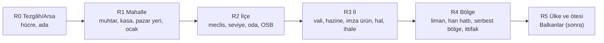
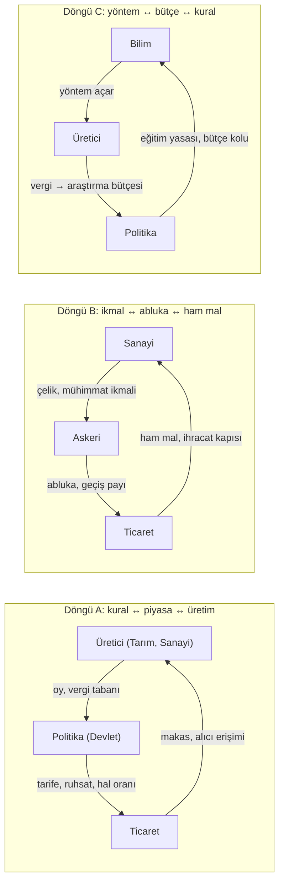

# Araştırma: İmza Mekanikleri ve Oyun Ortası/Sonu Yönelimleri

> **Konu.** Sahibin 1 Ekim yönergeleri ([12 — Yön taslağı](../12-yon-taslagi.md)): "Mahallende ya da seçtiğin yerde başla" kimliğinin oyunun tüm akışına yayılması; beş imza mekaniğin (mahalle ve muhtarlık, pazar günü, il imza ürünü, çay ocağı, imece ve kitabe) oynanabilir sistem düzeyine indirilmesi; **yeni imza mekaniklerinin** Türkiye'nin gerçek ekonomik ve sosyal dokusundan araştırılması; Tarım/Sanayi/Pazar açılışından sonra **yön değişimi** ve karşılıklı bağımlılıklar (taş-kâğıt-makas ekonomisi); **geri dönüşü zor kararlar**.

**Durum.** 1 Ekim 2026'da derlendi. Bu bir **Ar-Ge önerisidir, karar değildir.** Kod, başka belge ve commit yoktur. Sayılar başlangıç değeridir, kalibre edilmemiştir; **(tahmin)**, **(arama özeti)** ve **(doğrulanmadı)** etiketleri bu turda birincil kaynakla teyit edilemeyen bilgiyi gösterir. Zaman dilimleri için "iklim takvimi" ve "dönem" denir; oyun **strateji tabanlıdır, MMORPG değildir** (sınıf, seviye, XP, beceri/ustalık ilerlemesi yoktur). Din, siyasi parti ve gerçek kişi adı kullanılmaz; kurumlar (esnaf odası, hal, OSB...) yalnız kurum olarak anılır.

**Bu rapor neyi tekrar etmez, neyi derinleştirir.** [Oyun kimliği ve harman](oyun-kimligi-harman.md) beş imza mekaniği **tanıttı**; [başlangıç ve yönelim](baslangic-ve-ustalik.md) açılış kartlarını ve yeniden yatırım merdivenini yazdı; [çeşitlilik: üretim](cesitlilik-uretim-katmanlari.md) ve [çeşitlilik: yönetim, askeri, teknoloji](cesitlilik-yonetim-askeri-teknoloji.md) katalog verdi. Burada: (1) kimlik cümlesinin tüm akışa **ölçek merdiveni** olarak yayılması, (2) beş imzanın **oynanabilir sistem şemasına** indirilmesi (karar, girdi/çıktı, durum, kötüye kullanım, maliyet), (3) **17 yeni imza adayının** gerçek kurumlarla ve puanlamayla değerlendirilmesi, (4) açılıştan sonra **yön geçişleri** ve taş-kâğıt-makas bağımlılıkları, (5) **geri dönüşü zor kararlar** ele alınır.

**Kanıt sınırı.** Mevzuat sayfalarının bir kısmı (5957 yönetmeliği, 6585, 4734, 3218) bu turda tam metin değil **arama özeti** olarak okundu; oranlar (hal komisyonu, rüsum, teminat yüzdeleri) oyuna gerçek sayı olarak **bağlanmaz**, yalnız parametre ilhamıdır (K22 ruhu: gerçek fiyat ve oran oyuna bağlanmaz). Oyun örnekleri (Stardew, Victoria 3, Patrician IV, Offworld, Civilization V, Eco, Anno 1800, Albion) bu turda wiki ve arama özetleriyle sınandı; "başka oyunda var mı?" yanıtları kapsamlı pazar taraması **değildir**. Kodla ilgili tespitler `packages/cekirdek/src/tipler.ts` ve `packages/veri/icerik/*.json` dosyalarının doğrudan okunmasına dayanır.

**Kısaltmalar.** **S0–S3** sunucu, **B0–B3** tarayıcı yükü ([çeşitlilik §8.0](cesitlilik-yonetim-askeri-teknoloji.md) etiketleri). **S / M / L** uygulama büyüklüğü (≈ ≤3 iş günü / 1–2 hafta / 3+ hafta ya da çekirdek+sunucu+istemci birlikte). **A0 / A1 / Sonra** = Alfa-0 / Alfa-1 / v1.5+. **Yön** = oyuncunun ekonomik ağırlık verdiği alan (Tarım, Sanayi, Ticaret, Politika, Askeri, Bilim); **sınıf değildir**, kilit yoktur.

---

## Yönetici özeti (10 madde)

1. **Kimlik cümlesi "Ölçek Merdiveni" olarak akışa yayılır:** R0 Tezgâh → **R1 Mahalle** → R2 İlçe → R3 İl → R4 Bölge → R5 Ülke. Her kademede oynamaya değer **bitmiş bir oyun** vardır (Mahalleli, İlçe esnafı, İl sanayicisi, Bölge tüccarı); kapılar **toplu** açılır (ilçe seviyesi herkes için), ayak izi bireyseldir; ölçek büyümek zorunlu değil, **yerel prim** ve dikkat tavanı büyümeyi otomatik üstünlük yapmaz. Yer bağı üçe ayrılır: **başlangıç yeri** (kayıt), **yaşadığın yer** (türetilir), **memleket** (isteğe bağlı beyan, listeden, avantajsız) (§1).
2. **Beş imza tek ağdır:** ortak parçalar (mahalle birimi, **kamu arsası**, **Kamu Kasası**, komut ve olay aileleri, standart kötüye kullanım paketi) ve üç düzeltme: **Muhtar = mahalle, ilçede "İlçe Başkanı"** (Ç1/T2); **Pazar günü mahalle özelliğidir** ve üç belgedeki çelişen katsayılar tek ilkede birleşir: *talep zamanlaması değişir, toplam değişmez* (T1/T3); **kalite stokta değil tesiste/kanalda** taşınır (İ-3 maliyeti L→M) (§2).
3. **Her imza sistem şemasına indi:** İ-1 mahalle yaşam döngüsü Boş→Kurulu→Seçimli, %30 imza vetosu, 7 gün pasif → NPC kayyum; İ-2 haftalık **tezgâh kurası** (adalet ağırlıklı, %20 yeni esnaf), stok **commit**, 17:00 deterministik çözüm; İ-3 kalite puanı (yöntem+bekleme+menşei+bakım), mahreç/menşe eşiği, fuar payı `kalite²` ve hesap başına %30 tavan; İ-4 çay ocağı **yalnız sistem üretimi** haber (+6 sa; yanlış söylenti saldırısı imkânsız); İ-5 imece **kasa eşleştirmesi (NPC'den alım, para yanar)**, imece günü ×1,25, kitabe hesap başına tek satır (§2).
4. **17 yeni imza adayı** değerlendirildi: sahibin 15 başlığı + **N16 tarım sigortası havuzu** (TARSİM modeli) + **N17 esnaf kefalet havuzu**. Her biri gerçek kuruma bağlı (5362 esnaf odaları, 5957 hal, 1163 kooperatif, 4562 OSB, 4734 ihale, 3218 serbest bölge, 6585 perakende, 5737 vakıf, 5174 borsa) ve 7 ölçütle puanlandı (§3).
5. **En iyi 5 yeni imza:** **N14 Mahalle Bakkalı ↔ Zincir Market** (90 puan), **N1 Esnaf Odası ve Usta Defteri**, **N3 Hal ve Komisyoncu**, **N8 Gurbetçi Yaz Dönüşü**, **N4 Kamu İhalesi** (karar şimdi, yapım v1.5). Süzgeçler: bağımsız imza olması ve kademe/yön dengesi (N7, N5, N15 mevcut sistemin uzantısı olduğu için çekirdek işe katıldı). **Önemli düzeltme:** resmî işçi gelirleri GSYH'nin ~%0,1'i; "gurbetçi dövizi" ana gelir değil **mevsimlik talep şoku** olarak modellenir (§3.7).
6. **Yön geçişleri kilitsizdir; maliyet kodla tanımlı bedellerden hesaplandı.** 6 yön × (3 açılış × 5 hedef) matrisi: en kolay *Tarım→Ticaret* (≈₺15 bin) ve *herhangi→Politika* (≈₺0–6 bin + 14 gün); en zor *Tarım→Askeri* (≈₺100 bin+, Sanayi ikmaline **kasıtlı bağımlı**). Tetikleyici **Fırsat Kartı**dır: Dikkat paneli madde türü, günde ≤1, **kalabalık sönümlü** (boşluğun ¼'üne gösterilir). Her geçiş için ilk 3 adım, öğrenme eğrisi ve hibrit dengesi yazıldı (§4).
7. **Taş-kâğıt-makas ekonomisi:** 3 kaldıraç döngüsü (A: üretici→devlet→ticaret→üretici; B: sanayi→askeri→ticaret→sanayi; C: bilim→üretici→devlet→bilim) + 8 negatif geri besleme aracı (çoğu bugün planlı) + **Portföy Ligi** ölçümü YG1–YG7 (en iyi arketip ≤1,35× dikkat-başına-getiri; en üst %10'da bir arketip ≤%40; hibrit primi +%5…+%15; 90 günde ≥%30 oyuncu ≥1 geçiş). **Yeni ustalık sayacı gerekmez**; uzmanlık portföydür (§4.5–4.6).
8. **Geri dönüşü zor 16 karar; ilk 5 acil:** **K-1** ad alanlı `VarlikId` + `adina` (S3'ten önce); **K-2 kamu arsası %4 + mahalle başına meydan** (F4 hazır arsa üretiminden önce; en kritik tespit: parsel el değiştirmediği için sonradan ayrılamaz, fazla ayrılan rezerv ise sonra satılabilir); **K-3** kalıcı iç kimlik + dondurulmuş harita sürümü (OSM'de 13.793, resmî ~32.254 mahalle → yapay mahalle); **K-5** NPC alıcı bütçeleri; **K-9** mekanik başına PRNG akışı ve veri paketi sürümü (§5).
9. **Para korunumu ilkesi:** bugün para yalnız hibeyle ve NPC piyasa yapıcıyla girer; raporun adayları (zincir market, gurbetçi, hal komisyoncusu, ihracatçı heyeti, devlet alımı, ihale) **yeni musluklardır**. Çözüm: `NpcAlici` kayıtları (haftalık bütçe), "**talep zamanlaması değişir, toplam değişmez**", kamu harcamasının ≥%50'si NPC'ye gider (sink korunur), para arzı panosu (K-5).
10. **Hassasiyet ve hukuk:** memleket/hemşehri (gettolaşma riski → **Sonra**, listeden, açık alternatifli); kitabe/sicil ve KVKK (dolaylı kimlik, K-8); bayram yalnız **ekonomik ritim**, "Esnaf Haftası" (Ahilik Haftası'nın tarihî/resmî adı sahip onayında); vakıfta **dinî yapı yok**; seçim mekanikleri hesap güvence düzeyi 2 ile (Sybil, K-16); mevzuat oranlarının bir kısmı **arama özeti**, tam metinde doğrulanmalı (§5–7).

---

## 0. Okurken bulunan çelişkiler ve boşluklar (kararlaştırılması gerekenler)

Önceki belgelerin okunması sırasında çıkan, bu rapordaki önerilerin dayandığı tespitler. Her biri ilgili bölümde çözüm önerisiyle bağlanır.

| # | Tespit | Nerede | Bu raporda |
|---|---|---|---|
| T1 | **Pazar günü parametreleri üç yerde farklı:** "NPC talebi ×2, birikir" ([harman §3.4, §4.2](oyun-kimligi-harman.md)); "Ticaret ofisi perakende ×1,25, 07–17" ([çeşitlilik §8.1.2](cesitlilik-yonetim-askeri-teknoloji.md)); "talep +%15, makas −%3, hacim tavanı" ([çeşitlilik §6.2a](cesitlilik-uretim-katmanlari.md)) | üç belge | §2.2: tek formül, üç bileşen (hacim, makas, tezgâh yeri) |
| T2 | **"Muhtar" adı iki kademeye yazılmış:** gerçekte mahalle düzeyi; 11 §7.6'da ilçe başkanı ([Ç1](oyun-kimligi-harman.md), [çeşitlilik §3.2](cesitlilik-yonetim-askeri-teknoloji.md)) | harman, çeşitlilik, 11 | §2.1: Muhtar = mahalle; ilçede "İlçe Başkanı" |
| T3 | **Pazar günü ilçe özelliği olarak yazılmış; gerçekte mahalle/pazaryeri özelliği** (aynı ilçede her gün başka bir mahallede pazar kurulur; çeşitlilik §8.1.2) | çeşitlilik §8.1.2 | §2.2: pazar günü **mahalle** özelliği; yük de dağılır |
| T4 | **Kamu arsası yok:** parsel el değiştirmediği ve kamulaştırma olmadığı için meydan, pazar yeri, çeşme, han, okul için arazi **dünya kurulurken** ayrılmazsa sonradan ancak bağışla gelir | 11 §7.2, Ek karar | §5 K-2 (en kritik tespit) |
| T5 | **Mülkiyet tek tipli:** `HucreDurumu.sahip: OyuncuId`; `IsletmeDugumu` (oyuncu, il). Kooperatif, oda fonu, vakıf, mahalle kasası, imece sahibi olamaz | `tipler.ts` | §5 K-1 |
| T6 | **Politika komutları yalnız ikili diplomasi** (`anlasma_*`, `yaptirim`); seçim, oy, kart, imece, ihale komutu yok | `tipler.ts` | §2, §3: yeni komut aileleri ve günlük şeması (K-9) |
| T7 | **Yeni NPC alıcılar yeni para musluğudur:** para yalnız hibeyle ve NPC piyasa yapıcıyla girer; zincir market, gurbetçi, ihracatçı heyeti, hal komisyoncusu, devlet alımı, ihale, imece eşleştirmesi bunu çoğaltır | 08 P2, 11 §7.10 | §5 K-5 |
| T8 | **"Yol seçimi: Tarımcı / Sanayici / Tüccar" 5. günde** ([çeşitlilik §9](cesitlilik-yonetim-askeri-teknoloji.md) K7) yön taslağındaki "yalnız açılış önerisi, sonra istediğin yöne dön" ilkesiyle çelişiyor | çeşitlilik §9 | §4: "ikinci açılış önerisi" olarak yeniden adlandır |
| T9 | **OSM'de 13.793 mahalle, resmî sayı ~32.254 mahalle** (köyler mahalleye dönüştü) ([sokak-seviyesi-3d §5](sokak-seviyesi-3d.md), [çeşitlilik §3.1](cesitlilik-yonetim-askeri-teknoloji.md)); mahalle verisi **eksik** | iki belge | §1.7, §5 K-3: mahalle için yedek üretim kuralı |
| T10 | **Kitabe, sicil, başarım ve gazete oyuncu adını kalıcı yazıyor;** günlük "yalnız eklenir" olduğundan silme/anonimleştirme sonradan eklenemez | 11 §10, çeşitlilik §8.4 | §5 K-8 |

## 1. Kimlik: "Mahallende ya da seçtiğin yerde başla" tüm akışa nasıl yayılır?

### 1.1 Cümlenin üç sözü

Cümle yalnız bir slogan değil, oyunun oyuncuya verdiği **üç söz**dür. Her akış kararı bu üçüne karşı sınanır.

| Söz | Anlamı | Oyunun yapması gereken | Bozan tasarım (kaçınılır) |
|---|---|---|---|
| **"Mahallende"** | Yer, tanıdık ve gerçek bir yerdir | İlk 10 dakikada **o yerin** bir şeyi görünür olur: mahalle adı, pazar günü, muhtarlık tabelası, çay ocağı | Adı olmayan "Arsa #A3F2" dünyası; yalnız ilçe düzeyinde kalan kimlik |
| **"Ya da seçtiğin yerde"** | Başlangıç serbesttir, memleket olmak zorunda değil | Her ilçe başlangıca açık (yoğunluk ve ayrılmış hücre kuralları içinde); bölge kilidi yok | Memleketini kanıtlama, bölgesel avantaj ya da bölge dışı ceza |
| **"Başla"** | Başlangıç bir **başlangıçtır**, hapis değil | Ölçek büyümek davettir, zorunluluk değildir; her kademede oynamaya değer bir oyun vardır | "Sonunda il ya da bölge yönetmezsen oyunun içeriğini göremezsin" |

### 1.2 İki bağ ve bir kayıt: başlangıç yeri, yaşadığın yer, memleket

Kimliğin "yer" boyutu üç ayrı şeydir; karıştırılırsa hem gizlilik hem tasarım sorunu çıkar.

| Kavram | Ne | Nasıl oluşur | Değişir mi | Mekanik etkisi |
|---|---|---|---|---|
| **Başlangıç yeri** | İlk parselin mahallesi ve ilçesi | `oyuncu_katil` + ilk `parsel_al` ile **günlükte yazılır** | Hayır (tarihçedir) | "İlk" başarımları, Esnaf Kartı satırı "buradan başladı"; **avantaj yok** |
| **Yaşadığın yer** | En çok hücre/yapı bulunan mahalle (ve ilçe) | Çekirdek durumundan **türetilir** (saf fonksiyon) | Kendiliğinden | Akşam Defteri başlığı, tabela, muhtar adaylığı hesabı (oy hakkı zaten hücre sahipliğinden gelir) |
| **Memleket** (isteğe bağlı) | Oyuncunun **beyan ettiği** bir ilçe | Listeden seçilir; kanıt istenmez | 90 günde 1 kez | Yalnız küçük ve açık etkiler: N13 hemşehri derneği üyeliği, N8: memleket ilçendeki Yaz Dönüşü bilgi kartı (Akşam Defteri), memleket imza ürününü başka ilde satma kanalı. **Güç avantajı yok** |

**Hassasiyet notu.** Gerçek hayatta memleket bilgisi bölgesel ya da etnik kümelenmeyle ilişkilendirilebilir; hemşehri kümelenmesinin gettolaşma eğilimi literatürde tartışılır [R29][R30]. Bu yüzden memleket **serbest metin değil listeden seçim**, doğrulanmaz, gösterimi oyuncunun elindedir ve hiçbir mekanik **kapalı grup** yaratmaz (her etki herkese açık bir alternatifle birlikte gelir; §3 N13).

### 1.3 Ölçek Merdiveni: mahalle → ilçe → il → bölge

Her kademe aynı üç soruyu farklı büyüklükte sorar: **Kimleri tanıyorum** (ağ), **neyi birlikte yapıyoruz** (ortak nesne), **kim karar veriyor** (yönetişim). Merdiven, imzaların hangi kademede **doğal ev sahibi** olduğunu da gösterir.



| Kademe | Birim | Oyuncunun karar birimi | Ortak nesne | Yönetişim | İmza ve yeni mekanikler | Ritim | Harita | Açılış kapısı |
|---|---|---|---|---|---|---|---|---|
| **R0 Tezgâh** | Hücre, ada (4–12 hücre) | Yapı, yöntem, fiyat | — | — | Açılış Tezgâhı, Defter | Dakika | L3, L4 | İlk 10 dk |
| **R1 Mahalle** | 8–40 ada, 3–40 sakin (tahmin) | Komşu seçimi, tezgâh başvurusu, küçük imece | **Mahalle Kasası, pazar yeri, çay ocağı** | **Muhtar** + ihtiyar heyeti | **İ-1, İ-2, İ-4**, küçük İ-5, N14 (bakkal), N8, N10 | Gün–hafta | L3 | Kendiliğinden (ilk parsel mahallede) |
| **R2 İlçe** | İlçe; seviye Köy → Şehir | Vergi bandı, imar payı, zincir market izni, oda üyeliği | **İlçe Kasası**, ilçe seviyesi, orta imece | İlçe Meclisi + **İlçe Başkanı**; NPC Kaymakam | N1 oda, N5 OSB, N14 ruhsat kartı, İ-5 (köprü, sulama) | Hafta | L2 | Mahallenin kurulması, ilçe Kasaba eşiği (≥10 sahip, 5.000 nüfus) |
| **R3 İl** | İl, il merkezi limanı | Yasa, bütçe, fuar, ihale, hal | **İl Hazinesi**, il imza ürünü, il imecesi | İl Meclisi + **Vali** | **İ-3**, N3 hal, N4 ihale, N15 borsa, savaş ilanı | Ay | L1 | İlçe Merkez seviyesi, il imecesi |
| **R4 Bölge** | Birden çok il, liman havzası | Ticaret yolu, han hattı, serbest bölge, ittifak | Kenar/han ağı, liman, ortak sefer | İttifak (Esnaf/ticaret birliği), kardeş il | N6, N11, N2/N17 (kooperatif, kefalet birlikleri), abluka | Çeyrek | L0 | İl imecesi + ittifak + Şehir seviyesi |
| **R5 Ülke ve ötesi** | Balkanlar, diğer ülkeler | Tarife, anlaşma | — | NPC çerçeve (v1.5 federasyon) | İhracat anlaşmaları | Sonra | L0 | Alfa-1+ |

**Kurallar.**

1. **Kapılar toplu açılır, ayak izi bireyseldir.** Kademe kapısı (ilçe Kasaba eşiği, il imecesi) **herkes için** açılır (11 §7.4: Anno modeli). Oyuncunun "hangi kademede olduğu" ise bireysel ayak izidir: hangi mahalle, ilçe, ilde yapısı, makamı, sözleşmesi var. Kişi **ölçek atlamaz**, dünya atlar.
2. **Ölçek büyümek zorunlu değildir; ölçek küçülmek de meşrudur.** Bir oyuncu tüm oyun boyunca tek mahallede yaşayabilir (aşağıdaki "Mahalleli" portresi).
3. **Her kademede farklı karar türü açılır, daha çok para değil.** Mahallede *kime, ne zaman, nerede*; ilçede *hangi kural*; ilde *hangi hat ve hangi ortak yatırım*; bölgede *hangi ittifak ve geçit*.
4. **Üst kademenin görevi alt kademeyi ezmek değil, ona hizmet etmektir:** vali mahalle pazar gününü değiştiremez; ilçe meclisi mahalle kasasına el koyamaz; savaş mahalle pazarını kapatamaz (yalnız kenar kapasitesini en çok %50 kısar).

### 1.4 Her kademede "bitmiş oyun": dört oyuncu portresi

Ölçek, ilerleme sayacı değil **oyun biçimi seçimidir**. Dört portre aynı dünyada eşit derecede meşrudur (ve tek en iyi strateji oluşmasını önleyen §4.5 mekanizmalarına tabidir).

| Portre | Günlük karar (10 dk) | Haftalık | Aylık | Neden oynamaya değer |
|---|---|---|---|---|
| **Mahalleli** (R1 derin) | Tezgâh stoğu, ocaktaki söylentiyi okuma, komşunun siparişi | Pazar kurası, mahalle imecesi, muhtar oyu | Komşu mahallelerle pazar günü rotası | "Benim mahallem": tanıdık yüzler, kitabe, bakkal defteri; düşük dikkat yükü; **yatırımın büyük kısmı sabit** |
| **İlçe esnafı** (R2) | Fiyat, tedarik, oda standardı | Meclis oyu, ilçe projesi, esnaf siparişi | İlçe seviyesi, zincir market izni tartışması | Kural koyma ve rekabet; **ilçe seviyesi herkes için** açılır, ortak sahiplik hissi |
| **İl sanayicisi** (R3) | Hat dengesi, hal ya da imza kanalı | İl yasası, ihale teklifi | Fuar, il imecesi, vali seçimi | Zincir ve ölçek; **il imza ürünü** ile kimlik |
| **Bölge tüccarı** (R4) | Liman primi, han hattı, sözleşme | İttifak sefer çağrısı, serbest bölge kotası | Abluka, tarife, ihracat anlaşması | Büyük resim; en çok **dikkat** ister, en çok **risk** taşır |

### 1.5 Ölçek güç hâline gelmesin: beş denge

Ölçek büyütmenin otomatik üstünlük olmaması için beş denge:

| # | Mekanizma | Etkisi |
|---|---|---|
| 1 | **Dikkat bütçesi** (Dikkat paneli ≤5 madde; günde 1–2 kısa ziyaret) | Üç kademede aynı anda "iyi yönetmek" mümkün değildir |
| 2 | **Azalan getiri** (arsa çarpanı, ≤72 hücre / ≤%25, artan bakım, işgücü doygunluğu) | Aynı kademede de büyümek giderek pahalı |
| 3 | **Yerel prim:** mahalle bakkalı (N14), mahalle pazar günü (İ-2) ve çay ocağı bilgisi yalnız yerelde değerlidir | Büyüyen, yerelden **vazgeçer** |
| 4 | **Üst kademe farklı oyun açar** (ihale, hal, ittifak) ama aynı sermayeyi **başka riske** bağlar | Büyüme dikkat dışına çıkma riskidir |
| 5 | **Yerel kimlik ödülleri** (kitabe, tabela, "Hizmet Muhtarı") yalnız yerelde birikir | Kimlik kademe atlayınca taşınmaz, orada yeniden kazanılır |

### 1.6 90 günlük "tanışma sırası": imzalar hangi sırayla görünür?

[Çeşitlilik §9](cesitlilik-yonetim-askeri-teknoloji.md) 30 günlük karar-türü açılışını verdi; burada imzaların **ilk karşılaşma** noktaları ekleniyor (Alfa-0'da yalnız gözlem; seçim ve imece katkısı Alfa-1).

| Zaman | Ölçek | İmza ile ilk karşılaşma | Oyuncu kararı | Aşama |
|---|---|---|---|---|
| Gün 0 (10 dk) | R0–R1 | İ-1: yerleş ekranında **mahalle adı** + NPC muhtarın iki cümlesi; tabela | İlçe/mahalle seç, ilk hücre | A0 |
| Gün 1 | R1 | İ-2: "Salı: Karacabey Pazarı" kartı, ilk **pazar günü gözlemi** (NPC kasiyer satar) | Stoğu pazara ayırma | A0 (hafif) / A1 |
| Gün 3–4 | R1 | İ-4: mahalle **çay ocağı** söylentisi (iklim uyarısı +6 sa erken) | Hazırlık: depo, sulama, ithalat | A1 |
| Gün 6–7 | R1–R2 | İ-1: ilk **mahalle oyu** (küçük vaat kartı); İlçe Bülteni | Oy | A1 |
| Gün 9–10 | R1 | İ-5: mahalle imecesi (çeşme/çatı): ilk katkı, **kitabe** satırı | Katkı miktarı | A1 |
| Gün 11–14 | R2 | N14: ilçede **zincir market** açılış duyurusu; esnaf siparişi | Fiyat, tedarik, ruhsat oyu | A1 |
| Gün 14–21 | R2 | N1: **Esnaf Odası** daveti; rehberlik sözleşmesi | Üyelik | A1/Sonra |
| Gün 20–28 | R3 | İ-3: il **fuarı**, imza ürün kalite eşiği | Kalite yatırımı | A1 |
| Gün 28–60 | R3 | N3 hal: bozulan mallar için sabah hali; N4 ihale ilanları | Komisyoncu mu doğrudan mı | A1 |
| Gün 60–90 | R4 | N6/N11: serbest bölge kotası, han hattı; ittifak | Hat ve ittifak | Sonra |

### 1.7 Veri ve mekanik gereksinimleri

| Gereksinim | Durum | Öneri |
|---|---|---|
| **Mahalle sınırı ve adı** | OSM'de admin_level=8; topluluk veri setine göre **13.793 mahalle** (2026-09 anlık görüntü; doğrulanmadı) [R51]; resmî sayı ~32.254 mahalle (köyler mahalleye dönüştü) (çeşitlilik §3.1; kaynak haber sitesi) → kapsama ~%43 | OSM'de olan mahalle kullanılır; **olmayan yerde "yapay mahalle"**: komşu adaları yol ağı ve sınır içinde 3–12'lik kümelere böl, **dünya kurulurken dondur** (K-3), adı en yakın OSM `place=*` ya da yol adından |
| **Ada (4–12 hücre)** | 11 Ek karar: OSM yollarıyla çevrili | Dünya veri sürümüne bağlı dondurulmuş küme; sonra OSM değişse bile **hücre ve ada kimlikleri taşınmaz** |
| **Pazar yeri, meydan, çay ocağı arsası** | Yok | **Kamu arsası payı** (§5 K-2): her mahallede ≥1 meydan hücre kümesi |
| **Memleket listesi** | Yok | İlçe listesi (serbest metin yok) |
| **Kademe etiketleri** | Türkiye'ye özgü ("mahalle") | Veri güdümlü etiket: Bulgaristan, Romanya, Yunanistan'da karşılıkları ülke paketinde (K-15) |

---

## 2. Beş imza mekaniği oynanabilir sistem düzeyinde

[Harman §4.2](oyun-kimligi-harman.md) her imzayı bir cümle ve bir risk satırıyla tanımladı. Burada her biri bir **sistem şemasına** iner: oyuncu kararları, girdi/çıktı, durum ve komutlar, hangi katmana bağlandığı, kötüye kullanım ve önlem, sunucu/istemci maliyeti. Beşi **tek bir ağ**dır; ortak parçalar önce, sonra imzalar.

### 2.0 Ortak parçalar (beş imzanın paylaştığı altyapı)

| Parça | Ne | Neden ortak | Maliyet |
|---|---|---|---|
| **Mahalle birimi** | Her hücrenin `mahalle` alanı; mahalle = ada kümesi (§1.7) | İ-1 (muhtar), İ-2 (pazar günü), İ-4 (ocak), İ-5 (imece), N14 aynı birimde çalışır | M (veri + `tipler.ts`) |
| **Kamu arsası** | Dünya kurulurken ayrılan satılmaz hücreler: meydan, pazar yeri, çeşme/ocak/okul/han yeri; sahibi **kamu varlığı** (§5 K-1, K-2) | Parsel el değiştirmediği için sonradan ayrılamaz | M (veri hattı + `hucre` bayrağı) |
| **Kamu Kasası** | Mahalle Kasası, İlçe Kasası, İl Hazinesi: kamu varlıklarının hazinesi; **açık defter** (herkes görür) | Muhtar, imece, ihale, ocak bakımı aynı kasadan beslenir | M |
| **Kasa kaynakları** | Arazi vergisi tahsilatının payı (öneri: %20 mahalle, %40 ilçe, %15 il, **%25 yanar**); tezgâh ücreti; bağış; fuar harcı | Vergiyi "kaybolan para" olmaktan çıkarıp **kamu yararına döndürür**, enflasyon çıkarmaz (§5 K-5) | S |
| **Komut ve olay aileleri** | `oy_*`, `imece_*`, `tezgah_*`, `fuar_*`; olaylar `secim_kapanis`, `pazar_kapanis`, `imece_asama`, `fuar_kapanis` (hepsi olay kuyruğunda zamanlanır) | Seçim ve pazar çözümü sunucuda tik değil, zamanlanmış olaydır (S0–S1) | M |
| **Standart kötüye kullanım paketi** | Oy ve kura hakkı: hesap yaşı ≥14 gün **ve** ilçede ≥3 hücre; seçim haftasında transfer dondurma; hesap başına tek oy/başvuru; yeni hesap transfer tavanı; çıkar çatışması bayrağı; NPC Kaymakam kayyum | [Çeşitlilik §4.2, §4.6](cesitlilik-yonetim-askeri-teknoloji.md) kuralları mahalle kademesine uygulanır | S |
| **Kitabe/anıt kaydı** | Eklenen-yalnız kayıt: `{imece, sıra, görünürKimlikRef, pay}`; ad **dolaylı** (§5 K-8) | İ-5 ve N12 | S |

### 2.1 İ-1 Mahalle ve Muhtarlık

**Tek cümle.** Dünya il → ilçe → **mahalle** diye iner; mahalle, oyuncunun komşularını tanıdığı, küçük bir kasayı ve pazar yerini birlikte yönettiği **en küçük kamu birimidir**; muhtar seçimi mahallenin "seçim gecesi"dir.

**Karar (§0 T2).** *Muhtar* mahalle düzeyinin adıdır (gerçekle uyumlu); ilçe düzeyi arayüzde **İlçe Başkanı** olur. Böylece "yaklaşık 50 bin muhtar" gerçeğine bağ korunur ve her oyuncunun "bir şeyin başı olabileceği" küçük makamlar çoğalır.

| Boyut | Kural (öneri) |
|---|---|
| **Katman / ölçek / aşama** | Devlet (D); ölçek R1; **A0:** `mahalle` verisi + NPC muhtar + tabela (S0); **A1:** seçim, kasa, mühür (F6) |
| **Yaşam döngüsü** | **Boş** (NPC muhtar, varsayılan değer) → **Kurulu** (≥3 sakin, her biri ≥14 gün hesap, ≥7 gün geçti) → **Seçimli** (≥5 sakin, son 7 günde ≥3'ü aktif). İnce dünyada (R-Ü6) mahalleler Boş kalır, bu bir **hata değil varsayılan**dır |
| **Sakin** | Mahallede ≥1 hücre sahibi; 1 hesap = 1 oy |
| **Dönem** | Mahalle muhtarı 28 günde bir (küçük seçmen kitlesi için daha seyrek); ilçe başkanı 14 günde bir (11 §7.6 aynen) |

**Oyuncu kararları.**

1. **Aday olmak mı, destek imzası mı, oy mu?** (aday: ≥14 gün hesap, ≥3 hücre, ≥2 sakinden destek imzası)
2. **Hangi 2 vaat?** ("çeşme imecesi başlat", "pazar yeri günü şu gün", "çay ocağını aç ve bakımını üstlen", "pazar çatısına öncelik", "aydınlatma")
3. **Kasa önceliği:** kasadaki birikim hangi imeceye ya da bakıma gitsin?
4. **Mühür mü, imza toplamak mı?** (imece başlatmak için muhtar mührü *ya da* sakinlerin %30'u)
5. **İtiraz:** muhtar kararına **24 saat içinde** sakinlerin ≥%30'u (en az 3 kişi) imza ile veto edebilir.

**Girdi → çıktı.**

| Girdi | Çıktı |
|---|---|
| Arazi vergisinden pay (%20), tezgâh ücretleri, bağış, imece eşleştirme payı | **Mahalle Kasası** (açık defter) |
| Oylar, destek imzaları, vaat kartları | **Muhtar**, vaat karnesi (otomatik), "Hizmet Muhtarı" unvanı (≥%80 vaat tutuldu; **avantaj yok**) |
| Kasa + sakin katkısı | Mahalle projeleri: çeşme, pazar çatısı, çay ocağı, aydınlatma, mahalle ambarı (İ-5 kataloğu) |
| Sakinlerin etkinliği (aktif sahip sayısı) | Mahalle "kurulu / seçimli" durumu, tabela; ilçe Kasaba eşiğindeki "≥10 sahip" sayımına katkı (ilçe oyu yine **hesap başınadır**, mahalle ek oy almaz) |

**Durum ve komutlar.** `mahalle {id, ilce, adaKumesi[], sakinler[], durum, muhtar?, kasa (VarlikId), pazarYeri, pazarGunu, ocak?, projeler[], vaatler[]}`. Komutlar: `muhtar_aday`, `destek_imzasi`, `oy_ver`, `vaat_sec`, `imece_baslat` (muhur ya da imza), `mahalle_veto`. Olaylar: `mahalle_kuruldu`, `secim_kapanis` (28 gün), `vaat_karnesi`. **Hepsi günlüğe yazılır**; sandık gizli oy için oy komutu kapanışa kadar **şifreli/özetli** tutulur (§6.7 madde 6).

| Kötüye kullanım | Önlem |
|---|---|
| **Sahte mahalle:** 3 alt hesapla mahalleyi "kurmak" ve muhtar olmak | Kuruluş için **her sakin ≥14 gün hesap ve ≥3 hücre**; yeni hesaplar oy veremez; muhtarın **ekonomik gücü yok** (kasayı kişisel hesaba aktaramaz); aynı aygıt/IP sinyali **inceleme** için |
| **Oy satın alma** | Seçim haftasında aday–sakin transfer dondurma; yeni hesap transfer tavanı |
| **Kayırmacılık:** kendi tesisinden malzeme alma | Kasa harcaması **açık eksiltme** ve NPC referans fiyat tavanı; muhtarın **kendi tesisinden alım yasak**; çıkar çatışması bayrağı |
| **Despotluk** | %30 imza vetosu (24 sa); **7 gün pasif → NPC Kaymakam kayyum**, erken seçim |
| **Küçük seçmen kitlesi (3–5 kişi) ele geçirme** | Mahalle muhtarı **parsel ya da vergi** kararı veremez; yetkileri küçük proje, pazar günü önerisi ve mühürle sınırlı: ele geçirmenin ödülü küçük |
| **Mahalle sınırı manipülasyonu** (hücre alıp mahalle değiştirme) | Mahalle **hücre özelliğidir** ve dondurulmuştur; oy hakkı hücrenin sabit mahallesinden gelir |

**Maliyet.** S1 (zamanlanmış `secim_kapanis`; yük O(aktif mahalle), tembel); B1 (L3'te mahalle çizgisi ve etiketi, Devlet ekranında sandık paneli). **M**; veri hattı + `tipler.ts` genişlemesi nedeniyle bu parçanın kritik kısmı **A0'a yakındır** (K-2, K-3 kararları).

**Ölçüm (öneri).** İM1.1 aktif mahalle oranı (Seçimli / kurulabilir); İM1.2 mahalle seçimi katılımı ≥%40 (küçük kitlede hedef H9'dan yüksek); İM1.3 tek hesapla yönetilen mahalle oranı (Sybil işareti); İM1.4 veto kullanım sıklığı (aşırı ya da hiç → ayar).

### 2.2 İ-2 Pazar Günü

**Tek cümle.** Her **mahallenin** haftada bir "pazar kurulur" günü vardır; o gün NPC talebi mahalle pazar yerinde **toplanır**, tezgâh yuvaları **kura** ile dağıtılır ve oyuncu "bu hafta hangi mahallenin pazarına ne götüreyim" kararını verir; kaçıran kayıp yaşamaz.

**Çelişki çözümü (§0 T1, T3).** Üç belgedeki üç farklı katsayı tek ilkeyle birleşir: **talep zamanlaması değişir, toplam değişmez.** Pazar günü pazar-mallarının (taze, gıda, süt ürünü, bal, balık, dokuma-zanaat) **haftalık NPC talebinin %35'i** o güne yığılır, hafta içi payı azalır. Yeni para girmez (K-5); pazar günü ek olarak yalnız **dar makas** (−%3, doğrudan tüketiciye satış) ve **hacim tavanı** vardır. "×2" ve "+%15" ifadeleri bu ilkenin farklı okumalarıdır.

| Boyut | Kural (öneri) |
|---|---|
| **Katman / ölçek / aşama** | Pazar (P1) + Devlet (kart) + Tarım malları; R1 (mahalle); **A0-hafif:** NPC talep nabzı ve gün görünümü (S0); **A1:** tezgâh yuvası, kura, kapanış çözümü |
| **Birim** | **Pazar yeri** = kamu arsası (K-2) üzerinde mahalle başına 1; yuva sayısı ilçe seviyesine göre 4 / 8 / 16 ([harman §3.3](oyun-kimligi-harman.md)) |
| **Gün ve saat** | Mahalle başına tohumlu gün (Pzt–Cmt); 07:00–17:00 Europe/Istanbul; ilçe meclisi günü **28 günde bir** değiştirebilir (72 sa bekleme). Aynı ilçede aynı güne düşen mahalle sayısı ≤⌈mahalle/7⌉+1: **yük ve gün dağılır** |
| **Adlandırma** | Arayüzde "Salı Pazarı" (hafta günü *Pazar* ile karışmaz); "Pazar Günü" iç terim |

**Haftalık akış (oyuncu gözüyle).**

| Zaman | Olay | Oyuncu kararı |
|---|---|---|
| Pazar kurulmadan **48–24 sa önce** | **Başvuru**: hesap başına 1 başvuru/pazar yeri/hafta; küçük **başvuru teminatı** (₺50; stok konursa iade) | Hangi mahallenin pazarı? (aynı gün **komşu mahalleler** arasında seçim; otomatik taşıma ücreti görünür) |
| **24 sa önce** | **Kura sonucu**: ağırlık = 1 + 0,5 × min(4, üst üste kaçırılan hafta); yuvaların %20'si 14 günden genç hesaplara ayrılmıştır | Kazandıysan stok planına geç; kazanmadıysan komşu mahallenin pazarına başvur |
| 24–6 sa önce | **Tezgâh stoğu (commit):** mal, miktar, fiyat (referans ±%15); stok **tezgâha ayrılır** (depodan düşer) | Stok planı, fiyat |
| 07:00–17:00 | Pazar açık; kasiyer/kalfa varsa katılmasan da satar (A1: %70 verim) | (Zorunlu değil) |
| 17:00 | **`pazar_kapanis`**: satış çözümü; kalan stok depoya döner | — |
| 17:05 | Akşam Defteri satırı: "Salı Pazarı: 38 kasa sattın, +₺2.140" | — |

**Satış çözümü (deterministik, tamsayı PPM).**

```
H        = hacimTavani(mahalle) × pazarMalPayı           // NPC alıcı havuzu, haftalık talebin %35'i
cekim_i  = (refFiyat / fiyat_i)^ε × cesitlilik_i × stokYeterlilik_i      // ε≈1,5; sınırlı (0,5–2,0)
sat_i    = min(stok_i, H × cekim_i / Σ cekim)                          // artan hacim, 2 tur yeniden dağıtım
```

`cesitlilik_i` ürün çeşidiyle, `stokYeterlilik_i` müşteriye yetecek stokla artar; **tabela, unvan, başarım ve kitabe çekimi etkilemez** ([çeşitlilik §8.1.2](cesitlilik-yonetim-askeri-teknoloji.md)).

**Oyuncu kararları.** (1) tezgâh başvurusu ve **hangi mahallenin pazarı**; (2) tezgâh stoğunun **ne kadarı** (ambar ve diğer siparişlerle çatışma); (3) fiyat; (4) kasiyer/kalfa tutma (A1); (5) ilçe meclisi oyunda pazar günü kartı; (6) muhtar olarak pazar yeri günü vaadi.

| Girdi | Çıktı |
|---|---|
| Mal stoku (taze, gıda...), fiyat, çeşit, tezgâh ücreti (₺30/hafta → Mahalle Kasası) | Satış geliri; **Pazar Endeksi** (hacim) → ilçe seviyesi hizmet eşiği (11 §7.4); kasa geliri; mahalle ocağı bakımı |

| Kötüye kullanım | Önlem |
|---|---|
| **Kura hilesi** (çok hesap) | Hesap başına 1 başvuru; hesap yaşı/hücre eşiği; yeni hesaplar yalnız ayrılmış %20 yuvaya; kura PRNG akışı ayrı (K-9) |
| **Boş tezgâh tutma** (yuva işgali) | Stok koymazsan başvuru teminatı **Mahalle Kasası'na geçer** ve sonraki haftanın kura ağırlığı −1 |
| **Gün değiştirme manipülasyonu** | 28 gün kilit + 72 sa bekleme + ilçe meclisi oyu |
| **Zararına satış** (yıkıcı fiyat) | NPC hacmi **sabittir**: fiyat kırmak toplam satışı artırmaz, yalnız payı kaydırır; fiyat bandı ±%15 |
| **Zorunlu uğrama (angarya)** | Katılma zorunlu değil; başvuru ve stok **panelden**; yürüyüş yalnız görsel ("zorunlu değil" ilkesi, [Capital Rift §4.1 İ1](capital-rift-mekanikleri.md)) |
| **Pazar günü saatine kilitlenme** | Satış otomatik; kaçıran kasiyerle %70; "kayıp yok" |

**Maliyet.** S1 (günde ≈ aktif pazar yeri / 7 `pazar_kapanis` olayı; her biri O(başvuru); A1'de yüzlerce); B1 (L3 tezgâh simgesi, L4 tezgâh instancing). **M.** Kritik bağımlılık: kamu arsası (K-2) ve NPC bütçe kanalı (K-5).

**Ölçüm.** İM2.1 pazar yeri doluluk oranı (hedef %60–90); İM2.2 kura sonrası yeni hesap payı ≥%15; İM2.3 pazar günü satış payı / haftalık satış (hedef ≈%30–40); İM2.4 pazar yeri başına tezgâh sahibi çeşitliliği (en büyük tezgâh payı ≤%35).

### 2.3 İ-3 İl İmza Ürünü (coğrafi işaret kimliği)

**Tek cümle.** Her ilin 1–3 imza ürünü vardır; imza ürün **kalite ve menşe zinciri** ister, **ölçülen kalite** ile (oyla değil) il fuarında NPC alıcı heyetinden **toplu sipariş** kazanır ve **il marka endeksi** ilin ortak itibarını taşır.

**Tasarım kararı: kalite stokta değil, tesiste ve kanalda taşınır.** [Çeşitlilik P9](cesitlilik-uretim-katmanlari.md) stok kaleminde `kalitePpm` öneriyordu (L). Stok **değiştirilebilir ve tembel** (`miktar, oran, t0`) olduğundan kalite boyutu ona eklenirse her mal iki boyutlu olur (hem serileştirme hem protokol hem arayüz). Öneri: kalite **tesis özelliğidir** (0–100 puan) ve imza ürün yalnız **imza kanalından** satılır (fuar siparişi, ihracatçı heyeti, lüks alıcı, memleket pazarı [N13 sonrası]). Genel pazara giren mal sıradan maldır. Bu, maliyeti L'den **M'ye** indirir (K-7).

| Boyut | Kural (öneri) |
|---|---|
| **Katman / ölçek / aşama** | Tarım + Sanayi (üretim) + Pazar (fuar, kanal) + Teknoloji (yöntem); R3 (il); **A1** (veri A0'da hazırlanır) |
| **Veri** | `il-imza.json`: il, ürün, zincir aşamaları, mevsim profili, coğrafi işaret türü (mahreç/menşe); elle küratörlü; **yalnız genel ad**, marka adı yok; Türk Patent ve Marka Kurumu sicili ile doğrulanır (**doğrulanmadı**) |
| **Kalite puanı (tesis, 0–100)** | yöntem (0–40) + **bekleme/olgunlaştırma** süresi, ambarda bekletilen stokla (0–25) + **hammadde menşei:** ilin içinden gelen girdi payı (0–20) + bakım düzeyi (0–15) |
| **Eşikler** | **Mahreç:** kalite ≥50 ve en az 1 aşama il içinde (prim ×1,12); **Menşe:** kalite ≥70 ve **tüm** aşamalar il içinde (prim ×1,25) ([çeşitlilik §6.2c](cesitlilik-uretim-katmanlari.md)) |
| **Fuar** | İl fuarı dönemsel (ayda 1, 3 gün; ürünün hasat/üretim dönemine göre iklim takvimiyle); **NPC ihracatçı heyeti bütçesi** sabit havuz (K-5) |
| **Pay dağılımı** | `pay_i = kalite_i^k / Σ kalite^k` (k≈2); **hesap başına pay tavanı %30**; fazla pay sıradaki alıcıya akar |
| **İl marka endeksi (0–100)** | Üstel ortalama: ilin menşe/mahreç ürün hacmi × ortalama kalite; endeks fuar bütçesini ×0,8–×1,3 oynatır (ilin **ortak itibarı**; tek oyuncu değil) |

**Oyuncu kararları.** (1) Hangi ilde, hangi ürün zincirini kurmak; (2) **kalite mi hacim mi** (bekletme nakit bağlar: ambarda stok tutmak, hızlı satmaktan vazgeçmek); (3) hammaddeyi **il içinden** almak (daha pahalı ya da yavaş olabilir) mı, ithal mı; (4) fuar için stok ayırma; (5) kooperatif/oda ile **ortak marka** (N1, N2); (6) il yasası ve fuar bütçesi için oy (vali).

| Girdi | Çıktı |
|---|---|
| Hammadde (il içi), işleme yapıları, bekleme süresi, bakım, kalite yöntemi (teknoloji) | İmza prim (×1,12 / ×1,25), fuar siparişi, **il marka endeksi**, Tier 3 (zanaat ve coğrafi işaretli mal) kilidi |
| Fuar katılımı, kalite | Kitabe-benzeri **"Fuar Birincisi"** kaydı (avantaj yok) |

| Kötüye kullanım | Önlem |
|---|---|
| **Sahte kalite** (etiket şişirme) | Kalite **sunucuda formülle** hesaplanır; oyuncu beyanı yok; eşik sürekli denetlenir |
| **İmza ilinde spekülasyon** (hücre alıp bekleme) | Arazi vergisi, ≤72 hücre / ≤%25; imza prim **ürüne** bağlıdır, arsaya değil |
| **Fuar tekeli** | Hesap başına %30 pay tavanı; çoklu hesap R-Ü11 politikası |
| **Kültürel ihtilaf, marka riski** | Yalnız resmî sicildeki genel ad; ihtilaflı ürünler dışlama listesi ([11 K33](../11-urun-donusu.md)); işletme/üretici marka adı yok |
| **"Tek kazanan" imza** (en iyi tesis hep alır) | k=2 yumuşak dağılım; hacim talebi sınırlı → **kalite yarışı, hacim yarışı değil**; orta kalite ikincil NPC alıcıya satar |

**Maliyet.** S1 (fuar çözümü aylık, il başına O(katılımcı)); B0 (kalite kartı, il endeksi). **M** (veri küratörlüğü iş yükünün büyük kısmı; ayrı iş paketi). **A1.** Not: Tier 3 mal tanımları ([çeşitlilik §7.4](cesitlilik-uretim-katmanlari.md)) bu mekaniğe bağlıdır.

**Ölçüm.** İM3.1 menşe/mahreç ürün üretiminde en büyük üreticinin payı ≤%40; İM3.2 fuar katılımcı sayısı ve tekrar; İM3.3 imza ürünün ortalama sıradan pazara oranı (prim gerçekten ödenmiş mi?).

### 2.4 İ-4 Çay Ocağı (Dikkat panelinin sokaktaki sesi)

**Tek cümle.** Çay ocağı mahallenin **haber ve buluşma noktasıdır**: iklim ve baskın uyarılarını **6 saat erken** verir, mahalle ilan panosunu taşır, sohbetin yeridir; **bilgi yalnız sistemden gelir** (oyuncular söylenti üretemez), hiçbir şey zorunlu uğrama gerektirmez.

| Boyut | Kural (öneri) |
|---|---|
| **Katman / ölçek / aşama** | Devlet/Canlı dünya (bilgi), Lojistik arka plan değil; R1 (mahalle); **A1** (söylenti S), sohbet **A1-ikinci dilim** |
| **Yapı** | Kamu arsasında **kamu yapısı** (mahalle imecesi, 1 gün); mahalle başına ≤1; bakımı **Mahalle Kasası**'ndan (haftalık küçük gider); bakım ödenmezse "kapalı" (hizmet durur, yıkılmaz) |
| **Hizmetler (kademeli)** | **K1 Erken haber:** mahalle sakinleri iklim olayı, eşkıya baskını ve rekolte haberini **+6 sa** önceden alır (standart ≥24 sa → 30 sa). **K2 İlan panosu:** yapılandırılmış ilan (mal, miktar, vade; hesap başına ≤3 açık). **K3 Esnaf siparişi önceliği:** mahalledeki yeni NPC siparişi **2 sa erken** görünür. **K4 Sohbet:** mahalle odası, kalıp mesaj + dört selam (serbest metin K-13'e bağlı) |
| **Haber yayılımı** | Bilgi mahalle (t=0) → aynı ilçedeki mahalleler (+2 sa) → diğer herkes (+6 sa = standart Dikkat paneli yolu); **hemşehri ağı** (N13) +2 sa kısa yol. Yani herkes alır, **gecikme farkı** vardır |
| **Yürüyüş** | Ocağa uğramak ödül değildir; her şey **panelden** de vardır; yürüyüşte yalnız sohbet ve kozmetik (masa oyunu **Sonra/hiç**: kumar algısı, kapsam; [harman Ç4](oyun-kimligi-harman.md)) |

**Oyuncu kararları.** (1) Mahalle olarak **ocağı kurmak** mı, kasayı başka projeye mi (ocak 1 gün imece + haftalık bakım); (2) **hangi mahallede yaşamak/üretmek** (erken haber yalnız kendi mahallendeki ocaktan gelir: **yer seçiminin** yumuşak bir ağırlığı); (3) ilan vermek ve ilanlara yanıt; (4) kasa bakım önceliği.

| Girdi | Çıktı |
|---|---|
| Kamu arsası, 1 günlük imece, haftalık bakım (kasa) | Mahalle için +6 sa erken haber, ilan panosu, sohbet, mahallenin **Dikkat paneli diegetik yüzü** |

| Kötüye kullanım | Önlem |
|---|---|
| **Bilgi tekeli / ücretli üstünlük** | Haber **yalnız sistem üretimi ve doğrudur**; 6 sa sınırı; satılmaz, devredilmez; herkese +6 sa'te açılır |
| **Yanlış söylenti saldırısı** | Oyuncu söylenti **yazamaz**; yalnız yapılandırılmış ilan (mal/miktar/vade) |
| **İlan spamı** | Hesap başına ≤3 açık ilan; yeni hesap ≤1; şikâyet ve otomatik süre sonu |
| **Sohbet kötüye kullanımı** | Alfa-1'de kalıp mesaj; serbest metin yalnız moderasyon aracı hazır olunca (K-13) |
| **Ocak sahipliği = güç** | Ocağı **kamu** işletir; kimse sahip olmaz |

**Maliyet.** S1 (bildirim yayını ≈ olay başına O(mahalle sakini); sohbet S2 ayrı iş); B0–B1. **S** (K1–K3) + **M** (K4 sohbet). **A1.** Bağ: Gözetleme Kulesi (A2: ön duyuru +6 sa; [çeşitlilik §5.2](cesitlilik-yonetim-askeri-teknoloji.md)) ile **aynı mekanik**: ocak sivil, kule askeri ön duyurudur; üst üste binmez (en büyük +6 sa).

**Ölçüm.** İM4.1 ocağı olan mahallelerde iklim olayına hazırlıklı olma oranı (depo/ithalat öncesi karar) / olmayanlar; İM4.2 ocak bakım sürekliliği; İM4.3 ilan eşleşme oranı.

### 2.5 İ-5 İmece ve Kitabe

**Tek cümle.** İmece, mahalle, ilçe ve il ölçeğinde **ortak yatırım projesidir**: sakinler malzeme katar, aşamalar (Temel, İskele, Gövde, Tamam) görünür ilerler, tamamlanınca kalıcı bir etki kazanılır ve **kitabe** katkıyı kalıcı yazar; güç değil **prestij** verir.

| Kademe | Proje (örnek katalog) | Gereksinim büyüklüğü (öneri, ₺ değeri) | Süre | Kalıcı etki |
|---|---|---|---|---|
| **R1 Mahalle** | Çeşme, pazar çatısı, çay ocağı, aydınlatma, mahalle ambarı | ₺8–15 bin | 1–3 gün | Çeşme: K3 hizmet ↑ ve mahalle çekimi; Pazar çatısı: hacim tavanı +%10; Ambar: ortak depo (bozulma ×0,5); Aydınlatma: baskın ön duyurusu +2 sa |
| **R2 İlçe** | Köprü/kavşak, ortak sulama, okul/sağlık ocağı, han, pazar yeri genişletme | ₺80–150 bin | 7–14 gün | Kenar kapasitesi, kuraklık koruması, eğitim yasası katkısı, N11 han |
| **R3 İl** | Baraj, liman genişletme, demiryolu, fuar alanı, üniversite/teknopark | ₺400 bin–1 milyon | 14–28 gün | Elektrik/kuraklık, liman kapasitesi, ortak araştırma yuvası (Merkez sonrası, [çeşitlilik §6.2](cesitlilik-yonetim-askeri-teknoloji.md)) |

**Mekanik.**

| Parça | Kural (öneri) |
|---|---|
| **Gereksinim** | Sabit **katalog vektörü** (mal + para); değerlenme **sabit katalog değeri**ile (piyasa dalgalanması kitabeyi şişirmesin) |
| **Başlatma** | `imece_baslat`: mahalle: muhtar mührü *ya da* sakinlerin %30'u; ilçe: İlçe Başkanı + meclis onayı; il: Vali + il meclisi. **Her ölçekte aynı anda ≤1 aktif imece** (kasa kilitleme ve spam engeli) |
| **Katkı** | `imece_katki {imece, mal, miktar}`: ayni bağış; **10 dakika içinde geri alınabilir**, sonra kalıcı (cüzdan akışı yok); para katkısı yalnız kasa üzerinden |
| **Kasa eşleştirme** | İlgili kasa, oyuncu katkısının **≤%30'u kadar** malzemeyi **NPC pazarından alır** (ithalat fiyatı = para yanar: **sink**, mint değil); eşleştirme kasadan, hiçbir zaman bastırılmaz (K-5) |
| **İmece günü** | Cumartesi 14–18 (öneri): bu pencerede yapılan katkı ×1,25 sayılır; **sosyal buluşma anı**, kaçıranın kaybı yok (kitabede sıra bozulmaz) |
| **Aşamalar** | %25 / %50 / %75 / %100'de aşama; şantiye silueti büyür; tamamlanınca `imece_bitti`, kalıcı etki |
| **Zaman aşımı** | 28 gün ilerleme yoksa **askıya**: katkılar **oransal iade** edilir (kaybolmaz) |
| **Kitabe** | İlk 10 katkıcı **pay oranı sıralamasıyla**, "ilk katkı" ve "son taş" ek satırları; **miktar değil sıra ve yüzde bandı** gösterilir; **anonim katkı** seçeneği; **hesap başına tek satır**; hesap yaşı ≥14 gün ve ≥%2 pay şartı |
| **Bakım** | Her kalıcı imece yapısı küçük haftalık bakım ister (kasa); ödenmezse **"harap"** görünür, işlevi %50, yıkılmaz (dünya sıfırlanmaz, K-12) |

**Oyuncu kararları.** (1) Hangi projeye, **ne kadar ve hangi malı** katkı (kendi stoğunu satmak yerine bağışlamak); (2) kasa önceliği (muhtar/başkan/vali); (3) imece günü planı; (4) kitabeyi anonim mi; (5) il büyük imecesinde kooperatif/oda adına katkı (N1, N2).

| Girdi | Çıktı |
|---|---|
| Ayni katkılar, kasa eşleştirmesi, imece günü çarpanı | Kalıcı kamu etkisi (herkese), **kitabe** (prestij), mahalle/ilçe/il imece arşivi; ilçe seviyesi için hizmet katkısı |

| Kötüye kullanım | Önlem |
|---|---|
| **Bedavacı (Eco dersi)** | Ceza yok; **kasa eşleştirmesi** katkıyı artırır, kitabe/imece günü sosyal ödül verir; etkinin kamusal olması sayesinde bedavacılık ucuz; amaç **tamamlanma**, adil pay değil |
| **Kitabe çiftliği** (alt hesapla ad yazdırma) | Hesap başına tek satır, hesap yaşı, pay eşiği, sabit katalog değeri |
| **Kasa kilitleme / spam proje** | Ölçek başına ≤1 aktif; zaman aşımı ve iade |
| **Aklama (katkıyla para taşıma)** | Katkı yalnız **kasaya/proje**ye; kasadan oyuncuya para çıkışı yok; geri alma penceresi 10 dk |
| **Kitabe ve KVKK** | Ad **dolaylı** referans; silinen hesapta "Bir hemşehrimiz" (K-8) |

**Maliyet.** S0–S1 (katkı = komut; tamamlanma = olay; defter ≤ katkı sayısı); B1 (şantiye silueti L3/L4, kitabe panosu). **M.** **A1.** Kritik bağımlılık: kamu arsası (K-2), kamu varlık kimliği (K-1).

**Ölçüm.** İM5.1 imece tamamlanma oranı ve süresi; İM5.2 katkıcı sayısı/projede (≥8); İM5.3 en büyük katkıcı payı ≤%40 (bedavacı ve baskın katkıcı dengesi); İM5.4 anonim oran.

### 2.6 Beş imzanın bağları ve toplam maliyet

| | İ-1 Muhtar | İ-2 Pazar günü | İ-3 İmza ürün | İ-4 Çay ocağı | İ-5 İmece/kitabe |
|---|---|---|---|---|---|
| **İ-1** | — | Pazar yeri günü vaadi; tezgâh ücreti kasaya | Muhtarın imza ürün üzerinde yetkisi yok (il düzeyi) | Ocak bakım önceliği | Mühür/imza ile imece başlatma |
| **İ-2** | Gün önerisi | — | İmza ürün tezgâhta satılmaz; **ayrı kanal** (fuar, ihracatçı) | Pazar günü ocak kalabalığı (kozmetik) | Pazar çatısı imecesi (+%10 hacim) |
| **İ-3** | — | — | — | Fuar duyurusu ocakta | Fuar alanı il imecesi |
| **İ-4** | — | — | — | — | Ocak = 1 günlük imece |

| İmza | Sunucu | İstemci | Büyüklük | Aşama | Ortak bağımlılık |
|---|---|---|---|---|---|
| İ-1 | S1 | B1 | M | A0 (veri, NPC) → A1 (seçim) | K-1, K-2, K-3, K-4 |
| İ-2 | S1 | B1 | M | A0-hafif → A1 | K-2, K-5, K-9 |
| İ-3 | S1 | B0 | M (+veri) | A1 | K-5, K-7 |
| İ-4 | S1 (S2 sohbet) | B0–B1 | S + M (sohbet) | A1 | K-2, K-13 |
| İ-5 | S0–S1 | B1 | M | A1 | K-1, K-2, K-5, K-8, K-12 |

**Sıra önerisi.** Alfa-0'da yalnız **veri ve kimlik altyapısı** (mahalle alanı, kamu arsası, kamu varlık kimliği, NPC bütçesi); oynanış A1: **İ-2 → İ-4 (söylenti) → İ-1 → İ-5 → İ-3**. Gerekçe: İ-2 ve İ-4 tek başına anlamlı ve düşük risklidir; İ-1 ve İ-5 kasayı paylaşır; İ-3 veri küratörlüğü ister.

---

## 3. Yeni imza mekaniği adayları (17 aday)

### 3.1 Yöntem

Aday listesi sahibin verdiği 15 başlıkla (esnaf odası/ahilik, kooperatif, hal, ihale, OSB, liman serbest bölgesi, köy-kent göçü, gurbetçi dövizi, bayram ikramiyesi, yayla göçü, kervansaray/han, vakıf, hemşehri dernekleri, bakkal–zincir market, borsa/ticaret odası) başladı; araştırmada **iki yeni aday** çıktı: **N16 tarım sigortası havuzu** (TARSİM modeli) ve **N17 esnaf kefalet kooperatifi** (ortak kefalet). Her aday gerçek bir kuruma bağlanmıştır (kaynaklar §7). **Hassasiyet:** dinî yapı, siyasi parti, gerçek kişi ve gerçek marka adı yoktur; ahilik yalnız **meslek ahlakı, kalite denetimi ve usta–çırak** olarak ele alınır.

Puanlama (1–5; ağırlıklar toplamı 100; sonuç 0–100):

| Ölçüt | Ağırlık | 5 puan | 1 puan |
|---|---:|---|---|
| **A Stratejik karar derinliği** | 25 | Birbirine karşı **gerçek takaslar**, tekrarlayan karar | Tek seferlik/aşikâr seçim |
| **B Kimlik ve Türkiye özgünlüğü** | 20 | Başka oyunda bulunmayan, tanıdık gerçek doku | Genel tür mekaniği |
| **C Ölçek merdiveni uyumu** | 10 | Mahalle→bölge hattını bağlar | Tek kademeli |
| **D Yön geçişi / karşılıklı bağımlılık katkısı** | 15 | Birden çok yönü birbirine bağlar (§4.5) | Tek yönün içinde kalır |
| **E Maliyet** | 10 | S | L |
| **F Risk ve hassasiyet (düşük = iyi)** | 10 | Düşük | Yüksek |
| **G Canlı dünya ve çevrimdışı uyum** | 10 | Gerçek takvimle işler, angarya yok | Çevrimiçi katılım ister |

Puanlar **yön gösterir, hassas ölçü değildir** (±5 belirsizlik); aynı kümedeki adaylar arasında fark anlamsızdır.

### 3.2 Karşılaştırma (1/2): tanım, karar, katman

| # | Aday | Tanım (bir cümle) | Stratejik karar | Katman, ölçek |
|---|---|---|---|---|
| **N1** | **Esnaf Odası ve Usta Defteri** | İlçe/sektör odası: üyeler **kalite eşiği ve fiyat tavanı** standardını oylar; odalı tezgâh müşteri güveni kazanır; usta–çırak **rehberlik sözleşmesi**; Eylül **Esnaf Haftası** | Odaya gir (standart uy, güven kazan) mı, dışarıda mı kal; standardı kim yazsın; rehber ol/çırak al | Devlet + Pazar; R2 |
| **N2** | **Kooperatif** | En az 7 ortaklı, **1 ortak 1 oy** ortak işletme: ortak depo, **toplu girdi alımı**, ortak pazarlama | Özerklik ↔ toplu alım ve risk paylaşımı; sermaye payı; yönetim oyu | Tarım + Pazar + Devlet; R2–R3 |
| **N3** | **Hal ve Komisyoncu** | Bozulan mallar için il **sabah hali**: günlük kapanış fiyatı, **komisyoncu** üzerinden satış (komisyon + rüsum), günlük fiyat bülteni | Hale mi, doğrudan/pazara mı; bozulma baskısı, ambar | Pazar + Tarım + Lojistik; R3 |
| **N4** | **Kamu İhalesi** | İlçe/il kamu projeleri **açık eksiltme** ile ihale edilir: teklif, teminat, benzer iş deneyimi, aşırı düşük teklif sorgusu; kazanan **müteahhit** | Teklif fiyatı ve süresi, kapasite taahhüdü, taşeron, teminat finansmanı | Devlet + Sanayi + Lojistik; R3–R4 |
| **N5** | **OSB (yönetişimli sanayi adası)** | Sanayi adasına giriş **tahsis kurulu** ve aidatla olur; ortak arıtma/enerji; kümelenme | OSB'ye gir/girme; aidat; kurulda oy; hangi zincir tamamlanır | Sanayi + Devlet; R2 |
| **N6** | **Liman Serbest Bölgesi** | Liman ilçesinde **ihracat için işleme** rejimi: ham mal ithalatı tarifesiz, çıktı yalnız ihracat; lisans yuvaları sınırlı | İhracatçı-işleyici ol (düşük tarife) ↔ yerli pazarı bırak | Pazar + Sanayi + Devlet; R3–R4 |
| **N7** | **Köy–Kent Göçü** | **Mekanizasyon** kırsal işgücü talebini düşürür → kırsaldan kente göç → kentte işgücü ve konut talebi | Mekanize et, konut/hizmet yatırımı, tarım koruma | Devlet (D3) + Tarım + Sanayi; R2–R3 |
| **N8** | **Gurbetçi Yaz Dönüşü** | Yaz döneminde memleket ilçelerinde **geçici nüfus ve alım gücü**: pazar hacmi ↑, imza ürün alıcısı | Yaz stoğu, imza ürün hazırlığı, pazar planı | Pazar + canlı dünya; R1–R2 |
| **N9** | **Hane Bütçesi Takvimi** | Ayın başı ücret günü, **emekli bayram ikramiyesi**, bayram alışverişi, okul ve kış hazırlığı **NPC talep dalgaları** | Stok, fiyat, kampanya zamanlaması | Pazar + canlı dünya; R1–R3 |
| **N10** | **Yayla Göçü** | Mera/Ahır **mevsimlik sürü taşıma**: Mayıs ortası–Haziran çıkış, Eylül dönüş; kar ve don riski; kış yem stoğu | Çıkış zamanı, yem stoğu, ahır mı mera mı | Tarım; R1–R2 |
| **N11** | **Kervansaray / Han** | Yol üstü **han** yapısı: kenar kapasitesi/güvenlik, bozulma tamponu; **kenar başına ≤1** | Han nereye, kim finanse, ücretli mi | Lojistik + Askeri; R3–R4 |
| **N12** | **Vakıf (kamu yararı yapı)** | Parsel ve sermaye **geri alınamaz** bağışlanır; gelirli varlık kamu yapısını **kalıcı** besler (**endowment**) | Sermayeyi kilitle (prestij, kalıcılık) ↔ likidite | Devlet + Pazar; R2–R3 |
| **N13** | **Hemşehri Dernekleri** | **Memleket bağı:** haber hızı, ortak güven, yeni gelene yerleşim yardımı, memleket imza ürünü kanalı | Derneğe katıl; başkan oyu; karşılıklı yardım | Sosyal; R1–R4 |
| **N14** | **Mahalle Bakkalı ↔ Zincir Market** | NPC **zincir market** açılır, talep havuzunu böler; bakkal **yakınlık, veresiye, çeşit** ile rekabet eder; ilçe **ruhsat kartı**; toptan tedarik seçimi | Hangi **tedarik kanalı**, ruhsat politikası, bakkal pozisyonu | Pazar + Devlet; **R1–R2** |
| **N15** | **Ticaret Borsası ve Oda** | İl borsası: günlük **fiyat tescili ve bülteni**; kayıtlı satış → depo senedi avansı ve taban fiyat erişimi | Kayıtlı (avans+güvence) mı, kayıt dışı (anında, ucuz) mı | Pazar; R3 |
| **N16** | **Tarım Sigortası Havuzu** | Prim öde, iklim olayında **hasar tazminatı** al; il **havuzu** ortak risk; devlet prim desteği kartı | Sigorta ↔ sulama ↔ ambar ↔ çeşitlendirme | Tarım + Devlet; R2–R3 |
| **N17** | **Esnaf Kefalet Havuzu** | Üyeler **bloke sermaye** ile birbirinin sözleşme teminatına kefil olur; sicil | Kefil ol/olma; teminat; sicil | Devlet + Pazar; R2 |

### 3.3 Karşılaştırma (2/2): özgünlük, maliyet, öncelik, risk

"Başka oyunda var mı?" yanıtı bu turdaki arama ve bilgimizle yazıldı; kapsamlı tarama **değildir**.

| # | Başka oyunda var mı? | Özgünlük | Maliyet | Öncelik | Başlıca risk |
|---|---|---|---|---|---|
| **N1** | Lonca/klan **güç ve savaş** odaklı (Albion lonca [R62]); Patrician IV'te Hanse ticaret birliği [R53]. **Kalite standardı + fiyat tavanı + yeni oyuncu rehberliği** olan meslek odası bulunmadı | Yüksek | **M** | A1-ikinci dilim; v1.5 lonca ile | Kartelleşme (fiyat sabitleme), "usta" unvanının sınıf gibi okunması |
| **N2** | Eco'da şirket/ortaklık [R59][R60]; **demokratik 1 ortak 1 oy** kooperatif bulunmadı | Orta | **L** | v1.5 (K-1'e bağlı) | Aklama, çoklu hesap, dev ortaklık |
| **N3** | Ticaret oyunlarında mal borsası/açık artırma yaygın; **bozulan mal + komisyoncu + rüsum** olan hal bağlamı bulunmadı | Orta–Yüksek | **M** | A1 (NPC komisyoncu A0-ops) | Stok toplayıp fiyat oynatma |
| **N4** | EVE/Eco'da sözleşme panoları var; **kurallı kamu ihalesi** (teminat, benzer iş, aşırı düşük teklif) bulunmadı | Orta | **L** | A1-son / v1.5 (karar şimdi) | İhaleye fesat, kayırma |
| **N5** | Şehir kurma oyunlarında sanayi bölgesi (imar) var; **yönetişimli parsel tahsisi** bulunmadı | Orta | **M** | A0 (bonus) → A1 | Kapalı kulüp |
| **N6** | Serbest liman/ticaret bölgesi kavramı bazı ticaret oyunlarında var olabilir (doğrulanmadı) | Orta–Düşük | **M** | A1-son | Yerli pazara sızma |
| **N7** | Victoria 3'te göç iş ve arazi çekimine bağlı [R55]; mekanizasyon→kırsal işsizlik→göç **kuyruğu** oyuncuya karar olarak sunulmuyor | Orta | **S–M** | A1 | Boşalan ilçedeki oyuncunun kaybı |
| **N8** | **Bulunmadı** | Yüksek | **S** (+K-11) | A1 | NPC para musluğu, veri doğrulaması |
| **N9** | Tatil olayları var; **transfer ödemesi (ikramiye) takvimi** bulunmadı | Orta–Yüksek | **S** | A1 | Dinî hassasiyet (bayram), para musluğu |
| **N10** | Mevsimlik otlatma bazı çiftlik oyunlarında olabilir (doğrulanmadı); **yayla geleneği** bulunmadı | Yüksek | **M** | A1 | Mikro yönetim (varsayılan otomatik takvim) |
| **N11** | Civilization V'te Caravansary (menzil + altın) [R42]; **30–40 km kuralı ve imece/vakıf finansmanı** yeni | Orta | **M** | A1-son | Lojistiğin ön plana çıkması |
| **N12** | Anno'da kamu binaları ve etki (influence) [R61]; **kalıcı bağış–gelir döngüsü** bulunmadı | Yüksek | **L** | Sonra | Vergi/hareketsizlik sığınağı, dinî çağrışım |
| **N13** | Lonca ve klan sosyal ağı yaygın; **memleket bağı** bulunmadı | Yüksek | **M** | Sonra | **Etnik/bölgesel kümeleşme (yüksek hassasiyet)** |
| **N14** | Stardew'da **Joja ↔ Topluluk Merkezi** tek seferlik rota seçimi ve anlatı [R52]; **dinamik, siyasi ve tedarik temelli** rekabet bulunmadı | **Çok yüksek** | **M** | **A1** | Gerçek market markası, "kötü zincir" maniheizmi |
| **N15** | Borsa/açık artırma yaygın | Düşük | **M** | A1 (P3/P6) | Düşük |
| **N16** | Çiftlik oyunlarında sigorta olabilir (doğrulanmadı); **devlet destekli havuz** bulunmadı | Orta | **M** | A1 | Ahlaki risk (olay öncesi sigorta) |
| **N17** | **Bulunmadı** | Yüksek | **L** | Sonra | Zincirleme temerrüt, aklama |

### 3.4 Aday kartları: gerçek dayanak ve tasarım iskeleti

Her kartta: **gerçek** (kaynak), **oyun kuralı iskeleti** (öneri), **neden iyi / neden riskli**.

**N1 Esnaf Odası ve Usta Defteri.** *Gerçek:* 5362 sayılı Kanun: oda, ≥500 esnafın isteği ve Bakanlık izniyle kurulur; TESK odaları, birlikleri ve federasyonları birleştirir [R6][R7]. Ahilik geleneği: çıraklık–kalfalık–ustalık, **kalite ve fiyat denetimi**, meslek ahlakı; her yıl Eylül'de Ahilik Haftası kutlanır [R1][R2][R4][R5]. *İskelet:* oda ilçede **aynı sektörden ≥5 üye** imzasıyla kurulur (gerçek eşik 500, oyunda ölçeğe indirilir); ilçede sektör başına ≤1 oda; üye tavanı 60; **1 üye 1 oy**. Standart yalnız **kalite eşiği** ve **fiyat tavanı**dır (referansın +%10'u); **taban fiyat yoktur**. "Odalı" tezgâh müşteri çekimine +%5 ve oda fuar standından yararlanır. **Usta Defteri:** ≥28 günlük oda üyesi **Rehber**, 14 günden genç hesap **Çırak**; rehberlik ödülü **sonuca bağlıdır** (çırağın ilk 5 satışı/ilk imece katkısı); en çok 2 çırak; "Usta" unvanı **yoktur**, yalnız Esnaf Kartı satırı. *Neden iyi:* [baslangic §5.4](baslangic-ve-ustalik.md) Rehberlik sözleşmesini ve [harman](oyun-kimligi-harman.md) kooperatif/esnaf odası fikrini **gerçek bir kuruma** bağlar; ilerlemiş oyuncuyu yeni oyuncuyu işe almaya yöneltir. *Risk:* kartelleşme; yalnız tavan olması ve üye tavanı bunu keser.

**N2 Kooperatif.** *Gerçek:* 1163 sayılı Kanun: en az 7 ortakla kurulur, genel kurulda her ortağın bir oyu vardır, yönetim kurulu en az 3 ortaktır [R14]. Tarımsal amaçlı örgütler (2024): 6.369 tarımsal kalkınma kooperatifi ve 722.848 ortak (arama özeti) [R15]; Tarım Kredi Kooperatifleri 1.623 kooperatif ve 851.621 ortak; 2024'te 80 milyar TL girdi (gübre, tohum, yem...) temin (arama özeti) [R16]. *İskelet:* 7–40 ortak, ortak depo ve **toplu girdi alımı** (gübre/yem %5–10 indirim), ortak pazarlama (imza/ihracat kanalına toplu satış), sermaye payı (bloke), **1 üye 1 oy**, yönetici devri kuralı. *Neden iyi:* ittifak/loncanın **ekonomik** biçimi; savaş değil üretim ittifakı. *Risk ve not:* **sahip kimliği çok biçimli olmalı** (K-1); N1 ve N17 ile aynı varlık altyapısını paylaşır.

**N3 Hal ve Komisyoncu.** *Gerçek:* Yaş sebze-meyve ticareti 5957 sayılı Kanun ve yönetmeliğiyle düzenlenir; komisyoncunun komisyonu satış bedelinin **%8'ini aşmaz**, Bakanlık oranı yarıya indirebilir; hal rüsumu hal içinde satılanda %1, dışında %2 (arama özeti) [R10][R11]; **Hal Kayıt Sistemi** (2012) günlük fiyat ve miktarı kaydeder, şeffaflığı artırır [R12]; yaş meyve-sebze fiyat oluşumunda aracı marjı TCMB analizinin konusudur [R13]. *İskelet:* il halinde **günlük kapanış (09:00)**: il NPC talebi ile oyuncu arzı kesişir; kapanış fiyatı herkese aynıdır. Oyuncu iki yoldan satar: **hal** (komisyon %2–8 *il kartı ile belirlenir* + rüsum %1; garantili ve hızlı) ya da **doğrudan** (kendi tezgâhı, pazar günü; fiyat yüksek, hacim kısıtlı, bozulma riski). **Bozulan mal** (`taze`, `sut_urunu`, `balik`) günlük kaybeder; **ambar** bozulmayı ×0,5 yapar. HKS benzeri **günlük bülten** (fiyat/hacim) herkese açık. *Neden iyi:* bozulma, ambar ve pazar günü kararlarını **tek bir günlük ritimde** birleştirir; "iklim → bolluk → fiyat çöker → ambar" zincirini görünür kılar. *Risk:* stok toplayıp fiyat oynatma (hacim tavanı + bant).

**N4 Kamu İhalesi.** *Gerçek:* 4734 sayılı Kamu İhale Kanunu: açık ihale ilanı ≥40 gün önce; geçici teminat teklif bedelinin **≥%3'ü**, kesin teminat ihale bedelinin **≥%6'sı**; **ekonomik açıdan en avantajlı teklif**; **aşırı düşük teklif** sorgusu (arama özeti) [R19]; yapım ihalelerinde **iş deneyim belgesi** (benzer iş şartı) zorunludur [R20]. *İskelet:* kamu kasasından finanse edilen proje **yaklaşık maliyetle** ilan edilir; **kapalı teklif** (commit–reveal; determinizm); geçici teminat %3 bloke; puan = fiyat %70 + süre %20 + **portföy kanıtı** %10 (daha önce tamamlanan imece/ihale hacmi; seviye değil); teklif yaklaşık maliyetin %75'inin altındaysa **aşırı düşük sorgusu** (ek teminat ×2); kazanan kesin teminat %6; teslim **kilometre taşlarıyla**, gecikmede günlük ceza ve teminat müsaderesi. Muhtar/vali/başkan **kendi ihalesine giremez**. *Neden iyi:* "Müteahhit" rolünü ([11 §7.6](../11-urun-donusu.md) v1.5) **kuralla** tanımlar; [çeşitlilik §4.6](cesitlilik-yonetim-askeri-teknoloji.md)'daki "kayırmacı ihale" riskini **kurumsal çözümle** kapatır; sanayiciyi politikaya ve ordugâhın malzeme tedarikine bağlar. *Risk:* fesat (aynı aygıttan gölge teklif).

**N5 OSB (yönetişimli).** *Gerçek:* 4562 sayılı Kanun: OSB tüzel kişiliği altyapı ve ortak hizmet tesislerini kurar ve işletir, parselleri tahsis eder [R17]; 2025'te 416 OSB, 68 binden fazla fabrika, 2,7 milyon istihdam (arama özeti) [R18]. *İskelet:* [çeşitlilik S4](cesitlilik-uretim-katmanlari.md) bonuslarına (elektrik kaybı 0, kirlilik yayılımı ×0,5, bakım −%10) ek: **tahsis** = başvuru + uygunluk puanı (zincirin eksik halkasını tamamlayana öncelik, **kümelenme bonusu** kapıdır), haftalık **aidat**, yönetim kurulu (parsel sayısına göre oy; tek oyuncu ≤%33 oy), ortak arıtma/enerji **projeleri** (imece kataloğu). *Not:* yeni bir imza değil [çeşitlilik S4](cesitlilik-uretim-katmanlari.md)'ün **yönetişim katmanıdır**; ayrı sayılmamalı, N1 ve İ-5 ile birlikte yapılmalı.

**N6 Liman Serbest Bölgesi.** *Gerçek:* 3218 sayılı Serbest Bölgeler Kanunu (1985; 2017'de revize); 2024'te 19 faal serbest bölge, 2.928 firma; 2023'te 30,8 milyar dolar ticaret hacmi (arama özeti) [R21][R22][R23]. *İskelet:* liman ilçesinde **SB lisans yuvaları** (örn. 6); SB tesisleri ham maddeyi **tarifesiz** alır; çıktı **yalnız ihracat kanalına** (veya başka SB tesisine) satılır; yerli pazar yasaktır; lisans bedeli ve aidat. Uygulama: **tesis düzeyinde bayrak** (stok etiketi yok, K-7 ile uyumlu). *Risk:* tarife sistemi ([08 D4 #4](../08-alti-katman.md)) ve ihracat kanalı olmadan anlamsız; bu yüzden A1 son.

**N7 Köy–Kent Göçü.** *Gerçek:* 1950 sonrası köyden kente göç; hemşehri dernekleri bu göçün kurumsal izidir [R29][R31]. *İskelet:* [08 D3](../08-alti-katman.md) göç zaten var (çekim = istikrar, konfor, iş doluluğu); eklenen: `mekanize_tarim`/`otomasyon` gibi teknolojiler **işgücü talebini düşürür** → ilçenin iş doluluğu azalır → göç çıkışı; kent ilçesinde **işgücü havuzu** büyür, **konut** talebi ve K1/K2 ihtiyaç artar. Oyuncu kararları: mekanize etmek, **konut ve hizmet yatırımı**, `tarim_koruma` yasası, "köye dönüş" desteği. Bu bir **yeni imza değil D3'ün oyuncuya görünür kılınması**dır; çekirdek geliştirme olarak ele alınmalıdır. *Risk:* boşalan ilçedeki oyuncunun kaybı; mevcut günlük tavan %0,3 ve nüfus tabanı (≥1000) korunur.

**N8 Gurbetçi Yaz Dönüşü.** *Gerçek:* AB'de 5 milyonun üzerinde Türk kökenli kişi yaşıyor [R24]; haber özetlerine göre yurt dışında yaşayan vatandaşların yazın Türkiye'ye gelişinin **%63,4'ü memleket, akraba ve arkadaş ziyaretidir**, 2024 yazında 4,33 milyon kişi karayoluyla gelmiştir (arama özeti, **doğrulanmadı**) [R26][R27][R28]. **Önemli düzeltme:** resmî **işçi gelirleri** (remittance) GSYH'nin yaklaşık **%0,1**'ine düşmüştür (Dünya Bankası verisi) [R25]; "gurbetçi dövizi" bu yüzden **ana gelir kaynağı değil, mevsimlik bir talep şoku** olarak modellenmelidir. *İskelet:* **Yaz Dönüşü** dönemi (15 Haziran–31 Ağustos): memleket oranı yüksek **kırsal/kasaba ilçelerinde** *geçici nüfus* (K-11) ve haftalık sabit **gurbetçi alıcı bütçesi**; pazar günü hacmi ↑, imza ürün (peynir, bal, zeytinyağı, kuru meyve) için ek NPC alıcı. *Neden iyi:* çok ucuz, çok tanıdık, hiçbir oyunda yok; **mevsim** kavramını "iklim takvimi"nden **sosyal takvime** taşır. *Risk:* NPC para musluğu (K-5), ilçe katsayısı için veri.

**N9 Hane Bütçesi Takvimi.** *Gerçek:* 2026'da emekli bayram ikramiyesi **4.000 TL**; yaklaşık 16,5 milyon emekli ve hak sahibi; ödemeler bayramdan yaklaşık **1 hafta** önce (arama özeti) [R47][R48]. *İskelet:* [çeşitlilik §8.1.3](cesitlilik-yonetim-askeri-teknoloji.md) bayram paketini **transfer ödemesi takvimine** genişletir: ayın ilk haftası ücret günü, bayram öncesi ikramiye dalgası (14 gün önceden ilan), Eylül okul alışverişi, Ekim–Kasım kış hazırlığı. **Toplam talep sabit, zamanlama değişir** (K-5). **Hassasiyet:** ritüel gösterilmez, yalnız ekonomik talep eğrisi; "Bayram Dönemi" adı, sahip onayı. Gerçek ₺ tutarı oyuna **bağlanmaz**.

**N10 Yayla Göçü.** *Gerçek:* Doğu Karadeniz'de yüzlerce yayla (1.500–3.500 m), çıkış Mayıs ortası–Haziran, şenlikler Temmuz'da; hayvanlar süslenerek yaylaya çıkar [R36][R37][R38]. *İskelet:* **Mera** yapısı (11 §7.3: yalnız dağ/yayla hücreleri) ve **Ahır** eşleşir: yazın sürü meraya (verim ↑, ahır yem tüketimi ↓), kışın ahıra; **çıkış zamanı** iklim takvimine (kar çekilmesi, geç don riski) bağlı; **varsayılan otomatik takvim**, oyuncu yalnız **erken/geç çıkış** ve **kış yemi stoğu** kararını verir; Temmuz **yayla şenliği** ilçe fuarı olayı (turizm geliri kozmetik). Alfa-0 illerinde dağ/yayla hücresi sınırlı (Bursa, Sakarya yüksek kesimleri): **veri kapsamı doğrulanmalı**.

**N11 Kervansaray / Han.** *Gerçek:* Selçuklu hanları büyük ticaret yollarında yaklaşık **30–40 km** aralıkla (devenin 9 saatlik günlük yolu) yapılmıştır; hanlarda yerli yabancı herkese **üç gün** yiyecek ve içecek verilmiş, devletçe yaptırılıp vakıf geliriyle işletilmiştir (arama özeti) [R39][R40][R41]. Civilization V'te Caravansary kara ticaret yolunun menzilini +%50 uzatır [R42]. *İskelet:* **kenar başına ≤1 han** (ilçe imecesi, il yasasıyla ücretsiz/ücretli); etki: kenar kapasitesi +%10, **bozulma tamponu** (taze mal bozulması −%20 o kenarda), **baskın direnci** (eşkıya olayında yağma ≤%10); rota çizimi **yok**, lojistik arka planda kalır. *Not:* en doğal biçimi **imece/vakıf** yapısıdır (N12).

**N12 Vakıf.** *Gerçek:* 5737 sayılı Vakıflar Kanunu; Osmanlı ve Selçuklu'da çeşme, okul, kütüphane, han, köprü gibi **kamu hayratı** vakıf gelirleriyle yaşatılmıştır [R43][R44]. *İskelet:* oyuncu parsel+sermaye bağışlar → **kamu varlığı** (K-1) olarak kalıcı yapı; yapının bakımı **gelirli vakıf varlığından** (dükkân/çarşı) karşılanır; bağış **geri alınamaz**; mütevelli oyuncunun yetkisi yalnız yapı seçimi ve kitabe; vakıf varlığı **arazi vergisine tabidir** (sığınak olmasın) ve hareketsizlik açık artırmasından muaf değildir (vakıf kamu varlığıdır, yönetici yoksa NPC Kaymakam yönetir). **Dinî yapı (ibadethane) yoktur**; yalnız çeşme, okul, kütüphane, han, sağlık ocağı. *Risk:* "para park yeri" ve vergi sığınağı; dinî çağrışım.

**N13 Hemşehri Dernekleri.** *Gerçek:* İçişleri Bakanlığı verisine göre **15.941** aktif hemşehri derneği; İstanbul'da 6.000'in üzerinde; 1997'de 1.922 iken 2006'da 3.876 [R29][R31]; kırsal-kent göç zincirinin kurumsal biçimidir. Bu yapının **gettolaşma** ve kapalı sosyal ağ üretme eğilimi literatürde eleştirilir [R30]. *İskelet:* derneğe üyelik **memleket beyanıyla** (listeden), üyelik **kapalı değil** (herkes kendi memleket derneğine ya da "Her Yerden" derneğine katılabilir); etkiler küçük ve **açık alternatifli**: haber +2 sa kısa yol (İ-4), **yeni gelene yerleşim yardımı** (önerilen 3 ilçeden biri), memleket imza ürününü **başka ilde satma kanalı**, küçük karşılıklı teminat indirimi (≤%5). *Risk:* yüksek hassasiyet; bu yüzden **Sonra** ve yalnız hukuki/moderasyon incelemesinden sonra.

**N14 Mahalle Bakkalı ↔ Zincir Market.** §3.6'da tam iskelet.

**N15 Ticaret Borsası ve Oda.** *Gerçek:* 5174 sayılı Kanun: ticaret borsaları, borsada işlem gören malların alım-satımını yapar, **fiyatı oluşturur, kaydeder ve ilan eder**; işlem yapanlar borsaya **kayıtlı olmak zorundadır** [R45][R46]; lisanslı depo ve ürün senedi (TÜRİB) [çeşitlilik K35]. *İskelet:* [çeşitlilik P3, P4, P6](cesitlilik-uretim-katmanlari.md) kapsar; yeni olan **kayıtlı satış kararı**: borsa tescili (küçük harç) → depo senedi avansı + taban fiyat alımı erişimi; kayıt dışı satış anında ama avanssız. *Not:* düşük özgünlük; imza değil, **pazar altyapısı**.

**N16 Tarım Sigortası Havuzu.** *Gerçek:* TARSİM: ÇKS'ye kayıtlı üreticiler dolu, don, sel, fırtına gibi risklere karşı devlet destekli sigorta yaptırır; **devlet prim desteği %50–67**; 2006–2024'te 25,6 milyon poliçe, 72,5 milyar TL hasar tazminatı (arama özeti) [R49][R50]. *İskelet:* iklim olayları ([08 T3](../08-alti-katman.md)) zaten var; **prim** (tarımsal tesis değerinin %2'si/dönem), **havuz** (il düzeyi, kapalı devre), **il yasası kartı** "prim desteği %50" (hazine maliyeti), **bekleme süresi 7 gün** (olay öncesi sigorta alıp bırakma engeli), havuz tükenirse tazminat **oransal** kısılır. Karar: sigorta ↔ sulama ↔ ambar ↔ çeşitlendirme (**dört risk aracı**). *Neden iyi:* iklim olaylarını **kolektif risk kararına** çevirir, Tarım yönünün zayıf noktasını (iklim) yönetilebilir kılar.

**N17 Esnaf Kefalet Havuzu.** *Gerçek:* Esnaf ve Sanatkârlar Kredi ve Kefalet Kooperatifleri, üyeleri bankaya karşı **ortak kefaletle** teminatlandırır; kesintiler: %1,5 bloke sermaye, %1,5 gider payı, %1 risk fonu; temerrütte bloke hesaptan kesilir (arama özeti) [R8][R9]. *İskelet:* **sözleşme teminatı** için kefalet (oyunda kredi sistemi yok); üye bloke sermaye (%2) yatırır; havuz yeni oyuncunun **teminatsız** kalmasını engeller; temerrütte havuz öder, **sicil** düşer ([baslangic §5.5](baslangic-ve-ustalik.md)). N4 ihale teminatı ile bağlıdır.

### 3.5 Puanlama sonucu

| Sıra | # | Aday | A | B | C | D | E | F | G | **Puan** |
|---:|---|---|---:|---:|---:|---:|---:|---:|---:|---:|
| 1 | **N14** | Mahalle Bakkalı ↔ Zincir Market | 5 | 5 | 5 | 5 | 3 | 3 | 4 | **90** |
| 2 | **N1** | Esnaf Odası ve Usta Defteri | 4 | 5 | 4 | 4 | 3 | 3 | 4 | **80** |
| 3 | **N3** | Hal ve Komisyoncu | 4 | 4 | 3 | 4 | 3 | 4 | 5 | **78** |
| 4 | **N8** | Gurbetçi Yaz Dönüşü | 3 | 5 | 3 | 3 | 5 | 4 | 5 | **78** |
| 5 | **N7** | Köy–Kent Göçü | 3 | 4 | 4 | 5 | 4 | 3 | 4 | **76** |
| 6 | **N10** | Yayla Göçü | 4 | 4 | 3 | 3 | 3 | 5 | 4 | **75** |
| 7 | **N4** | Kamu İhalesi | 5 | 3 | 4 | 5 | 1 | 3 | 3 | **74** |
| 8 | **N5** | OSB (yönetişimli) | 4 | 4 | 3 | 4 | 3 | 4 | 3 | **74** |
| 9 | **N16** | Tarım Sigortası Havuzu | 4 | 3 | 3 | 4 | 3 | 5 | 4 | **74** |
| 10 | **N17** | Esnaf Kefalet Havuzu | 4 | 4 | 4 | 4 | 2 | 4 | 3 | **74** |
| 11 | **N2** | Kooperatif | 4 | 4 | 4 | 5 | 1 | 3 | 3 | **73** |
| 12 | **N6** | Liman Serbest Bölgesi | 4 | 3 | 4 | 4 | 3 | 4 | 3 | **72** |
| 13 | **N9** | Hane Bütçesi Takvimi | 3 | 4 | 3 | 3 | 5 | 3 | 5 | **72** |
| 14 | **N13** | Hemşehri Dernekleri | 3 | 5 | 5 | 3 | 3 | 2 | 4 | **72** |
| 15 | **N12** | Vakıf (kamu yararı yapı) | 4 | 5 | 4 | 3 | 1 | 2 | 3 | **69** |
| 16 | **N11** | Kervansaray / Han | 3 | 4 | 4 | 3 | 3 | 4 | 3 | **68** |
| 17 | **N15** | Ticaret Borsası ve Oda | 3 | 3 | 3 | 3 | 3 | 5 | 4 | **66** |

**Okuma.** İlk beş (N14, N1, N3, N8, N7) ile ikinci küme (N10, N4, N5, N16, N17, N2) arasındaki fark **ölçüm hatasının içindedir**; asıl ayırıcı, adayın **bağımsız bir oyuncu kararı ekranı/yapısı/olayı** olup olmadığıdır (N7, N5, N15 mevcut sistemlerin uzantısıdır). Bu yüzden seçim iki süzgeçle yapılır (§3.7). Puanlar yazarın değerlendirmesidir; lider ve sahip 30 dakikalık bir gözden geçirmeyle değiştirebilir, karar ağırlıkları ayrı bir tabloda tutulduğu için sıralama kolay yeniden hesaplanır.

### 3.6 N14 Mahalle Bakkalı ↔ Zincir Market: tam iskelet

**Neden önde.** Gerçek Türkiye'nin **en görünür** ekonomik dönüşümüdür: organize perakendenin gıda perakendesindeki payı 2014'te %41,8'den 2025'te %67,3'e çıkmış, geleneksel perakende %58,2'den %32,7'ye inmiştir (arama özeti) [R33]; bakkal sayısı on yılda 240 binden 165 bine, 2020'lerde 125–130 bin aralığına düşmüştür (arama özeti) [R34]; yalnız 2024'te 3.478 yeni market açılmıştır [R35]. Hukuk tarafında 6585 sayılı Kanun ≥400 m² satış alanlı işletmeyi **büyük mağaza** sayar ve esnafın **pazar kaybını** gözetir [R32]. Oyunda karşılığı hem **mahalle** (kimlik cümlesi) hem **ilçe politikası** (ruhsat) hem **tedarik zinciri** (Tarım/Sanayi yönelimi) ölçeğinde çalışır; [Stardew'un Joja ↔ Topluluk Merkezi](https://primagames.com/gaming/should-you-go-the-community-center-or-joja-mart-route-in-stardew-valley-1-6) rota seçimi yalnız **anlatı ve tek seferlik** iken burada seçim **dinamik, siyasi ve geri alınabilirdir** [R52].

| Parça | Kural (öneri; kalibre edilmedi) |
|---|---|
| **Aktörler** | **Zincir Market** (NPC; oyunda genel ad "İndirim Marketi", **gerçek marka yok**), **Bakkal** (oyuncunun küçük Ticaret ofisi; perakende yöntemi), **Esnaf Pazarı** (İ-2), **Toptan alıcı** (zincirin tedarik sözleşmesi) |
| **Açılış** | İlçe **Kasaba** (≥5.000 nüfus) ve ilçe ruhsat kartı izin veriyorsa; 7 gün **ön duyuru** (çay ocağında +6 sa erken) + 14 gün açılış gecikmesi |
| **İlçe ruhsat kartı** ("Büyük mağaza") | **Serbest** (zMax %55) / **Kota** (20.000 nüfusa 1 mağaza; zMax %35) / **Kapalı** (zMax 0); değişiklik 28 günde bir, 72 sa bekleme; çıkar grupları: Esnaf-Tüccar karşı, Hane/İşgücü lehine ([çeşitlilik §4.5](cesitlilik-yonetim-askeri-teknoloji.md)); karar **çıkar çatışması bayrağına** tabi |
| **Talep bölüşümü** | İlçenin perakende NPC talebi `D` **sabittir** (K-5). Zincir payı `z(t) = zMax × (1 − e^(−t/τ))`, τ = 30 gün; kalan `(1−z)·D` bakkal, pazar günü ve tezgâhlar arasında İ-2 formülüyle paylaşılır. zMax %55, gerçek %67'nin **altındadır**: bakkal oyunu bitmemeli |
| **Zincirin etkisi** | (a) Perakende fiyatı ↓ → K1 karşılama ↑, **istikrar +**; (b) zincir **toptan alıcıdır:** alım fiyatı referans **−%8**, sözleşme ≥14 gün, hacim büyük, ödeme güvenli; (c) **tedarikçi tavanı:** bir oyuncu zincirin ilçe hacminin **≤%35'ini** karşılar |
| **Bakkal avantajları** | Mahalle içi **yakınlık** payı, **çeşit**, **pazar günü**, **oda standardı** (N1: +%5 güven), esnaf siparişi önceliği; **veresiye** (A1-ikinci): sadakat +%10 ama **tahsilat gecikmesi** (borç 7 gün; risk) |
| **Oyuncu kararları** | (1) **Tedarik kanalı:** zincir sözleşmesi (düşük marj, yüksek hacim, güvenli) ↔ bakkal ağı/toplu alım ↔ pazar günü (yüksek marj, düşük hacim, kura); (2) **meclis oyu:** ruhsat politikası; (3) bakkal: çeşit ve veresiye limiti; (4) Tarım: zincire **ön alım** sözleşmesi ([çeşitlilik P5](cesitlilik-uretim-katmanlari.md)); (5) mahalle imecesi: pazar çatısı |

| Karşılıklı bağımlılık | Anlamı |
|---|---|
| Zincir **hacim** ister, **fiyatı** düşürür | Tarım/Sanayi üreticisi zincire bağımlı olursa tek alıcı riski; tedarikçi tavanı %35 bunu sınırlar |
| Bakkal **yerel** değerlidir, hacim sınırlıdır | Bakkallar tek başına büyüyemez → **N2 kooperatif toplu alım** ve **N1 oda** ile güçlenir |
| Ruhsat **siyasi** karardır | İlçe seçimlerini ve çıkar gruplarını (Hane, Esnaf) bağlar; seçmen **tüketici ve esnaf** olarak ikiye bölünür |

| Kötüye kullanım | Önlem |
|---|---|
| Muhtar/ilçe başkanı kendi çıkarına ruhsat | Çıkar çatışması bayrağı, il meclisi 24 sa itiraz, 28 gün kilit |
| Zincire "yalnız ben tedarik ederim" tekeli | Tedarikçi başına ≤%35; sözleşme süresi ≤14 gün yenilenir |
| Zincir "kötü, kapat" maniheizmi | Zincirin gerçek faydası (K1, istikrar, düşük fiyat) görünür; kapalı ruhsatın bedeli (istikrar −) kartta yazılır |
| Çoklu hesapla bakkal müşterisi paylaşımı | Müşteri havuzu **hesap başına değil tezgâh/kalite** başınadır; çoklu hesap kazanç getirmez |
| Gerçek market markası | Genel ad; marka adı, logo, renk **yok** (11 K34) |
| Yeni para musluğu | Zincirin bütçesi bakkalın bütçesinden **devralır**, toplam **sabit** (K-5) |

**Maliyet.** S1 (ilçe başına pay hesabı tembel; açılış olayı); B0–B1. **M.** **A1.** **Ölçüm.** İM14.1 bakkal sayısı 60. günde başlangıcın ≥%40'ı (çökmemeli); İM14.2 ruhsat kartı katılımı; İM14.3 tedarik kanalı çeşitliliği (zincir/bakkal/pazar arasında en büyük kanal ≤%50).

### 3.7 En iyi 5 yeni imza mekaniği ve gerekçe

**İki süzgeç.** Puan sıralaması ilk beşi N14, N1, N3, N8, N7 olarak verir. Seçimde iki süzgeç uygulanır: **(S-1) Bağımsız imza mı?** Yani oyuncunun doğrudan karar verdiği ekranı/yapısı/olayı var mı, yoksa mevcut sistemin (D3 göç, S4 OSB, P3/P6 borsa) uzantısı mı? **(S-2) Dengeli portföy mü?** Beşli küme birden çok kademeyi (R1–R4), en az dört yönü (Tarım, Ticaret, Politika, Sanayi/Askeri) ve hem ucuz hem pahalı işi kapsamalı. N7 birinci süzgeçten geçemez (D3'ün uzantısı: çekirdek geliştirme olarak ayrıca yapılır, §3.8). Beşinci yer için N10, N4, N5, N16 yarıştı; **N4** seçildi.

| Sıra | Aday | Kademe | Yön | Maliyet | Aşama | Gerekçe |
|---:|---|---|---|---|---|---|
| **1** | **N14 Mahalle Bakkalı ↔ Zincir Market** | R1–R2 | Ticaret, Tarım (tedarik), Politika (ruhsat) | M | **A1** | En yüksek puan (90). **Kimlik cümlesine en yakın** ("mahallendeki tezgâh"); Türkiye'nin en görünür dönüşümü; üç yönü (Tarım, Pazar, Politika) tek kararda bağlar; **taş-kâğıt-makas** parçasıdır (§4.5). Tek riski gerçek marka ve maniheizm, ikisi de kolay yönetilir |
| **2** | **N1 Esnaf Odası ve Usta Defteri** | R2 | Ticaret, Sanayi, Politika (hepsi) | M | A1-ikinci | "Lonca/kooperatif/esnaf odası" fikrinin ([harman §3.3](oyun-kimligi-harman.md), [11 §7.6](../11-urun-donusu.md)) **gerçek kurum karşılığı**; ilerlemiş oyuncunun yeni oyuncuya rehberliğini (baslangic §5.4) **yapısal** hale getirir; kartelleşme riski "yalnız tavan" ile kesilir |
| **3** | **N3 Hal ve Komisyoncu** | R3 | Ticaret, Tarım | M | A1 | **Günlük ritim** (canlı dünya), bozulma ve ambar kararlarını birleştirir; NPC komisyoncu A0-ops'ta zaten planlı ([çeşitlilik §6.2g](cesitlilik-uretim-katmanlari.md)); **Tarım→Ticaret geçişinin en doğal kapısıdır** (§4) |
| **4** | **N8 Gurbetçi Yaz Dönüşü** | R1–R2 | Tarım, Ticaret | **S** (+K-11) | A1 | **En ucuz ve en özgün**: hiçbir oyunda yok, herkesin tanıdığı yaz ritmi; "iklim takvimi"ni **sosyal takvime** genişletir. Düzeltme: gurbetçi dövizi ana gelir değil **mevsimlik talep şoku** olarak modellenir [R25] |
| **5** | **N4 Kamu İhalesi** | R3–R4 | Politika, Sanayi, Askeri (tedarik) | **L** | A1-son (**karar şimdi**) | Tek aday olarak **müteahhit/politika→sanayi→askeri** hattını **kurala bağlı** kurar; "kayırmacı ihale" riskinin kurumsal çözümüdür; en yüksek **karar derinliği** (5/5). Pahalı olduğu için son sırada yapılır ama **varlık kimliği ve komut şeması kararları şimdi** verilmelidir (K-1, K-9) |

**Beşli kümenin kapsaması.**

| Boyut | N14 | N1 | N3 | N8 | N4 |
|---|:-:|:-:|:-:|:-:|:-:|
| R1 Mahalle | ● | | | ● | |
| R2 İlçe | ● | ● | | ● | |
| R3 İl | | | ● | | ● |
| R4 Bölge | | | | | ● |
| Tarım yönü | ● | | ● | ● | |
| Ticaret yönü | ● | ● | ● | ● | |
| Politika yönü | ● | ● | | | ● |
| Sanayi/Askeri yönü | | ● | | | ● |
| Ucuz (S–M) | | ● | ● | ● | |

**Yedek ve yan paketler.** N10 (yayla), N16 (sigorta) ve N9 (hane takvimi) **hızlı kazanım paketi**dir; N2, N17 ve N12 N1'in **ekonomik/finansal kolları** olarak sonra gelir (K-1 sonrası).

### 3.8 Seçilmeyenler: ne yapılır?

| Grup | Adaylar | Karar |
|---|---|---|
| **Çekirdek geliştirme** (imza sayılmaz, mevcut sistemin görünür kılınması) | N7 köy–kent göçü, N5 OSB yönetişimi, N15 borsa | Sırasıyla D3, çeşitlilik S4, P3/P6 işi içinde yapılır |
| **Hızlı kazanım paketi** (düşük maliyet, takvimle iş görür) | N8 (zaten seçildi), **N9, N10, N16** | Alfa-1 başında 2 haftalık paket; hepsi gerçek takvim ve iklim takvimine biner |
| **Ortaklık ve finans kolu** (varlık kimliği ister) | **N2 kooperatif, N17 kefalet, N12 vakıf** | v1.5; K-1 kararı sonrası; N1 ile ortak altyapı |
| **Bağımlı** | N6 serbest bölge, N11 han | Tarife/ihracat kanalı ve imece/vakıf varlığı hazır olunca |
| **Hassas** | **N13 hemşehri** | Hukuki ve moderasyon incelemesi sonrası (K-13); önce yalnız "bilgi hızı" |

---

## 4. Yönelim değişimi: açılıştan sonra fabrikaya, ticarete, politikaya, askeri güce, bilime dönmek

### 4.0 Çerçeve

[Yön taslağı §3](../12-yon-taslagi.md) ve [baslangic §3](baslangic-ve-ustalik.md): **Tarım, Sanayi, Pazar yalnız açılış önerisidir; geçişler kilitsizdir, yalnız ekonomik maliyeti vardır.** Burada bu cümle **geçiş yollarına** dönüştürülür. Altı **yön** vardır (sınıf değildir; profil etiketi yalnız türetilmiş bir okumadır):

| Yön | Ne demek (yapılar ve kararlar) | Açılış mı, ikinci perde mi |
|---|---|---|
| **Tarım** | Tarla, Ahır, Mera, Sulama, Gıda fabrikası; ekim planı, gübre, hasat | Açılış |
| **Sanayi (Fabrika)** | Maden, Çelikhane, Parça, Elektronik, Santral, Gübre; elektrik, ölçek, bakım | Açılış |
| **Ticaret (Pazar)** | Ticaret ofisi, Ambar; fiyat, sözleşme, ihracat, hal, borsa | Açılış |
| **Politika (Devlet)** | Muhtarlık, ilçe/il meclisi, yasa kartı, bütçe, ihale | **İkinci perde** (üretim tabanı gerekir; Alfa-1) |
| **Askeri** | Ordugâh, Mühimmat fabrikası, birlik, savunma yapısı | **İkinci perde** (Alfa-0 PvE, Alfa-1 PvP) |
| **Bilim/Teknoloji** | Atölye-Lab, araştırma yuvaları, yöntem açma, ortak araştırma | **İkinci perde** (ilk düğüm gün 5'te doğal) |

**Not (T8).** [Çeşitlilik §9](cesitlilik-yonetim-askeri-teknoloji.md) 5. günde "yol seçimi: Tarımcı/Sanayici/Tüccar" der; bu ifade **"ikinci açılış önerisi"** olarak yeniden adlandırılmalıdır (seçim yok, kilit yok).

**Geçişin üç maliyeti.** (1) **Yatırım:** yeni yapılar, malzeme, teknoloji (kodda tanımlı sayılarla aşağıda). (2) **Öğrenme:** yeni kavram sayısı ve ilk haftanın hata maliyeti. (3) **Fırsat maliyeti:** eski yapının getirisinden vazgeçmek ya da dikkat bölmek. [Yeniden yatırım merdiveni](baslangic-ve-ustalik.md) (yöntem değiştir → yık/dönüştür → hücre bırak → başka ilçe → 72 saatlik pişmanlık penceresi) bunları **çıkış maliyeti** olarak sınırlar; **giriş** tarafı bu bölümdedir.

**Maliyet verisi.** Aşağıdaki yatırım rakamları `packages/veri/icerik/icerik.json` ve `parametreler.json`'dan **taban fiyatla** hesaplanmıştır (₺; mili-para ÷ 1.000): hücre kırsal 1.000 / kasaba 2.500 / şehir 6.500 (× (1 + 2·satılmış pay)); çelik 120, parça 180, gıda 70, mühimmat 150. Yapı bedeli = malzeme + para: Çiftlik ₺11.400, Ahır ₺15.500, Gıda fab. ₺20.800, Gübre fab. ₺30.000, Cevher madeni ₺19.600, Kömür ocağı ₺15.500, Santral ₺25.800, Çelikhane ₺39.200, Parça atölyesi ₺30.000, Mühimmat fab. ₺30.000. Teknoloji düğümü ₺15.000–40.000, 2–5 gün. **Ordugâh, Atölye-Lab, Ticaret ofisi ve Ambar henüz bedelli tanımlı değil; bu raporda Çelikhane sınıfı varsayımıyla (tahmin) gösterilir.** Başlangıç: hibe ₺50.000 + kit (≈₺35.600).

### 4.1 Geçiş matrisi (3 açılış × 5 hedef)

Zorluk: **K** kolay (≤₺25 bin, ≤5 gün), **O** orta, **Z** zor (>₺75 bin ya da başka yönün tedariğine bağımlı). "Süre", yalnız inşa/araştırma zinciridir; **birikim süresi** günlük gelire bağlıdır (ölçülmedi).

| Kaynak açılış ↓ / Hedef → | Fabrika | Ticaret | Politika | Askeri | Bilim |
|---|---|---|---|---|---|
| **Tarım** | **O:** işleme (gıda fab.) ₺24 bin, 6 sa; gübre ₺33 bin; **ağır sanayi** zinciri ₺110 bin (Z) | **K:** Ticaret ofisi + Ambar ≈ ₺15 bin (tahmin), 5 sa | **K:** ₺0–6 bin (3 hücre) + 14 gün; seçim döngüsü | **Z:** gıda var, **çelik/mühimmat yok** (Sanayi tedariği); ≈ ₺100 bin+ | **O:** Atölye-Lab + `mekanize_tarim` ≈ ₺35 bin (tahmin), 2–6 gün |
| **Sanayi** | **Derinleşme:** ölçek S→M→L, `otomasyon` ₺35 bin, zincir kapama | **O:** `konteyner_limani` ₺30 bin + limanlı il + ihracat; 5–10 gün | **O:** OSB/oda/ilçe sanayi payı; ₺0–6 bin; ≤14 gün | **O:** çelik+mühimmat var, **gıda ister** (Tarım sözleşmesi); ≈ ₺60–75 bin | **K–O:** `derin_madencilik` ₺25 bin → `elektrik_ark_ocagi` ₺30 bin → `mekanize_ordu` ₺40 bin (11 gün) |
| **Pazar** | **O:** geriye entegrasyon: marjı yüksek ara mal; Çelikhane ₺39 bin + elektrik ₺26 bin | **Derinleşme:** ihracat, hal, borsa; ₺10–40 bin | **K:** Esnaf-Tüccar grubu; ₺0–6 bin; ruhsat/tarife kartları | **O:** önce **ikmal tedarikçisi** (ordu kurmadan); ₺10–20 bin | **O:** Atölye-Lab + ticaret düğümleri ≈ ₺35–55 bin (tahmin) |

**En kolay** geçişler *Tarım→Ticaret* ve *herhangi→Politika*; **en zor** *Tarım→Askeri*. Bu **kasıtlıdır**: ordu, üretimden ve Sanayi'nin ikmalinden bağımsız kurulamaz; zorluk oyuncuyu ittifaka ve sözleşmeye yönlendirir (bağımlılık, §4.5).

### 4.2 Fırsat Kartları: geçişin tetikleyicisi

Geçiş **oyuncu karar vermeden önce bir fırsat sinyaliyle** başlar. Yerleş ekranı açılış önerir; **oyun ortasında** aynı rolü **Fırsat Kartı** oynar: Dikkat panelinin (≤5 madde) bir **madde türü**dür, günde **en çok 1**, kapatılabilir, push değildir.

| Kural | Değer (öneri) |
|---|---|
| **Kaynak** | Çekirdek durumundan **türetilir** (arz-talep boşluğu, eksik halka, açık makam); hiçbir pazarlama metni yok; her kart "**neden**" cümlesi taşır |
| **Boşluk hesabı** | Örn. `boşluk = NPC emilimi − oyuncu arzı` (08 P2), `eksik halka = yapı zincirinde eksik kademe`, `aday sayısı = 0`, `ordugâh yok ∧ baskın ön duyurusu` |
| **Kalabalık sönümü** | Bir fırsat, boşluğun **¼'ü kadar** oyuncuya gösterilir; sonrakilere gösterilmez (herd'i önler: herkes aynı fırsata yönelip fırsatı kapatmasın) |
| **Zorlama yok** | Kabul/ret oyun etkisi yok; "bugün yapacak şey yok" meşrudur |

Örnek kartlar: *"İlçende gıda fabrikası yok: hasat zirvesinde fiyat −%30 (Tarım→Fabrika)"*; *"Mahallende aday yok: Salı 14:00'te seçim kapanıyor (→Politika)"*; *"Yaklaşan baskın: karakter ve 3 tümen istenir (→Askeri)"*; *"Bu düğümü 2 oyuncu açtı: yayılım indirimi %50 (→Bilim)"*; *"Zincir market ruhsat oyu açık (→Politika/Ticaret)"*.

### 4.3 Beş geçiş kartı

#### 4.3.1 → Fabrika (Sanayi)

| Kaynak | Tetikleyici fırsat | Gereken yatırım | İlk 3 adım |
|---|---|---|---|
| **Tarım** | Hasat zirvesinde ham ürün fiyatı −%20–30 ve **ambar dolu**; ilçede gıda fabrikası yok (işleme makası ≈%20 ham ürünle açık) | **Kolay yol:** Gıda fab. ₺20,8 bin + 2 hücre ≈ ₺24 bin. **Gübre fab.** ₺30 bin (kendi tarlana gübre: döngü). **Ağır sanayi:** ≈₺110 bin | 1) Hayaleti **Tarla'nın yanına** yerleştir (ada içi, otomatik taşıma). 2) Yöntemi seç (girdi: tahıl; çıktı: gıda). 3) **Elektrik rozetini** oku: ▲ varsa Santral ya da il şebekesi |
| **Pazar** | Aynı ara malı sürekli alıp satıyorsun (`celik`, `parca`); **liman primi ve makas** marjı yiyor | Çelikhane ₺39,2 bin (+ elektrik ₺25,8 bin + cevher ithalatı) ≈ ₺65 bin | 1) Hangi ara malın **marjı en yüksek** (Pazar ekranı). 2) Ham mal **sözleşmesi** (cevher/kömür). 3) Küçük (S) ölçekle başla; **bakım düzeyini** normal bırak |
| **Sanayi** | Derinleşme: ölçek kilidi (ilçe seviyesi Kasaba → M), `otomasyon` açık | Ölçek S→M, `otomasyon` ₺35 bin | 1) İlçe seviyesini kontrol et (M ölçek kilitli mi?). 2) `tesis_olcek_yukselt`. 3) Elektrik brownout riskini **enerji önceliği** yasasıyla gözden geçir |

**Öğrenme eğrisi.** *Gün 1–3:* 3 kavram: elektrik (rozet ▲), girdi/çıktı, inşa süresi. *Gün 4–14:* bakım ve aşınma (S3), kirlilik (S4), damar tükenmesi (S5). *Gün 15+:* ölçek ve otomasyon kararları. **İlk hata:** elektriksiz kurmak (verim sınırı). **Koruma:** maliyet kartında "elektrik gerekli" uyarısı; ilk 5 yapıda %30 indirim ([11 §7.9](../11-urun-donusu.md)); pişmanlık penceresi 72 sa.

**Hibrit dengesi (Tarım+Fabrika).** Zinciri kapatan oyuncu **%20 makası** her adımda cebinde tutar ([baslangic §4.2](baslangic-ve-ustalik.md)); karşılığı: elektrik ve işgücü **ortak havuzunu** tüketir, iki katman için 5–7 Dikkat maddesi (tavan 5!), iklim + brownout şokuna **iki yönden** açıktır. Hedef: hibrit primi **+%5…+%15** (§4.6).

#### 4.3.2 → Ticaret

| Kaynak | Tetikleyici fırsat | Gereken yatırım | İlk 3 adım |
|---|---|---|---|
| **Tarım** | Hasat tepesinde fiyat düşer, **sonraki aya taşıma** kârlı; ya da ilçe pazar günü hacmi dolmaz | Ticaret ofisi + Ambar ≈ ₺15 bin (tahmin); sözleşme teminatı %20 | 1) **Ambar** kur (bozulma ×0,5) ve fazlayı sakla. 2) Fiyat bandı içinde **sat emri** (Ticaret ofisi). 3) N3 hal / İ-2 tezgâh kanalını dene, **komisyon**la doğrudan satışı karşılaştır |
| **Sanayi** | Çelik/parça stoğu birikiyor; **liman primi** ihracatı kârlı | `konteyner_limani` ₺30 bin; limanlı ilde işletme | 1) Limana yakın il (liman etiketi). 2) İhracat emri. 3) **Ticaret anlaşması** (makası yarıya indirir; 08 P2) |
| **Pazar** | Derinleşme: ihracat, hal, borsa kaydı, N6 | ₺10–40 bin | 1) İl borsası kayıtlı satış (avans). 2) Tedarik sözleşmesi. 3) Serbest bölge (Sonra) |

**Öğrenme eğrisi.** *Gün 1–3:* fiyat, makas, emir; *Gün 4–14:* liman primi, bozulma, sözleşme teminatı; *Gün 15+:* tarife, abluka riski, borsa tescili. **İlk hata:** bozulan malı ambarsız tutmak; **koruma:** "ambarsız taze mal" uyarısı.

**Hibrit dengesi (Tarım+Ticaret).** Kendi malını doğrudan satmak **aracı marjını** (hal komisyonu, NPC makası) tasarruf ettirir; bedeli **Dikkat** (fiyat izleme), ambar bakım gideri ve **sözleşme teminatı riski**dir. Hibrit primi küçük, risk dağılımı iyi.

#### 4.3.3 → Politika

| Kaynak | Tetikleyici fırsat | Gereken yatırım | İlk 3 adım |
|---|---|---|---|
| **Tarım** | `tarim_koruma` ve ilçe vergisi gündemde; **mahallede aday yok**; çiftçi grubu memnuniyeti düşük | İlçede ≥3 hücre, ≥14 gün hesap, ≥2–3 destek imzası ≈ ₺0–6 bin; **kampanya parayla yürümez** | 1) İlçe Bülteni ve kartlarda "seni nasıl etkiler" cümlesini oku. 2) **Oy ver** (ilk adım). 3) Seçim ilanında aday ol, 2 vaat seç |
| **Sanayi** | OSB ilanı, `enerji_onceligi`, kirlilik kartları | Aynı | 1) OSB/oda toplantısında oy. 2) Sanayi payı vaadi. 3) **Çıkar çatışması bayrağını** oku (kendi adana OSB mi?) |
| **Pazar** | Ruhsat (zincir market), tarife, hal komisyonu kartları | Aynı | 1) Ruhsat kartı oyu. 2) Esnaf-Tüccar grubu ile vaat. 3) Vaat karnesini izle |

**Öğrenme eğrisi.** *Gün 1–3:* oy ve kart; *Gün 4–14:* vaat, destek imzası, karne; *Gün 15+:* koalisyon, çıkar grupları, il meclisi. **İlk hata:** seçmeninden bağımsız vaat; **koruma:** vaat kataloğu bedel gösterir; vaat ihlali cezasız ama **karne**.

**Hibrit dengesi (üretici+politikacı).** Güç: kart oylamasıyla **kendi yönüne** (ör. `tarim_koruma`) etki; sınır: **çıkar çatışması bayrağı** (etkinin ≥%30'u kendi yapılarına), makam sahibi kendi tesisinden **alım yapamaz**, ihaleye giremez (N4), **maliyet:** 14/28 günlük görev + dikkat; makam **tek** (ilçe başına 1 muhtar). Hibrit primi **+%0…+%10**: politika **servet değil kural** kazandırır.

#### 4.3.4 → Askeri

| Kaynak | Tetikleyici fırsat | Gereken yatırım | İlk 3 adım |
|---|---|---|---|
| **Tarım** | **NPC eşkıya baskını** ön duyurusu (gıda stoğu hedef); ilçe **Kasaba** olunca korunacak çok şey var | Savunma yapısı (Karakol); **ordu için:** Ordugâh (≈₺40 bin tahmin) + Mühimmat fab. ₺30 bin + 3 tümen ₺26 bin ≈ **₺100 bin+**; **çelik/mühimmat için Sanayi sözleşmesi** (bağımlılık) | 1) **Karakol/Gözetleme** (A0). 2) **Sanayiciyle mühimmat tedarik sözleşmesi**. 3) Ordugâh; ilk parti (6–24 sa); **birlik maaşı ve ikmal**i bütçele |
| **Sanayi** | Çelik/mühimmat **stoğu**; savunma mühimmatı talebi | Mühimmat fab. ₺30 bin + Ordugâh + tümenler ≈ ₺60–75 bin; **gıda** Tarım'dan | 1) Mühimmat yöntemi ve fab. 2) **Gıda sözleşmesi** (Tarım). 3) Ordugâh, il komutanlığı havuzuna birlik |
| **Pazar** | Ordu ikmal talebi → fiyat primi | **İkmal tedarikçisi** ₺10–20 bin (Ordugâh gerekmez) | 1) Mühimmat/gıda/yakıt **arbitrajı**. 2) Ordugâhlara tedarik sözleşmesi. 3) (Sonra) paralı asker kiralama |

**Öğrenme eğrisi.** *Gün 1–3:* birlik, ikmal, mühimmat; *Gün 4–14:* savunma duruşu, kayıp, **sürekli gider** (maaş ₺8/sa/birlik ≈ ₺192/gün); *Gün 15+:* il kontrol savaşı akışı, abluka, ittifak. **İlk hata:** ikmalsiz ordu (ikmal karşılanma çarpanı); **koruma:** ikmal rozeti ve "ikmal yetersiz" Dikkat maddesi; **adalet:** parsel el değiştirmez, kalkan 14 gün, yağma ≤%25 ([11 §7.7](../11-urun-donusu.md)).

**Hibrit dengesi (üretici+komutan).** Askeri **sürekli maliyet** ister (maaş, ikmal, bakım) ve **talep yaratır**: üretici-komutan kendi mühimmatını tüketerek **döngüyü kapatabilir**; ama ordu yalnız **kontrol** kazandırır (vergi payı ≤%15, geçiş payı), **servet kazandırmaz** ve çoğunlukla **ittifak** gerektirir: tek başına komutan **kendi savunmasını** kurar, saldırı için vali ve il meclisi onayı gerekir. Askeri ayağın **eğlence değeri** için önemi büyük; ekonomik getirisi küçük **bilinçlidir**.

#### 4.3.5 → Bilim/Teknoloji

| Kaynak | Tetikleyici fırsat | Gereken yatırım | İlk 3 adım |
|---|---|---|---|
| **Tarım** | Kuraklık/don uyarısı; `sulama_sistemi` ya da `mekanize_tarim` **yöntem açar**; komşu ilçe düğümü açtı (**yayılım %50 indirim**) | Atölye-Lab (≈₺15–20 bin tahmin) + `mekanize_tarim` ₺15 bin (2 gün) | 1) **Atölye-Lab** kur (1 yuva). 2) İlk düğüm: yöntem açan ve **dışlayan dalı olmayan** (`mekanize_tarim`). 3) Araştırma bütçe kolu (varsayılan %10) ve **ikinci yuva** |
| **Sanayi** | Kömür/cevher azalıyor; `derin_madencilik` yeni damar yöntemi | `derin_madencilik` ₺25 bin → `elektrik_ark_ocagi` ₺30 bin → `mekanize_ordu` ₺40 bin | 1) Dal seç (Enerji ve Madde). 2) **Dışlayan dalı ertele** (gün 5+; bedelli açık metinle). 3) Yayılım: ticaret anlaşmasıyla başkalarına açılan düğüm |
| **Pazar** | `tedarik_sozlesmesi`, `serbest_liman` ticaret dalı; fiyat güvenliği | Atölye-Lab + ≈ ₺35–55 bin | 1) Ticaret dalı. 2) Liman/`konteyner_limani`. 3) Ortak araştırma bağışı (ilçe) |

**Öğrenme eğrisi.** *Gün 1–3:* düğüm = **yöntem açar**, yüzde vermez; *Gün 4–14:* yuva, bütçe, **yayılım**, ön koşul zinciri; *Gün 15+:* **dışlayan dallar** (geri dönüşsüz), patent/lisans (Sonra). **İlk hata:** erken dışlayan dal; **koruma:** onboarding'e girmez, açık metin ve onay.

**Hibrit dengesi (Bilim + herhangi).** Bilim **yöntem sağlar**, kendi başına gelir üretmez; yön olarak **bütçe** (araştırma kolu, varsayılan gelirin %10'u) ve **yayılım** (başkaları da öğrenir, **%50** indirimle) nedeniyle öncülük primi sınırlıdır. Bilim yönü **hibrit tamamlayıcıdır**: en iyi seyir "Sanayi + Bilim" ve "Tarım + Bilim"dir; saf bilim oyuncusu yalnız **ortak araştırma/teknopark** (Sonra) ile bir niş bulur.

### 4.4 Çıkış: yönü bırakmak

Geçişin ikinci yarısı eski yönü bırakmaktır; [yeniden yatırım merdiveni](baslangic-ve-ustalik.md) yeterlidir. Eklenen iki kural: (1) **Aynı hücrede 14 gün içinde ikinci dönüşümde iade yarıya düşer** (yık–kur–yık döngüsü ve iade istismarı olmasın; K-14). (2) **Kısmi çıkış meşrudur:** yapıların bir kısmı kalır; "hibrit" bir durumdur, **ara basamak** olarak ele alınır.

### 4.5 Karşılıklı bağımlılıklar: taş-kâğıt-makas ekonomisi

**İlke.** Hiçbir yön diğerleri olmadan tamamlanmaz ve hiçbir yönün **her şeye karşı** kaldıracı yoktur. Savaştaki taş-kâğıt-makas ([çeşitlilik §5.1](cesitlilik-yonetim-askeri-teknoloji.md): Piyade → Topçu → Zırhlı → Piyade, ±%25 tavan) ekonomiye **kaldıraç döngüleri** olarak uygulanır: A yönü B'nin **ihtiyacını** elinde tutar, B C'ninkini, C de A'nınkini. Sirlin'in ilkesi: dengeli bir karşı-hamle sistemi için **3+ seçenek** gerekir, aksi hâlde "karşıtın karşıtı" kendiliğinden ilk seçeneğe dönüşür ve **baskın strateji** doğar [R63][R64][R65]. Yani amaç "her yönün eşit güçte olması" değil, **hiçbirinin kayıtsız şartsız en iyi olmamasıdır**.

**Kaldıraç matrisi.** "Kaldıraç" = bir yönün başka yöne uygulayabildiği **ekonomik/siyasi** araç (savaş değil).

| Yön | Neye muhtaç | Kime kaldıraç uygular | Kimden kaldıraç görür | Karşı hamle |
|---|---|---|---|---|
| **Tarım** | Gübre, parça, elektrik (Sanayi); alıcı ve ambar (Ticaret); koruma (Devlet) | **Gıda = K1:** istikrar ve **ordu ikmali**; seçmen bloğu (çiftçi grubu) | **Ticaret** (hasat tepesi fiyatı), **Sanayi** (girdi fiyatı), iklim | Ambar, sulama, **sigorta (N16)**, kooperatif (N2), zincir sözleşmesi (N14), `tarim_koruma` |
| **Sanayi** | Elektrik önceliği (Devlet), ham mal damarı, işgücü ve gıda | **Ordu ikmali** (çelik, mühimmat), Tarım'a gübre ve makine | **Devlet** (enerji önceliği, kirlilik, teşvik), **Askeri** (ikmal talep şoku), **Ticaret** (ihracat kapısı) | OSB, ortak enerji, ihracat çeşitlendirmesi, oda (N1) |
| **Ticaret** | Üretici arzı, liman/kenar, bilgi, teminat | **Üreticiye** (makas, alıcı erişimi), halka (fiyat) | **Devlet** (tarife, ruhsat, hal oranı), **Askeri** (abluka, geçiş payı), **entegrasyon** (kooperatif ve zincir ticareti by-pass eder) | Bilgi (borsa, ocak), çok limanlı, kayıtlı satış, kefalet (N17) |
| **Politika** | Seçmen (üretici ve esnaf), vergi tabanı | **Herkese:** vergi, ruhsat, yasa, ihale, bütçe | **Seçmen** (karne, erken seçim), **NPC Kaymakam**, **Askeri** (kontrol hakkı: aday kontenjanı) | Vaat karnesi, açık defter, koalisyon |
| **Askeri** | İkmal, hazine/meclis onayı, maaş | **Ticaret** (abluka ≤%50 kapasite), ilçe kasası ≤%15 payı, yağma ≤%25 | **Sanayi/Tarım** (ikmal kesme), **Devlet** (seferberlik bedeli, onay), kalkan ve H5 korumaları | İkmal birliği, mevzi, ittifak |
| **Bilim** | Finansman (bütçe), kullanıcı yapılar | **Herkese yöntem açar**, dışlayan dallar kilitler | **Hazine** (bütçe payı), **yayılım** (kopyalanır), eğitim yasası | Patent/lisans (Sonra), kalite yöntemi (İ-3) |

**Üç kaldıraç döngüsü.**



- **Döngü A:** Üretici seçimle devleti, devlet tarife ve ruhsatla tüccarı, tüccar makas ve alıcı erişimiyle üreticiyi **sıkıştırır**. Üretici bu baskıyı **kooperatif/zincir sözleşmesi** (aracıyı by-pass) ile, tüccar **bilgi ve çok limanla**, devlet **karne ve erken seçimle** (kamu güveni <30) karşılar.
- **Döngü B:** Sanayi ordunun ikmalini elinde tutar, ordu abluka ile tüccarı, tüccar ham madde ve ihracat kapısıyla sanayiyi sıkıştırır. Ablukanın **tavanı** (kapasite en çok %50 düşer, gıda/elektrik koridoru, 7 gün ara) ve **ikmal** zorunluluğu döngüyü **tırmandırmaz**.
- **Döngü C:** Bilim yöntem açar, üretici vergi öder, devlet bütçeyi bilime ayırır. Burada kaldıraç **bilginin yayılması** ile sönümlenir (%50 yayılım indirimi).

**Karşılıklı çift bağımlılıklar** (mutual): *Tarım ↔ Sanayi:* gıda ve işgücü ↔ gübre, makine, elektrik. *Ticaret ↔ Tarım/Sanayi:* alıcı ↔ arz. *Politika ↔ herkes:* kural ↔ vergi ve oy.

**Negatif geri besleme araçları** (hiçbiri yeni kod gerektirmez; çoğu bugün planlıdır):

| # | Araç | Etkisi | Kaynak |
|---|---|---|---|
| 1 | **NPC derinliği = max(0, hedef − oyuncu hacmi)** | Bir yön kalabalıklaştıkça arz fazlası NPC'nin yerini alır, marj düşer | [11 §7.10](../11-urun-donusu.md) |
| 2 | **Fiyat esnekliği** (e = 0,75), makas %20 | Aşırı arz fiyatı çökertir; makası zincirini kapatan alır | `parametreler.json` pazar |
| 3 | **Kümelenme bonusu tavanı** (+%5 kademe, ≤+%15) | Uzman avantajı sınırlı | [çeşitlilik S4](cesitlilik-uretim-katmanlari.md) |
| 4 | **Sahiplik tavanları** (≤72 hücre, ≤%25), artan bakım, 2 eş zamanlı inşaat, 2 araştırma yuvası | Tek oyuncu her yönü dolduramaz | 11 §7.2, §7.3, 08 TK2 |
| 5 | **Yön-özgü şoklar** | İklim → Tarım; brownout/kirlilik → Sanayi; abluka/tarife → Ticaret; ikmal kesintisi → Askeri; karne → Politika; bütçe → Bilim. **Her yön dönem içinde bir şoka açıktır**; çeşitlendirme dikkat ve ortak havuz karşılığı korur | 08 T3, S1, D6 |
| 6 | **Çıkar grupları** (Victoria 3 modeli) | Bir yön çok güçlenirse diğer grupların yasa direnci doğar [R55][R56] | [çeşitlilik §4.5](cesitlilik-yonetim-askeri-teknoloji.md) |
| 7 | **Fırsat kartları + kalabalık sönümü** | Açık pozisyonlara yönlendirir, aynı fırsata herkes yığılmaz (§4.2) | Bu rapor |
| 8 | **Dikkat tavanı** (≤5 madde, günde 1–2 kısa ziyaret) | Hibrit sayısı doğal olarak sınırlı | 11 §7.1 |

### 4.6 Hibrit oyuncu dengesi ve "tek en iyi strateji" testi

**Hibrit primi ve yükü.**

| Portföy | Gelir etkisi (hedef) | Yük |
|---|---|---|
| **Tek yön (uzman)** | Taban (=100) | En az dikkat; en yüksek **şoka açıklık** |
| **İki yön, komşu** (Tarım+Fabrika, Tarım+Ticaret, Sanayi+Bilim) | **+%5…+%15** (zincir makası, risk dağılımı) | +2–3 Dikkat maddesi, ortak havuz (elektrik, işgücü) paylaşımı |
| **İki yön, uzak** (Tarım+Askeri, Ticaret+Politika) | **0…+%8** | Kavram yükü; **çıkar çatışması** bayrağı; sürekli gider (askeri) |
| **Üç yön** | **≤+%10** | Dikkat tavanı (5), sicil/itibar dağılır; en hata yatkın |
| **Dört+ yön** | Yarar yok / düşer | Dikkat panelinin tavanı aşılır |

**"Portföy Ligi" ölçümü (bot, A0/A1 ölçüm paketine ek).** Bot arketipleri ([11 §8.2](../11-urun-donusu.md): çiftçi, sanayici, tüccar, yönetici, akıncı, kur-unut, geç katılan) **iki hibrit** (Tarım+Fabrika, Sanayi+Ticaret) ve **bir gezgin** (fırsat kartlarına göre yön değiştiren) ile genişletilir; ≥10 tohum, 90 gün, ilçe sınıfı (köy/kasaba/şehir) başına.

| # | Ölçüt | Hedef (hipotez, kapı değil) |
|---|---|---|
| YG1 | **Dikkat-saat başına getiri**, arketip bazında (medyan=1,0) | En iyi arketip ≤**1,35×**, en kötü ≥**0,70×** |
| YG2 | En üst %10 gelir diliminde bir arketipin payı | ≤**%40** (7–10 arketipte eşit pay ≈ %10–14) |
| YG3 | **Hibrit primi** | İki yön komşu **+%5…+%15**; üç yön ≤+%10 |
| YG4 | Geçiş sonrası **geri kazanım süresi** (yatırım/gelir artışı) | ≤**21 gün** (kolay), ≤**45 gün** (zor) |
| YG5 | 90 günde **≥1 yön geçişi yapan oyuncu oranı** | ≥**%30** (geçiş kilitsiz ve görülür mü?) |
| YG6 | **Fırsat kartı kabul oranı** ve geçiş sonrası D14 tutunma | Kabul %10–40; geçiş yapanın D14 tutunması ≥ yapmayanın |
| YG7 | Yeni oyuncuların **açılış dağılımı** (Y3 ile birleşik) | Hiçbir açılış >**%55** |

**Baskın strateji alarm sinyalleri ve parametre kolları.** (a) Bir arketip iki ardışık ölçümde YG2'yi aşar → **parametre değişikliği günlüğe yazılan komuttur** ([11 R-Ü4](../11-urun-donusu.md)), yalnız dönem sınırında: NPC emilimi, makas, yasa bedeli, yayılım indirimi, tavanlar. (b) Yeni oyuncu açılış tercihinin ≥%70'i tek açılışa yığılırsa → Yerleş skorunda **ağırlık** ve fırsat kartı kalabalık sönümü sıkılaştırılır. (c) Bir yönün **geçiş kaynağı** yoksa (kimse o yöne gelmiyorsa) → fırsat kartı eşiği ve maliyet **geçici düşürülür** (parametre).

**Neden bu yeterli?** Taş-kâğıt-makas yalnız **döngü** değil, **döngünün kırılması için ölçüm** ister: kaldıraç döngüleri (A, B, C) + negatif geri besleme (1–8) + Portföy Ligi (YG1–YG7). Bunlardan **hiçbiri yeni bir "ustalık" sayacı gerektirmez**; uzmanlık portföydür.

### 4.7 Yeni imzaların geçişlere katkısı

| Geçiş | Ona yardım eden imza / aday | Nasıl |
|---|---|---|
| Tarım→Ticaret | **N3 hal**, **N14 bakkal/zincir**, İ-2 pazar günü | Doğal kapılar: bozulan mal, ambar, tezgâh kurası |
| Tarım→Fabrika | N5 OSB, N14 zincir tedariği | İşleme makası, toptan alıcı |
| herhangi→Politika | **İ-1 muhtar**, N14 ruhsat kartı, N1 oda | Küçük kademe (mahalle), düşük bedel |
| Sanayi→Askeri | **N4 ihale** (müteahhit/tedarik), N17 kefalet | Ordugâh yapı ihalesi; mühimmat tedariği |
| herhangi→Bilim | İ-5 il imecesi (teknopark), N16 sigorta (sulama/ambar teknoloji bağı) | Ortak araştırma slotu |
| Çıkış kolaylığı | N1 oda (rehberlik, ikinci el), N2 kooperatif | Bilgi ve toplu alım |

---

## 5. Geri dönüşü zor kararlar (şimdi verilmesi gerekenler)

**Seçim ölçütü.** Bir karar, **(a)** değeri **günlüğe** (eklenen-yalnız komut kaydına), anlık görüntüye, protokole ya da **satılmış parsele** gömülüyorsa, **(b)** oyuncuların alışkanlığını ve beklentisini şekillendiriyorsa, ya da **(c)** "parsel el değiştirmez / dünya sıfırlanmaz / gerçek zaman" ilkeleri yüzünden sonradan düzeltmenin yolu kapalıysa **geri dönüşü zordur**. Aşağıda 16 karar var; ilk beşi **acildir** (çekirdek `S3` ve harita `F4` işleri sürerken verilmelidir).

**Zaten kilitli ve bu rapor tarafından doğrulananlar** (yeniden açılmaz): z20 hücre atomu ve parsel el değiştirmez; strateji çekirdeği, sınıf/seviye/XP yok; gerçek zaman 1× ve gerçek takvim; çok oyunculu tek dünya; dünya sıfırlanmaz (dönem sonu ve sıralama yok); kalıcı eklenen-yalnız günlük + anlık görüntü; pay-to-win yok.

### 5.1 Özet tablo (aciliyet sırasıyla)

| # | Karar | Neden geri dönüşü zor | Önerim | Ne zamana kadar |
|---|---|---|---|---|
| **K-1** | **Varlık sahibi kimliği** (kişi, kamu, ortaklık, vakıf, NPC) | `sahip`, hazine ve işletme düğümü tek tipli; günlükteki kimlikler sonradan dönüştürülemez | Ad alanlı **`VarlikId`** (`o:`, `k:`, `d:`, `v:`, `n:`) + `tur` alanı + komutlarda isteğe bağlı **`adina`** | **S3 başlamadan** |
| **K-2** | **Kamu arsası payı** (meydan, pazar yeri, çeşme, han, okul) | Parsel el değiştirmez, kamulaştırma yok: **satılan arsa geri alınamaz**; ayrılan rezerv sonra satılabilir (tek yönlü kapı) | Hazır arsa üretiminde **%4 kamu arsası** + her mahallede ≥1 meydan | **F4 hazır arsa üretiminden önce** |
| **K-3** | **Mekânsal hiyerarşi, kalıcı kimlikler, harita sürümü** | Kimlikler günlükte, satışta, ada ve mahalle sınırları OSM değişince kayabilir | Kalıcı iç kimlik + **dondurulmuş dünya veri sürümü**; mahalle ve ada **hücre özelliği** | S5/F4 veri hattı |
| **K-4** | **Yönetişim kademesi ve adlandırma** (mahalle var mı?) | Oy hakkı, yetki matrisi, UI metni, test paketi bağlı | **Mahalle → ilçe → il**; Muhtar = mahalle, **İlçe Başkanı** = ilçe; A0'da mahalle **pasif (NPC)** | Alfa-0 öncesi (ad ve şema) |
| **K-5** | **Para korunumu ve NPC alıcı bütçeleri** | Para arzı bir kez şişerse geri alınamaz; her yeni NPC alıcı yeni musluktur | **`NpcAlici` kaydı** (haftalık bütçe, kapsam, kaynak) + kamu harcamasının NPC payı ≥%50 | Her yeni NPC alıcıdan önce |
| **K-6** | **Fiyat uzayı granülaritesi** | Tek küresel NPC pazar bugün; il/ilçe fiyatı eklemek bütün H1–H9 ve bot ayarlarını bozar | **Küresel + liman primi** kalır; **il kapanış fiyatı** yalnız bozulan ve imza mallar (hal, fuar); ilçe çarpan | N3 (hal) öncesi |
| **K-7** | **Kalite modeli** (stokta mı, tesiste/kanalda mı) | Stok değiştirilebilir ve tembel; kalite boyutu eklemek serileştirme, protokol, arayüz | **Tesis düzeyi** kalite + **imza kanalı** | İ-3 öncesi |
| **K-8** | **Görünür kimlik, KVKK ve kitabe** | Günlük eklenen-yalnız; kitabe/başarım/sicil/gazete adı kalıcı yazar; silme sonradan eklenemez | **Dolaylı `gorunurKimlikRef`** + anonimleştirme kuralı | **İlk kitabe/başarım yazılmadan** |
| **K-9** | **Günlük, rastgelelik akışı ve veri paketi sürümlemesi** | Yeni mekanikler yeni komut/olay/PRNG getirir; mevcut akışları kaydırmak eski günlüğü yeniden oynanamaz kılar | **Mekanik başına PRNG akışı** (`hash(tohum, ad)`), komut `v`, **veri paketi özeti günlük başlığında** | S2/S3 serileştirici ile birlikte |
| **K-10** | **Oy ve temsil tüzüğü** (1 hesap 1 oy mu, pay ağırlıklı mı) | Oyuncuların meşruiyet algısı; değişim ağır tepki | **Veri güdümlü organ tüzüğü** (seçmen tanımı, ağırlık, dönem, yeter sayı) | Alfa-1 seçim öncesi |
| **K-11** | **Yerleşik ve geçici (misafir) nüfus** | D2/D3 kuralları `nufus`'a bağlı (gıda ≥%95 büyüme, <%80 küçülme) | Ayrı **`misafirNufus`** (yalnız talep etkiler) | N8/N9 öncesi |
| **K-12** | **Kalıcı yapıların ömrü** (dünya sıfırlanmaz) | Kitabe, imece, vakıf yapıları sonsuza dek birikir; arsayı tüketir | **Bakım + "harap" + arşiv**; yapı yıkılmaz; kitabe kayıt olarak kalır | İ-5/N12 öncesi |
| **K-13** | **Sosyal yüzey** (serbest metin, memleket, hemşehri) | Topluluk normları, moderasyon yükü, mağaza kuralları, KVKK | **Kalıp mesaj + yapılandırılmış ilan** (A1); serbest metin moderasyon aracı sonrası; memleket **liste** | Alfa-1 öncesi |
| **K-14** | **Yön değiştirme ve iade paketi** | İade çok cömert olursa istismar, çok cimri olursa kilit | Baslangic §3.3 + 14 gün içinde ikinci dönüşümde **yarım iade** | Alfa-0 başında |
| **K-15** | **Ülke-bağımsız kademe etiketleri** | "Mahalle" Türkiye'ye özgü; Balkan genişlemesinde kimlik/UI yeniden yazılır | Kademe = **veri** (`kademe[]`, ülke paketinde ad) | K-3/K-4 ile birlikte |
| **K-16** | **Oy hakkı için hesap güvence düzeyi** | Seçim açıldıktan sonra kimlik güvencesini yükseltmek zor, KVKK etkisi | **Seçim yalnız güvence düzeyi 2'de**; ondan önce NPC makam (A0 planı) | Alfa-1 seçim öncesi |

### 5.2 Ayrıntılı kartlar

#### K-1 Varlık sahibi kimliği

| Alan | İçerik |
|---|---|
| **Bugün (kod)** | `HucreDurumu.sahip: OyuncuId`; `MulkOyuncuDurumu.id: OyuncuId`; `IsletmeDugumu {oyuncu, il, ...}`; `oyuncu_katil`. Politika komutları yalnız ikili (`anlasma_*`) |
| **Neden gerekli** | Mahalle/ilçe/il kasası (İ-1), imece sahibi (İ-5), oda ve kooperatif (N1, N2), vakıf (N12), NPC alıcı kayıtları (K-5), kefalet havuzu (N17) **sahip olabilen, hazinesi olan varlıklardır** |
| **A) Hiç değişmesin** | Kamu kasaları "sentetik oyuncu" olarak (OyuncuId dizgisi). *Artı:* ek kod yok. *Eksi:* kurallar (hangi komutu kim verir, vergi muafiyeti, öncelikler) kimliğe gömülü kalır; sızıntı ve karışıklık |
| **B) Ad alanlı kimlik + tür (öneri)** | `OyuncuId` dizgi **kalır**, ancak ad alanlı: `o:` oyuncu, `k:` kamu (`k:mahalle:...`, `k:ilce:...`, `k:il:...`), `d:` dernek/ortaklık (oda, kooperatif, havuz), `v:` vakıf, `n:` NPC. `OyuncuDurumu.tur` eklenir; komutlarda **`adina`** alanı: bir oyuncu bir varlık **adına** komut verir (yetki tablosu ile). Yönetici devri ve **yöneticisiz varlık** → NPC Kaymakam |
| **C) Tam ortak sahiplik şimdi** | Çok büyük; A0'ı geciktirir. **Önerilmez** |
| **Neden B** | Günlükteki kimlikler **bir kez yazılır**; ad alanı sonradan eklenemez. `adina` şemasını sonradan eklemek **her komutun** imzasını değiştirir |
| **Ertelenirse** | Günlük ve anlık görüntü dönüşümü; sunucu yetki katmanı yeniden yazımı |

#### K-2 Kamu arsası payı

| Alan | İçerik |
|---|---|
| **Tespit** | Parsel zorla el değiştirmez ve kamulaştırma yoktur. Meydan, pazar yeri, çay ocağı, çeşme, han, okul **ancak** (a) dünya kurulurken ayrılırsa ya da (b) bir oyuncu bağışlarsa (N12) kamu olur. Hazır arsalar F4'te üretiliyor; **en geç orada** karar gerek |
| **A) Yok** | Kamu yapıları oyuncu parseline (bağışla) kurulur. *Eksi:* yer yok; ilk mahalle pazar yeri bile **birine ait**; spekülasyon (kamu için arsa tutma) |
| **B) %4 sabit pay (öneri)** | Ada üretiminde ilçe uygun hücrelerinin **%4'ü** `kamu` sınıfı ve `k:`-sahipli; her mahallede ≥1 **meydan** (4–6 hücre: muhtarlık, ocak, pano) ve ≥1 **pazar yeri** (6–8 hücre); OSM'de `amenity=marketplace`, `place=square`, `leisure=park` gibi özellikler **tohum**dur, yoksa mahalle merkezine yakın en boş ada |
| **C) Dinamik** | Kamu arsası ilçe geliştikçe açılır. *Eksi:* zaten satılmış hücrelerden çıkamaz |
| **Asimetri** | **Fazla ayrılan rezerv sonra satışa açılabilir; az ayrılan sonradan geri alınamaz.** Bu yüzden hata yönü **fazla ayırmaktır**; yüksek tarafta olmak ucuzdur |
| **Etki** | 11 §7.2 "satın alınamaz hücre" listesine **kamu arsası** eklenir; ≤72 hücre ve ≤%25 sınırlarına **sayılmaz**; ilçe uygun hücre sayısından düşer |

#### K-3 Mekânsal hiyerarşi, kalıcı kimlikler ve harita sürümü

| Alan | İçerik |
|---|---|
| **Sorun** | İl/ilçe/mahalle sınırları OSM'den gelir; OSM düzenlenir. Mahalle verisi **eksik** (13.793 OSM mahallesi / ~32.254 resmî) [R51]. Ada (4–12 hücre) OSM yollarından türetilir; yol düzenlenince ada değişir. Kimlikler satış ve günlükte **kalıcı** |
| **A) OSM kimlikleri doğrudan** | Hızlı; ama OSM kimliği **sürekli değil** (birleştirme, bölme) |
| **B) Kalıcı iç kimlik + dondurulmuş sürüm (öneri)** | Her birimin kalıcı iç kimliği (`TR:{il}:{ilce}:{mahalle}`, tarihçeli); OSM kimliği **özellik**; dünya, **veri sürümüyle** kurulur ve **dondurulur** (`haritaSurumu` günlük başlığında); OSM değişse bile hücre, ada, mahalle **taşınmaz**; yeni sürüm yalnız **yeni ilçe açılışında** uygulanır, bölme/birleştirme için **eşleme tablosu** |
| **Mahalle** | OSM'de olan kullanılır; olmayan yerde **yapay mahalle** (ada kümeleme), dünya kurulurken dondurulur; ad en yakın OSM `place` ya da yol adı (K33 ad politikası, ihtilaflı alan listesi) |
| **Neden** | Mülkiyet ve seçim hakları (mahalle üyeliği) **hücrenin sabit mahallesine** bağlı; bu kimlik sonradan değişirse oy ve imece hakları anlamını yitirir |

#### K-4 Yönetişim kademesi ve adlandırma

| Seçenek | Artı | Eksi |
|---|---|---|
| **A) Yalnız ilçe** (11 bugün) | Basit | Mahalle kimliği ve çay ocağı/pazar günü mahallesiz kalır; "Muhtar" gerçeğe uymaz |
| **B) Mahalle → ilçe → il (öneri)** | Gerçekle uyumlu; her oyuncu küçük bir makama ulaşır; yük dağılır; kimlik cümlesiyle örtüşür | Veri (K-3) ve ince dünyada boş mahalle sorunu |
| **C) Ada → ilçe → il** | Veri kolay | Ada yapaydır; kimlik taşımaz |

**Öneri:** B; A0'da mahalle **pasif** (NPC muhtar, tabela, veri); aktif A1. Adlandırma: Muhtar = mahalle, İlçe Başkanı = ilçe (11 §7.6'daki "ilçe başkanı (Muhtar)" ifadesi değişir; **şimdi** değiştirmek ucuzdur, çünkü seçim ekranı ve metinler henüz yok).

#### K-5 Para korunumu ve NPC alıcı bütçeleri

| Alan | İçerik |
|---|---|
| **Tespit** | Bugün **para yalnız iki yoldan girer:** başlangıç hibesi ve NPC piyasa yapıcının alımı (ihracat ×0,9); iki yoldan çıkar: arazi vergisi/bakım/komisyon ve NPC'ye ithalat (×1,1). Bu raporun adayları **yeni NPC alıcılar** ekler: zincir market (N14), gurbetçi (N8), hal komisyoncusu (N3), ihracatçı heyeti (İ-3), devlet alımı (N15), lüks alıcı, ihale (N4) |
| **Risk** | Her NPC alıcı kendi bütçesini sınırsız kullanırsa para arzı şişer, H8 (spekülasyon) ve Gini bozulur; bir kez şişen **geri sarılamaz** |
| **A) Serbest** | Kolay; risk yüksek |
| **B) `NpcAlici` kayıtları (öneri)** | `{id, kapsam (ilçe/il), haftalikButce, mallar[], kaynak, tur}`; tüm NPC alıcı sınıfları aynı şemada; **bütçe toplamı** ve **talep zamanlaması değişir, toplam değişmez** ilkesi (İ-2, N9); **para arzı** metriği (hibe + NPC girişi − yanma) panoda; kamu harcamasının **NPC'ye giden payı ≥%50** (sink'i korur) |
| **Karar** | N14: zincir, bakkalın bütçesini **devralır**; N8: **haftalık sabit havuz**; İ-3: fuar bütçesi sabit havuz; imece eşleştirmesi **NPC pazarından alım** (para yanar) |

#### K-6 Fiyat uzayı granülaritesi

Bugün tek küresel NPC pazar (+ liman primi). Seçenekler: **A) küresel kalsın**, ilçe/il fiyatları çarpan; **B) il düzeyi fiyat noktaları** (hal, fuar); **C) ilçe düzeyi fiyat** (pazar günü). **Öneri A + B-lite:** il kapanış fiyatı yalnız **bozulan ve imza mallar** için (günde ~500 kapanış: 81 il × ~6 mal); diğer mallar küresel. *Neden:* fiyat uzayının büyümesi durum boyutunu, arbitraj dinamiğini ve **H1–H9 ve bot kalibrasyonunu** bir anda değiştirir; sonradan eklemek tüm ekonomi testlerini yeniden yazdırır.

#### K-7 Kalite modeli

**A) Stok kaleminde `kalitePpm`** ([çeşitlilik P9](cesitlilik-uretim-katmanlari.md)): L maliyet; her mal iki boyutlu. **B) Tesis düzeyi kalite + imza kanalı (öneri):** stok **değiştirilebilir** kalır; kalite satışta kanal bilgisidir. *Neden zor geri dönüş:* stok serileştirme, `(miktar, oran, t0)` tembel modeli, protokol ve arayüz fungible varsayar.

#### K-8 Görünür kimlik, KVKK ve kitabe

**A) Ad doğrudan günlükte/kayıtta.** **B) Dolaylı `gorunurKimlikRef` (öneri):** kitabe, başarım, sicil, gazete, vaat karnesi **ad yerine referans** taşır; referans çözümü sunucuda; hesap silinince **"Bir hemşehrimiz"**; anonim katkı seçeneği; **memleket** listeden beyan, doğrulanmaz. **Neden zor geri dönüş:** günlük eklenen-yalnızdır, **kişisel veriyi sonradan silmek yeniden yazmayı gerektirir**; KVKK kapsamı hukuki görüşe tabidir (11 Ü10, K34; **doğrulanmadı**). **Zaman:** ilk kitabe/başarım kaydı yazılmadan önce.

#### K-9 Günlük, PRNG ve veri paketi sürümlemesi

| Parça | Öneri |
|---|---|
| **PRNG** | `PrngAkisi` bugün 4 akış (`ekonomi`, `pazar`, `savas`, `olay`). Yeni mekanikler (pazar kurası, ihale sıralaması, fuar, söylenti) **mevcut akışı kullanmaz**; her biri **`hash(tohum, "pazar_kura")`** ile **kendi akışını** türetir. Böylece yeni mekanik eski günlüğün çekimlerini **kaydırmaz** ([08 §0.2c](../08-alti-katman.md) ilkesi: içerik değişince akış kaymaz) |
| **Komut sürümü** | Her komutta `v`; eski sürüm **yükselticiyle** okunur |
| **Veri paketleri** | `il-imza`, `takvim-tr-YYYY`, mahalle/ada sürümü, NPC katalogu, organ tüzüğü: **içerik özeti** günlük başlığında; paket değişimi **günlüğe yazılan komut** ([R-Ü4](../11-urun-donusu.md)) |
| **Zaman** | Serileştirici (S2) ve S3 ile birlikte; sonradan eklemek **eski günlüğün yeniden oynanmasını** bozar |

#### K-10 – K-16 (kısa)

| # | Seçenekler | Öneri ve gerekçe |
|---|---|---|
| **K-10 Oy ve temsil** | (a) her organda 1 hesap 1 oy; (b) organa göre: mahalle/ilçe/il 1 hesap 1 oy, **oda 1 üye 1 oy** (5362 ruhu), **OSB parsel sayısı** (≤%33 tavan), **kooperatif 1 ortak 1 oy** ([R14]); (c) servet ağırlıklı | **(b) veri güdümlü organ tüzüğü:** `{organ, seçmen tanımı, ağırlık, dönem, yeter sayı, tavan}`. Meşruiyet algısı ilk seçimde oluşur; sonradan değiştirmek güveni bozar |
| **K-11 Nüfus** | (a) tek `nufus`; (b) `yerlesikNufus` + `misafirNufus` | **(b):** misafir yalnız **talep ve işgücü talebi** üretir, büyüme/küçülme ve istikrar kuralına girmez (08 D2, D3 testleri korunur) |
| **K-12 Kalıcı yapı ömrü** | (a) kalıcı, bakımsız (birikir); (b) bakım + "harap" (işlev %50) + yıkılmaz + arşiv; (c) yıkılır | **(b):** dünya sıfırlanmadığı için her kalıcı yapının bir **bakım gideri** ve **emeklilik yolu** olmalı; kitabe kaydı kalır, harita nesnesi harap olur |
| **K-13 Sosyal yüzey** | (a) serbest metin baştan; (b) kalıp mesaj + yapılandırılmış ilan; (c) serbest metin moderasyon aracı hazır olunca | **(b) → (c):** moderasyon, mağaza kuralları, KVKK yükü; memleket **liste**, hemşehri derneği hukuki incelemeden sonra |
| **K-14 Yön değiştirme** | (a) %100 iade; (b) %50–70 + 72 sa pişmanlık; (c) kilit | **(b)** ([baslangic §3.3](baslangic-ve-ustalik.md)) + 14 gün içinde ikinci dönüşümde **yarım iade** (yık–kur–yık istismarı) |
| **K-15 Kademe etiketi** | (a) kod içinde "mahalle"; (b) `kademe[]` veri | **(b):** Balkan paketinde karşılıkları (Bulgaristan, Romanya, Yunanistan idari birimleri) doğrulanır; arayüz metni veriden |
| **K-16 Oy güvencesi** | (a) yalnız e-posta; (b) + telefon/ödeme doğrulama; (c) seçim yalnız yüksek güvencede | **(c):** seçim mekanikleri **hesap güvence düzeyi 2** hazır olunca açılır; ondan önce NPC makam. Seçimde Sybil, İ-1'in en zayıf noktasıdır |

### 5.3 Karar takvimi

| Dilim | Kararlar | Bağlı iş |
|---|---|---|
| **Şimdi (S3 ve F4 sürerken)** | **K-1, K-2, K-3, K-4 (ad ve şema), K-9** | S3 (E20-G2), F4 hazır arsa üretimi, S5 veri hattı |
| **Alfa-0 öncesi** | K-5, K-8, K-11 (alan), K-14, K-15 | NPC alıcı şeması, kitabe/başarım şeması |
| **Alfa-1 öncesi** | K-6, K-7, K-10, K-12, K-13, K-16 | İ-2, İ-3, İ-5, seçim |
| **v1.5 öncesi** | N2, N12, N17 için K-1 genişlemesi | Ortaklık ve finans kolu |

---

## 6. Uygulama sırası, etkilenen modüller, ölçüm ve riskler

### 6.1 Önerilen karar listesi (lider ve sahip için)

| # | Karar önerisi | Gerekçe | Bölüm |
|---|---|---|---|
| D1 | **Muhtar = mahalle; ilçe düzeyi "İlçe Başkanı"** | Gerçekle uyumlu, Ç1 ve T2 çözümü, küçük makam çoğalır | §2.1, K-4 |
| D2 | **Pazar günü mahalle özelliğidir**; talep zamanlaması değişir, toplam değişmez | T1+T3 çözümü, yük dağılır, para musluğu yok | §2.2 |
| D3 | **Kamu arsası %4 + mahalle başına meydan** (hazır arsa üretiminde) | Parsel el değiştirmez; yön hatası ucuz tarafta | K-2 |
| D4 | **Ad alanlı `VarlikId` + `adina`** | Kamu kasası, imece, oda, kooperatif, vakıf | K-1 |
| D5 | **`NpcAlici` bütçe kayıtları** | Para korunumu | K-5 |
| D6 | **En iyi 5 yeni imza:** N14, N1, N3, N8, N4 (sıra: N14 → N1/N3 → N8 → N4) | §3.7 | §3 |
| D7 | **Hızlı kazanım paketi:** N8, N9, N10, N16 (A1 başı, 2 hafta) | Düşük maliyet, takvimle iş görür | §3.8 |
| D8 | **Kalite tesis/kanal düzeyinde** (stokta değil) | İ-3 maliyeti L→M | K-7 |
| D9 | **Kitabe ve sicilde dolaylı kimlik** | KVKK, günlük eklenen-yalnız | K-8 |
| D10 | **Fırsat Kartı** Dikkat paneli madde türü (günde ≤1, kalabalık sönümlü) | Yön geçişinin tetikleyicisi | §4.2 |
| D11 | **"Yol seçimi" ifadesi "ikinci açılış önerisi" olsun** | T8: yön taslağıyla çelişki | §4.0 |
| D12 | **Seçim mekanikleri hesap güvence düzeyi 2 ile** | Sybil | K-16 |

### 6.2 Etkilenen modüller (çekirdek ve sunucu ajanları için)

| Modül | Etki | Karar |
|---|---|---|
| `packages/cekirdek/src/tipler.ts` | `OyuncuId` ad alanı ve `OyuncuDurumu.tur`; komutlarda `adina`; `HucreDurumu.mahalle?`, `sinif: "kamu"`; yeni komut ve olay aileleri | K-1, K-2, K-4 |
| `packages/cekirdek/src/mulk/` | Kamu sınıfı hücre kuralları (satılamaz, tavanlara sayılmaz); `parsel_al` denetimi | K-2 |
| `packages/cekirdek/src/pazar/` | `NpcAlici` kayıtları; il kapanış fiyatı (yalnız bozulan/imza); pazar günü çözümü | K-5, K-6 |
| `packages/cekirdek/src/serilestir.ts`, `prng.ts` | Mekanik başına PRNG akışı; komut `v`; veri paketi özeti | K-9 |
| `packages/cekirdek/src/politika.ts` | Bugün yalnız ikili diplomasi; seçim/oy/kart/ihale komutları **yeni modül** (`devlet/`) | K-4, K-10 |
| `packages/veri/` ve `veri-hatti` | Mahalle/ada kümeleme, kamu arsası üretimi, `il-imza.json`, `takvim-tr`, harita sürümü | K-2, K-3 |
| `packages/sunucu/` | Yetki tablosu (`adina`), zamanlanmış olaylar (`secim_kapanis`, `pazar_kapanis`, `fuar_kapanis`), oy güvencesi | K-1, K-16 |
| `istemci/` | L3 mahalle çizgisi, kamu arsası gösterimi, Defter/Akşam Defteri satırları, Fırsat Kartı | §1, §4 |
| `docs/` | 11 §7.6 (Muhtar adı), §7.2 (kamu arsası), §9.2 ekran 1 ("Yol seçimi"), çeşitlilik §9 (K7) güncellenir | D1, D3, D11 |

### 6.3 Fazlandırma

| Dilim | İçerik | Büyüklük (tahmin) |
|---|---|---|
| **Alfa-0 altyapısı (veri ve kimlik; oynanış yok)** | K-1, K-2, K-3, K-4 (pasif mahalle + NPC muhtar + tabela), K-5 şeması, K-8, K-9, K-11 alanı; İ-2 "gün görünümü" (S0); Gün 0 Yerleş ekranında mahalle adı | 2 M + 3 S |
| **Alfa-1 A (hızlı)** | İ-2 (tezgâh/kura/kapanış), İ-4 K1–K3 (erken haber, ilan, sipariş), **N8, N9, N16, N10** | 4 M + 3 S |
| **Alfa-1 B** | İ-1 (seçim/kasa/mühür; K-16 güvencesi şartıyla), İ-5 (imece/kitabe), **N14**, **N3** | 4 M |
| **Alfa-1 C** | İ-3 (veri + fuar), **N1**, N5 yönetişim, N7 (D3 uzantısı) | 3 M + veri iş paketi |
| **v1.5** | **N4 ihale**, N2, N17, N12, N11, N6, N13 (hukuki sonrası) | 2 L + 4 M |

Toplam yaklaşık **13 M + 6 S + 2 L (+ veri iş paketleri)**; [çeşitlilik §11](cesitlilik-yonetim-askeri-teknoloji.md) paketlerine **ek**tir, yerini almaz. Kapsam kayması riski (R-Ü14) için **aynı anda en çok bir imza** hayata geçirilir.

### 6.4 Ölçüm özeti

| Grup | Ölçütler |
|---|---|
| **İmza bazlı** | İM1.1–1.4 (mahalle), İM2.1–2.4 (pazar günü), İM3.1–3.3 (imza ürün), İM4.1–4.3 (ocak), İM5.1–5.4 (imece), İM14.1–14.3 (bakkal/zincir) |
| **Yön geçişi ve denge** | YG1–YG7 (Portföy Ligi, §4.6); [baslangic Y1–Y8](baslangic-ve-ustalik.md) ile birlikte |
| **Para ve adalet** | Para arzı (hibe + NPC girişi − yanma) trendi; H8 (spekülasyon); Gini ≤0,6; kitabe/imece katkı eşitsizliği |
| **İnsan testi** | Alfa-0 kohortunda 5 kişiyle: "Salı Pazarı nedir?", "çay ocağı ne verir?", "bu hafta hangi mahalleye ne götürürüm?" 60 saniyede yanıtlanabiliyor mu (H4 ruhunda) |

### 6.5 Riskler

| # | Risk | Olasılık | Etki | Azaltma |
|---|---|---|---|---|
| R-İ1 | **Boş mahalle:** ince dünyada (≤200 davetli, ~40 ilçe) mahalle kurulamaz, imzalar ölü kalır | Yüksek | Orta | Mahalle varsayılan **NPC muhtarla "Boş"**; ilk dilimde yalnız veri; mahalle başına eşik düşük (3 sakin); NPC pazar nabzı |
| R-İ2 | **Seçimde Sybil/çoklu hesap** (3–5 kişilik mahalle) | Yüksek | Yüksek | Muhtarın yetkisi küçük; K-16; ilk dilimde NPC makam; imza vetosu |
| R-İ3 | **NPC bütçe şişmesi** (N8, N14, N3, İ-3) | Orta | Yüksek | K-5; para arzı panosu; haftalık sabit havuzlar |
| R-İ4 | **Kitabe/memleket ve KVKK** | Orta | Orta | K-8, K-13; hukuki görüş (K34) |
| R-İ5 | **Hassasiyet:** bayram/ahilik/vakıf/hemşehri yanlış tonda algılanır | Orta | Yüksek | Ritüel yok; dinî yapı yok; adlandırma sahip onayı; N13 **Sonra** |
| R-İ6 | **Kapsam kayması:** 17 aday + 5 imza | Yüksek | Yüksek | Aynı anda tek imza; hızlı kazanım paketi; N7/N5/N15 çekirdek işe katılır |
| R-İ7 | **Gerçek veri doğrulanamaz** (hal/ihale oranları, pazar yeri günleri, il imza listesi) | Yüksek | Düşük | Oranlar parametre ilhamıdır, gerçek sayı bağlanmaz; il imza TPMK sicili ile doğrulanır |
| R-İ8 | **N14'te "kötü zincir" maniheizmi** ya da gerçek market markası | Orta | Orta | Genel ad; zincirin fayda satırı; ruhsat bedeli kartta |
| R-İ9 | **Yön geçişlerinin görünmezliği** (oyuncu hiç geçmez) | Orta | Orta | Fırsat Kartı; YG5 ölçümü; maliyet düşürme kolu |
| R-İ10 | **Taş-kâğıt-makas yanlış kalibre** (bir döngü baskın) | Orta | Yüksek | Portföy Ligi (YG1–YG7), dönem sınırı parametre değişikliği |

### 6.6 Açık sorular (sahip ve lider)

| # | Soru | Önerilen varsayılan | Karar |
|---|---|---|---|
| Q1 | Muhtar = mahalle, ilçe düzeyi "İlçe Başkanı" olsun mu? | Evet | Sahip |
| Q2 | Pazar günü mahalle özelliği olsun mu (ilçe değil)? | Evet | Lider |
| Q3 | Kamu arsası payı %4 yeterli ve kabul edilebilir mi? (ilçe uygun hücrelerinden düşer) | %4; 3–6 aralığında ölçülür | Lider |
| Q4 | En iyi 5 yeni imza ve sırası (N14, N1, N3, N8, N4) onaylı mı? | Evet | Sahip |
| Q5 | "Ahilik Haftası"nın oyundaki adı: **Esnaf Haftası**, takvim Eylül | Evet (tarihî çağrışım ve resmî ad hassasiyeti) | Sahip |
| Q6 | "Bayram Dönemi" ekonomik ritmi: ad ve içerik çerçevesi | Yalnız ekonomik eğri; ritüel yok | Sahip |
| Q7 | Memleket bağı ve hemşehri dernekleri hangi aşamada, hangi hukuki incelemeyle? | Sonra; önce yalnız "bilgi hızı" | Sahip |
| Q8 | Seçim mekaniklerinin açılışı hesap güvence düzeyine (K-16) bağlansın mı? | Evet; ondan önce NPC makam | Sahip |
| Q9 | N14 zincir payı tavanı (%55) ve ruhsat kartı varsayılanı ne olsun? | zMax %55, varsayılan "Serbest", meclis değiştirir | Lider |
| Q10 | İhale (N4) Alfa-1 sonuna mı, v1.5'e mi? | v1.5; ama K-1/K-9 şimdi | Lider |
| Q11 | Çay ocağı sohbeti: kalıp mesaj mı, serbest metin mi (Alfa-1)? | Kalıp mesaj + ilan | Sahip |
| Q12 | Mahalle muhtarı dönemi 28 gün, ilçe başkanı 14 gün: tutarlı mı? | Evet | Lider |

### 6.7 Sonraki Ar-Ge'ye devredilenler

1. **Alfa-0 illeri için mahalle veri denetimi:** Kocaeli, Sakarya, Bursa'da OSM mahalle sayısı/kapsaması ve "yapay mahalle" kümeleme denemesi (S6 Gebze denemesi ile birlikte).
2. **Semt pazarı verisi:** gerçek pazar günleri (belediye duyuruları) tohumlama için kullanılabilir mi, lisans ve hassasiyet.
3. **İl imza küratörlüğü:** 81 il için TPMK coğrafi işaret sicili ile eşleşme ve Alfa-0 illeri öncelikli doğrulama.
4. **Hal ve ihale parametreleri:** 5957 yönetmeliği ve 4734 **tam metin** okuması (bu turda arama özeti).
5. **Hukuki:** memleket verisi, kitabe, hesap güvence düzeyi (K34).
6. **Seçim bütünlüğü:** gizli oy + günlük + determinizm (oy komutlarının kapanışa kadar özet/şifreli tutulması) tasarımı.

---

## 7. Kaynaklar

Erişim 1 Ekim 2026. **(arama özeti)** = sayfa tam okunmadı, arama sonucundaki özet kullanıldı; **(doğrulanmadı)** = tek ya da zayıf kaynak. Oyunda kullanılan hiçbir gerçek sayı **oyuna bağlanmaz**, parametre ilhamıdır.

**Esnaf, oda, kooperatif ve ahilik geleneği**

- [R1] TESK, Ahilik: <https://www.tesk.org.tr/view/menu/goster.php?Guid=901d50d2-f1d9-11e9-b001-54213e5f8f01> (arama özeti)
- [R2] Ankara Esnaf ve Sanatkârlar Odası, Ahilik Teşkilatı: <https://www.ankeso.org.tr/ahilik/> (arama özeti)
- [R3] Ahis (genel bilgi): <https://en.wikipedia.org/wiki/Ahis>
- [R4] TESK, Ahilik Haftası kutlamaları: <https://www.tesk.org.tr/view/menu/goster.php?Guid=97685eae-2e24-11ea-9eaf-000c29b32a85> (arama özeti)
- [R5] Ahilik Haftası 2026 tarihleri (Eylül): <https://www.milligazete.com.tr/ahilik-haftasi-hangi-gun-2026-tarihleri-ne-kac-gun-surecek-kutlamalarin-amaci-nedir> (arama özeti)
- [R6] 5362 sayılı Esnaf ve Sanatkârlar Meslek Kuruluşları Kanunu: <https://www.mevzuat.gov.tr/mevzuatmetin/1.5.5362.pdf> (arama özeti)
- [R7] TESK, amaç ve yapı: <https://www.tesk.org.tr/view/menu/goster.php?Guid=9196fadc-f1d9-11e9-b001-54213e5f8f01> (arama özeti)
- [R8] Esnaf ve Sanatkârlar Kredi ve Kefalet Kooperatifleri (Ticaret Bakanlığı): <https://kars.ticaret.gov.tr/kurumsal/birimlerimiz/esnaf-sanatkarlar-ve-kooperatifcilik-subesi/esnaf-ve-sanatkarlar-kredi-kefalet-kooperatifleri> (arama özeti)
- [R9] Kefalet kooperatifleri sıkça sorulan sorular: <http://koop.gtb.gov.tr/bilgi-bankasi/sikca-sorulan-sorular/mevzuat/esnaf-ve-sanatkarlar-kredi-kefalet-kooperatifleri> (arama özeti)

**Hal, kooperatif, OSB, ihale, serbest bölge**

- [R10] Sebze ve Meyve Ticareti ve Toptancı Halleri Yönetmeliği: <https://www.mevzuat.gov.tr/File/GeneratePdf?mevzuatNo=16340&mevzuatTur=KurumVeKurulusYonetmeligi&mevzuatTertip=5> (arama özeti; komisyon ≤%8 ve rüsum %1/%2 değerleri tam metinde doğrulanmalı)
- [R11] Aydın Belediyesi, hal yönetmeliği özeti: <https://aydin.bel.tr/mobil/detail/6528/sebze-ve-meyve-ticareti-ile-toptanci-halleri-yonetmeligi> (arama özeti)
- [R12] Hal Kayıt Sistemi (İç Ticaret Genel Müdürlüğü): <https://icticaret.ticaret.gov.tr/bilgi-sistemleri/hal-kayit-sistemi-hks>
- [R13] TCMB, yaş meyve-sebze tedarik zincirinde fiyat oluşumu: <https://tcmbblog.org/wps/wcm/connect/blog/tr/main+menu/analizler/yas-meyve-sebze-tedarik-zincirinde-fiyat-olusumu> (arama özeti)
- [R14] 1163 sayılı Kooperatifler Kanunu: <https://www.mevzuat.gov.tr/mevzuatmetin/1.5.1163.pdf> (arama özeti)
- [R15] Tarımsal Amaçlı Örgütler, 2024: <https://istatistik.tarimorman.gov.tr/Sayfa/Detay/2116>
- [R16] Türkiye Tarım Kredi Kooperatifleri: <https://en.wikipedia.org/wiki/The_Agricultural_Credit_Cooperatives_of_Turkey> ve <https://www.tarimkredi.org.tr/kurumsal/%C4%B1stiraklerimiz/gubre-fabrikalari-turk-a-s/> (ortak/kooperatif ve 80 milyar TL girdi rakamları arama özeti)
- [R17] 4562 sayılı Organize Sanayi Bölgeleri Kanunu: <https://www.mevzuat.gov.tr/MevzuatMetin/1.5.4562.pdf>
- [R18] OSB sayısı 416: <https://www.bloomberght.com/osb-sayisi-416-ya-ulasti-3765940> (arama özeti)
- [R19] 4734 sayılı Kamu İhale Kanunu: <https://www.mevzuat.gov.tr/MevzuatMetin/1.5.4734.pdf> (arama özeti; teminat yüzdeleri tam metinde doğrulanmalı)
- [R20] Benzer iş ve iş deneyim belgesi: <https://dergipark.org.tr/tr/download/article-file/398163> (arama özeti)
- [R21] Serbest Bölgeler (Gümrük Rehberi): <https://gumrukrehberi.gov.tr/sayfa/serbest-b%C3%B6lgeler> (arama özeti)
- [R22] Serbest bölge (Vikipedi): <https://tr.wikipedia.org/wiki/Serbest_b%C3%B6lge> (arama özeti)
- [R23] Türkiye'de serbest bölgeler: <https://dergipark.org.tr/tr/download/article-file/710076> (arama özeti)

**Gurbetçi, hemşehri, perakende, yayla, han, vakıf, borsa, takvim, sigorta**

- [R24] Migration Policy Institute, Türkiye göç profili: <https://www.migrationpolicy.org/journal/country-profile/worlds-leading-refugee-host-turkey-has-complex-migration-history> (AB'de 5 milyonun üzerinde Türk kökenli; arama özeti)
- [R25] Türkiye, işçi gelirleri (GSYH %): <https://www.theglobaleconomy.com/Turkey/remittances_percent_GDP/> (arama özeti; ~%0,1)
- [R26] Gurbetçi sayısı haberi: <https://www.gunebakis.com.tr/ulkeye-gelen-gurbetci-sayisi-3-kat-artti/12889620> (arama özeti, **doğrulanmadı**)
- [R27] Gurbetçilerin ekonomiye katkısı haberi: <https://www.havadis.at/haber/gurbetcilerin-turkiye-ekonomisine-katkisi-634-milyar-euroyu-buldu-h43205.html> (arama özeti, **doğrulanmadı**)
- [R28] YTB, Avrupa'da yaşayan Türkler anketi (yaz tatili): <https://ytbweb1.blob.core.windows.net/files/resimler/kitaplar_pdf/Avrupada_yasayan_turkleranketi.pdf> (arama özeti)
- [R29] Sivil Sayfalar, hemşehri dernekleri: <https://www.sivilsayfalar.org/2019/07/23/hemsehri-deyip-gecme-hemsehri-derneklerinin-turkiye-sivil-toplumundaki-yeri/> (arama özeti)
- [R30] bianet, hemşehrilik ve gettolaşma: <https://bianet.org/haber/ilksel-baglar-hemsehrilik-gettolasma-8376> (arama özeti)
- [R31] Türkiye'de Hemşehri Dernekleri: <https://tde.org.tr/wp-content/uploads/2021/04/TURKIYEDE_HEMSEHRI_DERNEKLERI.pdf> (arama özeti)
- [R32] 6585 sayılı Perakende Ticaretin Düzenlenmesi Hakkında Kanun: <https://www.mevzuat.gov.tr/MevzuatMetin/1.5.6585.pdf> (arama özeti; ≥400 m² büyük mağaza)
- [R33] PwC, Türkiye perakende sektörü: <https://www.pwc.com.tr/tr/publications/industrial/retail-consumer/pdf/donusurken-buyuyen-turkiye-perakende-sektoru-raporu.pdf> (organize/geleneksel perakende payları: arama özeti; 2014 ve 2025 yüzdeleri tam metinde doğrulanmalı)
- [R34] Bakkal ve büfe sayısı azalıyor: <https://www.milliyet.com.tr/yazarlar/gungor-uras/bakkal-ve-bufe-sayisi-azaliyor-2561592> (arama özeti)
- [R35] Market sayısı: <https://www.bloomberght.com/tarim/haber/2121753-turkiye-de-market-sayisi-2024-te-44-bine-cikacak> (arama özeti)
- [R36] Karadeniz'de yayla zamanı: <https://www.yenisafak.com/gundem/karadenizde-yayla-zamani-2688347> (arama özeti)
- [R37] Doğu Karadeniz yaylacılık ve yayla şenlikleri: <https://www.sosyalarastirmalar.com/articles/kltrel-yapsal-ve-levsel-adan-dou-karadenizde-yaylaclk-ve-yayla-enlikleri-hdrnebi-ve-kadrga-yaylalar-rnei.pdf> (arama özeti)
- [R38] Trabzon yayla şenlikleri takvimi: <https://www.karadenizolay.com/yayla-senlikleri/trabzon-yayla-senlikleri-takvimi-h139.html> (arama özeti)
- [R39] Kervansaraylar (AA): <https://www.aa.com.tr/tr/kultur-sanat/turk-konukseverliginin-simgesi-kervansaraylar/1261642> (arama özeti)
- [R40] Kervansaray (Vikipedi): <https://tr.wikipedia.org/wiki/Kervansaray> (arama özeti)
- [R41] Anadolu Selçuklu hanları: <https://www.dunyabizim.com/anadolu-selcuklu-mimarisinin-en-ozgun-eserleri-hanlar-ve-kervansaraylar> (arama özeti)
- [R42] Civilization V, Caravansary: <https://civilization.fandom.com/wiki/Caravansary_(Civ5)>
- [R43] 5737 sayılı Vakıflar Kanunu: <https://www.mevzuat.gov.tr/MevzuatMetin/1.5.5737.pdf> (arama özeti)
- [R44] Osmanlı şehirlerinde vakıflar: <https://dergipark.org.tr/tr/download/article-file/13218> (arama özeti)
- [R45] Borsalar (Ticaret Bakanlığı): <https://ticaret.gov.tr/ic-ticaret/odalar-ve-borsalar/borsalar> (arama özeti)
- [R46] 5174 sayılı Kanun (TOBB): <https://www.tobb.org.tr/Documents/yayinlar/kanun-mevzuat-yonetmelik/TOBB_5174_kanun_kitap_int.pdf> (arama özeti)
- [R47] 2026 emekli bayram ikramiyesi: <https://www.kariyer.net/ik-blog/2026-emekli-bayram-ikramiyeleri-ne-zaman-yatirilacak/> (arama özeti)
- [R48] Bayram ikramiyesi ödeme tarihleri 2026: <https://www.haberturk.com/bayram-ikramiyesi-odeme-tarihleri-2026-emekli-bayram-ikramiyesi-ne-zaman-yatacak-kurban-bayrami-ikramiyesi-yatti-mi-3886103> (arama özeti)
- [R49] TARSİM hasar tazminatı (AA): <https://www.aa.com.tr/tr/ekonomi/tarsimden-ciftcilere-odenen-hasar-tazminati-72-5-milyar-liraya-ulasti/3391384> (arama özeti)
- [R50] TARSİM sunumu (Tarım ve Orman Bakanlığı): <https://www.tarimorman.gov.tr/TRGM/Belgeler/T%C3%BCrkiye%20Tar%C4%B1m%20Sigortalar%C4%B1%20Sistemi%20(TARS%C4%B0M)%20sunumu%202018.pdf> (arama özeti)
- [R51] Türkiye idari birimleri (OSM türevi topluluk veri seti; 13.793 mahalle, anlık görüntü 2026-09): <https://github.com/osadikoglu/turkey-admin-units-osm> ([sokak-seviyesi-3d §5](sokak-seviyesi-3d.md) üzerinden; **doğrulanmadı**)

**Oyun örnekleri ve tasarım kuramı**

- [R52] Stardew Valley, Joja ↔ Topluluk Merkezi rotaları: <https://primagames.com/gaming/should-you-go-the-community-center-or-joja-mart-route-in-stardew-valley-1-6>
- [R53] Patrician IV (Hanse, ticaret): <https://en.wikipedia.org/wiki/Patrician_IV>
- [R54] Patrician IV, ticaret rotaları ve kontor: <https://steamcommunity.com/sharedfiles/filedetails/?id=1681273344> (arama özeti)
- [R55] Victoria 3, hükümet ve yasalar: <https://vic3.paradoxwikis.com/Government>
- [R56] Victoria 3, çıkar grupları (dev diary): <https://forum.paradoxplaza.com/forum/threads/victoria-3-dev-diary-6-interest-groups.1481423/>
- [R57] Offworld Trading Company: <https://en.wikipedia.org/wiki/Offworld_Trading_Company>
- [R58] Offworld Trading Company, temel stratejiler: <https://offworldtradingcompany.fandom.com/wiki/Basic_strategies>
- [R59] Eco, hükümet: <https://wiki.play.eco/en/Government>
- [R60] Eco (2018): <https://en.wikipedia.org/wiki/Eco_(2018_video_game)>
- [R61] Anno 1800, ticaret birliği (Trade Union): <https://www.anno1800empirebuilder.com/ultimate-trade-union-guide-master-the-trade-union-in-anno-1800/> (arama özeti)
- [R62] Albion Online (sınıfsız sistem, lonca): <https://en.wikipedia.org/wiki/Albion_Online>
- [R63] Sirlin, Balancing Multiplayer Games Part 2: <https://www.sirlin.net/articles/balancing-multiplayer-games-part-2-viable-options>
- [R64] Sirlin, Designing Yomi: <https://www.sirlin.net/articles/designing-yomi>
- [R65] Sirlin, Rock, Paper, Scissors in Strategy Games: <http://oldsite.sirlin.net/articles/rock-paper-scissors-in-strategy-games.html>

**İç belgeler (bu raporun dayandığı):** [12 yön taslağı](../12-yon-taslagi.md) · [11 ürün dönüşü](../11-urun-donusu.md) · [08 altı katman](../08-alti-katman.md) · [oyun kimliği ve harman](oyun-kimligi-harman.md) · [başlangıç ve yönelim](baslangic-ve-ustalik.md) · [Capital Rift mekanikleri](capital-rift-mekanikleri.md) · [çeşitlilik: üretim](cesitlilik-uretim-katmanlari.md) · [çeşitlilik: yönetim, askeri, teknoloji](cesitlilik-yonetim-askeri-teknoloji.md) · [sokak seviyesi 3D](sokak-seviyesi-3d.md) · [paylaşılan dünya mimarisi](paylasilan-dunya-mimarisi.md) · kod: `packages/cekirdek/src/tipler.ts`, `packages/cekirdek/src/mulk/komut.ts`, `packages/veri/icerik/icerik.json`, `packages/veri/icerik/parametreler.json`.
