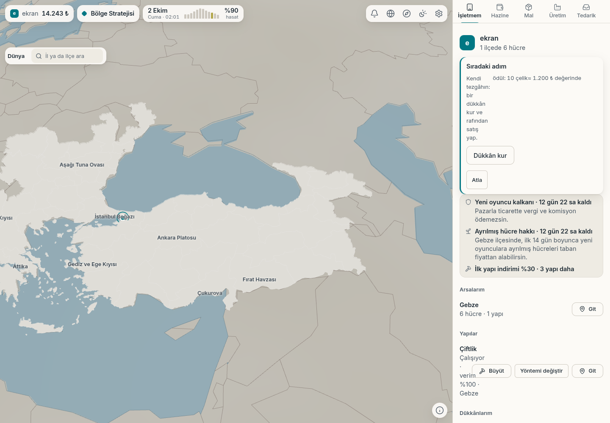
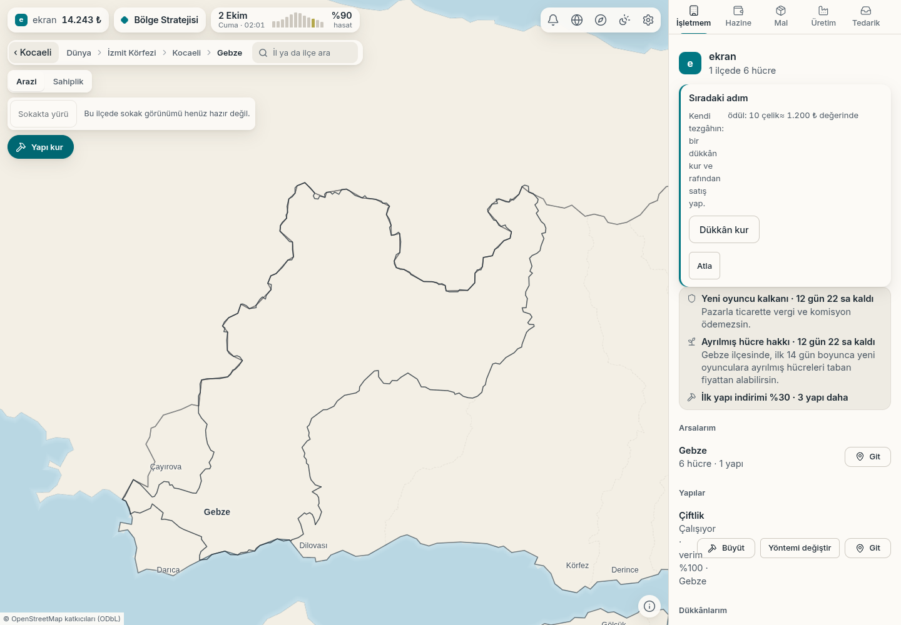
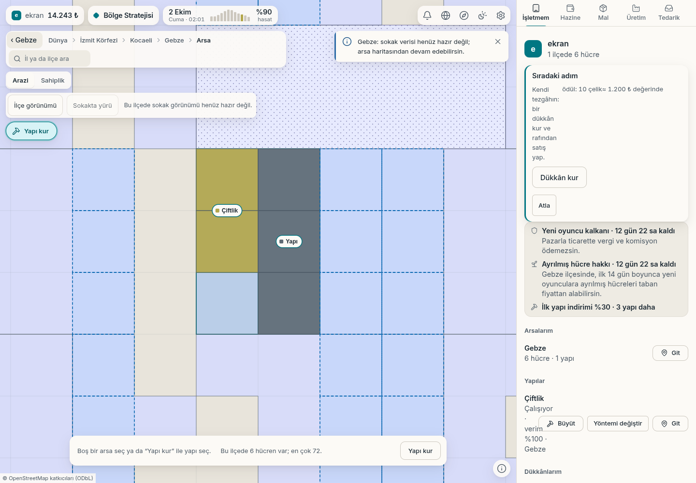

# Genel harita, ilçe ve parsel görünümü

2 Ekim 2026. Çalışan oyunun yerel örnek dünyası; gerçek arayüz tıklamalarıyla
alınmış 1440×1000 ekran görüntüleri. Genel harita, il ve ilçe gezintisi mevcut.
Karakterle sokak yürüyüşü kodu korunuyor; bu ortamda ham sokak/bina verisi
eksik olduğu için sokak görüntüsü sunulmuyor.

## Türkiye genel görünümü

Küreye dönüldüğünde arsa yönetim araçları kapanır.

## İlçe görünümü

Parsel görünümündeki “İlçe görünümü” düğmesi ile Gebze'nin genel coğrafyasına dönüş.

## Parsel yönetimi

Oyun arsaları alım ve inşaat için yakın ölçekte gösterilir. “Sokakta yürü”
girişi görünürdür; veri hazır olmayan ilçede neden kullanılamadığı açıklanır.

