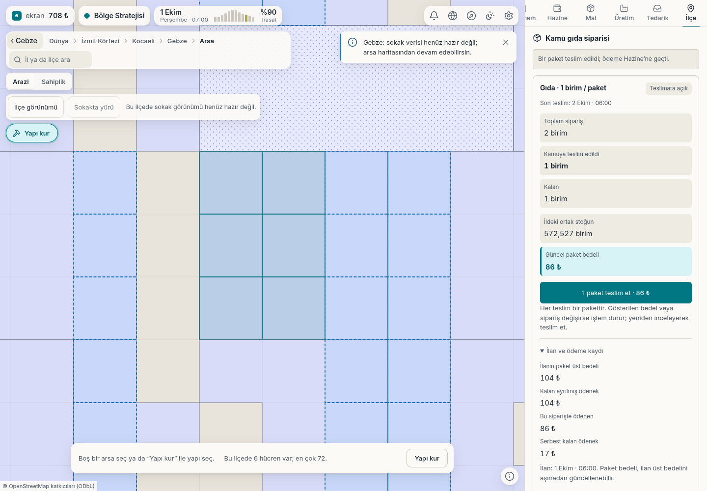

# Kamu gıda siparişine gerçek teslimat

2 Ekim 2026. Çalışan yerel oyunda Gebze'nin kamu kasası, gerçek gıda
ithalatından oluşan gelirle iki paketlik sipariş açtı. İlçe kartındaki
“1 paket teslim et” düğmesi kullanıldı; görüntü teslim sonrasıdır.

Gerçek sonuç:

- Ortak il deposundan **1 birim gıda** düştü.
- İlçe kasasından oyuncuya **86,625 ₺** aktarıldı.
- İlan üst bedeli **104,343 ₺** idi; fiyat düştüğünden kullanılmayan
  **17,718 ₺** ödenek serbest bırakıldı.
- Siparişte **1 paket kaldı**. Ekrandaki para biçimi tam liraya aşağı
  yuvarlar; işlem ve muhasebe mili-₺ hassasiyetindedir.

[Gerçek komut, stok, kasa ve ekran verileri](k1-kamu-gida-teslim-bilgisi.json).
Hazırlıkta ek hibe, yapay kasa geliri veya stok/DOM enjeksiyonu yoktur.
Kontrol yalnız bu gerçek masaüstü teslim akışını kapsar; geniş mobil
kabul turu yapılmadı.

Bu özellik kamu dağıtımına gıda tedarikidir. Makam yönetimi ve halk refahına
sayısal etki ayrı geliştirmelerdir.

[Önceki iç sevkiyat ekranı](../2026-10-02-tasima/README.md)
