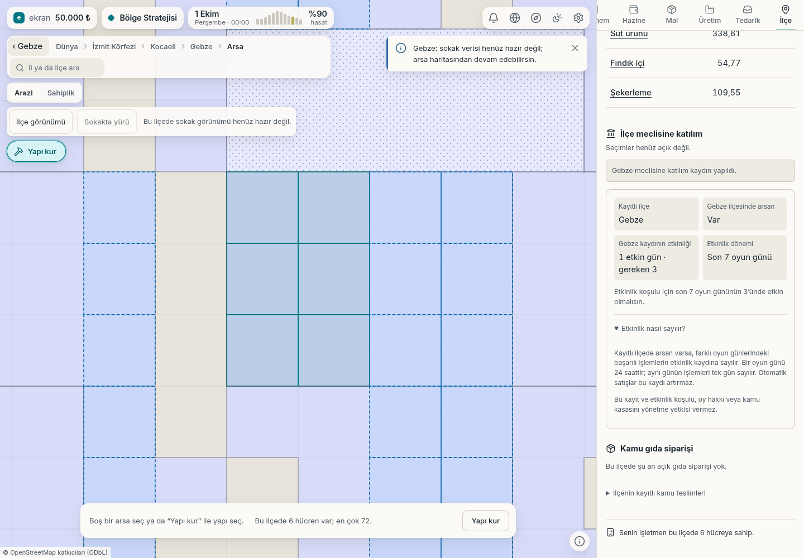

# İlçe meclisine katılım — gerçek oyun ekranı

Gebze'deki başlangıç arsalarıyla İlçe panelindeki **Bu ilçeye kaydol**
düğmesine basıldı. Sunucu komutu kabul etti; kayıtlı ilçe Gebze ve ilk
etkinlik günü arayüze yansıdı. Ekran 1440 × 1000 masaüstü görüntüsüdür.

Kayıt sonrası **1 etkin gün · gereken 3**, **son 7 oyun günü** ve gerçek
arsa sahipliği görülüyor. Sonraki başarılı oyuncu işlemleri farklı oyun
günlerinde etkinlik sayar; ayrıca günlük yoklama düğmesi yoktur.

Bu teslim katılım temelidir. Seçim, başkanlık veya kamu kasasını yönetme
yetkisi henüz açık değildir. Sokak verisi eksik olduğu için harita mevcut
arsa görünümündedir.

[Gerçek komut, sunucu yanıtı ve öncesi/sonrası kayıt](k2a-meclis-katilim-bilgisi.json).
Sayfa ve konsol hatası yok; stok, kasa, etkinlik günü veya arayüz verisi
enjeksiyonu yapılmadı.
