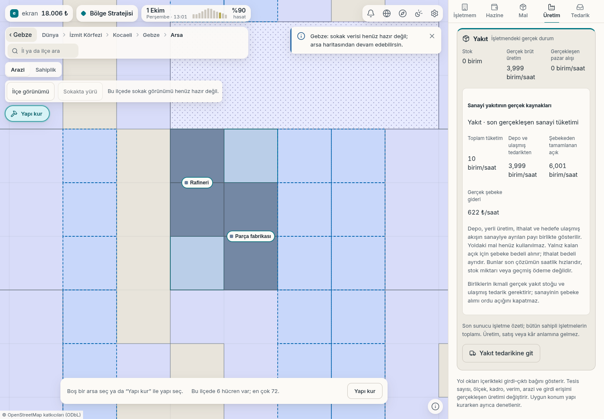
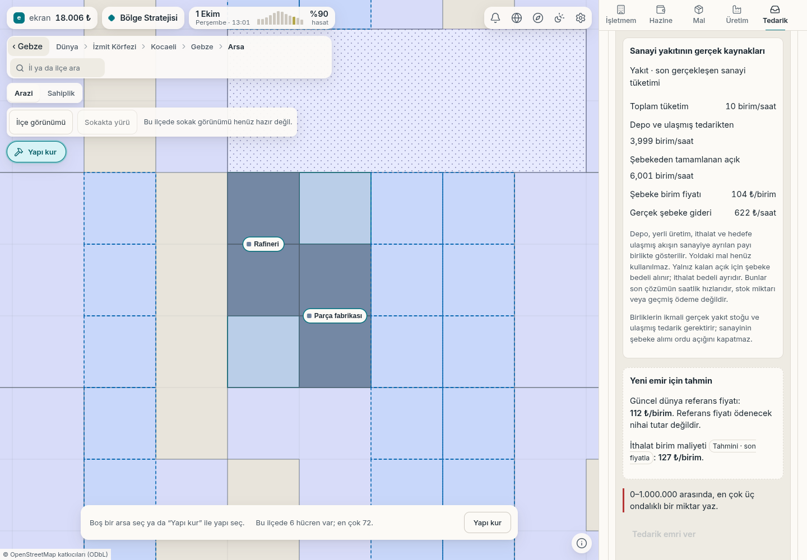

# Rafineri ve sanayi yakıtı

2 Ekim 2026. Yerel oyun örneğinde gerçek inşaat ve ithalat komutlarıyla
kurulan rafineri ve parça fabrikası. Görseller çalışan oyun arayüzünden
alınmıştır; tasarım maketi değildir.

## Üretim zinciri

Rafineri artık oyuncunun arsasına kurulabilir. Petrolü yakıta dönüştürür;
sanayi önce fiziksel yakıtını kullanır, eksik miktarı şebekeden alır.

## Yakıtın kaynağı ve gideri

Tedarik paneli gerçekleşen sanayi tüketimini, depo ve ulaşmış tedarikten
karşılanan miktarı, şebekeden tamamlanan açığı ve şebeke giderini gösterir.
Değerler son çözümün saatlik hızlarıdır; depodaki miktar veya geçmiş ödeme
toplamı değildir. İthalat bedeli ayrıca hesaplanır.

Bu örnekte tüketim **10 birim/saat**: **3,999** fiziksel kaynaktan,
**6,001** şebekeden karşılanıyor. Şebeke gideri **621,103 ₺/saat**;
arayüz bunu yukarı yuvarlayıp 622 ₺ gösteriyor.
[Gerçek sunucu/arayüz veri özeti](l2-rafineri-bilgisi.json).

Nakliye hizmet bedeli bu geliştirmeye dahil değildir. Rafineri için sokak
silüeti eklendi; eksik sokak verisi nedeniyle yürüyüş sahnesi burada
gösterilmiyor.

[Türkiye, ilçe ve parsel ekranları](../2026-10-02-harita/README.md)
