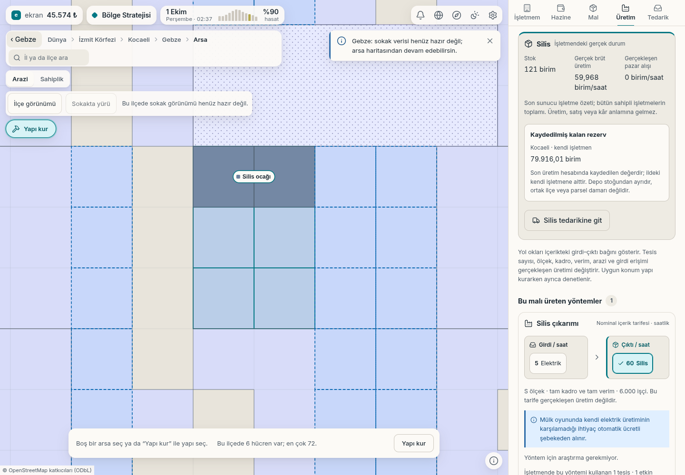

# Silis ocağı: depo stoğu ve kayıtlı rezerv

Gebze'de varsayılan başlangıç malzemeleriyle kurulan gerçek silis ocağı.
Üretim ekranı depodaki silisi ve Kocaeli'deki kendi işletmesinin kayıtlı
rezervini ayrı gösteriyor.

| Veri | Başlangıç | Üretim sonrasında |
|---|---:|---:|
| Kaydedilmiş kalan rezerv | 80.000 birim | 79.916,01 birim |
| Depodaki silis | 0 birim | 121 birim |
| Gerçek brüt üretim hızı | 60 birim/saat | 59,968 birim/saat |

Rezerv miktarı çekirdek, özel sunucu mesajı, istemci bağlantısı ve ekranda
birebir eşleşti. Kayıtlı rezerv son üretim muhasebesine aittir; depo stoğu
kare anına ilerletildiği için iki değişimin aynı tutarda olması beklenmez.
Bu işletmenin rezervi, ortak ilçe/parsel damarı veya gerçek jeoloji değildir.

[Gerçek kurulum ve önce/sonra ölçümleri](r1-silis-rezerv-bilgisi.json).
Rezerv, stok veya para enjeksiyonu yapılmadı. Görünüm salt okunur.
Sayfa/konsol hatası yok. Görüntü 1440 × 1000 masaüstüdür; eksik sokak
karoları nedeniyle harita mevcut arsa görünümündedir.
