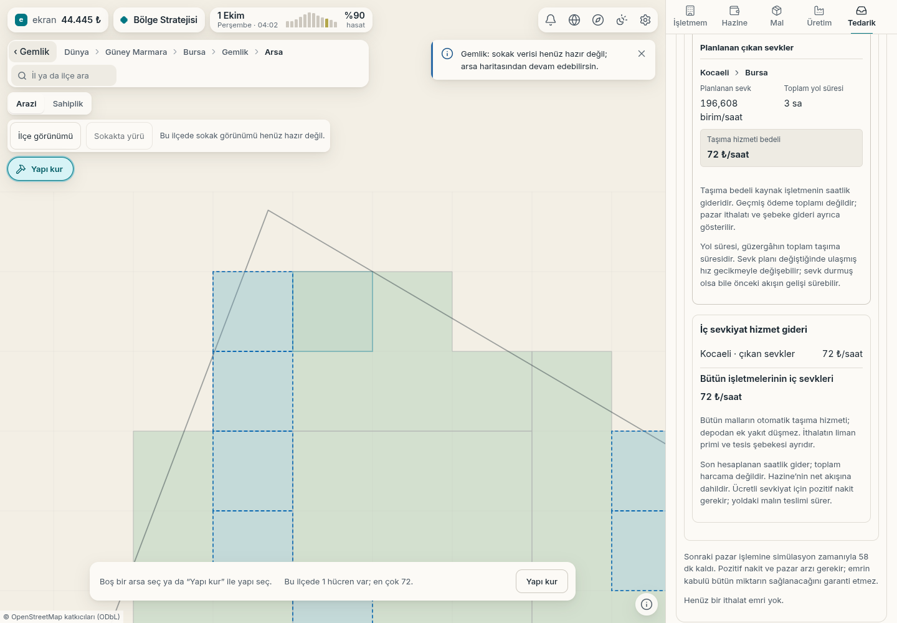

# İç sevkiyatın taşıma bedeli

2 Ekim 2026. Yerel oyunda gerçek inşaat, arsa alımı ve ticaret komutlarıyla
oluşturulan işletmeler arası tahıl sevkiyatı. Ekran çalışan oyundan alınmıştır;
stok veya arayüz verisi eklenmiş bir tasarım maketi değildir.

Örnek: Gebze'deki çiftlikten Gemlik'teki işletmeye **196,608 birim/saat**
tahıl, **3 saat** kara yolu, **71,686 ₺/saat** hizmet bedeli. Arayüz
bedeli yukarı yuvarlayıp **72 ₺/saat** gösterir. Rota kartı işletmeleri
il adlarıyla Kocaeli → Bursa olarak etiketler.
[Gerçek komutlar ve sunucu/arayüz dökümü](l3-ic-sevkiyat-bilgisi.json).

Her rota miktarını, toplam yol süresini ve kaynak işletmenin saatlik hizmet
bedelini gösterir. Tedarik ve Hazine toplamı bütün malların sevklerini
kapsar. Gösterilen bedel son hesaplanan saatlik giderdir; geçmiş ödeme
toplamı veya kalan varış süresi değildir.

Taşıma bedeli miktar, yol süresi, taşıma türü ve yakıt fiyatına bağlıdır.
Depodan ayrıca yakıt düşmez. NPC ithalatının liman primi ve sanayi şebekesi
ayrı giderlerdir. Sıfır nakit ücretli yeni sevki durdurur; yoldaki malın
teslimi devam eder.

[Önceki rafineri ve yakıt ekranları](../2026-10-02-rafineri/README.md)
