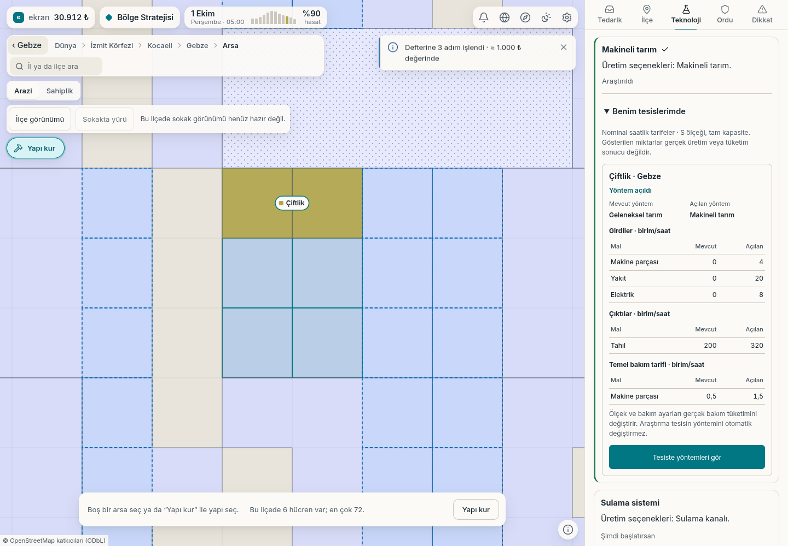

# Araştırmadan tesisin üretim yöntemine

Gerçek Gebze başlangıcında kurulan çiftlikte makineli tarım araştırması
bitirildi. **Teknoloji → Benim tesislerimde** kartı mevcut ve yeni yöntemi
karşılaştırıyor; tesis araştırma bitince hâlâ geleneksel yönteminde.

| Saatlik temel tarife | Geleneksel tarım | Makineli tarım |
|---|---:|---:|
| Tahıl çıktısı | 200 | 320 |
| Yakıt girdisi | 0 | 20 |
| Elektrik girdisi | 0 | 8 |
| Makine parçası girdisi | 0 | 4 |
| Temel bakım: makine parçası | 0,5 | 1,5 |

Bunlar S ölçeğinde tam kapasite nominal tarifelerdir. Gerçek üretim, tüketim
veya kâr sonucu değildir; ölçek ve bakım ayarları gerçek bakımı değiştirir.

Araştırmada ekranda görülen ve hazineden düşen bedel **15.000 ₺** oldu.
Görüntü alındıktan sonra **Tesiste yöntemleri gör** ile mevcut seçici açıldı;
oyuncu onayı üzerine gerçek tesis makineli tarıma geçti. Araştırma ve yöntem
komutları sunucuda kabul edildi; görülen bedel ve önceki yöntem alanları
komutlarda korundu. Araştırma kendiliğinden yöntem değişikliği yapmadı.

[Gerçek komutlar ve sunucu sonuçları](t1-arastirma-yontem-bilgisi.json).
Sayfa ve konsol hatası yok. Görüntü 1440 × 1000 masaüstü ekranıdır.
Eksik sokak karoları nedeniyle harita mevcut arsa görünümündedir.
