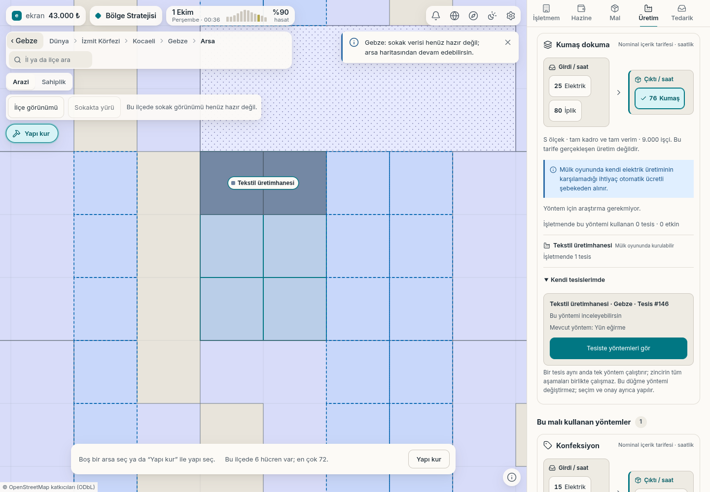

# Üretim kartından kendi tekstil tesisine

Gebze'de varsayılan başlangıç malzemeleriyle kurulan gerçek tekstil
üretimhanesi, **Üretim → Kumaş dokuma → Kendi tesislerimde** altında görünüyor.
Tesis numarası ve mevcut yün eğirme yöntemi, hangi tesise geçileceğini gösteriyor.

**Tesiste yöntemleri gör** mevcut yöntem seçicisini açtı ve Kumaş dokuma
kartını odakladı. Bu sırada yün eğirme seçili kaldı, onay açılmadı ve
sunucuya yöntem komutu gönderilmedi. Oyuncu ayrıca Kumaş dokuma'yı seçip
onayladığında gerçek Tesis #146'nın yöntemi değişti. Önceki yöntem bilgisi
komutta korundu; sunucu kabul etti. Ücretsiz geçişte hazine 43.000 ₺ kaldı.

Kumaş tarifesi nominaldir. Bu koşuda iplik stoğu sıfırdı; yöntem değişimi
kumaş üretiminin gerçekleştiği anlamına gelmez. Bir tesis aynı anda tek
yöntem çalıştırır; bütün tekstil aşamaları için ayrı tesisler veya tedarik gerekir.

[Gerçek komut, odak ve sunucu sonuçları](u1-uretim-tesis-bilgisi.json).
İlk akışta bulunan ikinci çizim kaynaklı odak kaybı düzeltildi; güncel derlemeyle
aynı akış başarılı. Sayfa/konsol hatası yok. Görüntü 1440 × 1000 masaüstüdür;
eksik sokak karoları nedeniyle harita mevcut arsa görünümündedir.
