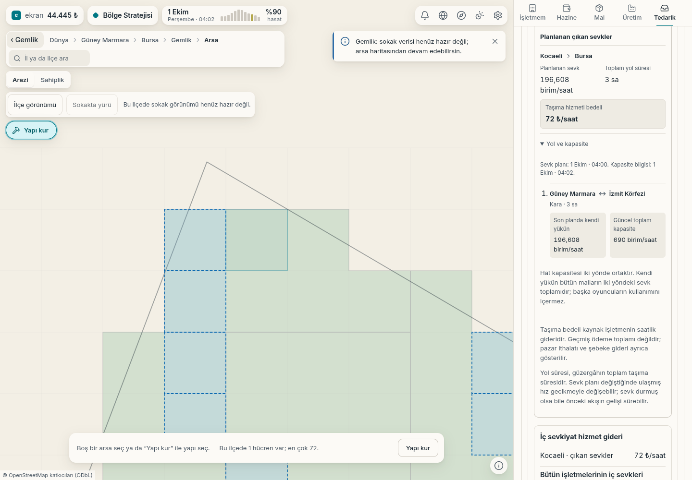

# İç sevkiyat: yol ve kapasite

Gerçek Gebze çiftliğinden Gemlik işletmesine tahıl sevkiyatı. Tedarik
ekranında **İç sevkiyat → Yol ve kapasite** ayrıntısı açıldı.

| Veri | Gerçek sonuç |
|---|---|
| Oyun ağı bağlantısı | Güney Marmara ↔ İzmit Körfezi |
| Yol | Kara, 3 saat |
| Oyuncunun bu yoldaki yükü | 196,608 birim/saat |
| Güncel toplam hat kapasitesi | 690 birim/saat |
| Taşıma bedeli | 71,686 ₺/saat; arayüzde yukarı yuvarlanmış 72 ₺ |
| Sevk planı / kapasite verisi | Oyun saati 04:00 / 04:02 |

Hat kapasitesi iki yönde ortaktır. Kendi yük bütün malları kapsar; başka
oyuncuların kullanımı verilmediğinden boş kapasite hesaplanmaz.
Genel oyun merkezleri arasındaki bağlantıdır; sokak veya parsel rotası değildir.

[Gerçek komutlar, çekirdek verisi ve arayüz karşılaştırması](l4-yol-kapasite-bilgisi.json).
Sayfa ve konsol hatası yok. Sokak karoları eksik olduğundan harita mevcut
arsa görünümündedir. Görüntü 1440 × 1000 masaüstü ekranıdır.
